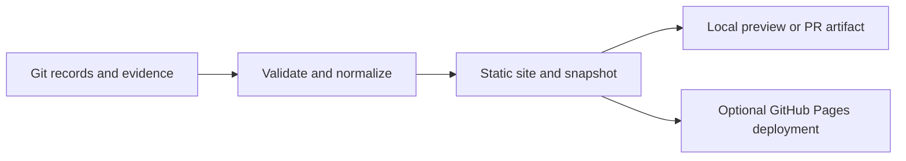

# Project dashboard plan

- ID: PLAN-NODD-DASHBOARD-001
- Status: DRAFT — infrastructure proposal, not implementation or publication approval
- Created: 2026-09-17
- Human owner / issue: TBD / not created
- Related: [development plan](DEVELOPMENT_PLAN.md), [project](../PROJECT.md),
  [review policy](decisions/ADR-002-review-and-signoff-policy.md),
  [validation policy](decisions/ADR-003-validation-and-artifact-policy.md),
  [logging policy](decisions/ADR-004-session-logging-and-traceability.md)

## Purpose and proposed approach

Provide one dashboard answering: where is the programme going, what is happening
in parallel, what is blocked, what needs human review, and what has actually been
approved and validated? Each answer must link to its repository evidence.

**NODD DESIGN CHOICE — proposed, human review pending:** generate a static,
read-only website from versioned project records. Git remains the canonical record;
changes happen through documents and pull requests. Start with local builds and
reviewable site artifacts, then optionally publish to GitHub Pages. This is M0
development infrastructure and introduces no detector parameters.

Current-state initialization must preserve stage A's closure for progression,
stage B's authorization, outstanding M0 governance, and existing draft ADRs.
Unexecuted baseline checks remain unexecuted. Organizational agent roles are not
evidence of running agents or assigned human reviewers.

## Views

| View | Content and interactions |
| --- | --- |
| Overview | Active programme stage, active workstreams, blocked tasks, reviews awaiting action, recent evidence-backed changes, snapshot revision and freshness |
| Programme | Stages A–G and milestones M0–M7 as separate linked axes; deliverables, dependencies, entry/exit conditions and explicit dispositions |
| Parallel work | Swimlanes by work package or responsible role; planned, ready, active, blocked and completed tasks; dependency graph and filters |
| Reviews | Open review queue grouped by technical, expert, sign-off and validation review; completed and withdrawn rounds in a searchable archive |
| Work-item detail | Objective, deliverables, owner role, affected systems, dependencies, issues/PRs, design/ADR links, review rounds, validation and next action |
| Evidence and history | Decisions, validation reports, source/reading coverage, TDR pointers and curated activity; links to the precise relevant revisions |

Default to the overview and an actionable review queue. Filters should include
stage, milestone, subsystem, role, work state, review type and review-round state.
Keep filter state in shareable URLs. Tables and text must remain usable without
interactive graphs; show states with words as well as colours.

Use dependency diagrams rather than dated Gantt charts until maintained dates
exist. Show counts by state with their scope and denominator; avoid an invented
overall completion percentage. Distinguish a review request from a completed
review and a scientific acceptance from a successful software check.

## State model

Three independent dimensions prevent misleading roll-ups:

1. **Work state:** planned, ready, active, blocked, completed, cancelled. Completion
   records the deliverable and its disposition, not scientific approval. Blocked
   items carry a reason, dependency and next action.
2. **Document lifecycle:** preserve the existing sequence
   `DRAFT -> TECHNICAL REVIEW -> EXPERT REVIEW -> SIGNED OFF -> IMPLEMENTED -> VALIDATED -> ACCEPTED`.
   Read the declared state from the document and show linked supporting evidence.
   Missing or conflicting evidence produces a visible discrepancy, never an
   inferred promotion or silent correction.
3. **Review round:** requested, open, closed or withdrawn; separately record type,
   target revision and outcome (pending, changes requested, conditional,
   approved or rejected). A closed review can have requested changes. Closed and
   withdrawn rounds remain visible when a new round opens.

Human sign-off and acceptance come only from designated records with identified
human reviewers, exact reviewed revisions and approval evidence. A merged PR,
closed issue or AI recommendation cannot supply them. Conditions remain visible
until human disposition is recorded. Subsequent document changes show the prior
approved revision and that the current revision needs review; unrelated repository
commits alone must not invalidate approval of an unchanged document.

Software-check execution and scientific acceptance are separate fields. Preserve
`NOT RUN`, unavailable criteria, failed attempts, and reviewed exceptions.

## Canonical data and update workflow

Proposed files, to be created during implementation:

| Location | Responsibility |
| --- | --- |
| `project/tracking.json` | Versioned schema and stable IDs for stages, milestones, workstreams, tasks, dependencies and explicit dispositions |
| `project/reviews.json` | Review requests and round history; references to governing documents and formal approval evidence |
| `tools/dashboard/` | Validation, document adapters and deterministic static-site build |
| `dashboard/` | HTML templates, CSS and small JavaScript enhancements |
| Build output (ignored) | Generated site and normalized snapshot; no manually edited authoritative states |

Use JSON initially to match the standard-library logging infrastructure. Do not
replace existing Markdown documents or require a broad front-matter migration.
Define a small explicit mapping for their status fields and fail visibly on
unsupported formats. Templates must not appear as actual designs or sign-offs.

Each work item needs an ID, title, scope, stage/milestone references, responsible
role, optional human owner, state, dependencies, deliverable links, last update,
and next action. Distinguish role ownership from actual assignment. Review rounds
need an ID, target document and revision, type, state, outcome, requested/completed
dates when known, reviewer assignments, conditions and evidence links.

Tracking records own operational status; documents own declared design/ADR status;
sign-off records own approval evidence; reports own validation results; logs own
curated activity. Store references instead of copying their contents into a second
manually maintained catalogue. Contradictions must be surfaced with both sources.

The PR delivering a task updates its tracking record and links its deliverable.
The PR requesting review opens a round against an exact revision. Human decisions
are recorded through the established review/sign-off workflow and then reflected
by the dashboard. Cancelling, reopening and superseding preserve history.

The first release requires no live GitHub API. Issue/PR links provide navigation;
optional later build-time collection may annotate discussion and merge state with
its own collection timestamp. Those annotations must never override approval
records. Failed collection retains an explicitly dated prior snapshot or reports
unavailable data. Browser visitors need no credentials.

## Build and optional hosting

Start with Python's standard library and plain HTML/CSS/JavaScript. Compare a
larger static-site framework only if document rendering or interaction needs
justify its maintenance. Escape source content and validate outgoing links.

Proposed flow:

GitHub Pages hosts static HTML, CSS and JavaScript and supports custom Actions
build/deployment workflows ([hosting documentation](https://docs.github.com/en/pages/getting-started-with-github-pages/what-is-github-pages),
[workflow documentation](https://docs.github.com/en/pages/getting-started-with-github-pages/using-custom-workflows-with-github-pages),
accessed 2026-09-17). This makes the proposed output suitable for Pages; actual
repository eligibility and settings have not been inspected.

Build and validate on pull requests, producing an artifact for review. After
publication is authorized, deploy successful builds from the selected main branch
using a protected Pages environment. Give deployment permissions only to the
deployment job; PR builds must not publish. Rebuild on relevant merged changes;
add scheduled refresh only if external annotations are introduced.

Support the repository URL prefix and relative asset paths. Every page shows
source commit, build time and any external snapshot time. Distinguish last data
change from build time. A failed build leaves the previous published version
identifiable; surface its age and link the build workflow. Publish an explicit
allowlist of dashboard output, never the entire checkout. No TDR submodule fetch,
downloaded PDFs, private endpoints or raw client archives are required.

## Delivery sequence and checks

| Increment | Deliverable | Completion evidence |
| --- | --- | --- |
| 1. Tracking contract | Schema, state rules, source mapping and curated initial register | Review against PLAN-NODD-001; no invented ownership, dates, approvals or checks; stage A/B initialization preserved |
| 2. Local MVP | Overview, programme, work lanes, review queue/archive and detail pages | Fresh-checkout build; links and filters work; empty and unknown states render clearly |
| 3. Automated checks | Record validator and PR build artifact | CI catches broken IDs/paths, dependency cycles, inconsistent states and missing required review fields |
| 4. Optional publication | Pages workflow and documented update/recovery procedure | Explicit publication authorization; project-prefix URLs work; visible deployed revision; deployment failure preserves prior site |
| 5. Expanded coverage | Evidence/TDR coverage, richer dependency exploration and optional GitHub annotations | Each added view has maintained source records and visible coverage/freshness |

Test the meaningful failure cases: closed review with changes requested, repeated
review rounds, conditional approval, approval of an earlier document revision,
merge without sign-off, missing validation criteria, completed planning stage
with unexecuted checks, and conflicting document/record states. Use clearly named
test fixtures. Also check deterministic output for fixed inputs/build metadata,
content escaping, link safety, dependency integrity, and keyboard/mobile use.

This plan changes documentation only. Dashboard build, deployment and browser
checks will be run during implementation; none is claimed here.

## Decisions remaining

- Assign maintenance of tracking records and ownership of the dashboard.
- Confirm the initial views and whether reviewer names already public in formal
  review records should be displayed or reached through evidence links.
- Reconcile minimum review requirements with ADR-002 when humans approve it.
- Select hosting and authorize publication after inspecting a working build.
- Decide whether GitHub annotations add enough value after the Git-only MVP.

No new issue, ADR, reviewer assignment, sign-off or deployment is created by this
proposal. Hosting documentation supports infrastructure feasibility and introduces
no normative detector claims; the detector source manifest is unchanged.
