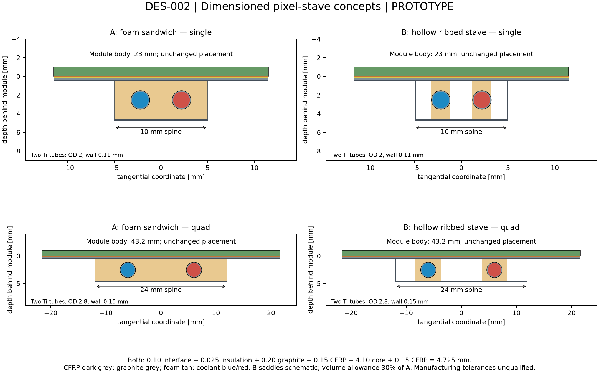

# DES-002 — Pixel barrel support and cooling concepts

- Status: DRAFT
- Created: 2026-09-30
- Author: Codex, AI-assisted proposal
- Human owner / engineering approver: unassigned
- Scope: **PROTOTYPE design study; two candidates; no production geometry change**
- Governing inputs: [DES-011 working baseline](DES-011-service-constrained-tracker-optimization.md#working-baseline-selected-on-2026-09-30), [DES-010 services](DES-010-tracker-service-corridors.md), [ADR-006](../decisions/ADR-006-global-envelope-and-field-hypotheses.md)
- Validation evidence: [screening results](../validation/DES-002/results.md)
- Sign-off: pending

## Authority and baseline

The user requested at most two low-material, stable, sufficiently cooled pixel
barrel support concepts, with technical drawings and literature cross-checks.
The request names PR #26; that PR restored workflow branches. The immediately
preceding human-selected tracker baseline is PR #28, so this study uses its exact
`p190-s680-b1-l1287.33-front_loaded-original-pockets` geometry, compressed SHA-256
`89ce39dae6af7e1e69d40582a6c49e6e7f26dbcd6ce1dd3cc061e41e75419cbd`.
This interpretation was stated to the user before the study. No geometry is moved.
PR #28 was merged into `study/tracker-service-corridors`; this proposal starts
from that merged baseline, rather than silently substituting the older main.

## Two candidates and recommendation

**A — carbon-foam sandwich stave (recommended first prototype).** A narrow
conductive carbon-foam spine contains two straight thin-wall titanium tubes.
CFRP face sheets provide bending stiffness; a thin graphite
spreader supports the full module width. Short, controlled adhesive interfaces
carry heat from the readout side. All four layers use the same architecture with
two widths. Full-area foam gives a continuous thermal path and supports the skins
against local buckling. Its main costs are foam/adhesive material and bonded-module
rework. Use measured laminate properties; high fibre modulus is not laminate modulus.

**B — hollow ribbed CFRP stave with local foam saddles.** Retain the same module
face and tube positions but replace most of the foam by a closed, thin-wall CFRP
box with local conductive saddles around the tubes. This reduces core material;
it adds bonding operations, makes contact quality more critical and needs buckling,
torsion and vibration verification. It is a material-reduction alternative if A
exceeds the eventual material allocation. Do not count hollow space as carbon.
No third architecture is proposed.

Both preserve radial staggering and use narrow structural spines. A full-width
5 mm-deep beam is incompatible with adjacent staggered modules in a preliminary
box check. The selected thin overhanging plate and spine need their own clearance
screen, rather than treating the existing annular reservation as detailed CAD.

## Source facts

Exact source entries, versions, URLs and local hashes are in
[the catalogue](../../reference/manifest.yaml). PDF pages below are one-based.

| ID | Classification | Source and locator | Evidence used and limits |
| --- | --- | --- | --- |
| PS-F01 | FACT | SRC-ATLAS-IBL-PRODUCTION-2018, §4.1, Tables 9–10, PDF 38–39 | Constructed IBL staves use CFRP, conductive foam and titanium tubing. Table 10 gives foam density 0.20 g/cm³ and conductivity 28.3 W/(m K); prepreg density 1.73 g/cm³ and transverse conductivity 0.5 W/(m K). Table 9 gives material radiation lengths and 0.621% X0 for its bare stave, including glue and fixations. These are a comparator, not nODD performance. |
| PS-F02 | FACT | Same source §5.2.1, Fig. 33, PDF 49–50; §7.5–7.6 | IBL uses 1.7 mm OD, 0.11 mm-wall titanium tubing and evaporative CO₂; its measured thermal figure of merit is about 14 K cm²/W. Warm pressure, joints, electrical breaks and leak qualification matter. IBL values do not qualify a changed tube/structure. |
| PS-F03 | FACT | SRC-ATLAS-TDR-030, §13.2.2, printed 287–288 / PDF 309–310; §14.2.1 PDF 337–338 | Thermal cells and structural longerons can be separated. Prototype pipe ID 2.5 mm, wall 0.15 mm. The earlier nODD service estimate uses the TDR's 0.5+0.1+0.1 W/cm² electronics/sensor/services budget. |
| PS-F04 | FACT | SRC-ATLAS-ITK-LOCAL-SUPPORTS-2022, slides 7, 10, 12–14 | Inner staves combine CFRP, foam and titanium; outer cells use graphite and cooling blocks. Peripheral chip heating is nonuniform. Prototype thermal tests and cycling accompany FEA; an average heat density alone does not bound a hot spot. |
| PS-F05 | FACT | SRC-NIST-CO2-SATURATION-DES002, −35 °C row | Saturation pressure 12.024 bar, liquid/vapour enthalpy 123.05/436.23 kJ/kg, liquid density 1096.4 kg/m³. These equilibrium data do not calculate two-phase pressure drop. |
| PS-F06 | FACT | SRC-PDG-MATERIALS-DES002, carbon, oxygen and polyimide rows | Carbon 42.70 and oxygen 34.24 g/cm²; graphite 19.32 cm. Graphite 2.21 g/cm³; polyimide 28.57 cm and 1.42 g/cm³. Used for graphite, insulation and stoichiometric CO₂ material accounting. |

## Proposed dimensions and operating assumptions

All values in this table are **NODD DESIGN CHOICE — proposed**, except where an
inference is explicitly identified below. They are centralized in
[inputs.json](../../tools/pixel_support/inputs.json); none has a human engineering
approver. The thermal interface is to the readout/chip side; insulating layers must
not short serial-power potentials through conductive carbon or cooling pipes.

| ID | Proposed parameter | Rationale / uncertainty |
| --- | --- | --- |
| PS-C01 | Spine width 10 mm for single modules, 24 mm for quads; retain full 23/43.2 mm module-facing plate | Avoid neighbouring staggered modules; plate spreads heat and supports overhangs. |
| PS-C02 | From module back: 0.10 mm interface, 0.025 mm insulation, 0.20 mm graphite, 0.15 mm top CFRP, 4.10 mm core, 0.15 mm bottom CFRP: 4.725 mm total | Fits nominally below the actual baseline's **5 mm** pixel support-depth reservation; that reservation is an inward shell, not a verified stave stack. Connections to it still need detailed geometry. |
| PS-C03 | Two straight tubes: singles 2.0 mm OD/0.11 mm wall, quads 2.8 mm OD/0.15 mm wall; transverse centres ±2.2/±6 mm | Small inner-layer pipe near IBL scale; outer tube follows TDR comparator. Both legs and coolant counted. No tight central U-bend. |
| PS-C04 | B uses two 0.15 mm CFRP webs and 30% of A's net foam volume as saddles | Screening allowance, not a manufactured topology. Saddle coverage/adhesive must be established thermally; do not assume savings preserve thermal performance. |
| PS-C05 | Light shared bearing ribs at z≈−560,−336,−112,+112,+336,+560 mm; screen maximum free span 250 mm (224 mm between proposed planes) | Beam screening tests unsupported spans explicitly. No module row is removed. Intermediate ribs are new passive material, not “free” support. Pins constrain position; one axial locator and sliding/flexural remaining bearings accommodate cooldown. Shared rings need an independently stiff global load path; floating rings alone do not shorten the effective bending span. |
| PS-C06 | Laminate axial effective E=100 GPa, sensitivity 70–140 GPa; payload 1 g/single and 4 g/quad, sensitivity ±50% | Engineering screening hypotheses, not measured finished modules. Include support/tube/full-liquid mass. No stiffness credit for graphite or foam. For material/weight screening, use IBL Table 9 radiation lengths (CFRP 211 mm, foam 2130 mm, tube 35.6 mm, filled epoxy 89.7 mm); density is 1.73/0.20/4.51 g/cm³ respectively. Effective glue density 2.0 g/cm³ and 0.08 mm additional equivalent internal bond thickness are proposed allowances. |
| PS-C07 | CO₂ set point −35 °C; nominal 0.7 W/cm², stress 1.05 W/cm²; target hottest sensor ≤−15 °C at stress | Nominal proxy inherited from DES-010; stress is +50%, not a radiation/end-of-life prediction. Revised measured electronics, leakage and service loads must replace it. |
| PS-C08 | End-to-end thermal figure of merit target ≤15 K cm²/W; insulation conductivity 0.12, bondline 1, graphite in-plane 500 W/(m K) for conduction screening | Coupon/test requirements and conservative calculation assumptions, not achieved material properties. Interfaces, tube contact, boiling and nonuniform heat require measurement. |
| PS-C09 | Counterflow pair: one circuit enters at each end, exits at the other; nominal flow 1.3 g/s per inner tube, 2.5 g/s per outer tube; inlet quality ≤0.10, exit quality ≤0.45; heat imbalance up to 2:1 | Avoid a central U-bend and retain one feed/one exhaust per stave at each end. Two full-length circuits replace the routing estimate's two half-stave circuits; this is an explicit hydraulic grouping refinement, not unchanged qualification. |
| PS-C10 | Illustrative common rib: 8 mm z-width, 1 mm radial CFRP; tolerance/stability targets: ≤50 µm static sag and ≤5 µm change during steady running | Rib material and stiffness are not qualified. Absolute sag is surveyable; changes with pressure, temperature and flow determine alignment stability. Targets are proposed, not experiment requirements. |

## Calculations and interpretation

**PS-I01 — INFERENCE:** count actual retained bodies by layer, column and family;
47 singles per inner stave and 24 quads per outer stave. Multiply chips by inherited
2.688 W/chip. Use full circuit count and preserve the existing 4 mm OD feed/exhaust
transport reservations. Do not add another 0.1 W/cm² service term to the load proxy.
No cooling service is removed from the detector-wide budget by this proposal.

**PS-I02 — INFERENCE:** latent heat is 313.18 kJ/kg at −35 °C. Calculate
Δx=Q/(mass flow × latent heat) for each tube, including +50% heat and 2:1 imbalance.
This is an energy-balance screen only. Restrictors, start-up, parallel-flow stability,
dry-out, pressure drop along approximately 1.1 m and transfer lines, orientation,
and hydraulic failure isolation remain to be tested. Return lines carry the full
local circuit load; the previous 300 W/circuit grouping ceiling is checked.

**PS-I03 — INFERENCE:** area-normalized conduction resistance is t/k; lateral
spreader rise for an overhang is q a²/(2kt). Add interface, insulation, transverse
CFRP and spreader terms as a lower-bound thermal budget, not a complete TFM.
Use the separate 15 K cm²/W acceptance target to obtain a prospective sensor
rise: 15.75 K at stress, leaving 4.25 K below the proposed −15 °C limit at −35 °C.
That margin must absorb measured uncertainties; a passing energy balance is not
proof of thermal-runaway safety.

**PS-I04 — INFERENCE:** model simply supported Euler–Bernoulli beam segments:
δ=5wL⁴/(384EI), f₁=π/(2L²)√(EI/μ). Compute composite section neutral axis and I
from CFRP skins/webs; use full-liquid mass for self-weight. Compare 250/560/1120 mm
spans and property sensitivities. These bending screens omit foam shear, torsion,
bearing/global-shell compliance, cable forces, vibration excitation and cooldown
bow. No FEA or measured stability claim is made. The short-span results assume rigid bearing reactions from a longitudinal global support shell or equivalent frame. Its stiffness/material are not established here; summing floating rings and staves would not provide those reactions.

**PS-I05 — INFERENCE:** sum each component's volume/width per unit length for
normal-incidence average X/X0. Include adhesive and electrical insulation, tube
walls and a liquid-filled coolant upper bound. Graphite/CFRP/foam properties are
explicit effective screening inputs; use final compositions before DD4hep material
integration. Report solid support and coolant separately. Sensor, ASIC, flex,
connectors, hardpoints and end/common support material are additional; a scalar
stave average cannot describe local pipe/rib peaks or eta-dependent material.

## Validation required before choosing engineering dimensions

1. CAD sweep against every staggered module, neighbouring stave, beam pipe,
   shared ribs, endcap and routing pocket; thermal/assembly clearances included.
2. Heater stave at nominal/stress load and peripheral hot spots; measure sensor
   TFM, contact uniformity, coolant Δp and quality, start-up and dry-out margin.
3. Thermo-mechanical FEA and metrology across operating/warm conditions; gravity,
   tube pressure, cable forces, modal response, thermal cycles and irradiated bonds.
4. Pressure design and certified leak/proof/cycling procedure for the complete
   tube/joint assembly, including warm conditions; cold saturation pressure alone
   must not size the wall. Local electrical isolation and grounding need tests.
5. Material inventory and Geant4 scans including shared ribs/services, then ACTS
   navigation/material and unchanged sensitive-hit regression. None is claimed run.

A is the recommended first prototype because thermal continuity and skin support
reduce the largest uncertainties. B earns adoption only after matched tests show
that its material savings survive the thermal-interface and stability requirements.
