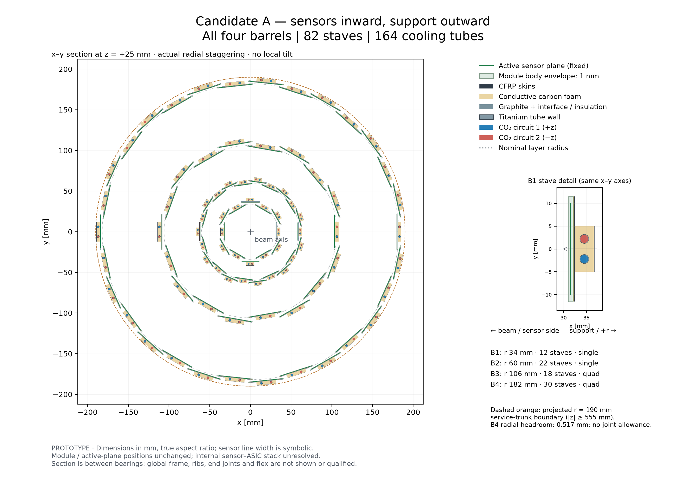
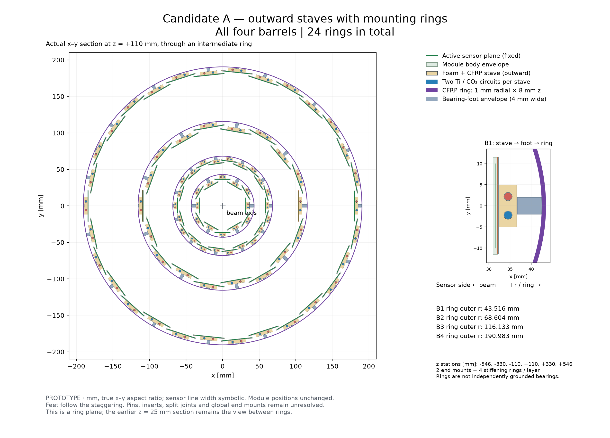
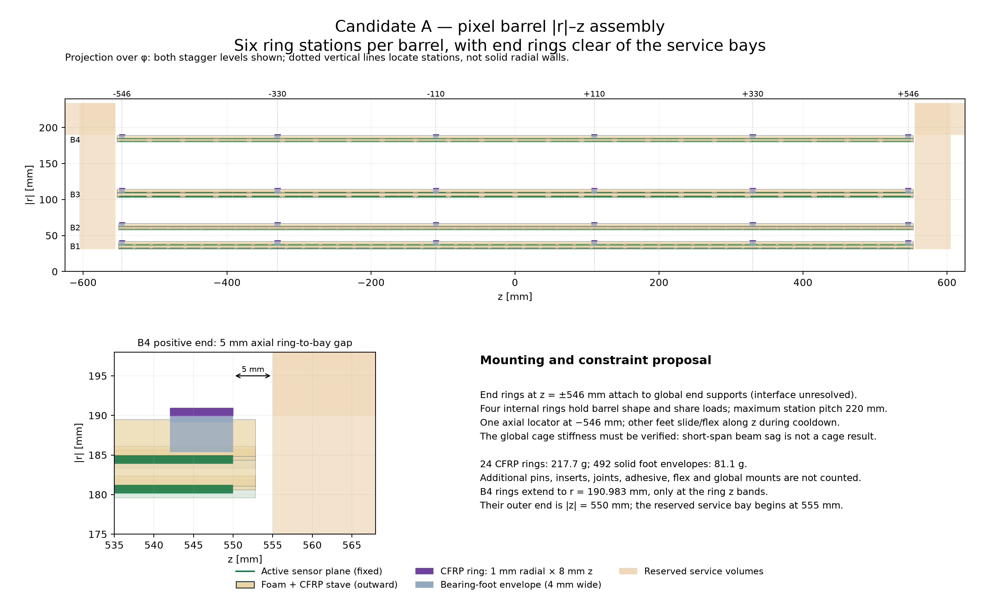

# DES-002 — Pixel barrel support and cooling concepts

- Status: DRAFT
- Created: 2026-09-30
- Author: Codex, AI-assisted proposal
- Human owner / engineering approver: unassigned
- Scope: **PROTOTYPE design study; two candidates; no production geometry change**
- Governing inputs: [DES-011 working baseline](DES-011-service-constrained-tracker-optimization.md#working-baseline-selected-on-2026-09-30), [DES-010 services](DES-010-tracker-service-corridors.md), [ADR-006](../decisions/ADR-006-global-envelope-and-field-hypotheses.md)
- Validation evidence: [screening results](../validation/DES-002/results.md)
- Sign-off: pending

## Current working implementation

The numerical studies below retain their original PR29 inputs. After the human
selected PR34's `packed-200um` barrel on 2026-10-01, [DES012 PB-C14–18](DES-012-dd4hep-pixel-barrels.md)
retains candidate A's outward stack, physical tube/stave ends and mounting stations,
refreshes ring clearances and service inventory, and uses the new module packing.
The [new drawings and checks](../validation/DES-012/PR34/results.md) are the current
working assembly reference. Quad stress exit quality is 0.45705 at the inherited
2.5 g/s per circuit, exceeding the 0.45 ceiling; no cooling qualification or flow
increase is implied by baseline selection.

## Authority and baseline

The user requested at most two low-material, stable, sufficiently cooled pixel
barrel support concepts, with technical drawings and literature cross-checks.
The request names PR #26; that PR restored workflow branches. The immediately
preceding human-selected tracker baseline is PR #28, so this study uses its exact
`p190-s680-b1-l1287.33-front_loaded-original-pockets` geometry, compressed SHA-256
`89ce39dae6af7e1e69d40582a6c49e6e7f26dbcd6ce1dd3cc061e41e75419cbd`.
This interpretation was stated to the user before the study. No geometry is moved.
PR #28 was merged into `study/tracker-service-corridors`; this proposal starts
from that merged baseline, rather than silently substituting the older main.

## Two candidates and recommendation

**A — carbon-foam sandwich stave (recommended first prototype).** A narrow
conductive carbon-foam spine contains two straight thin-wall titanium tubes.
CFRP face sheets provide bending stiffness; a thin graphite
spreader supports the full module width. Short, controlled adhesive interfaces
carry heat from the readout side. All four layers use the same architecture with
two widths. Full-area foam gives a continuous thermal path and supports the skins
against local buckling. Its main costs are foam/adhesive material and bonded-module
rework. Use measured laminate properties; high fibre modulus is not laminate modulus.

**B — hollow ribbed CFRP stave with local foam saddles.** Retain the same module
face and tube positions but replace most of the foam by a closed, thin-wall CFRP
box with local conductive saddles around the tubes. This reduces core material;
it adds bonding operations, makes contact quality more critical and needs buckling,
torsion and vibration verification. It is a material-reduction alternative if A
exceeds the eventual material allocation. Do not count hollow space as carbon.
No third architecture is proposed.

Both preserve radial staggering and use narrow structural spines. A full-width
5 mm-deep beam is incompatible with adjacent staggered modules in a preliminary
box check. The selected thin overhanging plate and spine need their own clearance
screen, rather than treating the existing annular reservation as detailed CAD.

### Candidate A with the support radially outside

**PS-C11 — NODD DESIGN CHOICE, proposed:** following the user's 2026-09-30
request, orient A with the sensor side towards the beam and its readout-side
thermal interface, carbon structure and cooling towards increasing radius.
Retain the module/sensitive-plane positions, radial staggering and PS-C01–C03
dimensions. This is an orientation variant of A, not a third candidate. Engineering
approval remains pending. The earlier inward-support screen is retained as
separate evidence; its clearance result does not establish the outward fit.

The motivation is to place a stave's support after its own measurement for an
outgoing track. Material from inner layers still precedes outer measurements;
tracking improvement has not been quantified. The working layout represents
sensitive planes and 1 mm module bounding bodies, not a resolved sensor/ASIC
laminate. Draw those planes at their exact existing positions; the proposed
sensor-facing direction does not relocate them to the body's inner edge.

**PS-C12 — NODD DESIGN CHOICE, drawing convention:** use an actual x–y cut at
z = +25 mm, between the proposed bearing planes, which intersects a module and
active silicon in every pixel stave. Show all columns with no azimuthal tilt.
Global bearing rings, end connections and service routes outside that cut are
not solid components in this section. A longitudinal assembly and global support
design remain necessary before calling this a mechanically complete detector.

The outward structure replaces the old inward-support hypothesis locally. The
DES-010 inward annular reservations are not moved or claimed to contain it.
New outward envelopes and clearances must be reviewed together with the global
load path, stagger-height bearings and service handoff. The repeatable section
generator and its separate retained evidence are documented in the
[outward assembly report](../validation/DES-002/outward-A/results.md).

Individual sections: [B1](../validation/DES-002/outward-A/barrel-B1.png),
[B2](../validation/DES-002/outward-A/barrel-B2.png),
[B3](../validation/DES-002/outward-A/barrel-B3.png),
[B4](../validation/DES-002/outward-A/barrel-B4.png).
PDF/SVG versions, nominal clearance results and the limited B4 service-interface
headroom are in the linked report.

### Mounting rings for candidate A

The [2026-09-30 reviewer request](https://github.com/asalzburger/nodd/pull/29#issuecomment-5910690174)
asks how the staves are held and mounted. **PS-C13 — NODD DESIGN CHOICE,
proposed:** use **six rings per barrel: two end mounting rings and four intermediate
stiffening rings**, or 24 rings across B1–B4. Put their centres at
**z = −546, −330, −110, +110, +330, +546 mm**. This supersedes PS-C05's
illustrative ±560/±336/±112 mm stations for outward A only; the earlier numerical
evidence is retained. The new end rings occupy |z| = 542–550 mm, before the
service bay starting at |z| = 555 mm. No module row is removed or displaced.

Retain the proposed 8 mm axial by 1 mm radial CFRP ring section from PS-C10.
Set each ring's inner radius 0.5 mm beyond its barrel's outermost stave corner.
This 0.5 mm is a proposed nominal assembly separation, not a tolerance budget.
Discrete 4 mm tangential by 8 mm axial bearing-foot envelopes bridge from every
stave's outward back face to its ring, with height following the radial staggering.
These envelopes represent CFRP feet for space/mass screening; pins, inserts,
bondlines, flexures and split-ring joints are still unresolved and additional.
Use one axial locating station at z = −546 mm; other stations guide radially and
tangentially while accommodating longitudinal contraction by slides or flexures.

The two end rings mount each barrel cage to the global tracker end supports.
The four interior rings tie the staves together to maintain cross-section shape
and share loads. They are not independently fixed bearings: **six rings alone
do not justify the previous 250 mm simply-supported sag result**. The new maximum
station pitch is 220 mm, but complete cage/end-mount FEA and metrology must
establish actual deformation and determine whether fewer rings suffice. End
mount brackets and the global load path remain unqualified interfaces, not hidden
massless supports. No material is added on the sensor-facing side.

**PS-C14 — NODD DESIGN CHOICE, representation:** show a real x–y section at
z = +110 mm through a ring, individually for all four barrels and combined,
and a |r|–z projection showing all six stations, module rows and the start of the
service bay. Radial projections do not claim that a ring at one z exists everywhere
along the barrel. The previous z = +25 mm drawings remain valid between rings.
See the [mounted-ring report](../validation/DES-002/outward-A-mounted/results.md)
for the new radial envelopes, material allowance, clearance checks and drawings.

## Source facts

Exact source entries, versions, URLs and local hashes are in
[the catalogue](../../reference/manifest.yaml). PDF pages below are one-based.

| ID | Classification | Source and locator | Evidence used and limits |
| --- | --- | --- | --- |
| PS-F01 | FACT | SRC-ATLAS-IBL-PRODUCTION-2018, §4.1, Tables 9–10, PDF 38–39 | Constructed IBL staves use CFRP, conductive foam and titanium tubing. Table 10 gives foam density 0.20 g/cm³ and conductivity 28.3 W/(m K); prepreg density 1.73 g/cm³ and transverse conductivity 0.5 W/(m K). Table 9 gives material radiation lengths and 0.621% X0 for its bare stave, including glue and fixations. These are a comparator, not nODD performance. |
| PS-F02 | FACT | Same source §5.2.1, Fig. 33, PDF 49–50; §7.5–7.6 | IBL uses 1.7 mm OD, 0.11 mm-wall titanium tubing and evaporative CO₂; its measured thermal figure of merit is about 14 K cm²/W. Warm pressure, joints, electrical breaks and leak qualification matter. IBL values do not qualify a changed tube/structure. |
| PS-F03 | FACT | SRC-ATLAS-TDR-030, §13.2.2, printed 287–288 / PDF 309–310; §14.2.1 PDF 337–338 | Thermal cells and structural longerons can be separated. Prototype pipe ID 2.5 mm, wall 0.15 mm. The earlier nODD service estimate uses the TDR's 0.5+0.1+0.1 W/cm² electronics/sensor/services budget. |
| PS-F04 | FACT | SRC-ATLAS-ITK-LOCAL-SUPPORTS-2022, slides 7, 10, 12–14 | Inner staves combine CFRP, foam and titanium; outer cells use graphite and cooling blocks. Peripheral chip heating is nonuniform. Prototype thermal tests and cycling accompany FEA; an average heat density alone does not bound a hot spot. |
| PS-F05 | FACT | SRC-NIST-CO2-SATURATION-DES002, −35 °C row | Saturation pressure 12.024 bar, liquid/vapour enthalpy 123.05/436.23 kJ/kg, liquid density 1096.4 kg/m³. These equilibrium data do not calculate two-phase pressure drop. |
| PS-F06 | FACT | SRC-PDG-MATERIALS-DES002, carbon, oxygen and polyimide rows | Carbon 42.70 and oxygen 34.24 g/cm²; graphite 19.32 cm. Graphite 2.21 g/cm³; polyimide 28.57 cm and 1.42 g/cm³. Used for graphite, insulation and stoichiometric CO₂ material accounting. |
| PS-F07 | FACT | SRC-ATLAS-IBL-PRODUCTION-2018, §7.3, printed p. 75 / PDF p. 75 | IBL staves mount on support rings; a segmented central ring clips to stave feet to increase radial stiffness while allowing azimuthal and longitudinal movement. The paper reports residual temperature-dependent distortions. This supports the ring/foot concept and the need to qualify constraints, not nODD's number, positions or stiffness. |

## Proposed dimensions and operating assumptions

All values in this table are **NODD DESIGN CHOICE — proposed**, except where an
inference is explicitly identified below. They are centralized in
[inputs.json](../../tools/pixel_support/inputs.json); none has a human engineering
approver. The thermal interface is to the readout/chip side; insulating layers must
not short serial-power potentials through conductive carbon or cooling pipes.

| ID | Proposed parameter | Rationale / uncertainty |
| --- | --- | --- |
| PS-C01 | Spine width 10 mm for single modules, 24 mm for quads; retain full 23/43.2 mm module-facing plate | Avoid neighbouring staggered modules; plate spreads heat and supports overhangs. |
| PS-C02 | From module back: 0.10 mm interface, 0.025 mm insulation, 0.20 mm graphite, 0.15 mm top CFRP, 4.10 mm core, 0.15 mm bottom CFRP: 4.725 mm total | Fits nominally below the actual baseline's **5 mm** pixel support-depth reservation; that reservation is an inward shell, not a verified stave stack. Connections to it still need detailed geometry. |
| PS-C03 | Two straight tubes: singles 2.0 mm OD/0.11 mm wall, quads 2.8 mm OD/0.15 mm wall; transverse centres ±2.2/±6 mm | Small inner-layer pipe near IBL scale; outer tube follows TDR comparator. Both legs and coolant counted. No tight central U-bend. |
| PS-C04 | B uses two 0.15 mm CFRP webs and 30% of A's net foam volume as saddles | Screening allowance, not a manufactured topology. Saddle coverage/adhesive must be established thermally; do not assume savings preserve thermal performance. |
| PS-C05 | Light shared bearing ribs at z≈−560,−336,−112,+112,+336,+560 mm; screen maximum free span 250 mm (224 mm between proposed planes) | Beam screening tests unsupported spans explicitly. No module row is removed. Intermediate ribs are new passive material, not “free” support. Pins constrain position; one axial locator and sliding/flexural remaining bearings accommodate cooldown. Shared rings need an independently stiff global load path; floating rings alone do not shorten the effective bending span. |
| PS-C06 | Laminate axial effective E=100 GPa, sensitivity 70–140 GPa; payload 1 g/single and 4 g/quad, sensitivity ±50% | Engineering screening hypotheses, not measured finished modules. Include support/tube/full-liquid mass. No stiffness credit for graphite or foam. For material/weight screening, use IBL Table 9 radiation lengths (CFRP 211 mm, foam 2130 mm, tube 35.6 mm, filled epoxy 89.7 mm); density is 1.73/0.20/4.51 g/cm³ respectively. Effective glue density 2.0 g/cm³ and 0.08 mm additional equivalent internal bond thickness are proposed allowances. |
| PS-C07 | CO₂ set point −35 °C; nominal 0.7 W/cm², stress 1.05 W/cm²; target hottest sensor ≤−15 °C at stress | Nominal proxy inherited from DES-010; stress is +50%, not a radiation/end-of-life prediction. Revised measured electronics, leakage and service loads must replace it. |
| PS-C08 | End-to-end thermal figure of merit target ≤15 K cm²/W; insulation conductivity 0.12, bondline 1, graphite in-plane 500 W/(m K) for conduction screening | Coupon/test requirements and conservative calculation assumptions, not achieved material properties. Interfaces, tube contact, boiling and nonuniform heat require measurement. |
| PS-C09 | Counterflow pair: one circuit enters at each end, exits at the other; nominal flow 1.3 g/s per inner tube, 2.5 g/s per outer tube; inlet quality ≤0.10, exit quality ≤0.45; heat imbalance up to 2:1 | Avoid a central U-bend and retain one feed/one exhaust per stave at each end. Two full-length circuits replace the routing estimate's two half-stave circuits; this is an explicit hydraulic grouping refinement, not unchanged qualification. |
| PS-C10 | Illustrative common rib: 8 mm z-width, 1 mm radial CFRP; tolerance/stability targets: ≤50 µm static sag and ≤5 µm change during steady running | Rib material and stiffness are not qualified. Absolute sag is surveyable; changes with pressure, temperature and flow determine alignment stability. Targets are proposed, not experiment requirements. |

## Calculations and interpretation

**PS-I01 — INFERENCE:** count actual retained bodies by layer, column and family;
47 singles per inner stave and 24 quads per outer stave. Multiply chips by inherited
2.688 W/chip. Use full circuit count and preserve the existing 4 mm OD feed/exhaust
transport reservations. Do not add another 0.1 W/cm² service term to the load proxy.
No cooling service is removed from the detector-wide budget by this proposal.

**PS-I02 — INFERENCE:** latent heat is 313.18 kJ/kg at −35 °C. Calculate
Δx=Q/(mass flow × latent heat) for each tube, including +50% heat and 2:1 imbalance.
This is an energy-balance screen only. Restrictors, start-up, parallel-flow stability,
dry-out, pressure drop along approximately 1.1 m and transfer lines, orientation,
and hydraulic failure isolation remain to be tested. Return lines carry the full
local circuit load; the previous 300 W/circuit grouping ceiling is checked.

**PS-I03 — INFERENCE:** area-normalized conduction resistance is t/k; lateral
spreader rise for an overhang is q a²/(2kt). Add interface, insulation, transverse
CFRP and spreader terms as a lower-bound thermal budget, not a complete TFM.
Use the separate 15 K cm²/W acceptance target to obtain a prospective sensor
rise: 15.75 K at stress, leaving 4.25 K below the proposed −15 °C limit at −35 °C.
That margin must absorb measured uncertainties; a passing energy balance is not
proof of thermal-runaway safety.

**PS-I04 — INFERENCE:** model simply supported Euler–Bernoulli beam segments:
δ=5wL⁴/(384EI), f₁=π/(2L²)√(EI/μ). Compute composite section neutral axis and I
from CFRP skins/webs; use full-liquid mass for self-weight. Compare 250/560/1120 mm
spans and property sensitivities. These bending screens omit foam shear, torsion,
bearing/global-shell compliance, cable forces, vibration excitation and cooldown
bow. No FEA or measured stability claim is made. The short-span results assume rigid bearing reactions from a longitudinal global support shell or equivalent frame. Its stiffness/material are not established here; summing floating rings and staves would not provide those reactions.

**PS-I05 — INFERENCE:** sum each component's volume/width per unit length for
normal-incidence average X/X0. Include adhesive and electrical insulation, tube
walls and a liquid-filled coolant upper bound. Graphite/CFRP/foam properties are
explicit effective screening inputs; use final compositions before DD4hep material
integration. Report solid support and coolant separately. Sensor, ASIC, flex,
connectors, hardpoints and end/common support material are additional; a scalar
stave average cannot describe local pipe/rib peaks or eta-dependent material.

## Validation required before choosing engineering dimensions

1. CAD sweep against every staggered module, neighbouring stave, beam pipe,
   shared ribs, endcap and routing pocket; thermal/assembly clearances included.
2. Heater stave at nominal/stress load and peripheral hot spots; measure sensor
   TFM, contact uniformity, coolant Δp and quality, start-up and dry-out margin.
3. Thermo-mechanical FEA and metrology across operating/warm conditions; gravity,
   tube pressure, cable forces, modal response, thermal cycles and irradiated bonds.
4. Pressure design and certified leak/proof/cycling procedure for the complete
   tube/joint assembly, including warm conditions; cold saturation pressure alone
   must not size the wall. Local electrical isolation and grounding need tests.
5. Material inventory and Geant4 scans including shared ribs/services, then ACTS
   navigation/material and unchanged sensitive-hit regression. None is claimed run.

A is the recommended first prototype because thermal continuity and skin support
reduce the largest uncertainties. B earns adoption only after matched tests show
that its material savings survive the thermal-interface and stability requirements.

## Cable bundles and twelve-sector cooling extraction

The [2026-09-30 routing request](https://github.com/asalzburger/nodd/pull/29#issuecomment-5911262892)
extends this **PROTOTYPE** towards a simulation description. It does not request
engineering CAD or approve a production material model. The repeatable proposal
and dedicated drawings are in [the service report](../validation/DES-002/outward-A-services/results.md).

**PS-C15 — NODD DESIGN CHOICE, proposed:** split electrical services at z=0 by
module centre (z=0 belongs to +z). Each homogeneous half-stave has contiguous
serial chains starting at its innermost module, capped at 16 modules and 32 chips,
as in DES-010. A full ancillary bundle starts at the first module in its chain;
each module adds its data/command links. This is a conservative transport envelope
within a chain, not a model of the individual serial jumpers. Pickups occur at
module centres; short module-to-bus flex and connectors remain additional. Use
all three inherited cable scenarios. The reference drawing uses one uplink and
one command per module, 35 mm² ancillary footprint per chain, 1 mm²/link, 50%
packing. These are the existing DES-010 choices supported by PX-SF01/04/10/11;
no new cable specification is inferred.

**PS-C16 — NODD DESIGN CHOICE, effective geometry:** represent each stave's
longitudinal bundle by stepped annular sectors covering 75% of its azimuthal
pitch, starting 0.5 mm outside its outer mounting ring. This keeps services on
the outward side and gives a simple ring overflight without bend CAD. It spreads
the bundle over the available pitch; it is not a solid annulus. The exact sector
area equals cable footprint divided by packing. The ring overflight is retained
along the whole stave as a conservative radial placement simplification; added
clips/trays, local transitions and bend lengths are not silently assigned zero
material. Keep their missing inventory explicit. Check against neighbouring
layers and the fixed end-service reservations before interpreting this as a fit.

**PS-C17 — NODD DESIGN CHOICE, human-directed topology:** twelve equal phi
cooling sectors, repeated at both signed ends. Each contains one grouped supply
and one grouped exhaust downstream of its layer pickups: 24 pairs total, serving
the unchanged 164 counterflow evaporators. Assign each stave to the nearest
sector centre; keep actual uneven populations. The two directions are independent
circuits, not a U-loop. Use the same sectors for illustrative cable collection;
calculate capacity per sector, never divide total demand by twelve indiscriminately.
Keep the existing |z|=555–605 mm radial bay and r=190–234 mm axial trunk. Use
2 mm boundary allowances, and the midpoint r=212 mm as the radial-to-axial handoff.
No endcap services are removed or included twice; the drawn handoff ends at
|z|=605 mm, with downstream shared loading inherited from DES-010.

**PS-C18 — NODD DESIGN CHOICE, unqualified transport dimensions:** upstream
branches retain the DES-010 4 mm outer envelope per feed/exhaust. At a collector
with N staves use grouped OD=4√N mm for each leg, preserving the sum of branch
outer cross-sectional areas. This is an area-preserving routing rule, not a
hydraulic sizing law. Use a provisional 0.15 mm Ti wall (the outer stave's wall
scale) only for a separately labelled transport-material screen. Pressure drop,
two-phase exhaust velocity, restrictors, manifolds and warm-pressure qualification
remain open. Coolant uses the existing full-liquid upper-bound density. Thermal
loads and flows follow PS-C09 and the exact sector population; collection does
not reduce heat or mass flow. Manifold hardware and local collection plumbing
need additional inventory before material integration.

**PS-I09 — INFERENCE:** compute cumulative longitudinal cable area at every
module pickup, integrate footprint × segment length by ancillary/data class,
and invert A=Δφ(Router²−Rinner²)/2 for each envelope. In the radial bay use
area=r Δφ Δz at its narrowest radius, adding the actual inner-layer pickups
sector by sector. Report nominal, conservative and stress capacity separately;
a failed scenario is retained, not hidden by increasing a gap or changing modules.

**PS-C19 — NODD DESIGN CHOICE, simulation contract:** exported route records
carry stable IDs, dimensions, counts, footprint volumes, packing and connectivity.
Cable conductor/insulator fractions remain null until a public cable specification
or measured bill of materials establishes them. For a supplied composition f_j
inside the cable outer footprint, the homogenized component fraction in the
route envelope is packing×f_j; sum(component volumes) must preserve the supplied
inventory. Packing void is not copper, and 35 mm² is not conductor area. Do not
assign the TDR's example local flex stack to an unrelated transport harness.
The export is geometry/material-accounting input for later signed-off DD4hep
implementation, not an executable or qualified full-simulation detector.

## Working implementation baseline selected on 2026-09-30

The [human reviewer](https://github.com/asalzburger/nodd/pull/29#issuecomment-5911774023)
confirmed “our new baseline with cables”. The user then explicitly directed use
of PR #29, even unmerged, as the DD4hep pixel-barrel implementation baseline.
Pin `c79c2194e23e99c4d2696ca2d6628a388b96f5e4`; the selected service scenario is
reference. [DES-012](DES-012-dd4hep-pixel-barrels.md) records the implementation
contract, explicitly provisional configurable cable material and representation
refinements. This records human selection and implementation authorization;
engineering uncertainties and formal lifecycle status remain as stated above.
