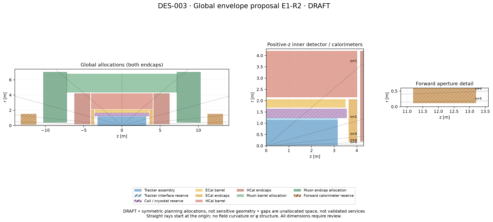

# DES-003 — Global detector envelopes and interfaces

- Status: **DRAFT — review round 2, E1-R2**, not approved geometry.
- Created: 2026-09-16; updated: 2026-09-17.
- Authors: AI-assisted project coordinator, System Architect, subsystem technicians, software engineer and Physics and Performance Validation.
- Human owner / technical reviewers / approving humans: TBD; no sign-off.
- Review issue: not separately created; [PR #4](https://github.com/asalzburger/nodd/pull/4) is the initial discussion venue.
- Related decisions: [ADR-001](../decisions/ADR-001-upstream-baseline.md), [ADR-003](../decisions/ADR-003-validation-and-artifact-policy.md), [ADR-006](../decisions/ADR-006-global-envelope-and-field-hypotheses.md), all DRAFT.
- Implementation PR / sign-off record: pending; none authorized here.
- Governing context: [PROJECT](../../PROJECT.md), [development plan, stage B](../DEVELOPMENT_PLAN.md).

## 1. Proposal and scope

The human review directs a **14 TeV HL-LHC reference** with tracker coverage
**|eta| < 4**, calorimetry **|eta| < 5** (extension if feasible), and muons
**|eta| < 3**, with **3.5 as a stretch objective**. These are human-directed
investigation targets, not achieved acceptance or sign-off of dimensions. The
later consolidated coverage comment supersedes the earlier calorimeter minimum
of eta 4. [Review direction](https://github.com/asalzburger/nodd/pull/4#discussion_r4032974435).

**NODD DESIGN CHOICE — proposed:** use **E1-R2**, the revised envelope hypothesis
below. It retains the revised forward apertures and detached calorimetry, but
expands the solenoid reservation and moves adjacent calorimeter/muon boundaries
outward and downstream to preserve nominal thicknesses and interface gaps. All revised dimensions are agent proposals, not human-approved
numbers. E1 at commit `7bb7ff04a96b2038572d59904f8954a42777d7e6` remains the
first-round comparison in Git; original input memoranda preserve its reasoning.
Review-round-1 E1-R1 remains at commit `9877ec1`. The review-round-2 proposal
adds a [solenoid space budget](inputs/DES-003-solenoid-space-budget.md); detailed
magnet and muon-system research is the next separate task, not a new prerequisite
for closing this space-allocation review.

Muon work now investigates a **standalone-compatible, potentially toroidal
system as the baseline study**, superseding E1's identification-first preference.
This does not require a dedicated magnet or establish that a toroid fits. Keep
iron-free solenoidal/combined measurement, instrumented return and air-core toroid
options live. The detailed magnet decision is deferred with the muon design;
envelope work must preserve its interfaces without forcing that decision now.

The central coil drawn remains an inner-solenoid hypothesis, not a selected
complete field topology. Envelope fit is not evidence of adequate supports,
services, shielding, shower containment or performance. Actual tracker layers,
calorimeter polygon choice and detailed PCB composition follow envelope work.

This round covers global setup, enclosures and interfaces. It does not select
sensor/chamber technology, layer counts, materials, electronics or detailed routes,
and it changes no production DD4hep geometry or reconstruction. Stage A remains
complete for progression by human direction; these are tests of new choices, not a
request to repeat A. The study ODD revision and ColliderML production identity
must still be distinguished when making quantitative comparisons.

## 2. Team inputs and evidence

| Role / input | Main contribution |
| --- | --- |
| [Tracker technician](inputs/DES-003-tracker-envelope-input.md) | Keep ODD-scale assembly; investigate forward tracking; expose missing services/timing space |
| [Calorimeter technician](inputs/DES-003-calorimeter-envelope-input.md) | Depth/composition, polygon dimensions, packaging and coil-order alternatives |
| [Muon technician](inputs/DES-003-muon-envelope-input.md) | Correct translated parent envelopes; distinguish identification from independent spectrometry |
| [System Architect](inputs/DES-003-system-architecture-input.md) | Reconcile requests into E1, reserve shared interfaces and expose coupled tradeoffs |
| [Software engineer](inputs/DES-003-software-validation-input.md) | Staged allocation, active-surface, material and transport diagnostics; reuse DD4hep/Geant4/ACTS |
| [Physics and Performance Validation](inputs/DES-003-physics-input.md) | Challenge coverage, magnetic leverage, material accounting and containment claims |

The input memoranda preserve alternatives: their individual requests are not all
adopted simultaneously. E1-R2 and the machine-readable allocation below are this
proposal's consolidated candidate. All source IDs resolve in the
[catalogue](../../reference/manifest.yaml); inputs retain precise PDF/factory locators.

### Review round 1 evidence and resulting changes

[All 25 review comments and dispositions](DES-003-review-1.md) record the
answers, changes and deliberately deferred questions.

- [Calorimeter review](inputs/DES-003-calorimeter-review-1.md): ATLAS compact
  forward and CMS detached forward precedents; eta 5 extension; literature-based
  barrel-endcap and rear-annular service handoffs.
- [Muon review](inputs/DES-003-muon-review-1.md): standalone/combined measurement
  distinction, toroid/solenoid/iron alternatives, smaller parent aperture and
  validation catalogue MU-V01–MU-V08.
- [Physics review](inputs/DES-003-physics-review-1.md): finite-solenoid feasibility
  screen, barrel-plus-forward timing, first-sensitive-radius hypotheses and
  operational evidence checking historical calorimeter assumptions.

These review inputs supersede conflicting first-round recommendations while
retaining their evidence. Later operational ATLAS/CMS calibration and field papers
support the historical scales as useful anchors; they do not validate nODD's
mixtures, cracks, containment or magnet. Detailed source locators are in the
review inputs and catalogue. The coordinator owns the human-decision register;
technical authors remain responsible for their claims.

| Claim | Classification | Evidence and consequence |
| --- | --- | --- |
| F1 | FACT | SRC-ODD-UPSTREAM at `c167363f3d4ad1540a577af99071283caf54f3a6`, `xml/OpenDataDetectorEnvelopes.xml`: tracker allocation r=0.025–1.140 m, half-length 3.150 m; calorimeter and muon allocations are tabulated in the inputs. These are source definitions, not new runtime checks. |
| F2 | FACT | Same source, `factory/calorimeter/ODDPolyhedraBarrelCalorimeter_geo.cpp` / `ODDPolyhedraEndcapCalorimeter_geo.cpp`: barrel radial parameters describe face geometry; endcap outer input is a circumradius. A common radial conversion is incorrect. |
| F3 | INFERENCE | Same source, `xml/detectors/CalorimeterECal.xml` / `CalorimeterHCal.xml`: summing the sourced layer repeats and slices gives normal sampling-stack thicknesses 0.2424 / 1.836 m. HCal contains substantial dense effective PCB material; depth cannot be inferred from steel alone. |
| F4 | FACT | SRC-ATLAS-TDR-030 §2.1, PDF25–26 and SRC-CMS-TDR-014 §2.2/PDF19, §3.1/PDF25: historical upgrade designs motivate investigating tracking near absolute eta 4. They do not establish nODD coverage or redundancy. |
| F5 | FACT | SRC-ATLAS-JINST-2008 §1.3/PDF38, SRC-CMS-JINST-2008 §5.1/PDF150 and SRC-CMS-TDR-019 §1.4/PDF17–19 provide calorimeter-depth precedents with different accounting boundaries. Their details and dates are retained in the calorimeter input. |
| F6 | FACT | SRC-CMS-TDR-016 §1.5.3/PDF39 and SRC-ATLAS-TDR-026 §1.4.4/PDF31 distinguish forward muon identification from standalone spectrometry; the latter describes a deferred proposed tagger. |

The 2008 overviews and dated upgrade TDRs are historical evidence, not assertions
about final installed systems. Their hardware choices are not copied wholesale.

## 3. E1-R2 allocation and r–z drawing

Canonical numerical input: [DES-003-envelopes.json](DES-003-envelopes.json).
All table rows are **NODD DESIGN CHOICE, proposed; approving humans: none**.
Coordinates use metres, a beam-axis z and cylindrical radius r. Positive-z
allocations reflect through z=0; a row with z minimum zero spans both sides.
These plotting conventions do not settle a full DD4hep/field coordinate ADR.

| Allocation | r min [m] | r max [m] | absolute z min [m] | absolute z max [m] |
| --- | ---: | ---: | ---: | ---: |
| Tracker assembly | 0.025 | 1.140 | 0 | 3.150 |
| Tracker interface reserve | 1.140 | 1.240 | 0 | 3.150 |
| Coil / cryostat reserve | 1.240 | 1.640 | 0 | 3.550 |
| ECal barrel | 1.700 | 2.060 | 0 | 3.500 |
| ECal endcaps | 0.180 | 2.060 | 3.650 | 4.010 |
| HCal barrel | 2.160 | 4.200 | 0 | 4.010 |
| HCal endcaps | 0.200 | 4.200 | 4.160 | 6.200 |
| Muon barrel allocation | 4.350 | 6.762 | 0 | 7.200 |
| Muon endcap allocation | 0.400 | 7.000 | 7.200 | 10.270 |
| Detached forward calorimeter study volume | 0.120 | 1.500 | 11.200 | 13.200 |

[Vector drawing](figures/DES-003-envelope-rz.svg).
Outer radii bound all polygon corners; inner radii bound the closest permitted
radial extent. These are axisymmetric enclosures, not imported polygon parameters,
active surfaces or uniformly filled material. Touching allocation boundaries
transfer ownership; actual geometry still needs reviewed tolerances and clearances.

### Rationale, concessions and omissions

- **Human review direction:** retain the aggressive **25 mm innermost tracker
  host radius**. This is not a selected sensitive-layer radius or a demonstrated
  beam-pipe/module clearance. The earlier 30–35 mm literature comparison remains
  context for later layer design, not a replacement envelope target.
- **Human review direction:** take the **outermost tracker layer with potential
  timing capability** as the baseline investigation. A timing-capable sensor/readout
  and forward coverage still need design; spatial silicon does not automatically
  provide precision timing. Separate barrel/forward timing assemblies remain
  alternatives. No new timing volume or shared-service capacity is approved here.
- **NODD DESIGN CHOICE:** reserve **0.400 m** radially and |z|≤3.550 m for the
  solenoid/cryostat. The space-budget input allocates 0.100 m inner cryostat/
  interface, 0.150 m cold assembly, 0.100 m outer cryostat/support and 0.050 m
  unassigned margin, with annular 0.250 m end allowances beyond a proposed cold
  assembly ending at |z|=3.300 m. These are planning allocations, not materials,
  engineering tolerances or a guaranteed upper bound. Chimneys and remote services
  need named routes outside the shell. ECal/HCal and the muon inner boundary move
  by 0.200 m; the calorimeter axial boundaries move by 0.200 m as well.
- **NODD DESIGN CHOICE:** shrink ECal/HCal endcap holes to 0.180/0.200 m to
  investigate adequate upstream calorimetry before muons near eta 3.5. This does
  not establish beam-line clearance or active coverage. The muon parent hole
  becomes 0.400 m; actual station edges still need redesign after envelopes.
- **Human review direction:** detached forward calorimetry is now the baseline;
  technology is deferred. **NODD DESIGN CHOICE:** retain the CMS-like study volume to target
  eta 5 without colliding with current muon boxes. Its 2.000 m axial allowance
  exceeds the historical CMS HF absorber length by 0.350 m; that increment is not
  a verified packaging budget. Readout, support and shielding require separate
  footprints and may extend beyond the drawn r=1.500 m or |z|=13.200 m bounds.
  The plotted global extent is therefore a lower bound on required space, not a
  closed detector enclosure.
- **NODD DESIGN CHOICE:** retain the smaller central muon host of E1 provisionally.
  Its 0.814 m radial loss relative to ODD remains a cost for stations and any
  toroid/return structures. No topology is demonstrated to fit.

**INFERENCE:** at eta 5 a prompt ray spans r=0.15094–0.17789 m across the forward
box. The ideal full-axial-depth geometric band is approximately eta 2.871–5.229,
from `asinh(z_back/r_outer)` to `asinh(z_front/r_inner)`. At eta 5.2 the entry
margin above the inner hole is only 3.57 mm: extension beyond eta 5 is exploratory,
not robust coverage. Beam-pipe profile, vertex shifts, inactive rims and shower
spread must be included. A detached calorimeter after muon stations cannot filter
hadrons before those stations; the smaller upstream endcap apertures address that
interface geometrically, without proving suppression.

**INFERENCE, conditional shape example:** if an ODD-like 16-sided barrel is
retained, normal depth is `r_max*cos(pi/16) - r_min`: approximately 0.3204 m ECal
and 1.9593 m HCal. A polygon is optional, not prescribed. These depth comparisons
are about 3.84 mm smaller than E1-R1 at each barrel face despite unchanged
nominal radial widths: moving polygon corners outward changes face depth. They
are not certified packaging margins. The detailed dense-PCB inventory is deferred;
it must remain accounted for when quoting inherited material depth. Minimal but
sufficient supports remain a physical requirement, not permission for zero mass.

## 4. Field, coverage and alternatives

**NODD DESIGN CHOICE:** retain **3 T** at the origin as an NbTi-compatible
study hypothesis, bracketed by 2 and 4 T. This is a literature-motivated range,
not proof that the allocated total coil/cryostat thickness can produce it.
SRC-ATLAS-SOLENOID-2007 and SRC-CMS-JINST-2008 supply commissioned 2 T and built
4 T examples with substantially different dimensions and material, documented
in the physics review. Higher-field conductors are not a shortcut to a thin
complete assembly.

**INFERENCE:** the new space-budget diagnostic uses a cold-assembly midpoint
R=1.415 m and illustrative winding length L=6.600 m. It requires approximately
17.14 MA-turn for 3 T centrally; the magnetic-pressure scale is 3.58 MPa and
uniform-bore energy proxy about 114 MJ. These are simplified consistency checks,
not total stored energy, conductor margins or structural validation. The earlier
E1-R1 finite-solenoid example and its forward field drop remain historical warning
examples, not field values for E1-R2. More space does not establish uniform 3 T
tracking. Detailed magnet/field research follows envelope agreement.

**INFERENCE:** an outer solenoid can provide bending between tracker and muon
segments; this may suffice for a combined fit, but does not automatically supply
independent standalone momentum. Iron is not fundamentally required for a
solenoid, but omitting it changes return/fringe field, support and energy.
Instrumented iron and air-core toroids remain alternatives. Evaluate signed
bending integrals between actual measured surfaces, alignment and scattering.
Estimate calorimeter leakage/punch-through before proposing additional absorber
steel; no extra steel is chosen merely to improve rejection.

**INFERENCE:** revised entrance-edge reach `asinh(z/r)` is approximately 3.703
for ECal, 3.729 for HCal and 3.584 for the muon parent. These fit prompt eta 3.5
rays through the allocation, not sensitive station or shower acceptance. The
forward calorimeter provides a geometric continuation toward eta 5. Define
separate observable-specific coverage and report transition depth, not only front
face intersections. Physics studies concern 14 TeV collisions, not 14 TeV
single-particle requirements; energy grids must respect forward event kinematics.

The earlier 24–30 radiation-length ECal and 9–11 interaction-length combined
calorimeter ranges remain **INFERENCE screening bands**. Operational calibration
supports their use as starting scales, not universal containment limits. Separate
instrumented material, upstream dead material and shielding; choose leakage-tail
observables before acceptance thresholds.

| Candidate | Study role | Principal unresolved question |
| --- | --- | --- |
| E0 | Inherited ODD control | Existing physical assumptions and actual polygon bounds |
| E1 | First-round enlarged central envelope, retained in Git | Coverage shortfall exposed by review |
| E1-R1 | Revised apertures and detached forward calorimetry, retained in Git | First revised space hypothesis |
| **E1-R2** | Explicit 0.400 m magnet budget and shifted neighboring envelopes | Provisional magnet decomposition; narrower muon host; service/forward footprints open |
| E2 | External central solenoid alternative | Useful combined/standalone bending and return flux; larger magnet/support volume |
| E3 | Standalone-compatible outer spectrometer, toroidal baseline investigation | Coil/support sectors and measured field integral; dedicated magnets deferred |

E1-R2 and E3 are not exclusive: the current boxes reserve a detector host, while
E3 describes a magnet/muon architecture to investigate within or beyond it.
A compact forward option from the calorimeter review (|z|=6.2–8.2 m,
r=0.080–0.900 m) remains an alternative, but overlaps current muon hosts and
requires a deliberate station/interface redesign. No magnet selection is forced
by this envelope iteration.

## 5. Interface register

The System Architect coordinates physical interfaces; subsystem owners provide
local inventories and requirements. The software engineer owns representations;
Physics and Performance Validation independently challenges the implications.
The coordinator routes coupled tradeoffs to the human reviewer.

| ID | Endpoint owners | Initial contract and unresolved handoff |
| --- | --- | --- |
| IF-01 | Architect / tracker | Beam pipe, first active radius, supports and forward aperture; pipe profile not assigned by tracker box |
| IF-02 | Tracker / architect | Shared r=1.140–1.240 m band; define local-to-shared cable/cooling/power handoff and timing competition |
| IF-03 | Architect / calorimeter | Coil/cryostat ends and material; r=1.640–1.700 m radial interface is proposed space, not demonstrated clearance |
| IF-04 | ECal / HCal, architect coordinating | r=2.060–2.160 m interface; packaging, electronics, shared supports and staggered transitions |
| IF-05 | Calorimeter / muon / architect | r=4.200–4.350 m interface, leakage, first station, return material and service routes |
| IF-06 | Architect / software | Units, enclosure conventions, field identity, geometry/version mapping; no implicit physical defaults |
| IF-07 | Subsystems / physics | Active surfaces, independent measurement counts, material scenarios and observable definitions |
| IF-08 | Architect / calorimeter / muon | Detached forward support, beam profile, shielding, downstream world extent and upstream hadron filtering |
| IF-09 | Tracker / architect / physics | Distinct barrel/forward timing hypotheses, coverage/association and shared services |

The tracker-to-ECal axial gap at absolute z=3.150–3.650 m remains unassigned
integration space, including competing coil-end and service needs. ECal and HCal
barrel/endcap transitions at 3.500–3.650 and 4.010–4.160 m, respectively, require
joint support/routing proposals. Space behind HCal endcaps is not assumed empty
or wholly usable. Muon barrel/endcap reservations meet at 7.200 m without certified
installation clearance. A two-dimensional drawing cannot allocate azimuthal routes.

**FACT:** ATLAS's barrel/endcap cryostat gap carries tracker/LAr services
(SRC-ATLAS-JINST-2008 §5.5/PDF166); CMS barrel ECal services converge to end
patch panels (SRC-CMS-JINST-2008 §4.2/PDF119); HGCAL services follow the exterior
to a rear annular exit shared with timing/muon constraints
(SRC-CMS-TDR-019 §4.5/PDF64–65). These are documented routing precedents.
**NODD DESIGN CHOICE:** investigate barrel-to-end patch regions and endcap outer
surface-to-rear handoffs, with owned phi sectors, sufficient supports and staggered
projective gaps. This supplies a route topology, not cable capacities or CAD.

Each material contribution must have exactly one owner. No return steel or cable
mass may also remain hidden in a calorimeter mixture. Shared-interface changes
require both endpoint owners to review the resulting proposal.

## 6. Validation and present evidence

The isolated **PROTOTYPE** [allocation tool](../../tools/envelope_study/study.py)
and [diagnostic report](../validation/DES-003-envelope-diagnostics.json) address
only rectangles and prompt straight rays. The report retains input/script hashes,
software versions, command and deterministic sampling. No acceptance tolerances
have been selected.

Earlier E1 and E1-R1 diagnostics remain traceable in Git. Read the current
E1-R2 report against its input hash for revised ray paths after the axial shifts;
prior numerical traversal fractions must not be transferred to the new boxes.
These diagnostics remain descriptive. Rectangle non-overlap and full axial
traversal establish neither material depth nor hermeticity, hits or efficiency.
Phi cracks, displaced vertices, bending, active edges and response remain outside
this tool. **ACTS installation is planned for the subsequent straight-line and
full-propagation study; it is not performed by this envelope revision.**

The [study catalogue](../validation/DES-003-study-catalogue.md), including
MU-V01–MU-V08 and later full propagation PROP-V01, separates geometric stations, measurement coordinates, field leverage, material,
punch-through, sensitive hits, reconstruction and systematic variations. It is a
staged research contract, not a claim those studies were executed. The actual
tracker/layer design begins after envelope definition; full propagation follows
field choice rather than replacing the present straight-line first estimate.

| Question / proposed requirement | Classification | Next measurement and acceptance state |
| --- | --- | --- |
| R1: coherent allocations and reproducible conventions | NODD DESIGN CHOICE | Rectangle and polygon checks now; actual clearances/overlaps after geometry exists; tolerances pending |
| R2: adequate tracking/muon measurement coverage | NODD DESIGN CHOICE | Count distinct surfaces/stations versus vertex, eta, phi and momentum; redundancy definition and target pending |
| R3: credible material and calorimeter depth | NODD DESIGN CHOICE | Component scenarios, directional X/X0 and interaction lengths; species/energy/angle shower studies later; leakage limits pending |
| R4: coherent magnet and field | NODD DESIGN CHOICE | Physical magnet/return proposal; field vectors/integrals and transport/reconstruction identity; accuracy pending |
| R5: physically connected services without double counting | NODD DESIGN CHOICE | Named handoffs, route sectors, component loads and aggregate material; capacities pending |

Software recommends a staged progression: allocation diagnostics now; active
surfaces and material scenarios next; then approved DD4hep geometry with DDRec
material scans, Geant4 transport/showers and ACTS tracking conversion/navigation.
Use existing tools where suitable rather than creating a competing transport
framework. DD4hep construction, physical overlap checks, Geant4 simulation, field
solutions and performance validation have **not** been run for this proposal.

## 7. Envelope review gate and subsequent work

**This review asks humans to assess the envelope allocation only:** E1-R2's
0.400 m solenoid reservation and propagated shifts, retained 25 mm tracker host,
forward-calorimeter baseline, and documented ownership of still-unallocated
service/support footprints. Confirm that the provisional space and its limitations
are an appropriate starting contract. No new physics, detailed magnet or layer
research is required to conclude this envelope discussion. No sign-off is recorded.

| Follow-up | Accountable role | Timing |
| --- | --- | --- |
| Review E1-R2 dimensions, narrowed muon host, interface ownership and provisional exclusions | Coordinator consolidates; System Architect owns space proposal; human reviewer decides | Current envelope review |
| Research solenoid/cryostat/field and dedicated muon architecture within reserved space; amend if needed | System Architect and muon technician, with physicist | Next separate research task |
| Develop tracker layers from retained aggressive host and timing-capable outer-layer baseline | Tracker technician; physicist evaluates timing/coverage | After envelope agreement |
| Choose forward technology and component supports/services, including beam profile and shielding handoffs | Calorimeter technician and System Architect | Subsequent subsystem design |
| Install ACTS in a reproducible environment and run planned line/full propagation studies | Software engineer; physicist defines observables | Subsequent validation task |
| Study leakage, punch-through, operating spectra, materials and final coverage | Physics and Performance Validation with subsystem technicians | Later performance work, before dependent acceptance claims |

Roles are accountable project roles, not appointed human approvers. Publication
maintains consistent proposal/TDR/source records. The deferred work can require
reviewed envelope amendments; it must not silently reinterpret agreed dimensions.

## 8. Review and implementation boundary

The PR is the initial proposal and discussion record. Human comments may change
the numbers and alternatives; the JSON, drawing and diagnostics must then be
regenerated consistently. Review must distinguish agreement to continue studying
E1-R2 from sign-off of this envelope proposal.

Human technical, domain, validation and approval assignments remain **TBD**.
Approval requires an identified reviewer, exact revision, conditions and explicit
sign-off record using the [template](../signoff/TEMPLATE.md). Merging a draft or
an agent's recommendation is not sign-off. Detailed component implementation
remains a separate authorized stage. DES-001/002 retain their proposed pixel and
support meanings; this document does not implement or approve them.
