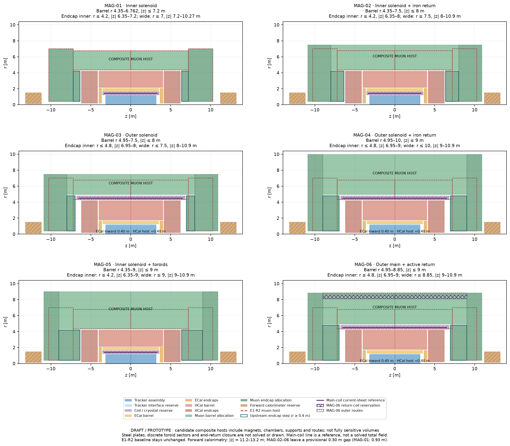
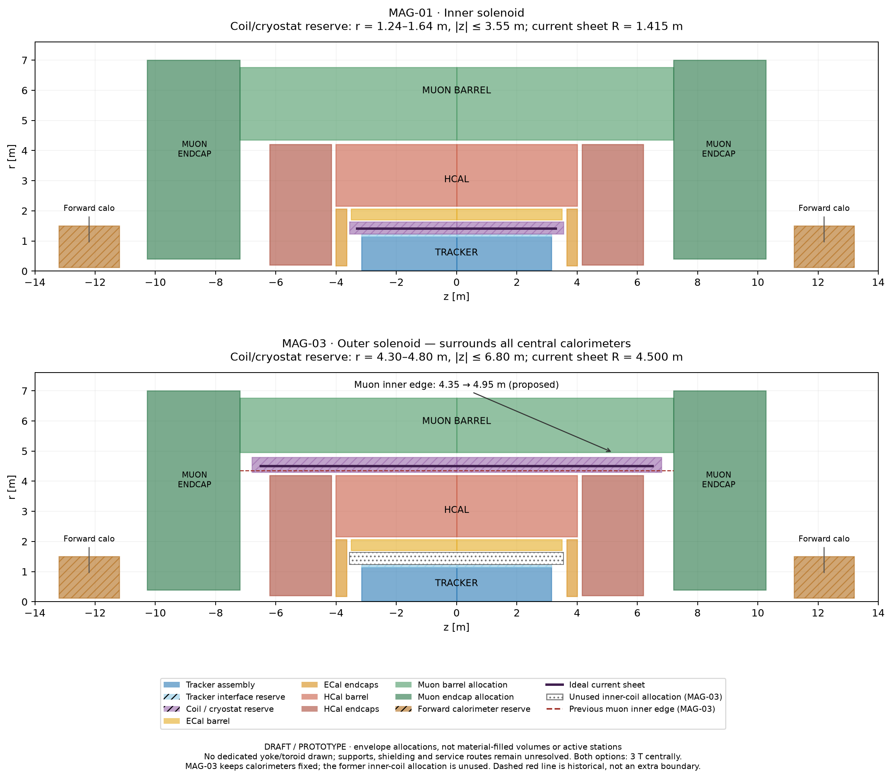
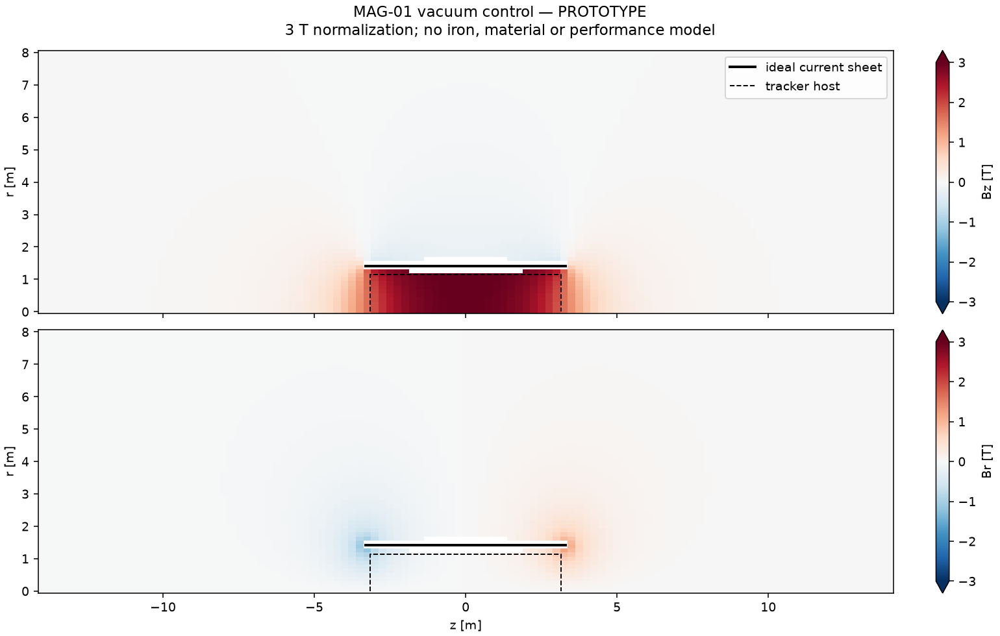
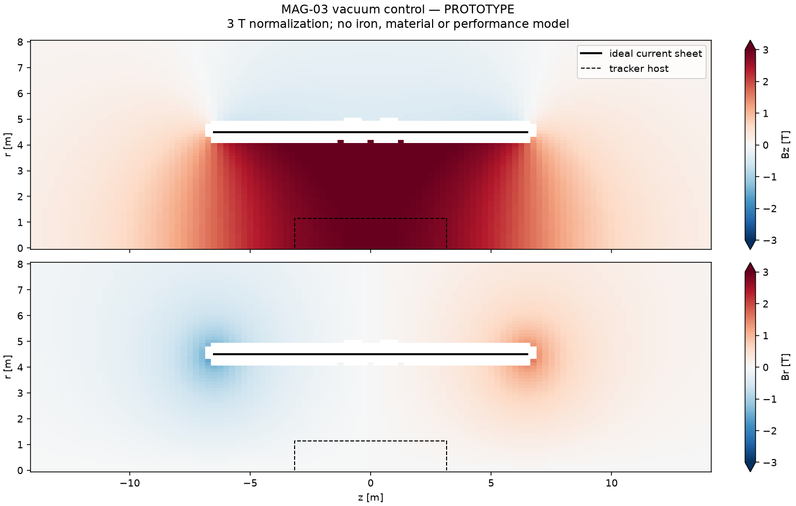

# DES-004 — Magnetic configurations and option evaluation

- Status: DRAFT
- Created: 2026-09-17; unsigned research candidates.
- Human owner / technical reviewers / numerical approvers: pending.
- Scope: candidate definitions and isolated PROTOTYPE diagnostics, not detector implementation.
- Context: [PROJECT](../../PROJECT.md), [research plan](../MAGNET_RESEARCH_PLAN.md), [DES-003](DES-003-global-envelopes.md), [ADR-006](../decisions/ADR-006-global-envelope-and-field-hypotheses.md), [ADR-003](../decisions/ADR-003-validation-and-artifact-policy.md).
- System integration: [architect input and explicit amendment requests](inputs/DES-004-system-architecture.md).
- Sign-off / production implementation: none.

## Current evaluation

The [physics pro/con follow-up](inputs/DES-004-muon-field-tradeoffs.md), tracked
in [issue #9](https://github.com/asalzburger/nodd/issues/9), responds to PR #6
on return-field versus dedicated muon magnets. Replies distinguish completed
envelope amendments from outstanding field and performance evidence.

The user authorized evaluation of all options on 2026-09-17. Read the
[two-page team summary and six one-page proposals](DES-004-options-summary.md)
for current recommendations, conditional showstoppers and next tests. The cards
below retain the initial definitions and numerical foundations. Recommendations
are research priorities; no topology has been selected or signed off.

## Candidate-specific muon envelopes

The user authorized adapting the study envelopes on 2026-09-17. The muon engineer
and Project Coordinator proposed the hosts, revised on 2026-09-18 by explicit
human direction to allow upstream endcap steps. The following are **NODD DESIGN CHOICE — unsigned**
composite hosts. They include chambers, magnet structures, supports and services;
coloured host area is not fully sensitive volume. E1-R2 remains the reference.
A baseline-update issue follows only after a layout is chosen.

| Candidate | Barrel r [m]; max absolute z [m] | Upstream endcap r [m]; absolute z [m] | Wide endcap r [m]; absolute z [m] |
| --- | --- | --- | --- |
| MAG-01 | 4.35–6.762; 7.2 | 0.4–4.2; 6.35–7.2 | 0.4–7; 7.2–10.27 |
| MAG-02 | 4.35–7.5; 8 | 0.4–4.2; 6.35–8 | 0.4–7.5; 8–10.9 |
| MAG-03 | 4.95–7.5; 8 | 0.4–4.8; 6.95–8 | 0.4–7.5; 8–10.9 |
| MAG-04 | 4.95–10; 9 | 0.4–4.8; 6.95–9 | 0.4–10; 9–10.9 |
| MAG-05 | 4.35–9; 9 | 0.4–4.2; 6.35–9 | 0.4–9; 9–10.9 |
| MAG-06 | 4.95–8.85; 9 | 0.4–4.8; 6.95–9 | 0.4–8.85; 9–10.9 |

The endcap front no longer follows barrel length: inner-solenoid options start
at |z|=6.35 m, outer-solenoid options at 6.95 m. A narrower section extends
inside the barrel, then widens downstream. The [revision rationale and aperture
limits](inputs/DES-004-muon-envelope-amendments.md#stepped-endcap-revision--2026-09-18)
classify the trial 0.15 m interface allowances and unresolved shared uses.

[Vector comparison](figures/DES-004-muon-envelopes-comparison-rz.svg),
[muon budgets and rationale](inputs/DES-004-muon-envelope-amendments.md),
[coordinator interface review](inputs/DES-004-envelope-coordination.md), and
[generated dimensions/checks](../validation/DES-004-muon-envelope-proposals.json).
Individual PNG/SVG drawings are linked from each option proposal below.

MAG-04 reserves example radial magnetic-structure slots totalling 129.94 m²;
this accommodates the earlier 127.23 m² trial return-area requirement without
using the entire host. MAG-06 reserves a 4.95–8.10 m measurement/return annulus,
8.10–8.60 m return-coil shell and 8.60–8.85 m routes/supports. These are space
budgets, not steel recipes, actual fields or validated chamber arrangements.

All six coarse allocations pass positive-rectangle-intersection checks. Expanded
endcaps stop at |z|=10.9 m, leaving 0.30 m to the forward instrumented host.
**Remaining concern:** MAG-04/06 end-flux closure, measurements and services have
not been shown to fit the stepped host. Its full-radius section still spans
9.0–10.9 m; the narrower upstream extension starts at 6.95 m. Further amendments
may be necessary. Enlarging the radial host does not settle that question.
The original two-option drawings and fixed-host flux screens below are retained
as historical comparison evidence; the table above is the current research request.

## Reuse of the absent inner-solenoid space — 2026-09-18

The System Architect coordinated tracker, calorimeter and muon inputs for
MAG-03/04/06. **NODD DESIGN CHOICE — unsigned:** retain tracker and service
bounds, move ECal barrel from r=1.70–2.06 m to **1.30–1.66 m**, reduce the
ECal endcap outer radius to **1.66 m** to avoid an HCal overlap, and move the
HCal barrel entrance from 2.16 to **1.76 m**, retaining its 4.20 m outer radius.
All axial bounds, HCal endcaps, outer coil and stepped muon hosts are retained.
The released 0.40 m increases HCal assembly capacity; no extra interaction length
or performance gain is assumed. The former unused-coil shell is no longer drawn
in these optimized candidates. Inner-solenoid candidates are unchanged.

See the [coordinated requirements and alternatives](inputs/DES-004-inner-space-reallocation.md).
The generated report compares nominal depths, interface gaps and 5,201 prompt
rays from eta 0 to 5.2 per candidate against E1-R2. No sampled ECal/HCal summed
host-path reduction was found. This does not validate showers, services, sensitive
coverage or physical fields. Earlier fixed-layout results remain separate controls.

## 1. Decision to inform

Which magnetic topology provides credible tracking and muon measurements for the
14 TeV programme while respecting calorimetry, material, service and resource
constraints? E1-R2 remains the reference allocation, not a geometry to overwrite
while experimenting. Keep tracker coverage to absolute eta 4, calorimetry to 5,
and muons to 3 with 3.5 stretch as investigation objectives. Standalone-compatible
muon spectrometry is the baseline investigation; combined measurement remains a
legitimate alternative rather than an interchangeable performance claim.

**NODD DESIGN CHOICE:** begin with six candidates. Normalize the first comparison
to +3 T central Bz, then test resource plausibility. No current-only calculation
represents calorimeter steel or an iron return. No candidate ranking, detector
resolution or engineering approval is supplied by these cards.

## 2. Existing source ledger

These are already catalogued in [reference/manifest.yaml](../../reference/manifest.yaml).
Locators were verified in the linked prior inputs; no new experimental parameter
is inferred from a document title. Historical construction and operational studies
have different evidential roles.

| Claim | Classification | Source and exact locator | Supported statement and limit |
| --- | --- | --- | --- |
| M-F01 | FACT | SRC-ATLAS-SOLENOID-2007, abstract and Table I/PDF1; [space-budget input](inputs/DES-003-solenoid-space-budget.md) | Commissioned 2 T NbTi solenoid, thin cold assembly and shared calorimeter cryostat; cold mass is not a complete standalone enclosure |
| M-F02 | FACT | SRC-CMS-JINST-2008, §2.1/PDF33 and Table 2.1/PDF35; [physics review](inputs/DES-003-physics-review-1.md) | Built/tested 4 T solenoid with much larger dimensions and cold mass; does not prescribe a scaled nODD shell |
| M-F03 | FACT | SRC-ATLAS-JINST-2008, §6.1/printed164/PDF194 and Figs.6.1–6.2/PDF195; [muon input](inputs/DES-003-muon-envelope-input.md) | Muon stations arranged with barrel/endcap toroids; different outer scale and service gaps |
| M-F04 | FACT | SRC-CMS-YOKE-COSMICS-2010, §§1–2/PDF3–5; [muon review](inputs/DES-003-muon-review-1.md) | Measured bending in tracker-to-muon and yoke contexts; vertex-constrained and independent measurement are distinct |
| M-F05 | FACT | SRC-CMS-FIELD-MAP-2023, §§1–2/PDF2–3; same review | Operational map includes iron/air interfaces and geometrical asymmetries; a central field number is insufficient |
| M-F06 | FACT | SRC-ODD-UPSTREAM at `c167363f3d4ad1540a577af99071283caf54f3a6`, `xml/detectors/CalorimeterHCal.xml`; [calorimeter input](inputs/DES-003-calorimeter-envelope-input.md) | Inherited calorimeter contains steel and effective material; absence of a dedicated yoke is not an iron-free detector |

## 3. Candidate cards

All candidate prescriptions below are **NODD DESIGN CHOICE — proposed; human
approvers pending**. Physical consequences labelled INFERENCE are hypotheses,
not measured nODD results. TBD means the candidate is not ready for a physical
field calculation; unknown dimensions must not be silently filled with defaults.

### MAG-01 — Inner solenoid, no dedicated return yoke

- **Geometry/current:** thin diagnostic sheet R=1.415 m, half-length 3.300 m,
  normalized Bz(0)=+3 T; reference assembly r=1.240–1.640 m, |z|≤3.550 m.
  INFERENCE: vacuum-sheet normalization requires approximately 17.144 MA-turn.
  Cable current/turn count, conductor fill and cryostat material remain TBD.
- **Return/material:** flux returns through exterior space in the vacuum control.
  Physical HCal/support steel is omitted there and must be restored in a separate
  material-aware model. No outer uniform-field value is imposed.
- **Measurements:** unchanged tracker; muon stations to be defined by the common
  comparison contract. Test tracker-combined and constrained/unconstrained muon
  hypotheses separately; fringe field alone establishes no standalone capability.
- **Space/source:** reference shell from DES-003; M-F01 supports an inner-solenoid
  technology precedent, not this exact iron-free complete detector.
- **Key tests:** forward field reduction, pre-ECal material and combined leverage.

### MAG-02 — Inner solenoid with instrumented iron return

- **Geometry/current:** retain MAG-01 as the starting coil request, but recompute
  required current after the nonlinear return geometry exists. Copying its vacuum
  current does not preserve 3 T once iron is included.
- **Return/material:** yoke barrel/endcap dimensions, plate/gap sequence, B–H
  curves, saturation, supports and mass **TBD**. No iron thickness is selected.
- **Measurements:** stations in proposed return gaps; independent bending,
  multiple scattering, stopping and alignment require joint evaluation.
- **Space/source:** amendment required within or beyond muon hosts; M-F04/M-F05
  establish operational return-field measurement/model needs, not this topology's
  fit or nODD performance.
- **Key tests:** whether useful signed return-field bending compensates material
  and space costs. A permeability multiplier is not an adequate physical model.

### MAG-03 — Solenoid outside all central calorimeters, no dedicated yoke

- **Geometry/current:** diagnostic sheet R=4.500 m, half-length 6.500 m at +3 T.
  INFERENCE: approximately 37.747 MA-turn in the vacuum-sheet model. It surrounds
  barrel **and central endcap** calorimeters, not detached forward calorimetry.
- **Space amendment:** proposed assembly r=4.300–4.800 m, |z|≤6.800 m; move
  muon barrel inner host from 4.350 to 4.950 m provisionally. Full rationale and
  costs are in the architect input. These are unsigned space requests, not fit
  evidence. Leave the former inner-coil allocation unused in the first comparison.
- **Return/material:** no dedicated yoke; ferromagnetic central calorimeters are
  inside the physical bore. Their response is absent from the vacuum control.
- **Measurements:** test bending between tracker and outer segments with common
  measurement assumptions. INFERENCE: longer magnetic leverage can aid a combined
  fit but is not proof of tracker-independent momentum.
- **Source/unknowns:** M-F02 anchors external-solenoid scale/technology, not an
  iron-free CMS replica. Conductor, cryostat, stored energy, end loads, supports,
  stray field and nonlinear material response remain TBD. A barrel-only variant
  MAG-03-B requires a separate length/interface card; it is not this model.

### MAG-04 — Outer solenoid with instrumented iron return

- **Geometry/current:** use MAG-03's proposed central enclosure for initial space
  discussion; renormalize current in the solved return geometry, not by a vacuum
  scaling after the fact.
- **Return/material:** yoke dimensions, gaps, material curves, supports and mass
  **TBD**. The already narrowed muon host cannot automatically hold both chambers
  and a return system. Additional radius or station changes require amendment.
- **Measurements:** common combined, vertex-constrained and standalone definitions;
  compare bending versus scattering and uncertainty in the material/field model.
- **Source:** M-F02/M-F04/M-F05 provide built and operational precedent for the
  topology. They do not validate this smaller host or proposed coil envelope.
- **Key tests:** actual return-field information and resource demands; no automatic
  advantage from adding absorber before punch-through evidence exists.

### MAG-05 — Inner solenoid with air-core barrel/endcap toroids

- **Geometry/current:** initial inner coil MAG-01; discrete barrel/endcap toroid
  coil count, shapes, currents, cryostats, supports and routes **TBD**.
- **Return/material:** no prescribed dedicated iron yoke; HCal/support steel still
  matters. Ideal axisymmetric toroidal fields are optional controls, not a model
  of discrete coil sectors and transition gaps.
- **Measurements:** baseline investigation for standalone-compatible muons, with
  useful bending between actual stations. Forward coverage, inactive sectors and
  alignment must enter the comparison rather than assuming ATLAS performance.
- **Space/source:** M-F03 supplies the engineered topology precedent at a different
  scale. Demonstrating fit inside r=4.350–6.762 m barrel host and the endcap host
  requires a new coil/support allocation; no such fit is claimed yet.
- **Key tests:** 3D field orientation, signed bending, coil obstruction and
  barrel/endcap continuity; report any required envelope expansion explicitly.

### MAG-06 — Solenoid with active return/shielding coils

- **Geometry/current:** central inner/outer choice, return-coil radii/lengths,
  positions, polarities and currents **TBD**. No numerical model is specified.
- **Purpose:** investigate whether controlled return flux can reduce reliance on
  dedicated iron while retaining useful measurement fields. Define the stray-field
  region/objective and measurement constraints before optimizing currents.
- **Material/space:** additional conductors, protection, supports and energy are
  not free; coupled forces and quench behavior need later study.
- **Evidence:** this is an exploratory project alternative, not a claimed built
  collider-detector precedent. The later [MAG-06 assessment](options/DES-004-MAG-06.md) now records a
  public 4th Concept dual-solenoid proposal. It supplies conceptual precedent,
  not a built HL-LHC system or a demonstrated nODD fit.
- **Gate:** cheap field/space plausibility and source screen first. Do not carry
  this candidate into a physical ranking until its geometry and evidence exist.

## 4. Shared comparison contract and limitations

Hold common diagnostic measurements and uncertainties where possible. Distinguish
fixed-layout results from improvements after candidate-specific surface changes;
MAG-03's host conflict must remain visible even in a vacuum comparison. Count
missing crossings as outcomes. Separate tracker-only, combined, muon-only with a
vertex constraint and unconstrained standalone fits, including displaced samples.

The architect proposes a **0.120 m exclusion band around ideal current sheets**
for numerical diagnostics. It is not a physical clearance and may not become an
undocumented out-of-domain rule in transport. Finite-coil physics near conductors
requires an appropriate model and independent convergence tests.

Calorimeter consequences: inner coils add pre-ECal material; outer coils trade
that for a larger magnetic volume, field through central calorimeters, external
supports and downstream dead material. No field model establishes shower
containment. Keep instrumented depth, supports, coil and return material separate.
Do not add steel merely to improve muon plots; punch-through is a later transport
question. Detached forward calorimetry cannot absorb hadrons before upstream
muon stations.

## 5. Review gates and first-increment deliverables

1. **Candidate contract:** review these cards, unknowns and amendment requests;
   physics supplies samples and comparison observables before ranking.
2. **Numerical foundation:** verify vacuum-solenoid fields and actual ACTS setup
   using independent checks. Source/model/configuration hashes and software
   versions accompany artifacts. Missing ACTS availability must remain explicit.
3. **Physical completion:** solve ferromagnetic/discrete-coil candidates with
   appropriate material and dimensional inputs; retain incomplete comparisons.
4. **Interpretation:** compare field-only, material and resource scenarios, then
   recommend a shortlist with uncertainty. Human review selects subsequent work.

This document supplies candidate definitions and source/amendment provenance.
Software artifacts and specialist results must state their own actual checks;
these cards do not claim a solver, propagation, engineering or performance result.
No sign-off state, baseline dimensions or production geometry is changed.

## 6. First evidence and subsystem advice

The [vacuum benchmark](../validation/DES-004-solenoid-benchmark.json) and
[reproduction instructions](../../tools/magnetic_study/README.md) retain the
actual field calculation. **INFERENCE — current-only controls:**

| Quantity | MAG-01 inner | MAG-03 outer, all central calorimeters |
| --- | ---: | ---: |
| Current-sheet radius [m] | 1.415 | 4.500 |
| Full winding length [m] | 6.600 | 13.000 |
| Normalization Bz(0,0) [T] | 3.000 | 3.000 |
| Required ampere-turns [MA-turn] | 17.144 | 37.747 |
| Bz on axis at z=3.15 m [T] | 1.766 | 2.743 |
| (Br,Bz) at (r,z)=(1.14,3.15) m [T] | (0.871,1.967) | (0.101,2.767) |

These are model calculations, not facts about a built magnet. The outer control
retains more forward axial field but at larger size/current; the table cannot
rank tracking resolution, resources or standalone muon performance. The last
point is a tracker-host corner, not an eta-4 track endpoint.

### Initial global system layouts — fixed outer-host comparison

The following full-system r–z comparison uses identical axes and colours. MAG-01
retains E1-R2. MAG-03 applies only the previously proposed outer-coil reservation
and muon barrel inner-radius change from 4.35 to 4.95 m. The unused inner-coil
allocation is dotted; the previous muon boundary is dashed red. Central calorimeters
and detached forward calorimeters retain their baseline locations. All allocations
remain **NODD DESIGN CHOICE — unsigned**; no yoke, toroid or material is implied.

Individual exports: [MAG-01 PNG](figures/DES-004-mag-01-system-rz.png) /
[SVG](figures/DES-004-mag-01-system-rz.svg),
[MAG-03 PNG](figures/DES-004-mag-03-system-rz.png) /
[SVG](figures/DES-004-mag-03-system-rz.svg), and
[comparison SVG](figures/DES-004-solenoid-options-system-rz.svg).
The [layout record](../validation/DES-004-system-layouts.json) retains actual
coordinates, amendment inputs, tool hashes and rectangle checks. Both candidate
allocations have zero positive rectangle intersections, and each ideal current
sheet lies inside its coil reservation. This does not establish service capacity,
engineering fit or active coverage; drawings omit unresolved global supports,
shielding and service routes.

### Vacuum field components

Both plots use the same spatial and colour scales. White cells fail the stated
source-distance/convergence screens. They are display grids, not transport maps.
Current-sheet idealization and missing ferromagnetic material limit interpretation.

Specialist assessments and responsibilities:

- [System Architect](inputs/DES-004-system-architecture.md): candidate geometry,
  interface ownership and explicit muon-host amendment requests.
- [Calorimeter engineer](inputs/DES-004-calorimeter.md): upstream coil material,
  steel response, leakage and service routes.
- [Muon engineer](inputs/DES-004-muon.md): conditional standalone/combined options,
  forward/sector gaps and material consequences.
- [Tracker engineer](inputs/DES-004-tracker.md): forward bending and measurement
  leverage, end-field effects and timing interfaces.
- [Physics and Performance office](inputs/DES-004-physics-validation.md): shared
  fixtures, independent checks, fit definitions and honest failure denominators.
- [Software coordinator](../validation/DES-004-acts-setup.md): actual ACTS
  installation and propagation verification, including remaining limitations.

The ACTS setup passed seven actual propagation fixtures and five solenoid-axis
comparisons using `pyacts==47.7.0`; the maximum axis discrepancy was
1.06×10⁻⁶ T. These checks use synthetic geometry with material effects disabled,
not nODD candidate trajectories or fitted performance.

The Project Coordinator reconciles these into this proposal. The Publication
Office maintains the candidate/source ledger, figures and claim boundaries here;
no TDR submodule modification is needed for this research checkpoint.

## 7. Questions for the next review

1. Retain all six candidates through the inexpensive screen, or prioritize the
   standalone-compatible toroid and instrumented-return candidates first?
2. Is the outer-solenoid enclosure around **all central calorimeters** useful
   enough to investigate its explicit muon-host amendment, alongside a separately
   defined barrel-only alternative?
3. What independent muon measurement requirement and displaced-particle cases
   should distinguish standalone from vertex-constrained and combined fits?
4. Which calorimeter/support ferromagnetic materials and B–H data form the first
   physical field scenario? Who reviews saturation and return-path modelling?
5. What 3D toroid coils, station/service gaps and endcap interfaces merit a first
   geometry? The existing host does not establish that such a magnet fits.
6. Which measurement covariance/material fixtures should be frozen before any
   conditional resolution comparison? What stray-field domain should be tested?

Next TDR section outline: requirements and precedents; candidate topology and
interfaces; field calculation/validation; material and measurement assumptions;
physics/resource comparison; selected concept and residual risks. Only the first
three have initial evidence here. Candidate selection and engineering sign-off
remain human decisions after further study.
