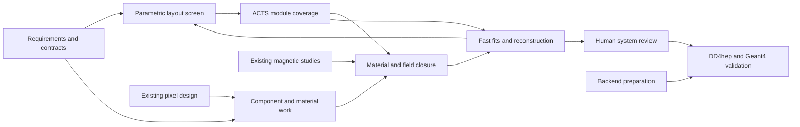

# DES-005 — Whole-tracker design and staged performance programme

- Status: TECHNICAL REVIEW — staged programme; no selected layer layout or human sign-off.
- Created: 2026-09-18.
- Roles: `SysArch`, `TrackTech`, `PhysVal`, `SoftEng`.
- Human owner / additional technical and expert reviewers: unassigned.
- Requested plan reviewer and final human sign-off authority: `asalzburger-review`.
- Origin: direct user requests on 2026-09-18 for the plan and its review/sign-off PR.
- Review request, exact target revision and PR: [review register](../../project/reviews.json).
- Related: [DES-003](DES-003-global-envelopes.md),
  [ADR-006](../decisions/ADR-006-global-envelope-and-field-hypotheses.md),
  [ADR-001](../decisions/ADR-001-upstream-baseline.md),
  [ADR-003](../decisions/ADR-003-validation-and-artifact-policy.md),
  [development plan](../DEVELOPMENT_PLAN.md).

## 1. Decision and fixed scope

Review and sign-off are requested for this staged programme, its responsibilities,
dependencies and evidence gates. Approval would establish the agreed planning
scope; numerical criteria, layer/component choices, production implementation
and physics acceptance retain their later review requirements. The human decision
must identify the exact reviewed revision and any conditions.

Develop a physically credible placement of tracker subsystems, barrel layers and
endcap disks/rings, with a demonstrated performance case and a route to detailed
implementation. The first deliverable is a reproducible comparison and a rough
layout shortlist; the final deliverable is the reviewed tracker system design,
its component/service interfaces and validation evidence for the TDR.

**NODD DESIGN CHOICE — human-directed requirements:**

- Retain the established tracker assembly envelope for the study. DES-003
  E1-R2's `tracker` region is `0.025 <= r <= 1.140 m`, `|z| <= 3.150 m`;
  `tracker_services` reserves `1.140 <= r <= 1.240 m` over the same longitudinal
  extent. These inherited allocations are not active bounds or verified capacity.
- System tracking coverage **`|eta| < 4` is fixed**. Evaluate the luminous-region
  spread before selecting the layout and again at final validation. Performance
  thresholds, beamspot distribution and statistical acceptance criteria remain
  to be agreed; angular reach alone is insufficient.
- Begin with **pixels → short strips/strixels → stereo outer long strips**.
  Internal boundaries, layer counts, radii, lengths, disk positions, stereo
  angles and module families remain variables. Each subsystem need not reach
  the full system coverage on its own.
- Permit well-motivated departures, including timing-capable layer(s). The
  inherited outermost-tracker timing investigation is a candidate, alongside
  no timing and justified integrated/separate barrel/forward alternatives.
- Demonstrated physics performance governs selection. Progress from inexpensive
  estimates to ACTS studies and later DD4hep/Geant4; module, material and field
  development run alongside this sequence.

The current instruction supersedes the reduced-coverage alternative in the
historical [tracker-envelope input](inputs/DES-003-tracker-envelope-input.md).
The 25 mm inner host is not a chosen sensor radius. An envelope conflict requires
an explicit amendment, not an unrecorded change to a fixed constraint.

All process, package and candidate recommendations below are **NODD DESIGN
CHOICE — proposed; approval pending**. No new numerical layer prescription,
material budget, beamspot width or performance target is introduced. This is
planning work: no prototype code or production configuration is added. Future
unsigned executable studies must be isolated and labelled `PROTOTYPE`.

## 2. Existing work to integrate

| Input | Verified identity and present state | Reuse and dependency |
| --- | --- | --- |
| Global envelopes | DES-003 E1-R2; [allocation JSON](DES-003-envelopes.json), regions `tracker`/`tracker_services`; baseline technical approval recorded in [tracking](../../project/tracking.json), formal lifecycle still DRAFT | Fixed host for the initial candidate family; active placement, route capacity and performance remain to establish |
| Pixel modules | [Issue #7](https://github.com/asalzburger/nodd/issues/7), [PR #8](https://github.com/asalzburger/nodd/pull/8); [DES-001 at d237f146b578915cc032b30efa50044cf6344d5f](https://github.com/asalzburger/nodd/blob/d237f146b578915cc032b30efa50044cf6344d5f/docs/design/DES-001-rd53-pixel-modules.md); open, DRAFT | Consume A1/A2/B4 outlines, active masks, sensor/readout response, material constituents and termination interfaces; return tiling/occupancy/service constraints to that work |
| Magnetic studies | [PR #6](https://github.com/asalzburger/nodd/pull/6), [DES-004 at 040337c2d6129014655a7534e0ea79c6ef693bc2](https://github.com/asalzburger/nodd/blob/040337c2d6129014655a7534e0ea79c6ef693bc2/docs/design/DES-004-magnetic-configurations.md); open, DRAFT | Reuse verified field controls and ACTS setup work from that branch; consume physical candidate fields when available. Six named study candidates do not mean six validated maps |
| Muon field comparison | [Issue #9](https://github.com/asalzburger/nodd/issues/9), open | Shared field/transport contract and consistency across tracker-only and combined studies; not the pixel-module task |
| ODD study control | `SRC-ODD-UPSTREAM`, revision `c167363f3d4ad1540a577af99071283caf54f3a6`; [source assessment](../validation/ODD-realism-assessment.md), E01–E04/E09 | Extract layout, passive structures, readouts and ACTS digitization distinctly. This study source is not automatically the approved ColliderML comparison configuration |
| Existing small tools | [Envelope prototype](../../tools/envelope_study/README.md), source-reading and dashboard infrastructure | Reuse provenance and diagnostic conventions; rectangle intersections are not active hit or material studies |

The request's pixel reference “#9” resolves in the repository to issue #7 / PR #8;
issue #9 is the separate muon study. The table records the inspected revisions,
not future merged content. Rebase/reconcile interfaces when either input lands;
do not copy its evolving implementation into this branch. Stage A remains closed
for progression; extracting the control needed by a new comparison does not
restart the old baseline programme.

The pixel proposal ends at its electrical termination and bare die backs. Its
`0.5884% X0` is a partial local reference path, not a complete module/layer budget
or area average. Mounting glue, supports, cooling and external distribution need
their own inputs. This limitation is recorded in DES-001, “Scope and exclusions”,
“Dimensions, material table and cross-sections”, and PM3-I02.

## 3. Four-role argument and integration

| Role and input | Position to defend | Required challenge / handoff |
| --- | --- | --- |
| [SysArch](inputs/DES-005-tracker-system-sysarch.md) | Preserve coherent host, beam-pipe, support and shared-service interfaces; allocate occupied space deliberately | Challenge ideal layers that cannot host modules/routes; reconcile field and calorimeter interfaces and any amendment |
| [TrackTech](inputs/DES-005-tracker-system-tracktech.md) | Credible modules, measured coordinates, stereo pairing, dead edges, tiling, supports and loads must constrain layout | Challenge unrealistically light or perfect surfaces; supply bounded component interfaces early and close them iteratively |
| [PhysVal](inputs/DES-005-tracker-system-physval.md) | Select with uncertainty-aware physics evidence, including forward information, failures, occupancy and vertex dependence | Challenge hit counts presented as resolution, truth-seeded fitting as reconstruction, and timing gains without hardware cost |
| [SoftEng](inputs/DES-005-tracker-system-softeng.md) | Carry one versioned detector/measurement/scenario definition through progressively richer tools | Challenge unsupported IdRes/ACTS features and incompatible conventions; expose losses and validate adapters independently |

SysArch integrates the proposals; PhysVal retains independent scientific review.
Disagreements become alternatives with an observable, physical cost and next
discriminating study. ProRes routes unresolved choices to human review. Agent
agreement does not provide technical/expert human approval.

## 4. Step-by-step programme

Each stage leaves reproducible artifacts in Git or a retained artifact manifest:
source/configuration hashes, tool versions, commands, units, seeds, sampling,
tolerances, assumptions, missing inputs and actual outcomes. A gate can accept a
bounded exploratory result while leaving physical design selection pending.

| Stage | Work and owners | Deliverables / exit evidence |
| --- | --- | --- |
| S0 — Requirements and interface contract | SysArch + PhysVal lead; all four contribute. Inventory inherited constraints, ODD control, intended physics uses, measurement definitions and component interfaces. Specify beamspot, momenta, occupancy and performance criteria before ranking | Requirement-to-observable matrix; input/uncertainty register; verified control identity; layout/material/field/sample schema. Open numerical targets assigned for human decision |
| S1 — Rough layers and parametric screen | TrackTech proposes ODD-like and motivated variants; SoftEng supports IdRes intake or a transparent analytic estimator; PhysVal evaluates covariance, forward lever arms and material/response sensitivities | Barrel/endcap layer tables and r–z drawings, calculation recipes, scenario sweeps, ranked/conditional shortlist with rejected alternatives and limitations. Beamspot sensitivity begins here |
| S2 — ACTS active coverage | SoftEng + TrackTech turn shortlisted surfaces into bounded modules, masks and stereo pairs; PhysVal measures coverage. Start with zero/uniform-field controls, add available candidate fields | Sensor/coordinate crossings, holes, independent information and lever arms versus eta/phi/momentum/vertex; transition and forward stress maps; numerical crosschecks and all propagation failures |
| S3 — Material and field closure | TrackTech + SysArch reconcile component, support, coolant and service scenarios; SoftEng maps/integrates them; PhysVal tests uncertainty | Directional material scans, mass/ownership ledger, material location before measurements, field-domain/interpolation checks and model uncertainty; feedback to S1/S2 |
| S4 — Fast fitting and reconstruction | SoftEng implements staged measurement simulation/fits and later pattern recognition; PhysVal defines samples and interprets results | First truth-seeded residuals/pulls, then efficiency/fakes/duplicates under explicit occupancy; alignment/field/material variations; timing association comparison and physics-use-case evidence where modeled |
| S5 — System design review | SysArch consolidates layout, component/service contracts and cost/performance alternatives; TrackTech closes physical interfaces; PhysVal independently assesses evidence | Reviewed shortlist recommendation, complete declared budgets and limitations, named validation requirements; human layout/component sign-off before production implementation |
| S6 — DD4hep/Geant4 and final validation | SoftEng lands the supported backend and conversion; TrackTech/SysArch integrate signed-off designs; PhysVal compares fast/detail evidence | Construction, overlaps, counts, identifiers, material and active crossing consistency; Geant4 single-particle then event studies; final beamspot-aware performance, TDR evidence and human acceptance |

S3 machinery starts beside S1 and S2; it is not a late retrofit. S4's truth-fit
controls can start once S2 and a declared provisional material/field scenario
exist. The physical shortlist gate requires the reviewed S3 budget and uncertainty
results. DD4hep/Geant4 infrastructure can be prepared independently, but full
simulation is not a prerequisite for the early screen. A simulation-only input
cannot be called a demonstrated reconstruction or analysis gain.

## 5. Bounded work packages and dependencies

The IDs below are also used by the [tracking register](../../project/tracking.json).
Owners are responsibility roles, not invented human appointments. Packages are
proposed work; only preparation of this plan and the externally linked pixel/
magnet tasks is established as started. New component DES IDs are assigned when
those proposals open, avoiding collisions with active branches.

| Task ID | Lead / collaborators | Deliverable and prerequisite |
| --- | --- | --- |
| TRK-CONTRACT | SysArch / PhysVal, TrackTech, SoftEng | S0 requirements, metrics and common input contract; first task after plan review |
| TRK-CONTROL | SoftEng / TrackTech, PhysVal | Extract pinned ODD layers and actual readout/digitization contracts, including strip dimensions/covariance; can start from a provisional TRK-CONTRACT while numerical criteria are reviewed |
| TRK-PIXEL-INTERFACE | TrackTech / DES-001 authors | Versioned interface receipt from existing issue #7 / PR #8; no duplicate module design. Provisional handoff can precede module approval |
| TRK-SSTRIP | TrackTech / PhysVal | Short-strip/strixel sensor, electronics, granularity/occupancy, outline, measured coordinates and material proposal; uses TRK-CONTRACT |
| TRK-LSTRIP | TrackTech / PhysVal | Stereo pair geometry, 1D measurement axes/covariance, pairing ambiguity, inactive regions and local electronics proposal; uses TRK-CONTRACT |
| TRK-SUPPORT | TrackTech / SysArch | Mounting, stave/petal/ring support and beam-pipe/assembly handoffs, mass and occupied space; starts on provisional component interfaces |
| TRK-COOLING | TrackTech / SysArch | Thermal assumptions, pipes/coolant/manifolds and exits with loads, routes and uncertainties; iterates with support and electronics |
| TRK-SERVICES | TrackTech / SysArch | Power/data/readout topology, connectors/conversion, cable inventory and local-to-common routing; iterates with cooling/support |
| TRK-PARAMETRIC | TrackTech / SoftEng, PhysVal | IdRes capability/pin decision, analytic controls and first layer/ring shortlist; needs TRK-CONTROL plus named provisional component scenarios |
| TRK-MATERIAL | SoftEng / TrackTech, PhysVal | Fixture-tested scans and mapping plus successive component/service ledgers; begins after TRK-CONTRACT, consumes all component packages progressively |
| TRK-FIELD | SoftEng / SysArch, PhysVal, magnet authors | Shared provider/map manifest and verified controls, then pinned DES-004 candidate fields; begins after TRK-CONTRACT without waiting for topology selection |
| TRK-ACTS | SoftEng / TrackTech, PhysVal | Module-aware candidate geometry, coverage and navigation studies; starts from parametric shortlist and tested field controls |
| TRK-TIMING | TrackTech / PhysVal, SysArch | Timing technology and location alternatives, barrel/forward scope, load/material cost and response contract; feeds S1 and S4 |
| TRK-PERFORMANCE | PhysVal / SoftEng, TrackTech | Fast fitting then occupancy/reconstruction/timing evidence and robust candidate recommendation; depends on ACTS, declared material/field readiness and scenario contract |
| TRK-REVIEW | SysArch / all four, ProRes | Consolidated system design and human review package; complete component/service evidence, performance and reservations required for selection |
| TRK-FULLSIM | SoftEng / all four | Backend readiness, signed-off integration, fast/detail closure and release evidence; production work gated on M0 completion and relevant human sign-off |

Support/cooling/services may use preliminary loads to unblock iteration; they
must issue revised interfaces as module designs mature. Their final closure is
a requirement of TRK-REVIEW. No task may count an unknown component as zero
material or claim that an ideal layer provides a complete mechanical solution.

S0 and component handoffs must state operating/radiation condition, temperature
and rate assumptions so response, power and cooling describe the same scenario.
At each common-service handoff compare occupied route cross-sections and loads
against the reservation, including uncertainties and unallocated components.

## 6. Shared data and evidence contracts

Every payload carries a schema version and immutable configuration ID/hash.
Provisional contracts permit source extraction and fixture development while
human numerical acceptance decisions remain pending; acceptance comparisons
require the completed metric contract.

- **Layout/measurement:** stable candidate, layer, module, sensor and stereo-pair
  IDs; coordinate frames, explicit units/transforms; active and occupied bounds;
  inactive masks; barrel/endcap topology; local axes, measurement dimension and
  covariance; response/efficiency assumptions; provenance and uncertainty.
- **Material:** component identity and owner, source or rationale, composition,
  density, shape/coverage and reference area, location, thickness/mass, uncertainty
  and omitted constituents; explicit-versus-effective representation and preserved
  quantities. Replacement removes the corresponding allowance to prevent double
  counting. Include beam pipe, attachment, supports, pipes/coolant and routed services.
- **Field:** provider and candidate identity, units/frame/polarity, domain,
  map/solver/configuration hashes, approximation class, interpolation and boundary
  behavior, convergence/uncertainty and shared simulation/reconstruction version.
  Out-of-domain queries are reported failures/unavailable results; never silently
  substitute zero field or extrapolate beyond an approved domain policy.
- **Samples/results:** momentum/charge/species and vertex distributions, eta/phi
  convention at production, random seeds/weights, beamspot identity, truth/matching
  definitions, denominators, binning, confidence/quantile definitions and failure
  categories. Report all losses separately from precision for surviving tracks.

Begin material tests with named synthetic slabs/shells and known path integrals,
oblique incidence, overlaps/ownership and conservation checks. Physical estimates
then become separate named scenarios with rationales and uncertainties. Test
`X/X0`, interaction lengths, spatial distribution and cumulative material before
each useful measurement, not only one integrated average. Inspect mapping bias
against direct integration before trusting a material map.

Early synthetic/analytic mapping tests establish machinery and declared estimate
scenarios. Geant4-recorded material and detailed-geometry mapping validation come
after the backend lands; S3 does not claim those have already been demonstrated.

IdRes is a candidate tool, subject to source/license/build/capability intake and
analytic crosschecks. If it cannot represent a required region, measurement or
field, restrict the claim and use a transparent reference calculation/ACTS for
that question; do not weaken the tracker requirement. See the SoftEng input for
actual access and environment findings. Version choice must reconcile the ODD,
ACTS and future DD4hep/Geant4 configurations; installation is not validation.

## 7. Performance decisions and gates

Use the [PhysVal contract](inputs/DES-005-tracker-system-physval.md) for the full
benchmark/metric matrix. Central questions include momentum and impact-parameter
resolution/bias/tails, forward lever arms, useful measurement redundancy, hit
occupancy, pattern-recognition efficiency/fakes/duplicates, material effects,
vertex association and timing benefit. Define numerical acceptance criteria,
uncertainty/statistics requirements and computational budgets before selection.

Compare geometry changes with common samples, fields and per-component
material/response assumptions first; changed layer counts still change material.
Any artificial fixed-total-material control must be identified explicitly.
Hold the complete layout/material/response fixed for field-only comparisons;
then allow physically consistent candidate-specific optimization and budgets.
Report both comparisons. Equal central field does not make different maps or resource costs
equivalent. Retain adverse bins, failures, out-of-domain tracks and rejected
options. No candidate wins solely because it omitted services or lost hard tracks.

Muon-like transport controls can establish early estimator behavior. Electron
and charged-hadron validation must follow with the appropriate radiative,
energy-loss and nuclear-interaction modeling before broad tracker-performance
claims. Name the species and supported processes at each stage.

Timing needs three controls: a credible no-timing tracker; the timing layout with
its material/geometry but time information disabled; the same layout with its
specified timing response. Include time-of-flight correction, efficiency,
operating/radiation assumptions and track/vertex association. Timing reach is
a separate decision from the fixed spatial tracking reach.

Before layer freeze, demonstrate robustness over the agreed luminous distribution
and conditional vertex tails, both charges/hemispheres, azimuthal sectors,
barrel/endcap transitions and the approach to `|eta| = 4`. Origin-only coverage,
a sensor count or a truth-seeded fit cannot establish complete tracking performance.
Repeat these checks on the final geometry; explain fast/detail differences rather
than rewriting baseline evidence. Unmet fixed coverage returns the candidate for
redesign or explicit human direction.

S5 design sign-off authorizes the reviewed implementation scope; demonstrated
physics acceptance follows the S6 evidence and human decision. If detailed
simulation invalidates an accepted choice, retain the discrepancy and request a
design amendment before changing that choice.

## 8. Immediate sequence and decisions to resolve

1. Review this coordinated plan and assign human technical/expert reviewers.
   SysArch and PhysVal draft TRK-CONTRACT: benchmark/use-case choices, coverage
   definition, luminous distribution, displaced scope, numerical performance
   targets, uncertainty and occupancy/timing scenarios. Record unresolved values.
2. SoftEng/TrackTech extract the ODD control and receive the current pixel interface;
   perform IdRes intake. In parallel, open bounded short-/long-strip and
   support/cooling/services dossiers. Research can proceed with explicit estimates.
3. TrackTech prepares the first layer/disk alternatives; SoftEng starts isolated
   material and field fixtures and adapters. PhysVal sets comparison criteria
   before ranked scans. Deliver tables/drawings, component receipts and known gaps.
4. Run the parametric screen, then module-aware ACTS coverage and fast fits;
   iterate material, beamspot and field scenarios. Add occupancy and timing studies
   before requesting a robust layout selection.
5. Consolidate the signed-off system/component interfaces when evidence is ready;
   integrate and validate detailed geometry after DD4hep/Geant4 readiness and
   applicable governance gates. Publish the eventual tracker TDR evidence.

No calendar estimate is assigned before tool intake and sample/resource decisions.
The next review should settle the S0 contract and authorize the first bounded
study tasks; it need not choose a final layer count or wait for full simulation.
Existing M0 restrictions on production changes and final human sign-off remain
applicable. This plan records no executed tracker performance, material scan or
new field solution.
