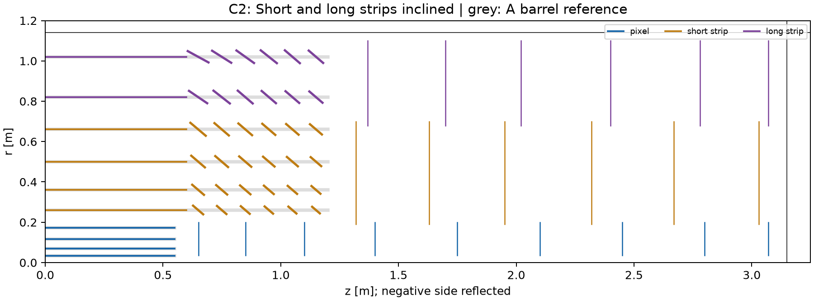
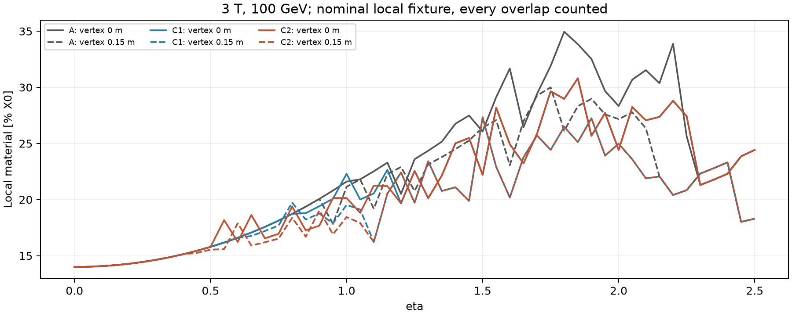

# DES-006 — C1/C2 split and layer-position optimisation status

DRAFT / isolated PROTOTYPE · 2026-09-18 · no layout selected or signed off.

This addresses the [second technical comment on PR #13](https://github.com/asalzburger/nodd/pull/13#issuecomment-5735179707).
Read the two-page briefs: [C1](DES-006-proposal-C1.pdf) and [C2](DES-006-proposal-C2.pdf).

## What is split

**NODD DESIGN CHOICE C08 — proposed, no approving humans:** split the original C
into two controlled alternatives. C1 inclines only the short-strip/strixel barrel
ends and retains A's two complete cylindrical long-strip barrels. C2 inclines
both strip types and is geometrically identical to the original C. Both retain
A pixels and all endcap disks. No radii, row centres, intrinsic resolutions,
normal material allowances or row margins are retuned for this comparison.

| Feature | A control | C1: short strips inclined | C2: both inclined |
| --- | --- | --- | --- |
| Four short-strip barrels | Cylindrical | Central cylinders with inclined ends | Same as C1 |
| Two double-sided long-strip barrels | Cylindrical | Same as A | Central cylinders with inclined ends |
| Inclined row envelopes, both ends | 0 | 48 | 72, including 24 long-strip rows |
| Pixel/endcap system | A | A | A |

For every inclined barrel, the original C07 construction retains the central
`|z| <= 0.600 m` cylinder; six row centres per end are at `|z| = 0.650..1.150 m`
in 0.100 m steps. Normals point toward the origin with a 45-degree cap. Origin
angular endpoints receive 0.010 m tangent extensions at each edge. The
[original derivation](DES-006-proposal-C.md) remains the source for C07 and its
0/5/10 mm controls. The [new machine-readable table](DES-006-inclined-split-layouts.json)
contains explicit C1/C2 identities, parent stations, endpoints and baseline A.
Conical envelopes approximate planar module rows; row count is not module count.

## Executed comparison and marginal benefit

**INFERENCE C-I03**, from the [split report](../validation/DES-006-inclined-split-screen.json),
using the same area and local-incidence equations as the independently checked
original C study:

| Full-system quantity | A | C1 | C2 |
| --- | ---: | ---: | ---: |
| Pixel ideal area [m²] | 4.902 | 4.902 | 4.902 |
| Strixel ideal area [m²] | 43.953 | 39.939 | 39.939 |
| Long-strip silicon area, both faces [m²] | 111.861 | 111.861 | 109.665 |
| Strixel area change relative to A | — | −9.13% | −9.13% |
| Long-strip area change relative to A | — | 0% | −1.96% |
| Min/max local material ratio to A over the full scan | 1 / 1 | 0.7794 / 1.1171 | 0.7794 / 1.2371 |
| Minimum parent stations over the full scan | 6 | 6 | 6 |
| Probes with fewer parent stations than A | — | 0 | 0 |

The full scan has 21,627 probes per candidate: signed eta at 0.01 spacing,
uniform fields 2/3/4 T, pT 1/10/100 GeV, and vertices −150/0/+150 mm. A separate
zero-field scan at 0.001 eta spacing and the same vertices also finds no parent
station loss for either nominal variant. These sampled statements do not establish
continuous coverage, module efficiency or tracking performance. No C1/C2 IdRes
or material-aware fit was run.

Relative to C1, C2 saves **2.196 m² of ideal long-strip silicon area** while
introducing 24 additional inclined long-strip row envelopes. Its benefit includes
reduced incidence in some directions; overlaps can reverse it elsewhere. The
min/max ratios above occur at potentially different probes and are not global
averages. The [full per-scenario summaries and profiles](../validation/DES-006-inclined-split-screen.json)
retain the adverse cases. At origin, eta=1.5, 3 T, 100 GeV, C1 and C2 both give
22.204% X0 versus A's 26.072%: tilting long strips provides no extra saving for
that particular trajectory.

Long strips are double-sided in **all** alternatives: two scalar sensor faces,
one paired station and one paired normal material allowance per module crossing.
Every overlap contributes material and physical faces; parent-group counting
is only a conservative coverage comparison. Area is a proxy before discrete
module tiling, inactive edges, services and supports. Neither cost nor power nor
a complete material budget follows from it.

**Recommendation:** investigate C1 first as the simpler inclined alternative.
It captures the larger strixel-area opportunity while retaining straightforward
outer barrels. Retain C2 for the decision: its small incremental long-strip-area
saving must justify extra stereo alignment, supports, routing, cooling and
assembly work. This is consistent with the preceding
[TrackTech](inputs/DES-006-inclined-tracktech.md) and
[PhysVal](inputs/DES-006-inclined-physval.md) assessments; this follow-up isolates
their stated tradeoff, and does not claim a new independent role review.

## How much radial and axial optimisation has been done?

**No systematic optimisation of layer radii or z positions has been performed.**
There is no objective-function minimisation, radial/z parameter search,
Pareto-front study or demonstrated optimum. The study has constructed a few
engineering-motivated hypotheses and tested them.

| Parameter group | What was done | What this does not establish |
| --- | --- | --- |
| Barrel radii | Retained the ODD study values: pixels 34/70/116/172 mm, strixels 260/360/500/660 mm, long strips 820/1020 mm; no radius scan | Optimal spacing for momentum, impact parameter, occupancy or material |
| Barrel half-lengths and disk z/annuli | Hand-chosen starting values to extend the forward pixel train within the host and provide staggered technology transitions; no systematic z scan | Optimal barrel/endcap boundary, disk spacing or support feasibility |
| A versus B | Compared two fixed forward-pixel hypotheses, with added disks and wider annuli coupled | An independent optimum in disk count, disk radius or disk position |
| Original C / C2 | Geometric normal-pointing prescription with fixed row centres and a 45-degree cap; tested 0/5/10 mm tangent extensions for vertex-dependent gaps | Optimal tilt, row length, row count, radius, z or engineered overlap |
| C1 versus C2 | Removed long-strip inclination only; kept all other choices fixed | A general tracker-layout optimisation |
| Field/material/vertex/pT sweeps | Sensitivity and robustness tests of fixed layouts | Position optimisation or detector acceptance |

The radius provenance is [TrackTech TT6-F01](inputs/DES-006-tracktech.md#public-odd-control-extracted-this-session),
source `SRC-ODD-UPSTREAM`; the lengths, disk placements and tilt prescriptions
remain the unsigned C02/C03/C07/C08 choices. No new external fact is introduced.
The far-forward curvature limitation and shared pixel-transition weakness remain
open findings, not solved by the present split.

A meaningful next optimisation needs agreed physics metrics and constraints.
Within the fixed host and coverage requirement, vary radii, barrel lengths,
disk z positions and annuli in controlled families, separating B's extra disks
from wider annuli. Include beam-pipe clearance, real module tiling, stereo
response and service/material constraints; compare coverage and momentum/vertex
information across vertex and field assumptions. Report the tradeoff between
performance and resources rather than optimising only hit count. That work is
proposed as a next study and has not been executed here.

## Reproduction and retained history

The [tool guide](../../tools/tracker_layout/README.md) gives commands. New tests
check that C1's complete long-strip geometry equals A, C2 equals the original C
apart from identifiers, and any C2–C1 material difference comes only from long
strips. Reports carry input/code hashes and deterministic scan settings.
Original A/B/C sources, reports and PDFs are preserved so earlier review links
continue to identify what was actually reviewed.
