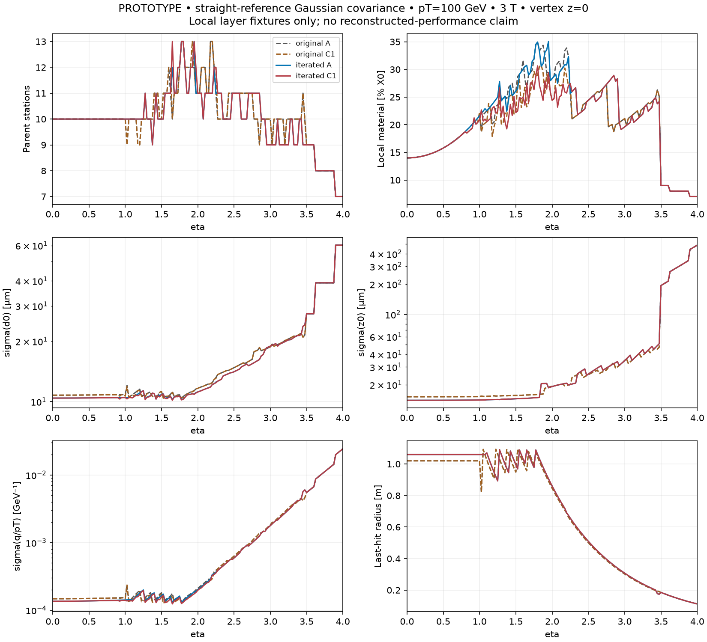
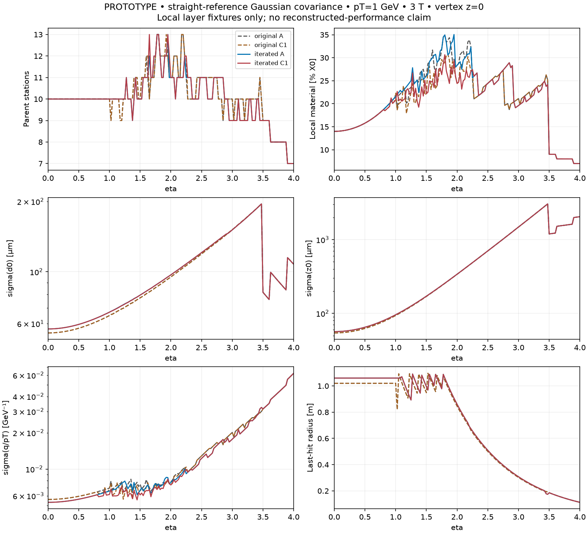
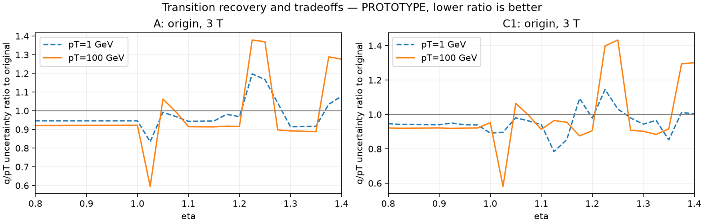

# DES-006 — Expert review and bounded layout optimisation

- Status: DRAFT / isolated PROTOTYPE; no production geometry or human sign-off.
- Created: 2026-09-24.
- Review: `noemina`, 2026-09-23, changes requested on
  `9f98d6dd821b10f756ce8781d07932801d5ba59b`, PR #13.
- Scope: retain A and C1 for current work; B and C2 are withdrawn alternatives,
  retained only as historical evidence. A reviewed frame is not an approved layout.

## Physical rationale and study contract

**FACT R-F01:** CMS Tracker TDR, SRC-CMS-TDR-014, §5.5, PDF 94,
specifies a proposed 45 mm diameter central pipe. Section 10.1.1.3,
PDF 234–235, links the approximately 29 mm inner pixel envelope to that external
diameter and gives different central/forward outer envelopes. These are CMS
engineering examples, not an nODD beam-pipe design.

**FACT R-F02:** ATLAS Pixel TDR, SRC-ATLAS-TDR-030, §2.1.2,
PDF 29/31 (printed 7/9), separates support structures and adjusts layer/ring
positions to preserve hit coverage, reduce extrapolation and avoid aligned
transitions. It changes the inner inclined radius from 39 to 36 mm and offsets
outer flat sections by 5 mm relative to inclined sections. Its dimensions are
comparators, not nODD constraints. Public source identities and local PDF hashes
remain in the source catalogue.

**NODD DESIGN CHOICE R-C09, proposed; approving humans: none:** retain the
DES-005 tracker host and A/C1 topology, response and local material fixtures.
Test disjoint active radial bands for pixels/short/long strips rather than the
old 10/20 mm overlaps. These gaps are prospective support/service reservations;
no TDR supplies a transferable nODD clearance. Compare 180/185/190 mm pixel
outer disk radii, 200/205/210 mm short-strip inner disk radii, and 710/720/735 mm
long-strip inner radii, with a 700 mm short-strip outer radius. Require at least
10 mm separation in this screen. Scan first two pixel radii over 34/36/39 mm
and 60/70/80 mm; do not move the first layer below the ODD 34 mm control before
the beam-pipe interface is engineered. A 25 mm pipe-exclusion fixture plus a
5 mm radial installation allowance is a conditional screen, not a selected pipe.

Test pixel first-disk z at 580/600/650 mm outside the 550 mm barrel; second/third
disks at 780/850 and 1000/1100 mm. Test outermost barrel radii 1020/1060/1100 mm
and half-lengths 1200/1300/1400 mm, with the first long-strip disk at least
30 mm beyond the barrel end. First and second long-strip disks are varied to
recover the final lever arm through eta 1–1.3; then scan each strip disk in 50 mm axial increments for two passes, requiring
30 mm from the corresponding barrel end, 60 mm disk separation and a last-disk
limit of 3120 mm. These bounded offsets probe transition repair, not module tiling.
Coordinate scans of other barrel radii use small 10/20 mm offsets and retain
technology ordering and the host. A/C1 are optimised separately by the same
declared objective; this is a bounded grid/coordinate search, not a global optimum.

For C1, compare six inclined short-strip rows per end with either uniform-z or
uniform-eta boundaries between z=600 and 1200 mm. Constant eta increments give
increasing z separation at larger eta. Test complete inclined-row radial offsets
within the reviewer's 100 mm limit and 0/5/10 mm tangent margins. Reject ideal
r-z segment intersections and host violations. Finite module/service clearances
remain a later gate; zero-thickness envelopes cannot establish buildability.

## Parametric method and limits

The new public control uses the existing ideal-surface intersection solver and
free transverse `[d0, phi0, curvature]` and longitudinal `[z0, cot(theta)]`
least squares. It adds correlated thin-scatterer kicks, with beta=1 and the
leading 13.6 MeV Gaussian scattering scale from SRC-PDG-PASSAGE-2025 §34.3,
Eq. 34.16. The logarithmic correction is deliberately omitted rather than
applied independently to arbitrary subdivisions. This is a leading-term
Gaussian scenario, not full PDG accuracy, IdRes, a finite-curvature fit or
reconstructed resolution. A measurement-only limit and material scaling are
reported independently. **INFERENCE R-I01:** for radii `r_i`, transverse design rows are
`[1,r_i,r_i²/2]` and longitudinal rows `[1,r_i]`. With `x_k` the incidence-corrected
material fraction, use `V_ij = sigma_i² delta_ij + sum_k max(r_i-r_k,0)
max(r_j-r_k,0) (0.0136/pT)² x_k`; longitudinal scattering is larger by
`cosh(eta)²`. The local second-coordinate error is multiplied by
`abs(n_r+n_z*sinh(eta))` to express it as a z residual. Whiten by Cholesky,
then calculate parameter covariance by SVD, with no vertex prior. This derivation
is restricted to the straight-reference/small-curvature approximation.

**NODD DESIGN CHOICE R-C10, proposed; approving humans: none:** the objective
is mean log resolution ratio to original A across d0, z0 and q/pT, plus 0.20
of the worst log ratio, 0.04 times mean lost stations and 0.02 times mean log
maximum-path-gap ratio. Equal weights cover eta=0..4 in 0.05 steps, vertices
−150/0/+150 mm and pT=1/100 GeV. These are transparent search weights, not
physics acceptance criteria. For the tilted-row scan add 0.01 times the
station-count spread in 0.8≤eta≤2.5. A final coupled outer-radius/transition
scan additionally requires no origin eta=1.1 q/pT degradation at either studied
pT relative to the corresponding original option, reflecting the review's
specific recovery request. The inclined-row selection may not enlarge the
pre-tilt worst free-flight distance on the search grid. These are study guards,
not a claim of protection at all eta/vertices. The finer retained evaluation profiles use 0.025
eta spacing. Final geometric checks use signed eta in 0.01 steps, 2/3/4 T,
1/10/100 GeV and all three vertices. Material controls use factors 0/0.5/1/2;
a 0.2% X0 normal beam-pipe fixture at radius 25 mm tests omitted upstream
scattering, without prescribing pipe composition or wall thickness.

Every physical row crossing adds its material; a
long-strip pair supplies one effective two-coordinate station and two sensor faces.

The search must retain its attempted variants, score definition and denominators.
Independent tests check limiting covariances and geometry. Verification samples
include signed eta, displaced vertices and field/pT controls; no sampled grid
proves continuous hermeticity. Missing real beam-pipe/support/services, field
maps, module tiling, stereo response, occupancy and numerical physics acceptance
criteria prevent a final design selection.

## Results and response matrix

The [machine-readable study](../validation/DES-006-expert-optimisation.json)
retains every attempted grid point and selected step; the
[coarse pilot](../validation/DES-006-expert-pilot.json) records why the initial
0.1 eta grid was refined. Its worst missed A q/pT regression was 56.51% at
eta=1.15, z_vertex=-150 mm, pT=100 GeV. An earlier average-only exploration
also hid large local impact-parameter losses and was rejected. The final
objective and review guards above were fixed before regenerating the retained
final evidence. Numerical success is not a reason to suppress adverse cases.

Current exact surfaces are in [the A/C1 layer table](DES-006-reviewed-layouts.json).
Original A/B/C/C1/C2 files remain unchanged as review history. Only **A and C1**
are active alternatives. B's wide disks are withdrawn for service/volume
complexity and material cost; C2's inclined long strips are withdrawn from the
active choice set. Nothing here replaces a signed-off detector.

### Response to each expert point

| Review point | Action and evidence | Remaining limit |
| --- | --- | --- |
| Keep A and C1; drop B/C2 | Current catalogue, two-page briefs and PR summary now expose only A/C1 as active options | Historical artifacts retained deliberately |
| Use TDR subsystem envelopes to improve volume spacing | R-F01/R-F02 comparisons; scan of disjoint pixel/short/long disk bands with explicit service-space hypotheses | Real support thickness, cable/cooling bends and installation clearances still needed; radial separation alone is insufficient |
| Large pixel-disk overlap and hit/material cost | Narrow-annulus scan records every station/pixel loss and material change; no widening back to B | Lost overlap hits cannot be presented as unchanged coverage |
| Iterate layer radii against physics resolutions | Two radial coordinate passes per option, explicit d0/z0/q/pT objective, zero/half/nominal/double material checks and finer-grid verification | Bounded search and approximate covariance, not a global optimum or reconstructed performance |
| First/second hits, beam pipe and forward IP | 34/36/39 mm first-radius and 60/70/80 mm second-radius scans; first two crossing radii versus eta retained; conditional 25+5 mm exclusion and pipe-scattering control | nODD beam-pipe profile, supports, tolerances and luminous distribution are not engineered; no clearance sign-off |
| Last hit and momentum leverage | Outer-radius/length/first-two-disk joint scan and last-hit profiles | Improved origin behavior can trade against displaced-vertex transition points |
| Barrel/endcap extrapolation and service routing | Pixel first-three-disk scan and two strip-disk axial passes; free-flight distance included in objective and reports | No pattern recognition or detailed services; adverse gap cases remain visible |
| Inclined z spacing and ≤100 mm row shifts without clashes | Uniform-z versus uniform-eta rows, six radial-offset hypotheses and three margins; exact ideal-segment intersection rejection; gap guard | Global constant hit count is not achieved. Finite planar tiling, phi staggering and support clashes require ACTS/DD4hep and engineering input |
| Recover momentum resolution near eta=1.1 | Explicit final outer-transition guard at origin for both pT values and retained nearby/displaced-vertex checks | Recovery at that landmark is not uniform recovery throughout the transition |

The inline material interpretation is supported conditionally by the existing
A/B controls: B's wider/additional disks combine more information with more
local material, and the low-pT covariance can worsen. It is not a measured
material budget or a unique causal attribution until disk count and annulus
width are separated. B is no longer proposed for selection.

### Executed result and proposal disposition

611 attempted variants (including infeasible/repeated coordinate points), 486 search cases per feasible variant; 966 finer covariance profiles per original/iterated option and 21,627 signed finite-field probes per geometry. No random sampling. The search deliberately exposes service-gap tradeoffs rather than declaring an accepted optimum.

| Quantity | Original A | Iterated A | Original C1 | Iterated C1 |
| --- | ---: | ---: | ---: | ---: |
| sigma(q/pT), eta=1.1, pT=1 GeV [GeV^-1] | 0.00720111 | 0.00679295 | 0.00636374 | 0.00598823 |
| sigma(q/pT), eta=1.1, pT=100 GeV [GeV^-1] | 0.000153205 | 0.000140191 | 0.000149263 | 0.00013627 |
| Last radius, eta=1.1 [m] | 1.02572 | 1.07064 | 1.02572 | 1.07064 |
| sigma(d0), eta=0, pT=1 GeV [um] | 54.7446 | 56.9389 | 54.7446 | 56.9389 |
| sigma(d0), eta=0, pT=100 GeV [um] | 10.7734 | 10.4179 | 10.7734 | 10.4179 |
| sigma(d0), eta=4, pT=100 GeV [um] | 60.2401 | 60.2401 | 60.2401 | 60.2401 |

All table probes start at z=0 in the 3 T straight-reference covariance model. At eta=1.1 the q/pT uncertainty improves by **5.7% / 8.5% for A** and **5.9% / 8.7% for C1**, at pT=1 / 100 GeV respectively. The physical proposal is a longer outer barrel and a nearby first endcap disk, jointly chosen with the outer radius. It adds ideal long-strip area and moves service handoffs; those costs must be reviewed.

| Current layer parameters [mm], positive z mirrored | A | C1 |
| --- | --- | --- |
| Pixel barrel radii | 34, 60, 106, 182 | 34, 60, 106, 182 |
| Short-strip central barrel radii | 260, 340, 480, 660 | 260, 340, 480, 660 |
| Long-strip barrel radii | 840, 1060 | 840, 1060 |
| Pixel disk z | 650, 850, 1100, 1400, 1750, 2100, 2450, 2800, 3070 | 650, 850, 1100, 1400, 1750, 2100, 2450, 2800, 3070 |
| Short-strip disk z | 1320, 1730, 1900, 2270, 2770, 3080 | 1320, 1730, 1900, 2270, 2770, 3080 |
| Long-strip disk z | 1430, 1800, 2120, 2450, 2730, 3120 | 1430, 1800, 2120, 2450, 2730, 3120 |

Both use pixel/short/long disk annuli 35–190 / 200–700 / 710–1100 mm: **10 mm active-band gaps**, not validated service envelopes. Pixel barrels retain 550 mm half-length. A short-strip barrels retain 1200 mm; C1 central sections retain 600 mm. Both long-strip barrels extend to 1400 mm, with the first disk at 1430 mm: the ideal axial separation shrinks from 170 to 30 mm. The pixel first-disk separation stays 100 mm; advancing that disk did not win the declared tradeoff.

**C1 inclination finding:** the final guarded selection retains uniform-z centres 650/750/850/950/1050/1150 mm, zero whole-row radial shift and 5 mm tangent margin. Uniform-eta spacing (increasing z separation), shifts −20/0/+20/+40/+80/+100 mm and 0/5/10 mm margins were actually tested. The tempting displaced uniform-eta variant enlarged the worst extrapolation gap and was rejected. No tested admissible variant delivers globally constant hit counts. This part remains an explicit follow-up; no unvalidated eta-spaced layout is promoted.

### Costs, adverse cases and what is still unresolved

| Finer-grid outcome versus its original option | A | C1 |
| --- | ---: | ---: |
| Worst d0 uncertainty ratio | 1.176 (eta 3.4, z 150 mm, pT 100 GeV) | 1.176 (eta 3.4, z 150 mm, pT 100 GeV) |
| Worst z0 uncertainty ratio | 1.278 (eta 1.55, z 150 mm, pT 100 GeV) | 1.280 (eta 1.55, z 150 mm, pT 100 GeV) |
| Worst q/pT uncertainty ratio | 1.430 (eta 1.15, z 150 mm, pT 100 GeV) | 1.473 (eta 1.15, z 150 mm, pT 100 GeV) |
| Lost-station finite-field probes vs original A (of 21,627) | 4032 | 3958 |
| Lost-pixel finite-field probes vs original A (of 21,627) | 2284 | 2284 |
| Minimum stations on finite-field grid | 6 | 6 |
| Ideal pixel area [m2] | 4.61233 | 4.61233 |
| Ideal short-strip area [m2] | 43.2032 | 37.8867 |
| Ideal long-strip area, both faces [m2] | 120.077 | 120.077 |
| Worst free-flight in finer straight profiles [m] | 0.880143 | 0.880143 |

These losses prevent recommending either complete iterated layout for adoption. Preserve the original A/C1 as controls, carry the outer-transition recovery mechanism forward, and resolve narrow-band transition losses before choosing radii. A 60 mm second pixel radius improves some high-pT IP estimates but worsens low-pT central d0 by about 4%; it is a tradeoff, not a universal improvement. The first radius remains 34 mm. The 35 mm disk aperture and unchanged first two disks keep far-forward first-hit limitations; at eta=4 the last radius is only about 112.5 mm from the origin. No forward momentum recovery is claimed.

Ideal segment checks find no intersections or host/exclusion violations for the iterated candidates. They say nothing about finite module widths, supports, services or phi overlaps. The 10 mm radial and 30 mm axial reservations require actual module and routing envelopes. In particular, reduced barrel/endcap boundary separation does **not** guarantee a smaller worst gap along every track: coverage losses elsewhere can lengthen extrapolation.

Priority follow-up: (1) review support/service widths and the beam-pipe profile; (2) repair lost pixel/strip transition coverage with module-aware masks and denser edge-directed scans; (3) compare the inner-two-layer IP tradeoff over an agreed beamspot/physics sample; (4) retune C1 row count/length/spacing jointly if constant counts justify the added structure; (5) execute ACTS navigation and later material-aware track fits. Fixed six-row envelopes alone did not settle the inclined request.

### IdRes cross-check

Final A was run in the pinned, unchanged local IdRes executable: **11 runs × 729 rows = 8,019 finite fit rows**, covering the existing field/material/vertex controls. Its near-zero-material q/pT values agree with the new independent control in all 12 retained pT=100 GeV probes to the documented half-print-unit tolerance (maximum difference 4.94e-07 GeV^-1 after matching IdRes's 0.3 field conversion). This tests the measurement-only limit, not equality of scattering models. C1 is not exported to IdRes because that adapter does not represent inclined surfaces.

[A IdRes input](DES-006-reviewed-A-idres-input.json), [executed report](../validation/DES-006-reviewed-A-idres.json). The public generic covariance remains reproducible without private upstream access.

