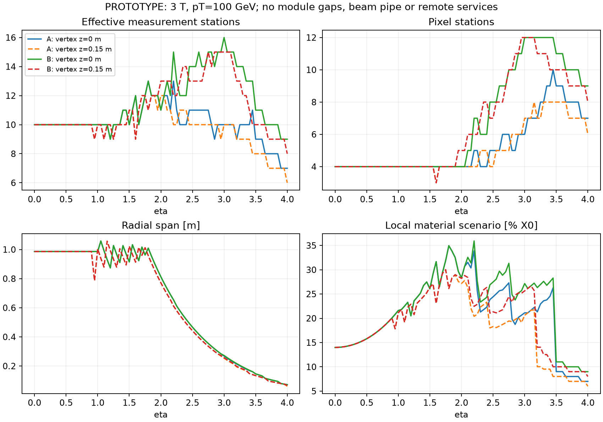
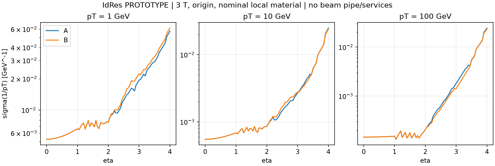

# DES-006 — First tracker subsystem and layer placement proposals

- Status: DRAFT — isolated **PROTOTYPE**; human review and numerical approval pending.
- Created: 2026-09-18.
- Authors: SysArch coordinating independent TrackTech, PhysVal and SoftEng agents.
- Human owner: unassigned; final sign-off authority: `asalzburger-review`.
- Authorization: user request on 2026-09-18 to install/exercise IdRes and begin proposals.
- Governing programme: [DES-005](DES-005-tracker-system-plan.md), especially S0/S1;
  inherited constraints: [DES-003](DES-003-global-envelopes.md) and
  [ADR-006](../decisions/ADR-006-global-envelope-and-field-hypotheses.md).
- Production integration: none. This request authorizes exploration, not design sign-off.
- Review and task records: [tracking](../../project/tracking.json), [reviews](../../project/reviews.json).

## Executive summary

**Current active options: A and C1 only.** The expert review from `noemina`
on 2026-09-23 withdraws B and C2 from the current choice set. Their files remain
historical evidence. The [expert-review response](DES-006-expert-review.md)
contains the TDR/beam-pipe comparison, bounded radial/axial optimisation,
hit/material tradeoffs, eta~1.1 recovery study and remaining engineering inputs.

Read the updated two-page briefs: [A](DES-006-reviewed-A.pdf) /
[source](DES-006-reviewed-A.md), [C1](DES-006-reviewed-C1.pdf) /
[source](DES-006-reviewed-C1.md). The
[current layer tables](DES-006-reviewed-layouts.json) and
[executed optimisation](../validation/DES-006-expert-optimisation.json)
are separate from the original controls. No candidate is selected or signed off;
local regressions and unresolved service/beam-pipe constraints remain explicit.

The following A/B comparison and IdRes evidence remain the original controls.

**A/B reference comparison; neither selected for construction.** A is the
smaller reference: ODD-guided barrel radii and a pixel-disk train extended to
3.07 m. B adds two pixel disks per end and widens downstream pixel annuli. The
comparison deliberately holds the barrel and strip system fixed. These are
starting points for iteration, not numerical optima or claims of buildability.

Read the two-page proposal briefs: **[A PDF](DES-006-proposal-A.pdf)** /
[source](DES-006-proposal-A.md), **[B PDF](DES-006-proposal-B.pdf)** /
[source](DES-006-proposal-B.md). The [machine-readable layer tables](DES-006-layouts.json),
[TrackTech argument](inputs/DES-006-tracktech.md) and
[independent PhysVal assessment](inputs/DES-006-physval.md) preserve the details.

The fixed envelope permits only about 115 mm radius at eta 4 at its downstream
edge. Both candidates consequently rely on forward pixels. In uniform-field
ideal-surface scans over signed eta, three vertex probes and 1/10/100 GeV pT,
A has a minimum of six effective measurement stations and B eight. Those are
intersections, not reconstructed-track efficiencies. At the eta-4 origin probe,
both span only about 72 mm in radius; B adds measurements without extending that
span. Independent measurement-only covariance already identifies severe
far-forward curvature uncertainty. More hits alone cannot settle this design.

B increases ideal total pixel area from 4.902 to 8.526 m² (+74%); its pixel-disk
area is 2.65 times A's. Actual module, power, cooling and service costs are not
available. Both candidates retain a transition with only three pixel stations.
**Priority: establish forward momentum/vertexing criteria, repair the transition,
and test tiled modules and services before choosing the wider pixel option.**

The executed IdRes screen gives a concrete trade-off: at eta 4, origin, 3 T and
pT=100 GeV, B's inverse-pT uncertainty is about 3.7% smaller. At pT=1 GeV it
is about 7% larger with the same per-layer material hypotheses. B's extra
measurements therefore do not give a universal performance gain. The balance
depends on momentum, vertex and physical material inputs.

## 1. Requirements, provenance and provisional contract

Every numerical proposal below is unsigned. The user fixed the coverage and
inherited host; this does not approve active dimensions or performance thresholds.

| Claim | Classification | Definition, rationale and source/approval |
| --- | --- | --- |
| C01 | NODD DESIGN CHOICE | Human-directed host `0.025 <= r <= 1.140 m`, `abs(z) <= 3.150 m`; shared services `1.140..1.240 m` are excluded from active placement. Fixed system `abs(eta) < 4`; DES-005 §1 / DES-003 allocation regions `tracker`, `tracker_services`. |
| F01 | FACT | Pinned public ODD study revision `c167363f3d4ad1540a577af99071283caf54f3a6`: pixel reference radii 34/70/116/172 mm, short strip 260/360/500/660 mm, long strip 820/1020 mm. `SRC-ODD-UPSTREAM`, exact XML/factory locators and disk-control table in TrackTech TT6-F01/F02. These are source placement parameters, not measured active coverage. |
| C02 | NODD DESIGN CHOICE | Adopt those radii as candidate controls; choose active barrel half-lengths 550 mm pixel and 1200 mm strips to start a barrel/endcap overlap study. First active radius 34 mm is not a cleared beam-pipe interface. Approvers: none. |
| C03 | NODD DESIGN CHOICE | Disk positions and annuli in §2 and JSON. Extend forward precision measurements within the host, stagger different technologies, compare narrow and widened pixels. Proposed 35 mm pixel aperture is unqualified. Approvers: none. |
| C04 | NODD DESIGN CHOICE | Response scenario: binary 50 µm pixels; strixels with 20 µm fine error and 5 mm coarse segmentation; long-strip scalar error 20 µm with symmetric ±20 mrad axes. Rounded study choices, not measured component performance. Approvers: none. |
| I01 | INFERENCE | Binary uniform impact gives pixel error `50/sqrt(12)` µm and strixel coarse error `5/sqrt(12)` mm. Equal independent stereo measurements give paired errors `20/(sqrt(2)*cos(.020))` and `20/(sqrt(2)*sin(.020))` µm. One collapsed pair is one two-coordinate station; alignment, pairing failures and physical separation are omitted. |
| C05 | NODD DESIGN CHOICE | Normal material fixtures: pixel 1%, strixel 1.5%, collapsed long-strip pair 2% X0; half/double sensitivity. Rounded local layer hypotheses, not engineered budgets or uncertainty intervals. No beam pipe or remote services; no composition, density, mass or interaction-length claim. Approvers: none. |
| C06 | NODD DESIGN CHOICE | Scans: pT 1/10/100 GeV, uniform axial 2/3/4 T, vertices -150/0/+150 mm, signed eta -4..4 at .01 for helix extrema (.05 plotted). Stress range explores vertex dependence; it is not a beamspot distribution. Fields reuse ADR-006 hypotheses as controls, not physical maps. Approvers: none. |
| I02 | INFERENCE | `r=(z-z_vertex)/sinh(eta)` for an outward straight ray. At eta 4 the host end reaches 115.43 mm from origin, 109.93 mm from +150 mm vertex. At last active disk, stressed reach is 107.00 mm. Finite curvature, active masks and beam-pipe profile require further checks. |

The JSON carries SI units, stable layer IDs, explicit mirrored disks, host,
measurement and material definitions. Its schema describes ideal surfaces only;
module transforms/masks, detailed scalar stereo surfaces, composition and actual
field providers remain TRK-CONTRACT extensions. Deterministic axial symmetry
means charge sign changes bending direction but not these radial intersections;
azimuthal/charge asymmetries remain for ACTS. The eta=4 endpoint is a margin
probe for the open coverage requirement, not its redefinition.

## 2. Concrete subsystem and layer arrangement

All table dimensions are **millimetres**; all positive disks are mirrored.
Classifications are C02/C03 above. Full per-surface IDs and response/material
numbers are in the JSON; the table is the human review view.

| Component | A and B common dimensions |
| --- | --- |
| Pixel barrel | radii 34, 70, 116, 172; half-length 550 |
| Strixel barrel | radii 260, 360, 500, 660; half-length 1200 |
| Stereo long-strip barrel | pair-reference radii 820, 1020; half-length 1200 |
| Strixel disks | radii 190..700; z 1320, 1630, 1950, 2320, 2670, 3030 |
| Stereo long-strip disks | radii 680..1100; z 1370, 1700, 2020, 2400, 2780, 3070 |

| Pixel disks | A — extended ODD | B — forward pixel rich |
| --- | --- | --- |
| First three per side | z 650, 850, 1100; radii 35..200 | same |
| Downstream disks | z 1400, 1750, 2100, 2450, 2800, 3070; radii 35..200 | z 1250, 1400, 1750, 2100, 2450, 2600, 2800, 3070; radii 35..320 |
| Pixel disks per side | 9 | 11 |
| Ideal total pixel area | 4.902 m² | 8.526 m² |

Area is an **INFERENCE** from ideal cylinders and annuli, not installed silicon
or cost. Long-strip reference areas count pairs once; two sensor faces would
double their reference silicon area before overlaps and tiling.

The widened B disks start beyond the strixel barrel end, avoiding an ideal
surface intersection. The 50 mm axial gap there, 40 mm outer radial difference
and 80 mm end difference to the host are geometric differences, not verified
assembly clearances. Supports, bends, connectors, tolerances and installation
space must fit. Neither candidate spends the shared service reservation twice.

## 3. Executed evidence and interpretation

The [geometry report](../validation/DES-006-layout-screen.json) records actual
uniform-helix intersections, local material path sums, areas, extrema and hashes.
The [tool guide](../../tools/tracker_layout/README.md) explains commands,
validation and approximations. Independent straight-ray and covariance checks
are retained in the PhysVal input. **No ACTS module propagation, Geant4,
pattern recognition or physical-efficiency validation was run for this study.**

| Diagnostic | A | B | Meaning |
| --- | --- | --- | --- |
| Minimum effective stations over declared uniform-field grid | 6 | 8 | Ideal crossings, including shifted vertices; no minimum accepted target |
| Eta 4, origin: pixel stations / radial span | 7 / 72.19 mm | 9 / 72.19 mm | More measurements but same span |
| Eta 4, +150 mm: pixel stations / radial span | 6 / 61.19 mm | 8 / 66.69 mm | Marginal aperture loses early disks |
| Pixel stations in transition (independent .001 ray grid) | minimum 3 | minimum 3 | Both need seeding/vertexing and module-edge follow-up |
| Eta 0 local material fixture, high pT | about 14% X0 | about 14% X0 | Excludes beam pipe and remote services |
| Eta 4, origin local material fixture | about 7% X0 | about 9% X0 | Added pixels carry added material; incomplete budget |

Independent measurement-only quadratic fits, without a vertex prior, give
`sigma(1/pT)` approximately 0.0244 / 0.0235 GeV⁻¹ at eta 4 from the origin,
versus 0.000136 GeV⁻¹ centrally (both). At pT=100 GeV the forward inverse-pT
error exceeds the mean inverse-pT: translating it into a Gaussian fractional
momentum resolution is invalid. These are optimistic information screens,
not measured performance. This adverse result must remain visible when choosing
physics benchmarks and when realistic field/material inputs arrive.

The smaller A is the resource control. B is a credible redundancy/forward-pixel
challenge, especially at intermediate eta and shifted vertices, but has not
earned selection on physics performance. Widening annuli and adding disks are
coupled here; the next scan must split those changes to identify their benefits.

### Executed IdRes installation and parametric results

IdRes revision `d54d0e3c465cc0308becb737b04364ce5c68ce16` was compiled and
installed locally; the supplied ITk plotting example ran successfully. The
[adapter and installation audit](../../tools/tracker_layout/IDRES.md) documents
the observed capabilities and defects. No upstream source is vendored, and its
anonymous access/license is still a public-reproduction dependency. The
[retained results](../validation/DES-006-idres-results.json) record 22 successful
runs with 729 expected fit rows each (16,038 total, none omitted): A/B times
2/3/4 T times half/nominal/double material, plus two near-zero-material controls
per candidate at 3 T. Inputs, executable, adapter and raw-output hashes are retained.

IdRes uses straight-ray layer intersections and a parametric covariance with
scattering, not the independent helix intersection model. It has no vertex
prior in these runs. Raw inverse-pT output is TeV⁻¹; the adapter converts it to
GeV⁻¹. Its raw hit convention counts strip-classified surfaces twice; it is
not our effective-station count. The main geometric station results above come
from the explicit layer model. No hit-count inflation is used in the proposals.

| Origin, 3 T, nominal local material | A sigma(1/pT) [GeV⁻¹] | B sigma(1/pT) [GeV⁻¹] | Interpretation |
| --- | --- | --- | --- |
| eta 0, pT 1 GeV | 0.005241 | 0.005241 | Common barrel control |
| eta 0, pT 100 GeV | 0.000146 | 0.000146 | Common barrel control |
| eta 3, pT 1 GeV | 0.019393 | 0.022368 | B worse with extra material in this scenario |
| eta 3, pT 100 GeV | 0.001821 | 0.001407 | B improves measurement information |
| eta 4, pT 1 GeV | 0.057425 | 0.061435 | B about 7% worse |
| eta 4, pT 10 GeV | 0.024916 | 0.024144 | Modest B improvement; already large relative curvature uncertainty |
| eta 4, pT 100 GeV | 0.024361 | 0.023454 | Both have poor high-pT curvature significance |

At eta 4 and pT=1 GeV, the half/double material controls span 0.043368..0.078933
for A and 0.045699..0.085297 GeV⁻¹ for B. These ranges are scenario sensitivity,
not measured uncertainty intervals. At nominal material and pT=100 GeV, 2..4 T
spans 0.036542..0.018271 for A and 0.035181..0.017591 GeV⁻¹ for B. Uniform
field scaling does not establish achievable forward magnetic bending power.
Total momentum is `pT*cosh(eta)`; the eta-4 1/10/100 GeV pT probes correspond
to approximately 27.3/273/2731 GeV total momentum, not a collision spectrum.

The independent control exposed an upstream multi-field defect: a list of
2/3/4 T values used the last field for all cases. Those trial results were
discarded; the retained runs use one field per process. Exactly zero material
is numerically unsafe upstream, so positive scales `1e-6` and `1e-8` tested
convergence. The [independent covariance evidence](../validation/DES-006-covariance-control.json)
agrees at the inspected control points within output rounding after accounting
for IdRes's `0.3` versus `0.299792458` conversion. This validates a restricted
transverse control, not the full material model or longitudinal covariance.
The retained independent audit also checks 486 origin-profile station counts
exactly and 162 material points within their printed precision. The nominal
central 14% X0 is four pixel allowances, four strixel allowances and two paired
long-strip allowances; the strip hit-reporting convention does not double that
material. All 16 retained near-zero-material covariance comparisons pass their
rounding consistency check.
Missing beam-pipe material makes impact-parameter estimates optimistic; they
are retained for audit but not promoted to certified performance.

## 4. Team arguments and priority order

| Priority | Work and owner | Decision it enables |
| --- | --- | --- |
| P0 | PhysVal + ProRes: agree physics use cases, forward pT/total-momentum bins, resolution and efficiency metrics; specify luminous distribution and displaced-track scope | Defines whether the severe forward curvature limitation is acceptable; avoids optimizing only hit counts |
| P0 | SysArch + TrackTech: beam-pipe profile and active-aperture clearance; first-disk/barrel transition variation | Determines whether proposed 34/35 mm interfaces fit and whether pixel seeding survives real edges |
| P1 | SoftEng + TrackTech: receive DES-001 module outlines/masks, tile candidate annuli and barrels, run ACTS coverage/navigation with declared fields | Replaces full-azimuth ideal surfaces with useful coordinate crossings, holes and failure accounting |
| P1 | TrackTech + SysArch: launch strixel/stereo module interfaces and local support, cooling, power/data ledgers; compare area-driven loads | Determines whether B's information gain justifies its additional material and resource cost |
| P1 | PhysVal + SoftEng: separate extra-disk/wider-annulus ablations; vary response, one-side/station loss, vertex tails and material placement | Tests robustness and a possible hybrid; neither candidate frozen |
| P2 | SysArch + magnetic team / SoftEng: import pinned physical field candidates and rerun fixed-layout comparisons | Replaces nominal 2/3/4 T controls with actual forward bending power |
| P2 | TrackTech + PhysVal: timing-capable outer station and forward timing hypothesis with hardware/time-off/time-on controls | Establishes benefit only after response, material and readout costs exist |
| Later | SoftEng + all roles: DD4hep/Geant4, fast/detail closure and full reconstruction | Production integration follows human sign-off and backend readiness |

SysArch defends host and route ownership. TrackTech supports A as the smaller
starting control and challenges B's support/power burden. PhysVal asks to retain
B as an alternative but gives transition repair and forward precision priority
over nominal hit counts. SoftEng must establish what IdRes actually measures and
preserve representation losses before export to ACTS. Agreement among agents
does not settle hardware feasibility or human selection.

## 5. Inputs that cannot yet be resolved

| Missing input / owner | Blocked conclusion | Productive work now |
| --- | --- | --- |
| Physics targets, luminous distribution, occupancy/radiation scenario / ProRes + PhysVal | A/B acceptance, meaningful weighted efficiency, strip occupancy and timing benefit | Publish unweighted probes and stress cases, retain adverse bins |
| Beam pipe/profile and mechanical envelope at small radius / SysArch | First-layer and forward inner-edge feasibility | Parametrize aperture/clearance; do not certify 34/35 mm |
| Pixel masks, support/thermal handoff / issue #7, PR #8 and TrackTech | Tiling, dead areas, complete pixel material/power/cooling | Consume current draft outlines; 0.5884% X0 partial module path is not a layer budget |
| Strixel/long-strip modules, stereo pairing, services/support/cooling / TrackTech | Real measurement covariance, loads, complete material and fit | Start dossiers and scalar measurement adapters, bounded allowances only |
| Physical field maps / DES-004 PR #6 | Actual forward momentum performance and candidate ranking | Uniform controls and common field interface |
| Timing technology/response and hardware cost / TrackTech + PhysVal | Timing-driven third layout or pile-up improvement | Reserve question; no assumed precision timing on a spatial strip |
| Public IdRes distribution/license and numerical capability closure / SoftEng | Fully public reproduction and supported interpretation of every output | Retain public nODD input/analytic controls; no upstream source vendoring |
| DD4hep/Geant4 backend, detailed components and approved integration / SoftEng | Full transport/overlaps/material closure and final physics acceptance | Independent prototype studies continue |

Pixel input is pinned to `d237f146b578915cc032b30efa50044cf6344d5f` (PR #8,
open); magnetic input to `040337c2d6129014655a7534e0ea79c6ef693bc2` (PR #6,
open), inspected 2026-09-18. These are dependencies, not duplicated designs or
claims of merged readiness. DES-005 was merged in PR #11, but remains DRAFT;
the user's present exploration request does not fabricate its formal sign-off.

## 6. Human review requested

Review whether A, B, C1 and C2 are useful starting hypotheses and whether the priority
order addresses the dominant uncertainties. Specify acceptable forward physics
benchmarks and the next component-interface owners. No final layer selection is
requested from these idealized results.

Named coverage from DES-005: Markus Elsing and Noemi Calace for layer placement,
parametric performance, hit and material studies; `paulgessinger` for DD4hep–ACTS
interfaces. Participation confirmation and remaining engineering reviewers are
still open. Final applicable sign-off is by `asalzburger-review`, against an exact
revision and explicit scope. No invitation acceptance, review or approval is
inferred here.
