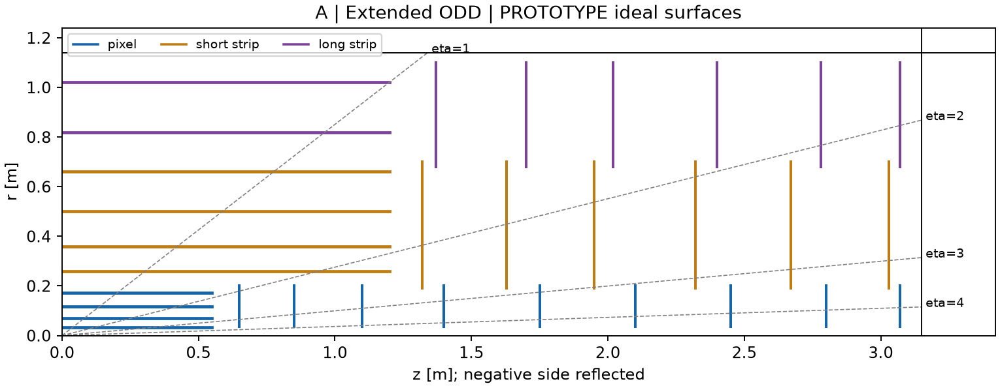

# A | Extended ODD tracker

## Page 1 - Proposal and evidence

PROTOTYPE / DRAFT. First placement study, 2026-09-18. No human numerical approval, production geometry or demonstrated tracking efficiency.

**Proposal.** Keep ODD-guided barrel radii and the pixel / strixel / stereo-long-strip order. Extend narrow pixel disks towards the end of the established tracker host. Use A as the smaller resource reference while testing forward performance and repairing the barrel/endcap transition.

**Fixed constraints.** Tracker host: 25 <= r <= 1140 mm, |z| <= 3150 mm; system coverage |eta| < 4. Shared services outside r=1140 mm are not extra active space. The 25 mm host is not a sensor radius.

**Barrels, all radii in mm.** Pixels: 34 / 70 / 116 / 172, half-length 550. Strixels: 260 / 360 / 500 / 660, half-length 1200. Stereo long-strip pair stations: 820 / 1020, half-length 1200.

**Disks, positive z in mm; mirror the negative side.** Pixels: 650 / 850 / 1100 / 1400 / 1750 / 2100 / 2450 / 2800 / 3070, r=35..200. Strixels: 1320 / 1630 / 1950 / 2320 / 2670 / 3030, r=190..700. Long strips: 1370 / 1700 / 2020 / 2400 / 2780 / 3070, r=680..1100.

**Geometry results.** Minimum six effective stations over the declared uniform-field/vertex grid. At eta=4: seven pixel stations from origin, six from z=+150 mm; radial spans 72.19 and 61.19 mm. Total ideal pixel area 4.902 m2; disks 2.193 m2. At the transition only three pixel stations remain in some bins.

**Meaning.** These are complete ideal surfaces and collapsed stereo pairs, not tiled modules. Station counts are not track efficiencies. All adopted dimensions are unsigned design choices, even where barrel reference radii match public ODD parameters.

<!-- PAGE -->

# A | Review argument and priorities

## Strengths

Smaller pixel inventory: 43% less total ideal pixel area than B. Retains familiar radial organization and outer lever arm. A common barrel/strip system makes it a clean reference for studying the extra forward pixels, field and material. Longitudinal extension provides several precision measurements approaching eta=4 without widening the whole forward pixel system.

## Weaknesses and adverse evidence

Forward curvature information remains poor. The independent no-prior, measurement-only control gives sigma(1/pT) about 0.0244 GeV^-1 at eta=4 from the origin, versus 0.000136 centrally at 3 T. High-pT forward errors cannot be interpreted as a Gaussian momentum percentage. Vertex/aperture stress removes an early disk; only six stations remain at the boundary. The narrow disks retain a three-pixel transition weakness. A long small-radius support/service structure is still needed.

**Executed IdRes check.** At eta=4, origin, 3 T: sigma(1/pT) is 0.057425 GeV^-1 at pT=1 GeV and 0.024361 at 100 GeV. B is about 7% worse at 1 GeV but 3.7% better at 100 GeV. Added measurements do not give a universal gain once their material is included.

## Assumptions shared with B

Pixel precision 50/sqrt(12) micrometres per coordinate; strixel errors 20 micrometres and 5/sqrt(12) mm. Two scalar long-strip measurements at +/-20 mrad are collapsed into one paired station. Local normal material hypotheses are 1 / 1.5 / 2 percent X0 for pixel / strixel / pair, tested at half/double. They are not qualified component budgets. Beam pipe and remote services are missing. Uniform 2/3/4 T and vertices -150/0/+150 mm are controls, not physical field maps or a luminous distribution.

## Priority order

1. Agree physics benchmarks and luminous-region scope; clarify what forward momentum, vertexing and efficiency must achieve. Retain inverse-pT errors and failed/weak bins.

2. Vary first-disk placement/width and barrel overlap; tile DES-001 modules and check beam-pipe aperture, dead edges, support and service exits with ACTS coverage.

3. Replace material/response fixtures with pixel, strixel, stereo, support and cooling interfaces. Compare A against B and separate the effects of added disks versus wider annuli.

## Not resolvable yet

Beam-pipe clearance, real module masks and material, strixel/stereo hardware, service/cooling loads, field maps, luminous distribution and numerical physics targets are pending inputs. Timing hardware/response and DD4hep/Geant4 readiness are later dependencies. None is treated as zero cost or satisfied by this screen.

## Review request and recommendation

Retain A as the smaller study control; do not freeze it. Review the forward precision limitation and transition-repair priority with Markus Elsing and Noemi Calace; DD4hep-ACTS interfaces with paulgessinger. Participation and specialist engineering assignments remain open. Final sign-off: asalzburger-review, against an exact revision.

Source and reproduction: DES-006-first-tracker-layouts.md; DES-006-layouts.json; tools/tracker_layout/README.md; DES-006 TrackTech and PhysVal inputs. These contain provenance, retained outputs, IdRes interpretation and validation limits.
