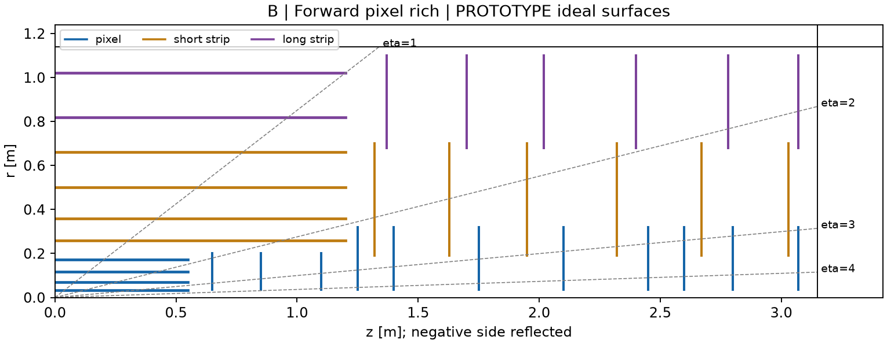

# B | Forward pixel rich tracker

## Page 1 - Proposal and evidence

PROTOTYPE / DRAFT. First placement study, 2026-09-18. No human numerical approval, production geometry or demonstrated tracking efficiency.

**Proposal.** Add two pixel disks per side and widen downstream pixel annuli while retaining A's barrel and strip system. Test whether additional forward measurements and redundancy justify extra silicon, material, support and services. B is a performance challenger, not a selected upgrade.

**Fixed constraints.** Tracker host: 25 <= r <= 1140 mm, |z| <= 3150 mm; system coverage |eta| < 4. Shared services outside r=1140 mm are not extra active space. The 25 mm host is not a sensor radius.

**Common with A, mm.** Pixel barrel radii 34 / 70 / 116 / 172, half-length 550. Strixel radii 260 / 360 / 500 / 660 and stereo-pair radii 820 / 1020, half-length 1200. Six strixel disks per side span r=190..700; six long-strip pair disks span r=680..1100. Exact positions are in the common layer table.

**Pixel disks, positive z in mm; mirror the negative side.** z=650 / 850 / 1100 retain r=35..200. z=1250 / 1400 / 1750 / 2100 / 2450 / 2600 / 2800 / 3070 use r=35..320. Wide disks start beyond the strixel barrel end; its 50 mm separation from the first wide disk is not an engineered clearance.

**Geometry results.** Minimum eight effective stations over the declared uniform-field/vertex grid. At eta=4: nine pixel stations from origin, eight from z=+150 mm; radial spans 72.19 and 66.69 mm. Total ideal pixel area 8.526 m2 (+74% over A); pixel-disk area 5.817 m2 (2.65 times A).

**Meaning.** Extra measurements chiefly add redundancy and mid-forward precision opportunities. Wider outer annuli do not move eta-4 hits farther out. Counts from complete ideal surfaces do not establish tracking efficiency.

<!-- PAGE -->

# B | Review argument and priorities

## Strengths

Additional forward pixel measurements improve redundancy and pixel/strixel overlap. The shifted-vertex eta-4 measurement-only curvature error is about 21% smaller than A's under the common 3 T response control. Around eta=3 the origin probe crosses twelve pixel stations instead of six. The unchanged barrel/outer tracker keeps the comparison focused and preserves the central reference.

## Weaknesses and adverse evidence

Origin eta-4 curvature precision improves by only about 3.7% in the independent measurement-only control: sigma(1/pT) is about 0.0235 GeV^-1. The same short radial span limits both layouts, and the high-pT momentum interpretation fails. B adds substantial pixel area, local material and likely cooling/services. The shared three-pixel transition weakness remains. Coupled widening and added stations must be separated in the next scan to avoid attributing all gains to the larger annulus.

**Executed IdRes check.** At eta=4, origin, 3 T: sigma(1/pT) is 0.061435 GeV^-1 at pT=1 GeV and 0.023454 at 100 GeV. B is about 7% worse than A at 1 GeV under the nominal local-material assumptions. Its high-pT benefit does not establish a universal advantage.

## Assumptions shared with A

Pixel precision 50/sqrt(12) micrometres per coordinate; strixel errors 20 micrometres and 5/sqrt(12) mm. Two scalar long-strip measurements at +/-20 mrad form one collapsed paired station. Normal local material hypotheses are 1 / 1.5 / 2 percent X0 for pixel / strixel / pair, tested at half/double. Extra pixels retain their material. Beam pipe, remote services and full thermal/mechanical budgets are missing. Uniform fields and +/-150 mm vertices are exploratory controls.

## Priority order

1. Demonstrate that extra measurements improve the agreed forward momentum, vertexing, efficiency or failure-tolerance metric. Compare material and response sensitivities; do not select by hit count.

2. Split extra-disk and wider-annulus variations, including a possible hybrid. Repair the common transition and test realistic module masks and scalar stereo measurements with ACTS.

3. Obtain area-driven power/cooling/service estimates and support layouts. Check the first wide disk's barrel-end clearance and radial overlap with strixel routes before accepting added area.

## Not resolvable yet

Pixel module interfaces remain draft; strixel/stereo modules, beam pipe, supports, cooling, services and field maps are incomplete. Physics thresholds, occupancy/radiation conditions and a luminous distribution are not agreed. These block final A/B ranking and claims of buildability. Timing requires its own hardware/response/cost controls; more spatial silicon is not precision timing.

## Review request and recommendation

Keep B as a conditional alternative, with A as its smaller resource control. Its added forward information must justify the physical cost. Request layout/performance input from the nominated experts and software-interface input from paulgessinger; participation remains to confirm. Final applicable sign-off is by asalzburger-review on an exact revision.

Source and reproduction: DES-006-first-tracker-layouts.md; DES-006-layouts.json; tools/tracker_layout/README.md; DES-006 TrackTech and PhysVal inputs. Detailed records retain source locators, commands, results and unresolved inputs.
