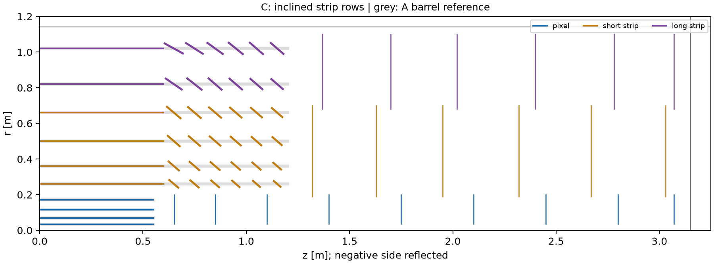
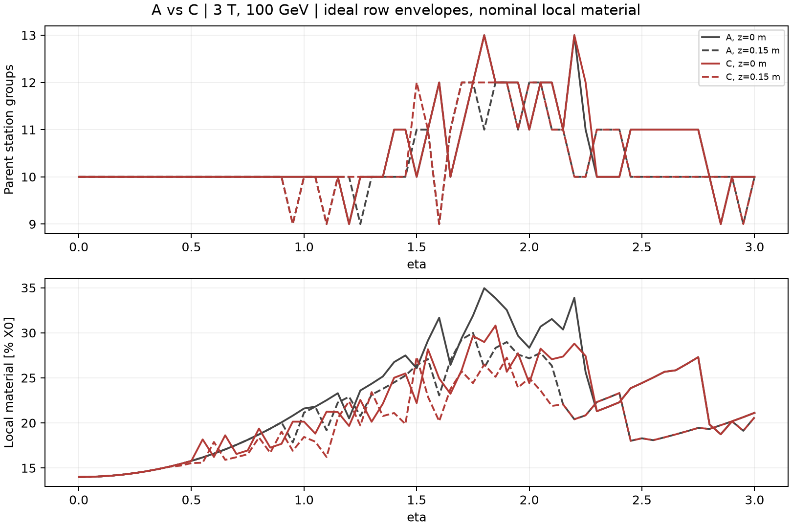

# DES-006 — Proposal C: inclined strip barrel ends

DRAFT / isolated PROTOTYPE · 2026-09-18 · human selection and sign-off pending.

**Review follow-up:** the original C is now named C2; C1 inclines short strips only.
See the [C1/C2 comparison and optimisation status](DES-006-C1-C2-review.md).
The original C proposal and numerical evidence below are retained for traceability.

Read the [two-page C brief](DES-006-proposal-C.pdf),
[TrackTech cost–benefit assessment](inputs/DES-006-inclined-tracktech.md) and
[independent PhysVal assessment](inputs/DES-006-inclined-physval.md).
This addresses the [PR #13 review request](https://github.com/asalzburger/nodd/pull/13#issuecomment-5731319897).

## Proposal and comparison control

**Retain C as a challenge to baseline A, with no layout selection.** C tilts the
ends of all six strip barrels toward the interaction region. Pixels, signed
endcap disks, normal material allowances and measurement response retain A's
values. The two existing A/B inputs and retained IdRes results remain the
historical controls; C has no IdRes or material-aware fit result.

**NODD DESIGN CHOICE C07 — unsigned, no approving humans:** retain flat strip
barrels for `|z| <= 0.600 m`, at radii 0.260, 0.360, 0.500, 0.660, 0.820 and
1.020 m. Replace each end by six rows centred at `|z| = 0.650, 0.750, 0.850,
0.950, 1.050, 1.150 m`. Tilt the normal toward the origin by
`min(atan(|z_c|/r_c), 45 degrees)`. For each original 0.100 m axial band, define
endpoints by intersecting its two origin rays with the tilted row. Extend each
endpoint by 0.010 m along the row. These choices target reduced oblique material
and ideal area while retaining angular coverage; the 45-degree cap limits radial
excursions. The 0 and 0.005 m extensions are comparison controls. They are not
manufacturing clearances or qualified module dimensions.

The [machine-readable configuration](DES-006-inclined-layouts.json) records all
endpoints and their parent station groups. Each inclined segment is revolved to
form a conical ring **envelope of planar module rows**, not a proposal for curved
silicon. The extension causes real overlap contributions in this model. Discrete
module footprints, phi tiling, finite thickness, support, cooling and services
remain unresolved; projected envelopes are insufficient for engineering clearance.

**FACT TTC-F01:** CMS has publicly engineered a flat-centre/tilted-end tracker
arrangement with module/material motivation and associated mechanical/cooling
challenges; `SRC-CMS-OUTER-TRACKER-2018`, §2/Fig. 2, §5.3/Fig. 12. This is a
feasibility precedent, not a source of nODD numerical dimensions or savings.
See the [catalogue](../../reference/manifest.yaml) and TrackTech source discussion.

## Double-sided long-strip accounting

**INFERENCE I01, made explicit:** two independent scalar strip measurements at
symmetric ±20 mrad form one effective two-coordinate stereo station. The 2% X0
normal allowance belongs to the complete pair and is applied once per crossed
module. Silicon area and face counts include both sides. At the origin and
eta=0, all A/B/C have 10 stations, 12 silicon-face crossings and 20 ideal scalar
coordinates: four pixels, four strixels and two double-sided long-strip modules.
IdRes's raw count of 16 follows its own strip-classification convention; it is
neither a physical sensor-face count nor a station count.

Overlapping C rows retain every material and physical-face crossing. Distinct
parent station groups provide a conservative coverage comparison; they do not
specify the full information in the additional measurements. The report records
physical scalar coordinates and grouped-station coordinates separately. Material
and covariance of separated stereo faces, pairing ambiguities and correlations
still need a module-aware model.

## Executed cost–benefit comparison

**INFERENCE C-I01:** ideal areas from exact cylinders/annuli and conical ring
areas `pi*(r1+r2)*hypot(delta_r,delta_z)`:

| Full-system quantity | A | C | Change |
| --- | ---: | ---: | ---: |
| Pixel reference area [m²] | 4.902 | 4.902 | 0% |
| Strixel reference/sensor-face area [m²] | 43.953 | 39.939 | −9.13% |
| Long-strip paired reference area [m²] | 55.930 | 54.833 | −1.96% |
| Long-strip silicon area, both faces [m²] | 111.861 | 109.665 | −1.96% |

These are ideal area proxies. Installed module counts, cost, power and complete
material cannot be inferred before tiling and service/support closure. The
barrel-only gains are larger (15.0% strixel, 4.0% long strip); unchanged disks
explain the smaller full-system savings.

**INFERENCE C-I02:** the [retained screen](../validation/DES-006-inclined-screen.json)
uses 801 signed-eta samples, three uniform fields (2/3/4 T), three pT values
(1/10/100 GeV) and three vertex probes (−150/0/+150 mm): 21,627 probes per
candidate and margin choice. Nominal C loses no parent-station groups relative
to A on this grid; both have a minimum of six. C/A local material ranges from
0.7794 to 1.2371, including every overlap. This is not a uniform material win.
At origin, 3 T, 100 GeV, eta=1.5: A gives 26.072% X0 and C 22.204%; at displaced
vertices some overlapping rows reverse the gain. Absolute values are unqualified
local fixtures, excluding the beam pipe and remote services.

| Tangent extension at each row end | Lost-station probes on the 0.01 eta helix grid | Interpretation |
| --- | ---: | --- |
| 0 mm | 748 | Tilt without overlap opens vertex-dependent gaps |
| 5 mm | 0 | Finer independent straight-ray scan still finds two narrow missed bins |
| 10 mm | 0 | Independent 0.001 eta scan also finds no loss; no continuous/tiled coverage proof |

The [independent audit](../validation/DES-006-inclined-independent.json) retains
the finer zero-field scan and a separate helix solver comparison. No counts are
reconstruction efficiencies. C preserves A's far-forward pixels, hence does not
repair the existing forward curvature or pixel-transition weaknesses.

## Balanced recommendation and next review

TrackTech recommends evaluating inclined strixel ends first: the long-strip
area benefit is small, while stereo alignment, two-face routing, row supports,
cooling bends and additional assembly/inspection work can consume it. PhysVal
recommends retaining A and C through active-mask tiling and material-location
checks, including the adverse overlap bins. Neither assessment supplies a
material-aware resolution or efficiency advantage for C.

Review C07 and its margin controls, then establish discrete reusable module rows,
scalar stereo transforms, tolerances and an owned service/support ledger. Only
after those interfaces exist should ACTS transport and a covariance model that
supports arbitrary sensor orientations decide the physical benefit. Do not map
C to cylinders/disks to obtain an unsupported IdRes prediction. Original A/B
fits remain useful controls and keep their recorded limitations.

Reproduce using the [study instructions](../../tools/tracker_layout/README.md).
