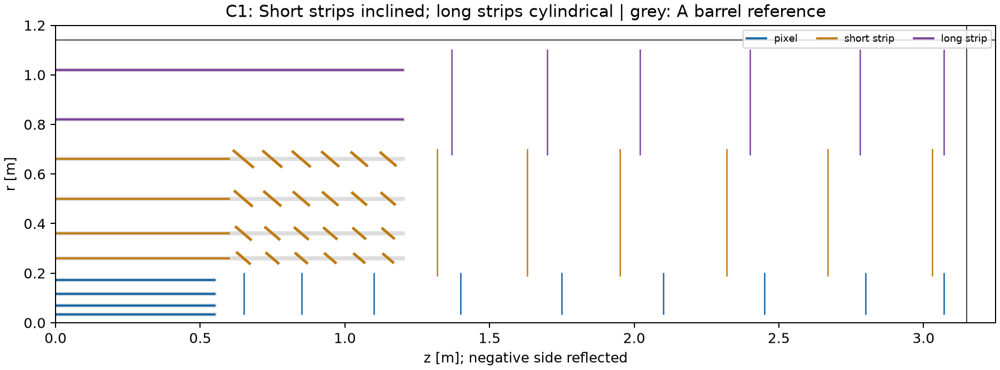

# DES-006 — C1: Inclined short-strip ends; cylindrical long strips

DRAFT / PROTOTYPE · 2026-09-18 · no layout selection or human sign-off.

Read the [two-page C1 brief](DES-006-proposal-C1.pdf),
[full comparison and optimisation answer](DES-006-C1-C2-review.md),
[layer table](DES-006-inclined-split-layouts.json) and
[executed evidence](../validation/DES-006-inclined-split-screen.json).

