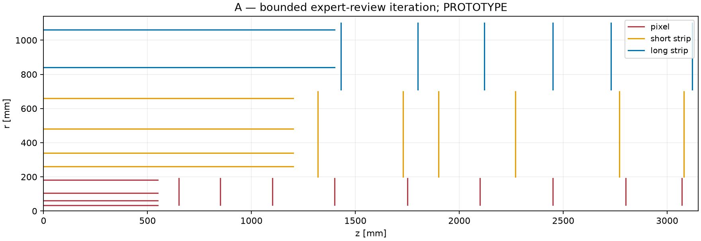

# DES-006 A: expert-review iteration

DRAFT / PROTOTYPE, 2026-09-24. Only A and C1 remain active. Cylindrical short strips; ODD-guided control.

## Geometry and motivation

Retain the tracker host and |eta| < 4 requirement. Separate active pixel, short-strip and long-strip disk bands with provisional 10 mm gaps. Move the outer long-strip barrels and disks together to recover leverage around eta=1.1. No component or geometry is signed off.

Pixel barrel radii: 34, 60, 106, 182 mm; half-length 550 mm. Short-strip central radii: 260, 340, 480, 660 mm. Long-strip radii: 840, 1060 mm; half-length 1400 mm. First long-strip disk: z=1430 mm. Exact signed layers are in DES-006-reviewed-layouts.json.

Disk annuli: pixels 35-190 mm; short strips 200-700 mm; long strips 710-1100 mm. Those active bounds reserve space but do not prove that real supports or services fit. A 25 mm pipe-exclusion plus 5 mm installation fixture is conditional; the 34 mm first radius is not a cleared interface.

<!-- PAGE -->

# A: strengths, weaknesses and next decision

## Demonstrated prototype benefit

At eta=1.1, origin, 3 T, the Gaussian q/pT uncertainty improves 5.7% at pT=1 GeV and 8.5% at 100 GeV relative to original A. The generic five-parameter covariance uses straight-reference crossings and leading thin-scatterer noise. It is not a reconstructed resolution or a full material budget.

Ideal silicon areas: pixel 4.612 m2; short strip 43.203 m2; long strip 120.077 m2 including both faces. Long-strip pair material is counted once. Earlier controls remain in the original files.

## Costs and unresolved weaknesses

The worst finer-grid q/pT uncertainty ratio is 1.430, so the landmark improvement is not uniform. Narrower disks lose hits in some transitions. The 60 mm second pixel layer trades better high-pT IP information against about 4% worse central low-pT d0. Far-forward leverage remains limited. These losses prevent adopting the full iterated layout as an optimum.

A remains the simplest geometric control. The longer outer barrel increases the area and changes the service handoff. IdRes was run on A only; its zero-material limit agrees with the independent covariance at printed precision.

## Priorities and human review

Review beam-pipe and service envelopes first; repair lost transition coverage with real module masks; agree beamspot/performance weights; revisit C1 row count and tiling; then run ACTS and later full simulation. Source locators, all attempted scans, adverse cases and individual comment responses are in DES-006-expert-review.md. Final sign-off remains with asalzburger-review.
