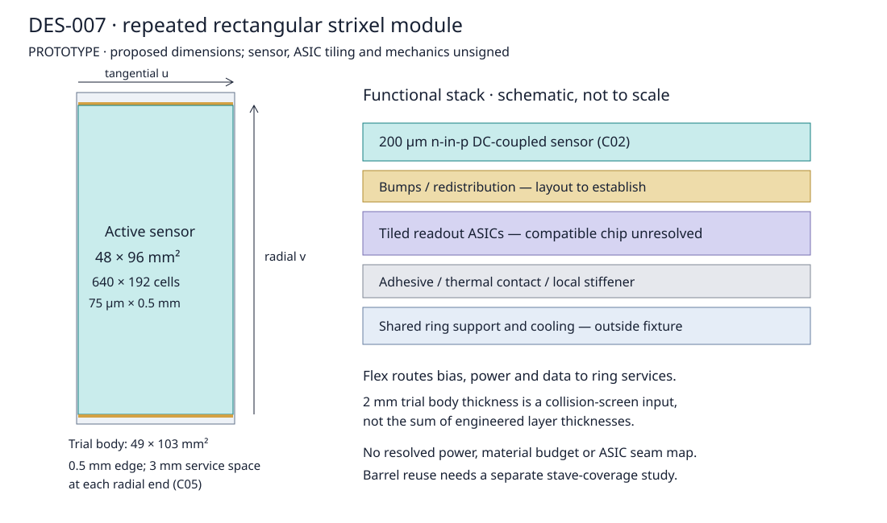

# DES-007 — Short-strip sensors, modules and reusable endcap rings

- Status: DRAFT
- Created: 2026-09-25
- Updated: 2026-09-25
- Author: Codex, AI-assisted research
- Human owner / technical and domain reviewers: TBD
- Issue: [#20](https://github.com/asalzburger/nodd/issues/20)
- Governing design: [DES-005](DES-005-tracker-system-plan.md), TRK-SSTRIP and TRK-CONTRACT
- Sign-off / production implementation: pending; none authorized by this document
- Scope: **PROTOTYPE** analytical module and ring study; no production geometry changes

## Proposal and scope

Develop a planar n-in-p **strixel** module with approximately ODD's fine pitch
and short second coordinate. The agreed research baseline is a 75 µm × 0.5 mm
cell, with 75 µm × 1.5 mm retained as the fallback for electronics review. Compare
ring-specific wedge sensors with repeated rectangular sensors. A repeated
48 mm tangential × 96 mm radial active rectangle is the initial candidate;
48 mm squares provide a smaller-module alternative. Neither is an approved
sensor or available electronics assembly.

ATLAS ITk does have “short strips”, but its 24.1 mm strips are much longer than
ODD's 0.5 mm cells. CMS PS macropixels provide the closer readout precedent.
This proposal uses their sensor/readout and support principles without adopting
either experiment's full detector, trigger architecture or radiation requirements.
It opens the component research area requested by the human on 2026-09-25.
The subsequent clarification selects **ATLAS ITk Strip + CMS Tracker TDRs**.
On 2026-09-25 the user explicitly agreed to keep 0.5 mm as the research
baseline and study 1.5 mm as the fallback until electronics feasibility is
clearer. This resolves the research preference only; DES-007 remains DRAFT,
with hardware feasibility and formal design sign-off pending. Evidence:
[recorded agreement](../../logs/codex/SESSION-2026-09-25-short-strip-cell-choice.md).

## Public facts and precise locators

PDF page numbers below are one-based. Sources and local hashes are recorded in
[the manifest](../../reference/manifest.yaml). These are TDR-era specifications,
not claims about final production hardware.

| ID | Classification | Fact | Source and locator |
| --- | --- | --- | --- |
| F01 | FACT | ODD short-strip XML Cartesian segmentation is 75 µm × 0.5 mm; ACTS geometric digitization uses 80 µm × 0.5 mm. | SRC-ODD-UPSTREAM, revision `c167363f3d4ad1540a577af99071283caf54f3a6`, `xml/detectors/TrackerShortStrips.xml` readouts; `config/odd-digi-geometric-config.json` short-strip volumes |
| F02 | FACT | ODD endcaps have three rings at 318, 470, 622 mm, 42 modules per ring; sensor x1/x2/length values are (18.4,32.2,78), (30.2,44,78), (40.8,56.4,78) mm; sensor thickness 0.25 mm. | Same XML, endcap module definitions and ring placements; `factory/tracker/ODDModuleHelper.cpp`, `assembleTrapezoidalModule`, Trapezoid constructor |
| F03 | FACT | ODD barrel sensor parameters dx/dy/dz are 48/108/0.2 mm; its box factory halves all three. Endcap readout allocates two bits to ring and eight to module. | Same XML and `ODDModuleHelper.cpp`, box module constructor |
| F04 | FACT | ITk barrel active sensor area 96.640 × 96.669 mm², pitch 75.5 µm, strip lengths 24.10 or 48.20 mm; stereo module rotations ±26 mrad. | SRC-ATLAS-TDR-025 §6.1, printed102/PDF128 |
| F05 | FACT | ITk uses single-sided n+-in-p float-zone sensors, AC-coupled strips; sensor specification thickness 300–320 µm. | Same, §6.1 printed101/PDF127 and Table6.1 printed103/PDF129 |
| F06 | FACT | ITk endcap has six sensor geometries R0–R5, radial strips and internal ±20 mrad stereo; pitches span 69–84 µm across sensor types. Nine modules per petal side use six sensor geometries; outer three rings use two sensors each. | Same, printed92/PDF118, printed94/PDF120, §6.1 and Table6.2 printed104/PDF130 |
| F07 | FACT | ATLAS12 prototype inactive edges are 450 µm longitudinal and 500 µm lateral. | Same, printed102/PDF128; prototype values, not a guaranteed edge termination for this design |
| F08 | FACT | CMS PS-p active area is 96 × 46.944 mm², outer size 98.740 × 49.160 mm², cell 100 µm × 1.467 mm. PS-s strips are 100 µm × 23.472 mm; 2S strips are 90 µm × 50.274 mm. | SRC-CMS-TDR-014 Table3.3, printed/PDF37 |
| F09 | FACT | PS-p uses DC coupling and bump-bonded MPA readout; the TDR prefers 200 µm physical silicon and discusses alternatives. MPA cell redistribution accommodates a 200 µm bump pitch. | Same, §3.3.1.2 printed/PDF38 and §3.3.2.2 printed/PDF42 |
| F10 | FACT | CMS endcap modules are staggered on both faces to form rings, with adjacent rings on paired disks; first two double-disks have 15 rings. | Same, §3.1.1 printed/PDF28 |
| F11 | FACT | ITk local support uses carbon-fibre structures, embedded cooling and bus tapes; CMS PS includes large-area cooling of bump-bonded readout and a 200 µm CFRP baseplate. | ATLAS printed92/PDF118; CMS §3.3.3.2 printed/PDF45 |

## Inferences

| ID | Classification | Deduction, assumptions and limitations |
| --- | --- | --- |
| I01 | INFERENCE | F02's factory treats x1, x2 and length as half dimensions: full sensor lengths are 156 mm, widths 36.8→64.4, 60.4→88, 81.6→112.8 mm. Nominal local radial spans are 240–396, 392–548, 544–700 mm. Corner radii differ; this is source interpretation, not a DD4hep build. |
| I02 | INFERENCE | A 48 × 96 mm² active rectangle with F01 cells has 640 × 192 = 122,880 channels. A 48 mm square has 61,440; a 96 mm square 245,760. Cell density is about 3.91 times CMS PS-p's, from (0.1×1.467)/(0.075×0.5). This is a channel-density comparison, not a power prediction. |
| I03 | INFERENCE | Ideal uniform binary errors are pitch/√12: 21.65 µm and 144.34 µm for 75 µm × 0.5 mm. Charge sharing, threshold, incidence and radiation alter actual response. These numbers are not a calibrated resolution model. |
| I04 | INFERENCE | F09 motivates distributed bump-bonded readout for the short second coordinate. No cited ASIC is demonstrated compatible with 75 µm × 0.5 mm. ABCStar strip bonding and CMS MPA cannot be declared interchangeable with this sensor. |
| I05 | INFERENCE | More than four rings cannot be encoded in F03's existing two-bit ring field. At least three bits for six rings, four for twelve; integration needs a reviewed identifier amendment and regression tests. |

## Proposed choices and measurement contract

All choices below are **NODD DESIGN CHOICE**. C01 records the user-agreed
research baseline/fallback; the other choices remain AI proposals. Formal
human design sign-off is **pending**. The input JSON retains the numerical
comparison cases, including the 1.0 mm sensitivity point and CMS reference cell.

| ID | Proposed choice | Rationale, alternatives and consequences |
| --- | --- | --- |
| C01 | 75 µm × 0.5 mm research baseline; 75 µm × 1.5 mm fallback, agreed by the user on 2026-09-25. Retain 75 µm × 1.0 mm as a sensitivity point and sourced CMS 100 µm × 1.467 mm as a reference. | Keep ODD feature size while exposing readout cost. Longer cells lower channel density but worsen the second coordinate. Rounded cell counts for non-divisible dimensions are only area estimates. |
| C02 | Single 200 µm planar n-in-p DC-coupled sensor; examine 250/300/320 µm thicknesses. | ODD barrel and CMS precedent; thickness is a proposal, not an established radiation solution. No copied CMS paired-sensor pT-stub requirement and no artificial stereo pair for a 2D cell. |
| C03 | Repeated active 48×96 mm² and 48×48 mm² sensors; 96×96 mm² control; custom wedges per ring. | 48 mm follows ODD barrel scale; 96 mm follows TDR sensor scale and gives integer baseline cell counts. Full dies with edges, ASIC peripheries and wafer yield still need layout. A large square is a packaging/control alternative, not automatically one feasible wafer product. |
| C04 | Compare a 200–700 mm active annulus, with six or twelve rings as appropriate, and ODD's three-ring reference separately. | Provisional interface aligned with the DES-006 first-layout study, not an approved envelope. ODD itself starts near 240 mm active radius. Keep disk count/positions outside this study's optimization. |
| C05 | Trial sensor edge 0.5 mm; trial service allowance 3 mm at each radial end. | F07 gives an order-of-magnitude edge precedent only. Rectangular body dimensions active width+1 mm, active height+7 mm; wedges use a conservative local bounding rectangle with the same allowances. These are occupied-space fixtures, not engineered dimensions. |
| C06 | Ring-end overlap allowance 4 mm (2 mm initial control), tangential half-width allowance 1 mm; even module counts. | At 700 mm, a 4.5 mm z offset from a 1320 mm disk with vertex z=150 mm shifts the footprint by 2.69 mm. The initial 2 mm margin fails this stress case; 4 mm leaves room for this shift and corner curvature. Not alignment/assembly tolerances. Sweep/check discretization before review. |
| C07 | Four trial z levels separated by 3 mm, with 2 mm body thickness. | Colour rings and alternating modules to separate projected overlap. Total trial envelope 11 mm; excludes common supports and services. This fixture is tested for same-plane collisions; physical thickness and cooling layout remain unsigned. |

Local module coordinates are u tangential, v radial, w normal. Cells measure u
and v; reconstruction must rotate their covariance into disk coordinates.
Rectangles keep fixed physical pitch everywhere. Wedges in this study are
**clipped Cartesian-cell footprints**, not an implemented radial-strip sensor.
An ITk-like constant angular pitch would have physical pitch proportional to
radius and requires a separate segmentation/readout study. Wedge channel counts
are area/cell-area estimates and omit partial boundary-cell layout.

The PROTOTYPE uses `(candidate, ring, module)` tuples, all unique, and records
stagger levels separately. No existing production identifier is modified.
DES-006 in [open PR13](https://github.com/asalzburger/nodd/pull/13),
`docs/design/DES-006-reviewed-layouts.json` at
`06275ecf55e4bb428ffbdb1d5beb72c9a7aca064`, uses a provisional 5 mm/√12 short-strip second-coordinate
error; that is ten times C01's ideal binary value. The component handoff must
resolve this explicitly rather than silently changing either study.

## Sensor, electronics and mechanical assembly

From the incident side: sensor and guard region; bump interconnects; tiled
readout ASICs; adhesive/thermal interface; a local carbon-based stiffener and
thermal contact; flex connections to ring power/data and bias distribution.
Cooling is shared by the ring support, with embedded tubing as a public
precedent. Bump redistribution, ASIC reticle dimensions, tile seams and power
conversion occupy real space and must enter the next component drawing.

| Component | Representation in this study | Unclosed engineering quantities |
| --- | --- | --- |
| Sensor | Explicit active polygon and candidate thickness | Guard/bias termination, bias voltage, wafer layout, fluence and lifetime |
| Bumps and readout ASICs | Readout topology and channel demand only | Compatible ASIC, chip dimensions/count, bump map, inactive seams, threshold/noise, bandwidth and W/channel |
| Flex, power conversion, connectors | Trial occupied-space allowance only | Copper/polyimide stack, converters, connector count and envelope, grounding and HV clearance |
| Adhesives, stiffener and thermal path | Named required constituents; not homogenized | Areal densities, conductivity, contact resistance, sensor operating temperature |
| Ring support/cooling/services | Four-level fixture; no material model | Tube dimensions/coolant, support skins/core, routing, hydraulic/thermal and mechanical assessment |

The sensor-only volume is active area × thickness (die edges additional).
Changing 200 to 300 µm increases that contribution by 50%; it says nothing
about the full module budget. No total X/X0, mass, ASIC power or material mixture
is invented. In particular DES-006's ideal-layer material fixture is not a
completed module material account. Electronics and service budgets must close
before a performance comparison is used to select the physical detector.

## Reproducible comparison and acceptance criteria

The [isolated study](../../tools/short_strip/README.md) generates module polygons,
ring tables, channel-area estimates, coverage samples, collision diagnostics
and [a comparison report](../validation/DES-007-ring-study.md). Everything remains
PROTOTYPE. Coverage is the union of sensor polygons, including inactive edges
through the difference between active and body outlines. It is sampled at
polar-bin midpoints with area weighting, not a proof of hermetic coverage.
Straight rays also test the four z levels from a provisional first disk at
1320 mm and vertex z = −150, 0, +150 mm. These are coverage stress fixtures,
not beamspot or alignment specifications. No magnetic deflection is modeled.

| Requirement | Classification | Criterion and scope |
| --- | --- | --- |
| R01 | NODD DESIGN CHOICE | Retain C01 baseline and report all other cell choices explicitly; no adoption without human review. |
| R02 | NODD DESIGN CHOICE | Compare ring-specific and one-type approaches using the same target annulus; report counts, silicon area, overlap, holes and channel estimates, including failed candidates. |
| R03 | NODD DESIGN CHOICE | Zero interior body intersections on the same trial z level (convex polygon separating-axis test); required occupied envelope reported. This is a fixture check, not DD4hep validation. |
| R04 | NODD DESIGN CHOICE | Target zero sampled uncovered bins for shortlisted layouts; repeat with doubled radial/azimuthal sampling. Do not interpret zero samples as a continuous proof. |
| R05 | NODD DESIGN CHOICE | Verify polygon orientation/area, transform symmetry, obvious inside/outside cases, collision controls and an independent brute-force coverage crosscheck. |

No random sampling is used. The report records source revision, input/script
hashes, Python/dependency versions, commands and sampling. DD4hep construction,
Geant4 tracking, ACTS conversion/navigation, realistic dead maps, curved-track
acceptance, material scans, radiation damage, electrical/thermal/mechanical
qualification and stable production identifiers have **not** been validated.
They are later gates after the sensor/readout and support interfaces are reviewed.

## Open decisions and review gates

1. Research preference resolved on 2026-09-25: keep 0.5 mm as the baseline and
   investigate 1.5 mm as the fallback. Switching to the fallback requires an
   explicit decision based on electronics feasibility; it is not automatic.
2. Sensor/electronics expert: compatible readout and realistic ASIC tiling,
   leakage/noise/radiation and bandwidth/power; the fine-cell baseline is
   conditional on this work. The sourced CMS cell is a lower-extrapolation
   comparison reference, distinct from the agreed 75 µm × 1.5 mm fallback and
   not proven plug-compatible with the proposed rectangle.
3. Tracker architect: approve active inner radius and ring count; reconcile
   DES-006 covariance/material fixtures and adjacent pixel/long-strip envelopes.
4. Mechanical/services expert: replace trial body and z offsets with a complete
   cooling/support assembly, routing and tolerance budget, then repeat coverage.
5. Technical reviewer and approver: select candidate and exact parameter version,
   record sign-off, then authorize a separate DD4hep module prototype/integration
   step. No named human has yet reviewed or signed off DES-007.
