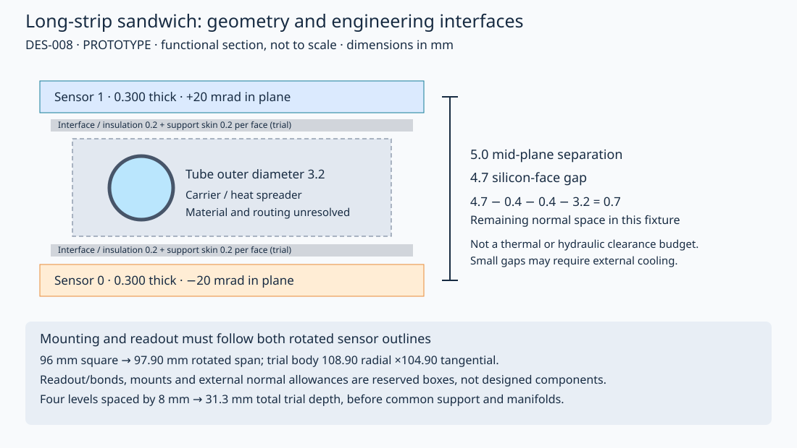

# DES-008 — Stereo long-strip sandwiches and reusable endcap rings

- Status: DRAFT
- Created: 2026-09-25
- Updated: 2026-09-25
- Author: Codex, AI-assisted investigation
- Human owner, technical and engineering reviewers: TBD
- Governing design: [DES-005](DES-005-tracker-system-plan.md), TRK-LSTRIP,
  TRK-CONTRACT, TRK-SUPPORT and TRK-COOLING
- Related investigation: [PR #21](https://github.com/asalzburger/nodd/pull/21),
  DES-007 at `17d84a4c92916a49929db3c5e75684e51bf613b7`
- Authorization: user request for the corresponding long-strip investigation,
  2026-09-25; [session record](../../logs/codex/SESSION-2026-09-25-long-strip-research.md)
- Scope: **PROTOTYPE** analytical study; no production implementation or sign-off

## Investigation contract

Compare repeated rectangular sensors with ring-specific wedges in a provisional
710–1100 mm target annulus, aligned with PR13 A and C1. Each module contains two independently identified sensors,
physically rotated by opposite half-angles about their common centre and placed
on opposite sides of a local support. Count coverage only when the same ray
crosses both sensors of the same module. The relative angle, sensor mid-plane
separation, silicon thickness and free internal gap are different quantities.

The starting hypothesis is 40 mrad relative stereo and 5 mm mid-plane separation,
motivated by the inspected ODD endcap sandwich. Scan angle and separation instead
of freezing these values. Compare 96×96 mm² sensors with continuous strips or two nominal 48 mm rows,
96 mm tangential ×48 mm radial sensors with one row, narrower rectangles and
custom wedges. Include inactive row seams, sensor rotation, trial readout/mounting
space, four stagger levels, pair coverage and support/cooling fit. These are
unsigned NODD DESIGN CHOICE scenarios, not a production sensor specification.

Results, public provenance, parameter rationale and mechanical review gates are
recorded below as the study is executed. No full-detector performance or material
claim is authorized by this prototype.

## Public facts and source interpretation

Source IDs resolve in [the manifest](../../reference/manifest.yaml). TDR page
numbers below are **printed / one-based PDF**. They describe the cited editions,
not a claim about current production hardware. Local hashes were rechecked;
public CDS pages returned an access challenge, so byte equality with the live
public editions is unverified. No new source PDF is committed.

| ID | Classification | Observation and precise locator |
| --- | --- | --- |
| F01 | FACT | SRC-ODD-UPSTREAM, `c167363f3d4ad1540a577af99071283caf54f3a6`, `xml/detectors/TrackerLongStrips.xml`, endcap Ring0/Ring1: sensor rotations ±0.02 rad, normal offsets ±2.5 mm, thickness 0.25 mm; central 4 mm foam component and cooling tube outer radius 1.5 mm. `factory/tracker/ODDModuleHelper.cpp`, `assembleTrapezoidalModule`, halves thickness and uses `RotationY(alpha)`. |
| F02 | FACT | Same source, barrel module: 96×108×0.25 mm sensor boxes, rotations 0 and 0.04 rad, normal offsets +3.30/−3.31 mm. The box factory halves its dimensions and rotates about local z. Readouts use 0.15×1.5 mm Cartesian cells; ACTS digitization long-strip volumes instead measure one coordinate. This inconsistency must be resolved, not interpreted as a physical 1.5 mm strip length. |
| F03 | FACT | SRC-ATLAS-TDR-025 §5/PDF118 (printed92): opposite sides of a common stave have ±26 mrad module rotation, giving 52 mrad relative stereo. Endcap sensors implement ±20 mrad in their strip pattern, giving 40 mrad relative stereo. Modules are carried by a carbon-fibre sandwich support with embedded titanium cooling. This is not a standalone two-sensor module. |
| F04 | FACT | Same TDR §6.1, printed101–103/PDF127–129: AC-coupled n+-in-p sensors, target physical thickness 300–320 µm; barrel active dimensions 96.640×96.669 mm², 75.5 µm pitch and 48.20 mm long-strip rows. ATLAS12 prototype inactive edges 450/500 µm are a precedent, not a general clearance guarantee. |
| F05 | FACT | SRC-CMS-TDR-014 §3.1.2 printed/PDF30: 2S sensor mid-plane separations 1.8 and 4.0 mm serve on-module transverse-momentum filtering. §3.3.1.2/Table3.3 printed/PDF37 gives 90 µm pitch and 50.274 mm strips. These are not stereo-resolution requirements. |
| F06 | FACT | Same TDR §3.3.3.1 printed/PDF44–45, Fig3.11: 2S bridges set separation and provide structure, cooling paths and attachment to the support. Hybrid placement changes with the gap; electrical isolation and thermal interfaces occupy space. |
| F07 | FACT | Same TDR §3.1.1 printed/PDF28: rectangular modules are reused in barrel and endcaps; alternating module faces and adjacent rings on paired disks provide four staggered surfaces. This motivates a tiling comparison, not the numerical nODD stagger spacing. |

**INFERENCE I01:** F01 implies 40 mrad relative stereo, 5 mm mid-plane distance
and 4.75 mm clear silicon-face gap. F02 implies 6.61 mm barrel mid-plane distance.
Neither quantity is a validated coolant/support allocation. The present prototype
uses a common symmetric ±half-angle frame; the barrel's 0/+angle convention is
related by rotating the local coordinate frame, but its mounting outline must
also rotate. Source inspection is not a new ODD construction/overlap test.

## Proposed geometry and parameter provenance

All C01–C09 are **NODD DESIGN CHOICE — proposed**, with approving humans pending.
The user authorized this investigation and the sandwich/stereo requirement, not
these numerical choices. Exact inputs are in [inputs.json](../../tools/long_strip/inputs.json).

| ID | Scenario | Rationale and alternatives |
| --- | --- | --- |
| C01 | 710–1100 mm target annulus; first long-strip disk z=1430 mm; vertices z=−150,0,+150 mm. | Align with both active DES-006 A/C1 proposals in PR13 at `f57e26e83b826867c2720edcd702e808fe946854`. Check all six disk positions and mirrored sides. Replaces the initial 700 mm / 1320 mm fixture on user request; neither layout is signed off. These are coverage targets at reference planes, not guaranteed physical sensor edges. |
| C02 | Relative stereo 40 mrad, scan 0/20/40/52/80 mrad; sensors rotated physically about the common module centre. | ODD/endcap and ITk angle references; zero is a singular control, 20/80 bracket the nominal value. Do not confuse 40 mrad relative with ±40 mrad per side. Implant stereo without die rotation is a separate option. |
| C03 | Sensor mid-plane separation 5 mm; scan 1.8/4/5/6.6/10 mm. Silicon thickness 0.300 mm per side. | ODD endcap spacing, CMS packaging scales, rounded ODD barrel comparison and enlarged stress control. TDR thickness precedent; no radiation qualification implied. The minimum geometric separation must exceed thickness. |
| C04 | Square 96×96 mm² and narrow 48×96 mm² active outlines; one continuous nominal 96 mm strip row for the geometric shortlist. Compare 96×48 mm² one-row modules, two 48 mm rows on the square, and six ring-specific wedges. | 96 mm scale follows PR21/ITk sensor scale, not an approved 96 mm strip product. Continuous strips avoid a central dead seam but double strip length relative to ITk's cited long-strip row; capacitance, noise and occupancy must be checked. Wedge strips here are parallel Cartesian lines clipped to the outline, not ITk radial/fan strips. |
| C05 | 80 µm pitch; split-square dead row band 0.100 mm; one-row cases have no internal row seam. | Rounded pitch near ITk's 75.5 µm, compatible with 96 and 48 mm integer channel counts. The seam is an explicit sensitivity fixture, not a sourced manufacturing dimension. Dead channels and bond-pad masks remain unmodeled. |
| C06 | 0.5 mm guard beyond active outline; 5 mm radial and 3 mm tangential service/mounting allowances beyond guard; 1 mm external allowance on each sandwich face. | Trial boxes surround both rotated sensors. Edges have a public scale precedent; electronics, mounting tabs, connectors and adhesives are not dimensioned hardware. A 30 mm radial-allowance stress control tests larger attachments. |
| C07 | Four module-centre levels at −12,−4,+4,+12 mm; even module counts, ring parity and alternating azimuthal index define levels. | 8 mm separation accommodates the nominal 7.3 mm occupied stack, leaving 0.7 mm between adjacent levels. The 3 mm PR21 spacing is retained only as a rejected control. Common carrier, manifolds and fastener access are additional. |
| C08 | 16 mm radial end allowance and 3 mm tangential half-width allowance; compare 5/6 rings for 96 mm radial size and 12/14 for 48 mm size. | Extreme sensor plane is 14.5 mm from the disk reference; at r=1100 mm and vertex z=150 mm its radial displacement at the first 1430 mm disk is 12.46 mm. Extra margin covers rotation/curvature in this fixture. It is not an assembly tolerance. Failed ring counts are retained. |
| C09 | Internal test stack: 0.2 mm interface per face, 0.2 mm support skin per face and 3.2 mm tube outer diameter. | Deliberately explicit fit test near the ODD pipe scale; no chosen coolant, pressure, material or engineered wall thickness. Residual space measures only a one-dimensional envelope; routing/bends/joints/insulation and adhesive qualification remain open. |

## Measurement contract and stereo tradeoff

Local coordinates are u tangential (precision coordinate), v radial in an endcap
(along the unrotated strips), and w normal to the sandwich. The implementation's
polygon coordinates are `(v,u)`. Each physical sensor supplies **one** measured
coordinate plus its discrete strip-row identity, where applicable. Two sensors
retain separate `(candidate, ring, module, side)` identities and share a module
pair ID. Those study tuples do not define a production DD4hep bitfield.

For known direction and independent equal binary errors σ=p/√12, transporting
both measurements to a common plane gives axes
`m± = u cos(α/2) ± v sin(α/2)` and the covariance

```
Var(u) = p² / [24 cos²(α/2)]
Var(v) = p² / [24 sin²(α/2)]
Cov(u,v) = 0                 (symmetric frame only)
```

**INFERENCE I02:** at 80 µm pitch and 40 mrad relative stereo the ideal errors
are about 16.33 µm across strips and 0.817 mm along strips. At 20/52/80 mrad,
the along-strip errors are about 1.633/0.628/0.408 mm. At zero stereo the second
coordinate is unmeasured, not zero-error. These are binary geometry estimates,
not detector-performance predictions. A 150 µm pitch would scale both errors
by 1.875; the ODD XML grid must not be silently imported as the readout contract.

The plane separation matters even though it is absent from this ideal covariance:
for local track slopes `(tu,tv)` and separation d, the displacement is `(d tu,d tv)`.
If one collapses the raw ±half-angle measurements to one plane **without** the
slope correction, the inferred v can shift by magnitude
`d tu cot(α/2)/2`, while u shifts by `d tv tan(α/2)/2` (signs depend on side labels).
With d=5 mm, α=40 mrad and a tangential slope of 0.01, the first bias is about
1.25 mm. Direction uncertainty, scattering, alignment, correlated charge response
and hit assignment therefore belong in the fit. Do not feed two independent 2D
space points into ACTS or double count a derived space point and its constituent
strip hits. Multiple hits per sensor can yield false pair combinations; coverage
assumes the correct same-module association and says nothing about occupancy or
pattern-recognition efficiency.

**INFERENCE I03:** a 96 mm square rotated by ±20 mrad has a combined axis-aligned
width/height of `96(cos(0.02)+sin(0.02)) = 97.901 mm`. Using an unrotated 96 mm
box misses roughly 0.95 mm per edge before guards, bonds and services. For a
96 mm long strip, opposite sensor ends differ tangentially by about
`96 sin(0.02) = 1.92 mm` between the two sides. Common bridge holes, bond edges
and clamp pads cannot simply share identical unrotated coordinates.

A 96×96 mm one-row pair has 2×1200=2400 nominal strip channels; the same outline
split into two rows has 4800. A 48×96 mm one-row pair has 1200, and a 96×48 mm
one-row pair has 2400. The 404-pair square layout therefore has 969,600 nominal
channels, before spare/edge channels. Wedge counts in the JSON are width/pitch
estimates; actual fan/parallel strip termination and partial strips require a
sensor-mask design. Channel count alone is not a power or material model.

## Sandwich, mounting and cooling implications



**NODD DESIGN CHOICE C10 — proposed, approving humans pending:** use single-sided AC-coupled n-in-p strip
sensors, with a separately read out edge hybrid for each side and wire-bonded
connections to the sensor. Public strip ASICs provide readout precedents, but
no ABCStar/CBC compatibility, chip count or power is established for the proposed
pitch, channel count and strip length. Both rotated bond edges and hybrid thermal
paths must fit the module. This is a strip readout proposal, not PR21's distributed
strixel ASIC tiling.

The working topology is two sensors around a carbon-based local carrier/heat
spreader, with electrical isolation and bond/adhesive interfaces, coupled through
mounting contacts to a cooled ring or petal. Compare an embedded tube within the
carrier with an external tube/cold rail and conductive bridges. No material
mixture, heat load, thermal resistance or complete X/X0 is assigned yet.

| Interface | Quantified screening or flag | Required next decision |
| --- | --- | --- |
| Sensor rotation | Rotated outlines included; nominal square body 108.901 mm radial ×104.901 mm tangential. | Locate bonds, bias contacts, alignment fiducials and separately rotated mounting lands; check tool access and handedness on both detector sides. |
| Internal sandwich gap | d−t = 4.7 mm silicon-face clearance at nominal d=5 mm. Subtract interfaces, skins and tube: 0.7 mm test residual. At d=1.8 or 4 mm the embedded-tube fixture does not fit. | Smaller gap requires a smaller tube, revised skins/interfaces or external cooling. No inference that CMS's smaller-gap module is impossible: its bridges and cooling topology differ. |
| Stagger depth | 7.3 mm trial body, four-level total 31.3 mm before shared support. d=6.6 mm already exceeds 8 mm adjacent-level spacing. | Increase spacing only after repeating ray coverage and clearance; added support depth worsens parallax. PR21's 11 mm total envelope cannot be reused. |
| Shorter 48 mm modules | Twelve rings leave pair gaps; fourteen rings produce occupied-body intersections in this four-level fixture. | Reassign supports/levels, alter disk position or overlap strategy, or change outline; more rings alone is not a mounting solution. |
| Row division | A 0.1 mm central dead band creates pair losses even on otherwise covered square rings. | Qualify row termination, mask and electronics placement; change staggering or use a separate seam-covering arrangement. Do not hide the band in an effective resolution. |
| Wedges | Fewer modules and less silicon for this annulus, but six outline families; rotated corners and clipped strip ends require local clearances. | Sensor masks, hybrid families and common mounting datums; compare implant stereo as an alternative that avoids rotating whole dies. |
| External supports/cooling | Trial box detects module-to-module intrusion only; no ring carrier/tube network or screws are modeled. | Route contacts, tube bends, manifolds, cable exits and fasteners without crossing the rotated sensor/bond envelopes; close thermal and mechanical budgets. |
| Adjacent subsystems | Occupied radii extend below the 710 mm long-strip target edge and above 1100 mm active edge. | Coordinate with DES-007 at its exact revision, including relative z: continuous active coverage is not a noninterference proof. Remain within the 1140 mm host boundary with real services. |
| Barrel reuse | Same sensor family is plausible; normal separation becomes radial and longitudinal slope can enlarge edge losses. | Perform a separate stave tiling, end overlap and thermal/support study. No barrel acceptance follows from this endcap screen. |

## Results, limitations and review gates

The [retained report](../validation/DES-008-ring-study.md) compares all candidates,
angle/gap controls and mounting failures. The [reproduction workflow](../../tools/long_strip/README.md)
uses two deterministic polar midpoint grids and straight rays from three vertices.
Two sensors are ANDed within a module before module pairs are ORed. Separate
metrics expose regions with one sensor, or with both side labels from unrelated
modules but no valid pair. Rotated body prisms are checked at all intersecting
z intervals, including different stagger levels; negative cooling-stack residuals
are independently flagged. Touching prism boundaries are not counted as interior
overlap, so real assembly tolerances remain necessary.

The continuous-strip six-ring square is the initial **geometric working
candidate**, conditional on readout/noise/occupancy feasibility for 96 mm strips.
A six-ring wedge is a competing geometry with additional sensor types. This is
not a technology down-selection; 48 mm strip rows have a stronger direct TDR
precedent but require a different treatment of row seams and/or supports.

Before selection: sensor/electronics experts must assess strip length, pitch,
readout topology, radiation, noise, occupancy, bandwidth and power; mechanical
and thermal experts must replace occupied boxes and the one-dimensional cooling
fixture with an assembly and tolerance budget; tracker architects must close
subsystem interfaces and mounting levels. PhysVal must validate pair ambiguity,
correlated errors, realistic masks and curved-track acceptance. Pin the resulting
proposal for human technical/expert review and formal sign-off before production
implementation. No DD4hep/Geant4/ACTS construction, overlaps, material scans,
alignment stability, thermal analysis or full tracking efficiency is claimed here.

## Compatibility amendment — PR13 A and C1, 2026-09-25

**NODD DESIGN CHOICE C11 — human-directed compatibility study, dimensions remain
unsigned:** use the active A and C1 definitions from PR13's
[reviewed layout file](https://github.com/asalzburger/nodd/blob/f57e26e83b826867c2720edcd702e808fe946854/docs/design/DES-006-reviewed-layouts.json).
Both use long-strip disk annuli 710–1100 mm at |z|=1430,1800,2120,2450,2730,3120 mm.
Their long-strip barrels are at r=840/1060 mm with |z|≤1400 mm; the C1 inclination
applies to short strips. Do not confuse these barrel radii with disk apertures.

The [curated input](../../tools/long_strip/pr13-layouts.json) retains exact signed
layer IDs, geometry, source revision and original-file hash for both options.
The [compatibility report](../validation/DES-008-layout-compatibility.md) checks
annulus equality and five/six-ring coverage at every disk position. This replaces
the initial 700 mm / 1320 mm scenario; its inputs, results, code and figures remain
available at [the previous study revision](https://github.com/asalzburger/nodd/tree/68932692fc61bb25d21e55a915a12eb929b2b316/tools/long_strip).

The rerun retains six rings: 404 square module pairs per disk, with no missing
pair samples at any of the six disk positions on either grid. Five rings lose
pair coverage at the first three disks (worst 1.0914% at 1430 mm). Using the same
six-ring arrangement throughout avoids a separate rear-disk assembly variant;
five-ring rear disks remain a possible later material/complexity tradeoff. The nominal
10 mm separation from the 700 mm short-strip band is a separation of ideal
reference-plane coverage bands: rotated sensors, parallax margins and attachments
extend inward. Check actual disk z separation and the host boundary; do not claim
a free 10 mm radial service corridor. Barrel end structures, shared supports,
connector access and the short/long-strip handoff still require engineering review.
