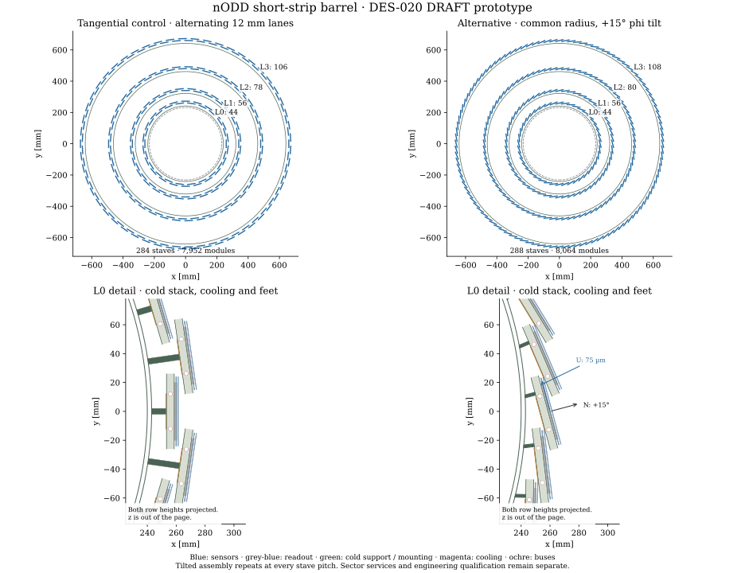

# DES-020 — Detailed short-strip barrel

- Status: DRAFT
- Created: 2026-10-06
- Scope: isolated PROTOTYPE; no change to the pixel baseline or production detector.
- Governing documents: [DES-007](DES-007-short-strip-modules.md), [DES-011](DES-011-service-constrained-tracker-optimization.md), [DES-010 service inputs](inputs/DES-010-strip-services.md).
- Issue: [#20](https://github.com/asalzburger/nodd/issues/20).
- Human owner, engineering reviewers and sign-off: pending.

## Proposal

Use four cylindrical layers of straight carbon sandwich staves. Keep the
selected nominal radii 260/340/480/660 mm and active z extent ±1200 mm.
Orient the fine sensor coordinate tangentially and the short-cell coordinate
along z. Each stave carries 28 rectangular strixel modules, with alternate
modules raised above the common cold plate. Alternate staves occupy two radial
lanes. This gives physically accessible cooling and service paths while covering
projected sensor edges. Unlike DES-009's alternating half-phi row shifts, each
column is now one straight mechanical stave. This is a new placement proposal;
historical transforms, IDs and coverage results are not reused as validation.

Each stave has two independent half-length U-loops, accessed from its respective
barrel end. Common support crosses z=0; the positive and negative circuits do
not. End boards terminate the local copper buses, HV, control and data.
Radial sector trays collect services outside the active barrel; downstream
services use the inherited r710..783 mm short-strip corridor. Endcaps are outside
this first implementation; their demand is not counted as spare capacity.

## Provenance and numerical contract

The executable input is [inputs.json](../../tools/short_strip_barrel/inputs.json).
All numerical hardware parameters are NODD DESIGN CHOICE unless an inherited
fact or derivation is explicitly identified below. These are engineering
hypotheses, not approved components or fabrication specifications.

| ID | Classification | Parameter, rationale and boundary |
|---|---|---|
| SB-F01 | FACT | Inherit DES-007 F01/F03 and DES-010 SS-F01..12 with their public source IDs and precise TDR locators. These are recorded historical source readings; the local PDFs are unavailable in this checkout and CDS challenges live access. No new byte verification of those TDRs is claimed. |
| SB-F02 | FACT | Thermal cycling of ATLAS strip assemblies revealed CTE-related sensor fractures; an interposer mitigation was studied. SRC-ATLAS-STRIP-INTERPOSER-2025, §1–2, arXiv:2508.18015v1. It concerns different strip hardware and supplies no qualification for nODD strixels. |
| SB-C01 | NODD DESIGN CHOICE | Retain user-agreed DES-007 75 µm × 0.5 mm cells, 48×96 mm² active area, 0.5 mm guard and 0.2 mm sensor. The 1.5 mm fallback remains separate. No stereo pair is added to a two-coordinate sensor. |
| SB-I01 | INFERENCE | 640×192 = 122,880 channels/module. Fit 28 symmetric rows with endpoint centres ±1152 mm: pitch 2304/27 = 85.333… mm and nominal axial active overlap 10.666… mm. No cropping at endpoints. |
| SB-C02 | NODD DESIGN CHOICE | 12 mm lane separation, 1.5 mm alternating row lift, 52 mm support width; size even phi populations using the outermost sensor radius and an 8 mm tangential active margin. Low-row sensor centres sit at nominal radius, high rows at +1.5 mm; odd staves add +12 mm. Radii are datums, not average sensor surfaces. Recompute counts; do not copy the old 242-column inventory. |
| SB-C03 | NODD DESIGN CHOICE | One continuous 49×97 mm² sensor die; eight 23.4×23.4×0.15 mm³ readout tiles on a 2×4 grid with 24 mm centre pitch. 25 µm bump envelope (15% Cu/85% air volume fixture), 0.10 mm adhesive, 0.20 mm graphite, 25 µm insulation, 0.10 mm adhesive and 0.20 mm CFRP backing. The two 3 mm axial flex ledges make a 49×103 mm² occupied outline. Tiles/bump redistribution are a footprint hypothesis, not compatible off-the-shelf ASICs; no live-channel claim across tile gaps. |
| SB-C04 | NODD DESIGN CHOICE | 5 mm core, two 0.15 mm CFRP skins and two 0.10 mm core glue layers, informed by SS-F01. Two 20×64 mm² graphite pickups/module span from cold-plate surface to module backing. Length64 clears the next module despite its 103 mm body. Raised modules require oriented thermal inserts; density2.21 g/cm³ and assumed effective conductivity100 W/(m K) are screening choices. |
| SB-C05 | NODD DESIGN CHOICE | 2.5 mm OD / 0.14 mm wall titanium U-loop, two legs at u=±12 mm, centre w=−4.05 mm, straight z spans16..1210 mm on each side, U-return radius12 mm. This adopts an interface-scale diameter from SS-F02, not the exact ATLAS prototype pipe. Ti density4.51, CO2 effective density1.0 g/cm³; coolant density is a transport proxy, not a saturation calculation. Include explicit pipes/coolant; subtract their full outer envelopes from the core. |
| SB-C06 | NODD DESIGN CHOICE | Backside buses: two 12×0.20 mm² Cu rails and a 0.15 mm PI carrier, electrically separate from carbon. HV/control/data use a distinct 0.10 mm patterned flex fixture (17 µm Cu-equivalent at50% coverage). Each module has two flex ledges; route edge tails separately. End-board footprint52×30×8 mm³ at z=±1230 mm is an effective electronics allocation, not a qualified connector/ASIC BOM. |
| SB-C07 | NODD DESIGN CHOICE | Nine 8 mm axial ×3 mm radial CFRP bearing rings/layer at z=0, ±250, ±550, ±850, ±1150 mm. Four-mm tangential feet join the stave back to the ring. The z=0 bearing is the axial datum; other feet use proposed sliding/compliant joints. Hardware is represented by occupied feet, not detailed pins or proven kinematics. CFRP density1.73 g/cm³, 70% carbon mass fraction, E70/100/140 GPa; pure-carbon foam core density0.20 and glue2.0 g/cm³ are screening choices informed by the pixel work; the pure-carbon core composition differs from the pixel composite foam. |
| SB-C08 | NODD DESIGN CHOICE | Twelve sector collectors, r244..750 mm, |z|1245..1310 mm; fixed trunk r710..783 mm, |z|1310..3500 mm. Usable phi fraction0.75, nominal packing0.50; adverse case0.50/0.40 and demand factor1.25, inherited DES-010. One 13.4 mm power plus3.6 mm fibre cable per ≤12 modules, rounded within each half-stave. Cooling manifolds ≤8 leaf loops, 8/12 mm OD and6/10 mm ID feed/return. Counts round separately per sector. Collector cells conserve constituent volumes but do not represent fittings or bend geometry. At65 mm, the worst mean envelope fill is50.90%, slightly exceeding the50% packing target: at least70 mm is recommended for the next interface revision, as a mean-volume lower bound; local cross-section/manifold/bend geometry is still required. |
| SB-C09 | NODD DESIGN CHOICE | For effective off-stave cable material, allocate20% Cu,30% PI,50% air by volume inside the outer cable envelope; optical material is a silica/PI fixture. Native constructibility cannot qualify either cable. Preserve the gross diameter budget independently of material fractions. Tray wall0.5 mm Al, density2.70 g/cm³; no installation void is counted as solid. |
| SB-I02 | INFERENCE | Inherit7.8 W/module CMS PS comparator and7.8×122880/30208 W channel-scaled sensitivity; neither is a physical bound. Add the separate2 W leakage comparator and5 W/end-board choice. Evaluate12 V distribution, copper resistivity0.0175 Ω mm²/m, uniform taps with exact discrete drop/loss, 1 V/0.2 V round-trip/return screen from SS-F04. Shared 0.20 mm rails are a higher-current choice than ITk's patterned17 µm layers. |
| SB-C10 | NODD DESIGN CHOICE | Thermal screen: coolant−35/−25 °C, sensor goal≤−20 °C, interface k1, PI k0.12, CFRP through-thickness k0.5, graphite in-plane k400 and carbon-foam core k20 W/(m K), additional pipe-contact R0.25 K/W. The conservative hotspot fixture sends all module heat through6 mm of graphite toward two64 mm sheet edges and through the full5 mm carbon-foam depth; it is not a calibrated finite-element model. Flow3/7 g/s, latent heat200 kJ/kg and usable quality rise0.35; energy-only comparisons, no pressure-drop/dry-out qualification. Retain any failures. |
| SB-C11 | NODD DESIGN CHOICE | 25/50 mm route bend-centre allowances and25 mm connector/access reserve are inherited unqualified construction cases. Compare the swept finished cable/pipe radius with the65 mm collector depth. The original30 mm collector failed both cable-volume conservation and bend clearance; retain inputs-30mm-control.json. A failed turn cannot be hidden by an effective DD4hep service cell. |
| SB-C12 | NODD DESIGN CHOICE | Isolated readout `system:5,layer:3,stave:7,module:5,sensor:1,x:-11,y:-10`, system3; layer/stave/row indices are deterministic prototype IDs. No production identifier remap is implied. The MC-truth region uses r800 mm and z±1400 mm, matching the coverage host and enclosing all sensors; world half sizes1000/1000/3700 mm are simulation fixtures. |

Native constituent definitions reuse the explicit pixel material builder: Si2.329,
Cu8.96, graphite2.21, PI1.42, epoxy2.0, CFRP1.73 and carbon foam0.20 g/cm³,
with its atom/mass recipes except the separately defined pure-carbon core. Silica2.20 g/cm³ is an optical transport fixture. Patterned interconnect and electronics/service cells
are documented volume-normalized fixtures. Core holes displace foam; tube walls
and coolant are disjoint. Silicon guards are passive and the active rectangle
alone is sensitive. No overlapping parent silicon is counted twice.

The initial20/10 mm lane/row fixture was replaced by12/1.5 mm after accounting
for the actual roughly1 mm module stack. The larger lift is unnecessary and
increases projective seam displacement. A first2 mm phi-margin sample exposed
curved-track gaps;8 mm includes the displacement between radial lanes at1 GeV
in4 T. Retained initial results remain separate. Fixed ±1200 mm endpoints mean
some nominal-cylinder end crossings move beyond the physical outer lane: report
these losses against the original denominator and close them with the endcap
transition study, not by relabelling the eligible cylinder.

The65 mm collector ends at1310 mm. The frozen first short-strip disc datum is
1295.5 mm, so this new collector is **incompatible with that existing endcap
schedule** wherever their radial envelopes coincide. Endcap placement/support
must be revised before integration. Pixel services remain a separate fixed
interface; no pixel displacement or global allocation is authorized here.

SB-C13 — NODD DESIGN CHOICE: data sensitivity uses cell occupancy10⁻⁵/10⁻⁴/10⁻³,
1/40 MHz accepted-event rates,32 bits/hit and20% packet allowance. These are
scenario inputs, not collider occupancy or DAQ predictions. Compare required
uplinks with the sourced8.96 Gbit/s usable payload and the ATLAS two-uplink
half-stave comparator. Neither MPA compatibility nor a qualified fibre count in
the3.6 mm cable is supplied. The benchmark gross cable diameter does not certify
signal capacity. Shared LV buses and separately grouped HV/data are an nODD
proposal; CMS's independently powered modules are a geometric comparator.

## Support, assembly and routes

Recommend metrology-controlled module bonding onto discrete insulated thermal
pickups, with flex tails on a separate compliant path. The electronics sits
behind the sensor and transfers heat through the graphite backing; it does not
use the ATLAS hybrid-on-sensor assembly unchanged. The cited CTE experience
motivates thermal-cycle testing and strain relief, not an assertion that a
polyimide sheet solves nODD's different bump-bonded assembly.

Build and pressure-test each stave before module loading. Load alternating
heights using datum fixtures; inspect fiducials and active seams; mount the stave
in its bearing rings with one axial locator. Connect accessible end boards and
manifolds after installation. Restrain service loads to the rings/end frame,
with flexible pigtails between fixed services and the cold stave. The native
rectangular feet meet the circular ring at a tangent; this is an occupied
interface placeholder with line contact, not a finite-area bearing seat.
Specify a curved shoe or machined seat and clamps before mechanical integration.
End boards,
conversion heat and optical endpoints need independent qualification.

LV/HV/control and data run along each half-stave to its end board. The service
ledger explicitly connects every module to one half-stave, every half-stave to
one sector, and every sector to the downstream boundary. Cooling runs inward
along one leg, returns in the central U-bend and leaves through the other;
positive/negative loops are independent. Sector collectors and longitudinal
trunks are finite transport cells with volume inventories. They preserve
material and demand, **not hydraulic or signal connectivity at the CAD level**.

Recommend closing electronics power/bandwidth, bends, connector envelopes and
manifold access before changing the global tracker allocation. Barrel-only
capacity cannot establish the full short-strip/endcap budget. Validate against
the actual pixel and future short/long-strip geometry before subsystem
integration. Do not remove silicon or shrink cables to conceal service failures.

## Validation contract

Generate deterministic placement, route ledger, constituent inventory and
drawings. Screen local OBB body collisions, pickup clearance, transverse/axial
coverage at luminous z±150 mm and both charges at pT≥1 GeV under |B|≤4 T;
sampling is not continuum hermeticity or ACTS tracking validation. Report
off-stave packing, electrical, thermal, enthalpy and beam-sag scenarios
independently. A native PASS refers only to construction, transforms, identifiers,
material conservation, overlaps at1e−5 mm, sparse ROOT material/navigation rays,
ROOT persistence and Geant4 smoke execution. Engineering failures remain
failures. Human sign-off and full-detector integration remain pending.

## Phi-tilted alternative requested 2026-10-06

This amendment authorizes an isolated comparison, still DRAFT. Preserve the
tangential two-lane input and all its retained evidence. The alternative puts
all stave anchors of a layer at the same nominal radius and rotates the whole
cold stave about the beam axis. Modules, pickups, flex, pipes and buses share
that rotation; the 1.5 mm alternating axial-row lift remains. Recompute even
stave counts from the angular span of the 40 mm active interior (48 mm minus
the existing 8 mm phi margin), taking the smaller span of the two row heights.
Do not obtain symmetry by rotating sensors independently of their support.

| ID | Classification | Alternative contract |
|---|---|---|
| SB-F03 | FACT | SRC-ODD-PHI-LOCAL-2026: the clean installed-build ODD source at d70556f33b1c36abdf101a07ad8cf57eb56fbdf1 has `phi_tilt=-0.15` rad in TrackerShortStrips.xml layer0..3, and ODDStripBarrel_geo.cpp lines171–188 applies a common stave orientation while anchors stay at `(r cos(phi),r sin(phi),0)`. This is a separately inspected version, not a replacement of the older study snapshot. Its coordinate convention is not assumed to match ours. |
| SB-F04 | FACT | SRC-ATLAS-ITK-PERFORMANCE-2025, section2.2/table1, reports phi tilts13/12/12/11 degrees for ITk strip layers. The text connects tilt/radius revisions to installation space and adjacent-stave overlap. These different strip assemblies do not prescribe an angle for our thicker strixel stack. |
| SB-C14 | NODD DESIGN CHOICE | Survey12/15/18 degrees, retaining rejected clearances. Select the smallest surveyed angle clearing complete neighbouring stave and end-board solids, with the inherited active margin. Angles are about global+z: `N=cos(alpha) er+sin(alpha) ephi`, `U=cos(alpha) ephi-sin(alpha) er`, `V=ez`; `U cross V=N`. Positive alpha is a declared handedness; it is not sensor stereo. Fine75µm coordinate follows U,0.5mm coordinate follows z. |
| SB-C15 | NODD DESIGN CHOICE | Same-radius shingling replaces the12mm alternating stave lanes only for this input. Cold plate, modules and all local services retain their dimensions. Use a2 mm-wide CFRP mounting web at u=+14.5 mm, on the3 mm-wide bare back-skin land between insulation edgeu13 and signal-bus edgeu16; leave0.5 mm to each. The web extrudes8 mm in z and stops at w=−6.8 mm, without bearing on a conductor. Bevel its inner face to the ring tangent plane. The tangential control retains its original4 mm feet. Web strength/bond/clamp/seat and off-centre torsion require qualification; no bolt-through-web assumption. A−18 mm/4 mm left-side shoe failed neighbour-core clearance and is retained separately. |
| SB-I03 | INFERENCE | Equal radii and common tilt give exact discrete N-fold rotational covariance of local stave geometry at each layer's pitch. Different layer populations and12 sector services do not make the full detector continuously symmetric or reflection symmetric. Compare both charges, finite-plane coverage, orientation and material rays; claim no calibrated resolution improvement or continuum hermeticity. |

Keep fixed nominal radii, axial endpoints, cells, collectors and trunks. Repeat
construction/overlaps, transforms and anisotropic IDs, mass/material rays,
fresh-process ROOT persistence, saved Geant4 hits and refined luminous-region
coverage against the same ideal-cylinder denominator. Sector routing and
rounding must be recalculated. Warm thermal, adverse packing, unqualified
electronics/CTE, collector/endcap interface and original coverage limitations
remain gates. A simple beam screen uses full gravity as a conservative normal
load; it does not qualify the new torsional or in-plane load component.

Recommend **+15°** for the next prototype iteration:12° gives602 native
flex-to-neighbour-bus overlaps;15° and18° report zero at the unchanged tolerance.
This is the smallest *surveyed* clearing angle, not a continuous optimum or
installation-clearance qualification. The resulting44/56/80/108 staves carry
8,064 modules (+112 versus the tangential control). Finite-plane sample losses
fall substantially but remain nonzero near the ends; see the
[alternative report](../validation/DES-020/phi-tilted/results.md).

With alpha=15°, the normal is consistently15° from the anchor's radial vector,
and U consistently15° from its tangent. Radial tracks traverse roughly
0.2/cos(15°)=0.2071 mm silicon at a stave centre. V remains along z; this
does not add an in-plane strip stereo angle or change the anisotropic readout.
Charge sharing, Lorentz drift, incidence-dependent resolution and material
ripple require response/tracking studies. Equal-radius placement improves the
local geometric repetition, not a proven flat phi performance curve.

For the beveled shoe, let R be the ring outer radius and r the anchor radius.
The inner-face centre is at
`w0 = -r cos(alpha) + sqrt(R² - (u0-r sin(alpha))²)` along N at u0=+14.5 mm. If theta is
the azimuth of that contact point, the inner face is
`w(u)=w0+(u-u0) tan(alpha-theta)` and the outer face is `w=-6.8 mm`.
Extrude this quadrilateral over8 mm in z. The inner plane touches the cylinder
tangentially, the outer plane meets the cold-plate back, and the foot has positive
depth throughout its2 mm width. This represents contact and material without
interpenetration; finite-area seating, clamps, friction and installation gaps
remain unqualified.

## Longitudinal packing of both prototypes — PR49 review, 2026-10-07

SB-I04 — **INFERENCE** from the unchanged SB-C01..08/C14 input choices and
exported compact solids: both prototypes have the same axial schedule in every
layer/stave. The phi tilt rotates U and N around global z, leaving V along z;
it changes stave populations and transverse placement, not row pitch or end
allocation. The [packing report](../validation/DES-020/z-packing.md) and
[machine-readable measurements](../validation/DES-020/z-packing.json) retain the
source hashes and comparison against every frozen axial placement.

| Quantity | Tangential control | +15° phi-tilted alternative |
|---|---:|---:|
| Staves / modules | 284 / 7,952 | 288 / 8,064 |
| Rows per stave; per end's service group | 28; 14 | 28; 14 |
| Row centre range | −1152..+1152 mm | −1152..+1152 mm |
| Row pitch `(2400−96)/27` | 85.333333 mm | 85.333333 mm |
| Adjacent active overlap `96−pitch` | 10.666667 mm | 10.666667 mm |
| Die length including guards; projected overlap | 97 mm; 11.666667 mm | 97 mm; 11.666667 mm |
| Front body including flex; projected overlap | 103 mm; 17.666667 mm | 103 mm; 17.666667 mm |
| Alternating row lift along local N | 1.5 mm | 1.5 mm |
| Gap between overlapping front stacks along N | 0.5 mm | 0.5 mm |
| Same-height front-body gap `2×pitch−103` | 67.666667 mm | 67.666667 mm |
| Pickup length; next front-body axial gap | 64 mm; 1.833333 mm | 64 mm; 1.833333 mm |

The sum of active lengths is `28×96 = 2688 mm` per stave, with a projected
union of 2400 mm. The 27 seams duplicate 288 mm, or **10.7143% of summed active
length**. This is axial redundancy, not a whole-barrel silicon-area overlap
fraction. The silicon planes have 1.3 mm separation between their nearest faces;
the broader front-stack envelopes run from −0.9..+0.1 mm for low rows and
+0.6..+1.6 mm for raised rows, leaving the 0.5 mm gap. Pickups need a shorter
length because the high pickup shares the low module's normal-depth range:
`pitch−(103+64)/2 = 1.833333 mm` clears that neighbour in z. These nominal gaps
do not include manufacturing, assembly or thermal-cycle tolerances.

At z=0, row13 (raised) and row14 (low) overlap actively from −5.333333 to
+5.333333 mm. There is no central active cut or split cold plate. Row centres
assign 14 modules to each end's services even though the two central modules
extend across z=0. The half-stave cooling circuits remain independent: straight
legs occupy |z|16..1210 mm and the inward 12 mm-radius returns have swept outer
envelopes −17.25..−2.75 and +2.75..+17.25 mm, a 5.5 mm central axial gap.
Support/buses are continuous; the central bearing station supplies the proposed
axial datum. Bearings at 0, ±250, ±550, ±850 and ±1150 mm occupy 8 mm each,
with a maximum 300 mm centre spacing and 60 mm from the last centre to the
stave end. Seating, clamps and the other sliding/compliant joints are unqualified.

| Positive end allocation (negative end mirrors the z bounds) | z [mm] |
|---|---:|
| Active silicon / guarded die outer edge | 1200 / 1200.5 |
| Front body and edge flex outer edge | 1203.5 |
| Cold plate, local buses and cooling-leg end | 1210 |
| End-board envelope | 1215..1245 |
| Sector collector | 1245..1310 |
| Downstream trunk | 1310..3500 |

Thus the support extends 10 mm beyond active silicon and 6.5 mm beyond the
front-body/flex edge; the support-to-board axial gap is 5 mm and front-body-to-board
gap 11.5 mm. The board meets the collector's axial boundary, giving no additional
axial connector allowance at that interface. These are occupied bounds and route
allocations, not qualified fittings or connected cable/manifold CAD. The old
1295.5 mm endcap datum is 14.5 mm inside the collector's outer boundary; its
conflict and the mean packing failure remain explicit. This figure preserves the
PR49 control interface; later endcap work is a separate revision.

The projected active union has no axial hole, but tilted/displaced finite planes
still lose some eligible nominal-cylinder crossings near the ends. The retained
coverage failures and unchanged denominator in both reports remain applicable.
Nominal seams, native zero-overlap checks and a drawing do not establish
full-track hermeticity, mechanics or service qualification.

## Drawings and evidence

The [retained report](../validation/DES-020/results.md) distinguishes native
software checks from failed or unqualified engineering gates. No DES-006
resolution/material fixture or production reconstruction configuration changes.
