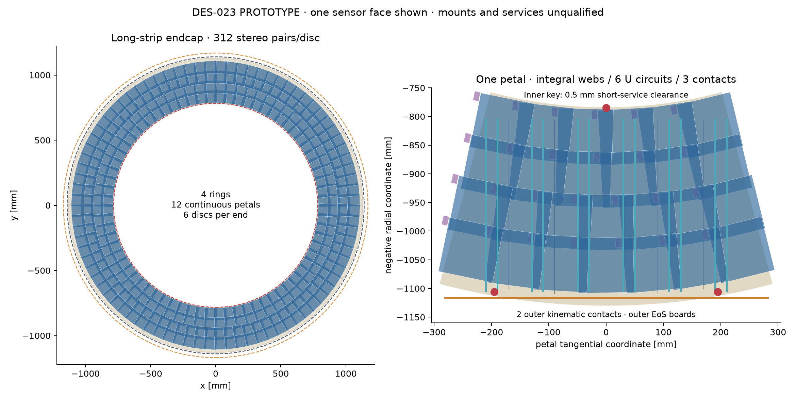
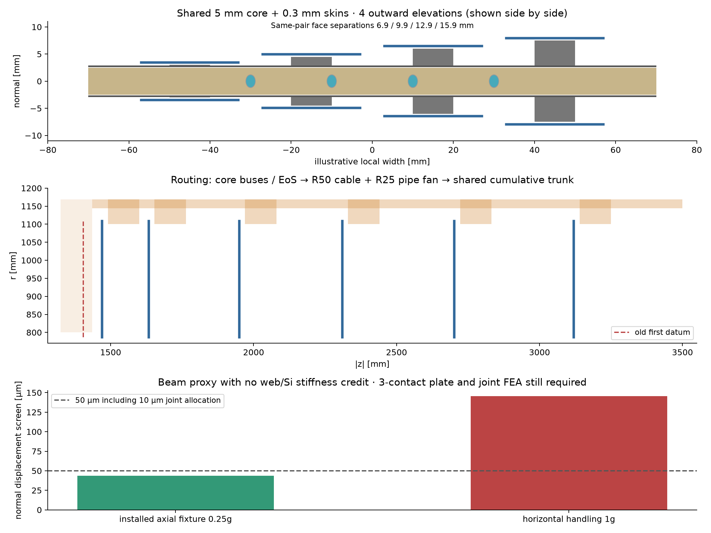

# DES-023 — Long-strip endcap structural petals

- Status: DRAFT
- Created: 2026-10-07
- Scope: isolated PROTOTYPE; human approval pending, stacked on DES-022 / PR52.

The requested separate endcap PR retains the two independent1D strip faces and
continuous cooled carrier between them. No production compact or historical
DES-008/011/020/021/022 artifact is changed. Sources/classifications below govern
this prototype; no mechanical/material qualification or sign-off is inferred.

## Evidence and inference

**LE-F01 FACT:** DES-022 LS-F01/02 and DES-010 SS-F01–12 retain the public ATLAS
TDR support/cooling/bus and CMS harness/power benchmarks with precise locators.
SRC-MIT-SANDWICH-2015 PDF3–4/9 gives bending+core shear and their qualification
limits. SRC-ATLAS-STRIP-PETAL-2026 section1/1.1 (DES-021 SE-F01/02) supports
cooled CFRP petal topology and the need to qualify cold sensor/PCB stress.
These are topology/mechanics facts, not nODD petal dimensions or material moduli.

**LE-I01 INFERENCE:** DES-022 collector ends at|z|1435 mm. The highest hybrid reaches8.95 mm from
the datum; a9 mm upstream-depth reservation plus10 mm clearance requires
first datum>1454 mm. Propose
1470 mm,66.35 mm beyond the frozen DES-011 first1403.65 mm. Keep the old datum
and annulus as coverage denominator; do not remove losses by redefining acceptance.

**LE-I02 INFERENCE:** four 96 mm squares rotated±20 mrad have projected radial
span97.90067264255 mm. Centre radii fit the fixed786.46023565796–1108.32994888566
mm annulus:835.4106,910.067,984.723,1059.3796 mm (exact calculation in model).
The74.66 mm radial pitch needs normal staggering. Pair faces lift OUTWARD on both
sides of the common core; the petal is never duplicated or shifted with a pair.
42 mm pickups clear neighbouring low-face silicon by finite geometry. Both faces
of the same module are required for a hit, with separate strip IDs/physical axes.

## Unsigned central choices

Every number in the input/producer and fixture ledger is a **NODD DESIGN CHOICE**
unless explicitly classified above or inherited below. Approving humans: pending.

**LE-C01 NODD DESIGN CHOICE:** twelve petals per disc, six discs/end. Datums1470,
1633.20848448926,1949.63516612773,2309.99786766720,2702.22888849008,3120 mm;
only the first changes. Four rings with12-fold populations chosen using16 mm
phi reserve. Active96×96×0.3 mm, guard0.5 mm,80 µm strips, relative stereo40 mrad
inherit DES-008/022. Local tangential/radial axes rotate by±20 mrad; both signed
ends use proper right-handed frames. Module/face IDs are prototype-local and
never replace surviving production IDs.

**LE-C02 NODD DESIGN CHOICE:** a continuous annular-sector5 mm carbon-foam core
with0.1 mm glue and0.3 mm CFRP skins per face IS each petal's carrier. Inner radius
784 mm, outer1130 mm, seam angular margin0.002 rad. Outer bearing ring1130–1140 mm;
inner bearing ring783.5–785.5 mm leaves0.5 mm beyond the fixed short-service783 mm
outer boundary. The narrow inner key is a feasibility fixture requiring expert
review: it is not a qualified load introduction. Two outer contacts and one inner
key give a kinematic support; one outer contact fixes in-plane position, the other
slides tangentially, the inner key slides radially. Slot travel±0.3 mm is an
unsigned thermal/assembly reserve, not a machined joint specification.

**LE-C03 NODD DESIGN CHOICE:** pair lift1.5 mm ×(2×ring parity +global phi parity),
creating four elevations.0.1 mm pickup plus0.1 mm full96×96 mm graphite spreader,
0.2 mm sensor glue and0.3 mm sensor give6.9/9.9/12.9/15.9 mm mid-plane separations.
Pickups/glue are42×42 mm; guards/spreaders rotate with the active plane.
A21×20×0.1 mm graphite edge land centred(u58.5,v40) mm extends the spreader
only at a corner, from u48..69/v30..50 mm, avoiding the adjacent raised pickup.
A4×12×0.3 mm graphite post plus0.05 mm adhesive supports the10×16×1 mm
hybrid at(u55,v40,normal3.95+lift) mm. Its top stays below the next higher
sensor. A1.5×12×0.15 mm tail at(u49,v40,normal3.8+lift) mm reserves the
sensor-corner bond region, with0.25 mm lateral clearance to the hybrid body. These are effective bond/flex fixtures; wire bonds/connector CAD
remain unqualified. Initial high electronics and a full-width extended platform
collided with neighbouring pickups and are retained as rejected evidence.
Core/skins carry the structure;
four integral2×5 mm CFRP radial webs replace foam, at u−170/−90/+90/+170 mm, ending at constant maximum
r1114 mm, before the collection bus begins1115 mm. Each local radial end is
sqrt(1114²−(|u|+1)²), so its far corner also clears the collection strip.
No additional hidden rail or silicon stiffness is credited in the conservative
normal-load screen; web shear stiffness also receives no credit.

**LE-C04 NODD DESIGN CHOICE:** six U circuits/petal, ≤12 COMPLETE pairs per
circuit,2.5 mm OD/0.14 mm Ti wall,10 mm bend centre radius. Radial legs at offsets
u−210,−190,−130,−110,−50,−30,+30,+50,+110,+130,+190,+210 mm
run from local radial805 to1105 mm; returns at805 mm
turn inward, contained within r784–1130 mm. Circuits service pairs assigned to the nearest pair of pipe legs
and exit at the outer board/couplings. Hydraulic balancing, fittings and two-phase
stability require proof. Two separately insulated Cu/PI buses are embedded in
core seam channels at normal±1.8 mm, plus an outer collection strip1115–1118 mm;
contained cutouts conserve material and avoid pipe/potting contacts.
Copper is0.05 mm, fully wrapped by0.15 mm polyimide on both normals and every
exposed edge. The connected spine/collector copper shares the r1115 mm interface;
partitioned rear dielectric closes the remaining collector edges without
overlapping another wrap. This replaces the retained one-face-only draft. Dielectric
isolation and local flex feedthroughs remain effective fixtures, not certified
HV insulation or connector CAD.

**LE-C05 NODD DESIGN CHOICE:** outer end board1123 mm, three≤12-pair harnesses
per petal for the expected26 pairs. DES-022 conductor-sized6 mm LV/HV and3.6 mm
48-fibre bundles retain actual constituent volumes,11 V/88.8 W/4.1 m voltage-drop
fixtures and the warm-resistivity failure. The gross13.4 mm power cable remains
a separate control. Cable/pipe R50/R25 elbows reside in a local fan at r1100–1169
mm, from normal+20 to+130 mm: above the full disc stack. They connect to the
unchanged r1144–1169 mm longitudinal corridor. The fan can overhang the active
annulus in radius only because it has axial clearance; it is a service bay, not
silicon or an enlargement of the outer service bound. Connector heads, weld
access, individual bend CAD and complete sector assembly require review.

**LE-C06 NODD DESIGN CHOICE:** common longitudinal segments carry cumulative
barrel PLUS upstream endcap harness/circuit loads. The standalone endcap replaces
the barrel-only trunk representation; the two compacts must NOT be blindly
superimposed, which would double-count the shared corridor. Fans include incoming
and outgoing loads, sectors keep75% occupied phi. Reference75% phi/50% packing;
adverse50%/40% plus25% spare; fixed bounds, failures retained. Last fan ends3250 mm
and hands off at3500 mm; sensitive/carrier datums remain within3150 mm while the
passive trunk deliberately extends beyond that tracker host. Full detector
integration is a later governed task.

**LE-C07 NODD DESIGN CHOICE:** densities/compositions inherit DES-022. CFRP E70,
100,140 GPa and foam G5/10/20 MPa are unmeasured coupon hypotheses. Conservative
normal-load released-span screen uses the complete petal mass, minimum carrier
width, net foam area after pipes/webs, no web/silicon bending/shear credit.
Operational0.25g axial acceleration and1g horizontal handling are separate
scenarios;50 µm total screen includes10 µm for joints. In the installed vertical
disc, gravity lies in the petal plane: calculate that displacement separately.
A normal-load/handling failure requires a temporary installation frame and
plate/joint/global-ring FEA; never call the proposal sag-free or qualified from
these beam proxies. Cold glue/interface stresses, buckling, vibration, torsion,
thermal bow and irradiation/leakage remain open.

Use the immutable old layout, first1403.65 mm/annulus and finite matched old/new
sample, |eta|≤4, luminous z±150/0 mm, B0/4 T and pT1/10 GeV, both charges.
Both-face coverage, short-service separation, native construction/overlaps/mass/
IDs/material rays, fresh ROOT persistence and Geant4 saved hits will be reported.

**LE-C08 NODD DESIGN CHOICE:** six U-loops replace the three-loop engineering
control because its central legs leave long foam heat paths near the sector
edges. Nearest-leg assignment is explicit, each group remains ≤12 complete pairs.
The face-to-core slab and lateral foam path are separate thermal screens using
5/10/20 W/m/K hypotheses, 42 mm pickup width, 5 mm slab thickness, half of7.4 W
per face, -30 C coolant and -10 C sensor limit. A deliberately pessimistic
single-path lateral resistor omits beneficial parallel spreading but retains
its failures; the lower-bound normal slab cannot qualify cooling. Flow per
circuit uses an unsigned200 kJ/kg enthalpy proxy. Six loops shorten the paths,
but measured anisotropic conductivity, contact/bond resistance, two-phase flow
and thermal simulation must close before a buildable baseline is claimed.

## Drawings and actual evidence

[Actual results and retained failures](../validation/DES-023/results.md) and
[reproducibility receipt](../validation/DES-023/reproducibility.json) distinguish
native execution, sampled coverage and unresolved mechanical/thermal/service gates.
Recommend the three-contact concept for expert review with a handling frame,
plate/joint FEA and thermal heat-bridge qualification before adoption. This
proposal remains DRAFT; no human sign-off or production integration is recorded.
