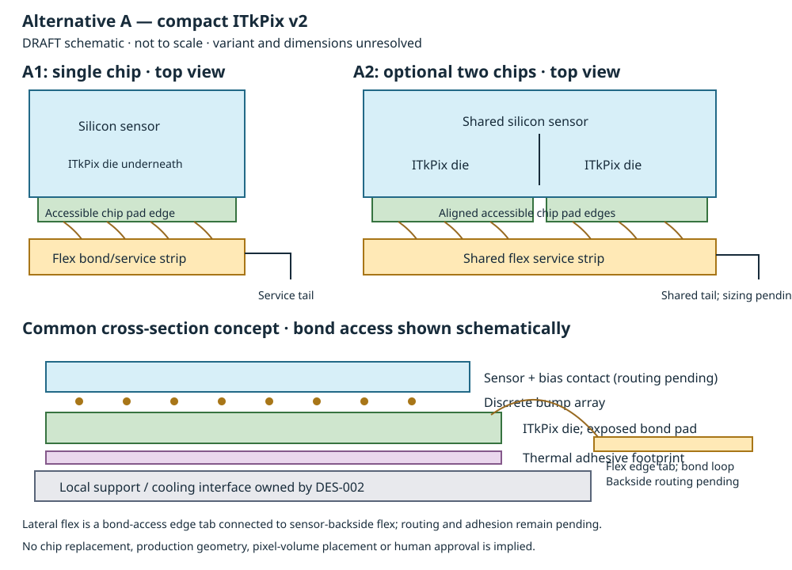

# DES-001 alternative A — compact reusable pixel modules

- Status: DRAFT; design input, not an approved specification
- Created / updated: 2026-09-17
- Author: Tracking Engineer compact-module sub-agent, AI-assisted
- Human owner, issue, expert reviewers and sign-off: pending in parent DES-001
- Production implementation: excluded

## ITkPix baseline revision — 2026-09-17

The user selected **ITkPix**, superseding the earlier unspecified RD53-family
assumption. Exact v1/v1.1/v2 stock revision, thinning, pads and qualification remain
unresolved. This is a family direction, not human module sign-off. All RD53A
facts and arithmetic retained below are **historical superseded benchmarks**;
none sets current ITkPix dimensions, power, pads or acceptance.

**FACT — SRC-RD53-OVERVIEW-2023 slide5/PDF5:** the RD53 presentation identifies
ITkPix v1/v1.1 as RD53B and v2 as RD53C; its ATLAS column lists400×384chip
pixels at50×50µm pitch and approximately20×21mm chip dimensions. Exact revision
manual/procurement drawing is a pre-freeze gate. Presentation targets are not
measured stock performance. Public source: Stefano Esposito for RD53,
*RD53: Lessons Learned — A verification perspective*, 2023-10-23, catalogue entry
SRC-RD53-OVERVIEW-2023; accessed2026-09-17.

**INFERENCE A-I4 — current ITkPix benchmark:** one chip has nominal matrix
20×19.2mm =384mm² and153,600channels; A2 has768mm² and307,200channels.
Derived counts×pitch, excluding sensor edges, seam efficiency, gaps and services.
Approximate chip-only spans are20×21mm forA1 and40×21mm forA2, before margins
and clearances. One ITkPix A1 nominal matrix equals the old RD53A A2 matrix;
reassess whether A2 adds useful savings before adding a second module type.

**NODD DESIGN CHOICE A-C7 — proposed:** retain ITkPix A1 as the compact baseline,
A2 as conditional optimization. Revalidate accessible pad edges and the backside
flex/contact concept against the exact ITkPix revision rather than transferring
RD53A's1.7mm pad separation. Human technical approvers pending.

## Scope

Equip a future pixel volume using the selected ITkPix chip family. The exact
revision, physical stock, thinning and qualification evidence must be identified before
mechanical dimensions or operating limits can be selected. The ITkPix family is fixed for this design study. It offers one reusable single-chip unit (A1),
optionally extended to a side-by-side two-chip module (A2); A2 is justified only
if its reduction in service overhead survives material and yield comparisons.
The volume, radii, module populations, dose, occupancy and cooling conditions
remain unresolved. No geometry or production code is introduced.

The drawing is an original DRAFT schematic, not to scale. Distances and layer
thicknesses in the SVG have no engineering meaning.

## Public evidence and provenance

Existing source catalogue entry: [SRC-RD53A](../../../reference/manifest.yaml),
RD53 Collaboration, *The RD53A Integrated Circuit*, CERN-RD53-PUB-17-001,
version 3.51, 2019-08-19. The
[public manual](https://dpnc.unige.ch/atlas/itk/docs/rd53a/RD53A_Manual_V3-51.pdf)
was checked on 2026-09-17. One-based physical PDF pages below are authoritative;
the printed contents have stale destinations. These facts apply to RD53A only.

The CDS record abstract has been reported with a conflicting 11.8 mm height;
the cited manual gives 11.6 mm. Preserve that discrepancy rather than averaging
or silently resolving it. Actual module design uses inventory-drawing parameters
`die_u`, `die_v` and `die_w`, all pending verification. The conditional manual
benchmark below cannot set the dimensions of the available chip.

| Claim | Classification | Statement | Exact locator |
| --- | --- | --- | --- |
| A-F1 | FACT | RD53A is a prototype containing design variations; die dimensions are 20.0 mm × 11.6 mm. | Abstract, PDF 1; Figure 1, PDF 5 / printed 4 |
| A-F2 | FACT | Its matrix has 400 × 192 pixels at 50 µm × 50 µm pitch. | Section 1, PDF 4 / printed 3; Section 2, PDF 6 / printed 5 |
| A-F3 | FACT | Peripheral circuits and wire-bond pads occupy the bottom edge; sensor attachment must preserve bond access. | Section 2, PDF 6 / printed 5 |
| A-F4 | FACT | RD53A supports serial supply operation and prototype direct-rail operation. | Section 3, PDF 8 / printed 7 |

The [ATLAS pixel reading map](../../../reference/guides/SRC-ATLAS-TDR-030.md)
points to Chapter 7 (hybridization), Section 8.2.2 (flex) and Table 8.2
(material accounting). Those are engineering-review leads, not additional
verified parameter facts in this input. TDR prescriptions are not inherited.

| Claim | Classification | Derivation / limitation |
| --- | --- | --- |
| A-I1 | INFERENCE | Conditional RD53A matrix rectangle: 20.0 mm × 9.6 mm = 192 mm² from A-F2; two such rectangles total 384 mm². These are nominal matrix areas, not demonstrated efficient sensor area or guaranteed seamless coverage. |
| A-I2 | INFERENCE | A2 can amortize a shared service tail over two chips, but only saves material if actual tail and local-component mass is less than twice A1. Routing, current capacity and support reinforcement can reverse the saving. |
| A-I3 | INFERENCE | A1 can follow tighter or irregular envelopes with smaller unsupported spans, at the cost of more unit boundaries, tails and assembly operations per covered area. The benefit depends on the future placement geometry. |

## Proposed choices and interfaces

All rows below are **NODD DESIGN CHOICE** proposals. Human approvers and approval
evidence are pending; none is a signed-off requirement.

| Claim | Proposal | Rationale, alternatives and consequence |
| --- | --- | --- |
| A-C1 | A1 is the common unit: one silicon sensor bump-bonded to one available RD53 die. | Small reusable building block for barrel or disks; avoids early specialization. More unit perimeter per area than a larger hybrid. |
| A-C2 | If justified, A2 uses one shared sensor over two side-by-side dies with aligned accessible bond edges and one shared flex tail. | Shares interfaces without a long assembly; alternative is two independently testable A1 units. Requires custom sensor seam electrodes, two-die placement and larger-sensor yield studies. |
| A-C3 | Start with a planar silicon sensor candidate; retain a 3D single-chip sensor as a separately reviewed high-fluence contingency. | Limits initial manufacturing variants. Radiation environment can require a sensor amendment; no thickness, bias or fluence capability is assumed. |
| A-C4 | Use a polyimide/copper flex with bond windows, localized decoupling and sensor-bias routing; keep external connector or splice at the service boundary where possible. | Reuses interface design and limits concentrated material. Copper area and dielectric thickness follow current, impedance, insulation and manufacturability requirements. |
| A-C5 | Provide an adhesive thermal joint from die backs to a common local support interface; support/coolant hardware belongs to DES-002. | Avoids cooling hardware on every small module. Separate mechanically compliant sensor/flex adhesion must not obstruct die cooling or bond access. |
| A-C6 | Reserve pad access, loop height, tool clearance, bend radius, bias isolation and installation sweep as explicit keep-outs. | Material minimization must not remove buildability or electrical clearance. Values remain pending chip drawing, bonding process and voltage requirements. |

Local coordinates are proposed as u along the aligned chip pad row, v toward
the matrix, and w normal to the sensor. A2 places dies adjacent along u; this is
a design choice, not a global detector convention. A sensor seam can have dead
or enlarged-pixel regions: physical die adjacency does not establish uniform
pixel acceptance. No chip-to-chip gap or sensor-edge dimension is assigned.

Each module exports individually addressable chip links, power return, sensor
bias and monitoring connections. Pin mapping, lane count, current demand,
grounding, serial-chain membership and interlocks require the actual chip
manual and system architecture. Shared A2 tails must not imply shared data
links are feasible. Serial powering is a candidate, not a selected topology.

## Material accounting and comparison

No total X/X0 is claimed. A material comparison must include the whole
module and allocated local services, using measured/vendor-certified thickness,
composition and density; a low sensor thickness alone is insufficient.

| Constituent | Required accounting | Boundary / unresolved inputs |
| --- | --- | --- |
| Sensor silicon | Full physical area × thickness × density; separate active matrix and edge/seam regions. | Technology, thickness, guard rings and bias metallurgy unresolved. |
| RD53 dies | Sum full die areas × actual thinned thickness × density. | Peripheral silicon remains passive material; do not replace die area with matrix area. |
| Bumps and metallization | Bump count × qualified bump volume × composition/density, plus under-bump films. | Electrode mapping, additional edge/bias bumps and metallurgy unresolved; not a continuous dense metal slab. |
| Adhesives | Actual bonded footprint × cured thickness × mixture density. | Separate flex, sensor and thermal joints; record void fraction and coverage, not double-counted full-area coats. |
| Flex | Polyimide, copper traces/planes, coverlay and adhesives separately by occupied area and thickness. | Include tail beyond sensor; copper fill follows routed layout. |
| Wire bonds | Count × wire cross-section × loop length × density. | Include bias and ground bonds, loop envelopes and any qualified protection. |
| Local components | Package/material masses and physical positions. | Decouplers, resistors, monitoring and connector/splice where present; not massless interface markers. |
| Support/cooling allocation | DES-002 interface joint and agreed per-module share of common structure/services. | Explicit ownership prevents omissions and double counting. |

For each constituent j, mass is m_j = ρ_j V_j. Compare
Σm_j/A_active and mapped normal/directional X/X0, while keeping sensor dead
regions and tails spatially distinct. A slab estimate uses t_j/X0_j along a
normal traversal only where that constituent is actually crossed. Off-normal
paths, tail crossings and service overlap require a placement/material map.
Effective layers may preserve component mass and projected material coverage
only after a documented composition/area model and explicit-geometry check.

## Realism constraints, alternatives and gates

A1 offers smaller replaceable units, easier access to irregular boundaries and
less material lost when a chip or hybrid fails. A2 potentially reduces tail and
component overhead, with fewer placements per covered area. Its shared sensor
makes rework and yield more difficult: a bad die/bump region can reject a larger
assembly. More module edges in A1 can require overlap and offset, adding support
and material; neither family wins without a representative tile/service study.

Power qualification must cover ASIC operating modes, regulator/shunt losses,
sensor leakage after irradiation, transients and fault isolation. The thermal
network includes die-to-glue-to-support resistances and gradients, not merely
coolant temperature. Confirm sensor stability and avoid thermal runaway at
the chosen bias and irradiation state. Bonded joints and flex must tolerate
thermal cycles, bow and differential contraction. Do not thin dies or sensors
to an arbitrary material target without handling/bonding yield evidence.

Before technical review, identify the chip and pinout, sensor electrode map,
service footprint, voltage clearances, power modes, usable link bandwidth and
manufacturing process. Before expert review, obtain material and thermal
estimates, bump/bond yield and rework constraints, dimensional tolerance stack,
irradiated sensor evidence and an A1/A2 tiled coverage comparison. Human sensor,
electronics, thermal/mechanical and assembly reviewers remain unassigned.

Planned evidence includes bare-module electrical tests, sensor IV and bump
connectivity maps, dimensional metrology, mass/component inventory, power and
thermal tests including interlock faults, thermal cycling and irradiation
qualification matched to the eventual requirements. Any later simulation must
check dead regions, overlaps, identifiers, material maps and reconstruction
navigation. Criteria and tolerances are pending; none of these tests has run.

Recommendation to the Tracking Engineer: develop A1 as the minimum reusable
candidate, keep A2 as a conditional optimization and compare both with the
larger-module alternative before the Coordinator proposes a family selection.

Drawing clarification: the lateral flex in the common cross-section is a
bond-access edge tab connected to the proposed sensor-backside flex. Its routing
and attachment are unresolved; it does not replace or obstruct the separate
chip-back thermal interface. Both the backside stack and edge-tab footprint
require inclusion in the material and occupied-envelope maps. This clarification
belongs to proposed NODD DESIGN CHOICE A-C4; human approvers remain pending.
