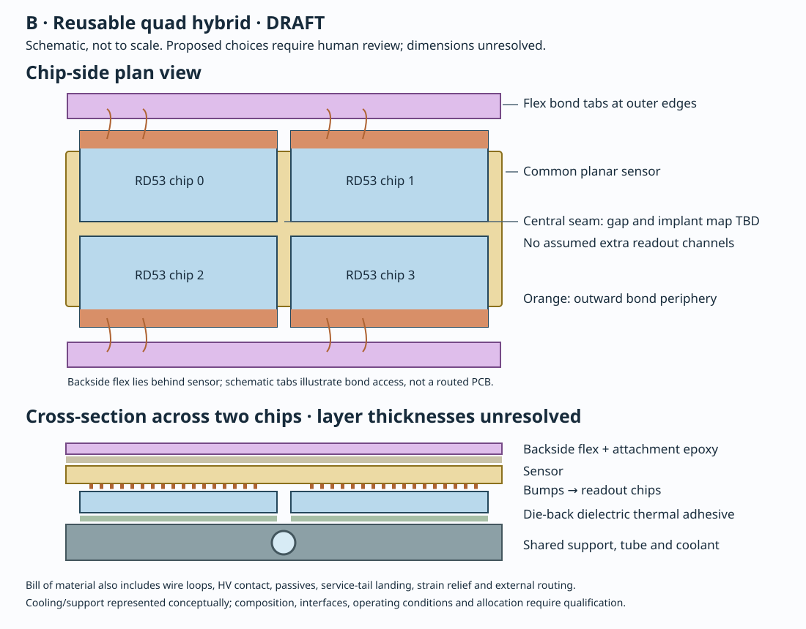

# DES-001 input — Alternative B: reusable planar quad module

- Status: DRAFT design input; no human approval or production implementation.
- Date: 2026-09-17.
- Author role: Tracking engineer alternative-design agent.
- Governing design: [DES-001](../DES-001-rd53-pixel-modules.md); issue #7.
- Context: [PROJECT](../../../PROJECT.md), [design workflow](../TEMPLATE.md), [source catalogue](../../../reference/manifest.yaml).
- Human technical reviewer and approving humans: pending.
- Chip inventory, pixel volume and operating requirements: unresolved.

## ITkPix baseline revision — 2026-09-17

The user selected **ITkPix v2 (RD53C-ATLAS)**, superseding the earlier unspecified RD53-family
assumption. The revision choice is resolved; physical stock, thinning, pads and qualification remain
unresolved. This is a family direction, not human module sign-off. All RD53A
facts and arithmetic retained below are **historical superseded benchmarks**;
none sets current ITkPix dimensions, power, pads or acceptance.

**FACT — SRC-RD53-OVERVIEW-2023 slide5/PDF5:** the RD53 presentation identifies
ITkPix v1/v1.1 as RD53B and v2 as RD53C; its ATLAS column lists400×384chip
pixels at50×50µm pitch and approximately20×21mm chip dimensions. Exact revision
manual/procurement drawing is a pre-freeze gate. Presentation targets are not
measured stock performance. Public source: Stefano Esposito for RD53,
*RD53: Lessons Learned — A verification perspective*, 2023-10-23, catalogue entry
SRC-RD53-OVERVIEW-2023; accessed2026-09-17.

**INFERENCE B-I-ITK1 — current ITkPix benchmark:** each matrix is
20×19.2mm =384mm² and153,600channels; quad totals1536mm² and614,400channels.
Approximate chip-only2×2span is40×42mm before die gaps, sensor edges, bond access,
flex and mounting. These derive from source nominal dimensions/counts, not stock
tolerances or measured active area. Do not carry RD53A's82.8%ratio into ITkPix.

**NODD DESIGN CHOICE B-C-ITK1 — proposed:** keep B as an ITkPix four-chip candidate
only where its substantially larger rigid footprint fits. Revalidate outward-pad
orientation, chip seams, flex routing and thermal contact against the exact revision.
More nominal area per assembly heightens curvature, large-sensor yield and total
heat/service challenges; no universal quad selection follows. Approvers pending.

## Proposal and boundary conditions

**NODD DESIGN CHOICE — proposed:** develop one rectangular four-chip hybrid with
one common planar silicon sensor, a common flex and a replaceable external service
tail. Arrange the chips in two rows and two columns, with the bottom wire-bond
peripheries facing the two outer long edges. This protects bond access and leaves
the central seam between the opposing pixel-matrix edges. All choices in this
input require human approval; none selects ATLAS or CMS geometry.

**NODD DESIGN CHOICE — proposed:** use n-in-p planar silicon as the default sensor
candidate. Keep sensor thickness, implant/isolation technology, guard-ring design,
bias contact and qualified irradiation envelope open until operating requirements
and suppliers are established. A single large sensor saves repeated perimeter
regions, but is not evidence that its central seams collect charge efficiently.
Do not impose the same large sensor on a future highest-fluence region without
comparison against small planar or 3D hybrids.

**FACT — SRC-RD53A:** manual v3.51 abstract and §1/Figure 1, physical PDF pages
1 and 4–5, identify RD53A as a prototype and give a 20.0 mm × 11.6 mm die.
Section 2, PDF 6, gives 400 × 192 cells of 50 µm × 50 µm and bottom-edge bond
periphery. These are conditional benchmarks, not an identification of the chip
in hand. The stock variant, wafer/die revision, thickness and assembly drawing
must be established before freezing the sensor bump mask. Other published
11.8 mm height labels must be reconciled against the stock drawing.

**FACT — SRC-RD53A-MODULE-ASSEMBLY-2022:** §1–2, PDF 2–5, describes RD53A
sensor/chip bump hybrids, flex attachment, pigtails, metrology and aluminium wire
bonds. Section 3, PDF 5–7, describes electrical, source and thermal-cycle testing;
PDF 7 reports seven operational quads, four integrated into a demonstrator.
This establishes a manufacturing precedent, not nODD yield or lifetime.

## Interfaces and construction

The following rows are all **NODD DESIGN CHOICE — proposed**. Approving humans
are pending. Dimensions and compositions remain explicit design variables.

| Element | Proposed representation and reason | Evidence needed to freeze |
| --- | --- | --- |
| Sensitive sensor | One planar tile, with four separately addressable readout regions; retain guard/bias structures and central seam map. | Sensor process, breakdown/leakage, edge efficiency, irradiation and bump-mask compatibility. |
| Chip interconnect | Qualified flip-chip bumps to the actual supplied RD53 die; no replacement readout chip or assumed through-silicon vias. | Supplier bump alloy, pitch/mask, height, yield and thermal-cycle data. |
| Flex | Polyimide/copper candidate stack on sensor backside, with bond-access openings or edge tabs; only required routing/passives. | Routing, return paths, conductor widths/thicknesses, dielectric stack and HV clearance. |
| Flex attachment | Controlled patterned epoxy film; bonded support beneath flex bond pads; no glue on pads, HV contact or sensor guard regions. | Adhesive identity, density, coverage/mass, cure, flatness and radiation compatibility. |
| Wire bonds | Low-mass aluminium candidate wires from outward-facing chip pads to flex. Keep bond loops and tool access in occupied envelope. | Actual pad compatibility, wire geometry, pull tests and protection method. |
| Cooling interface | Thin qualified dielectric thermal adhesive on chip backs to shared support lands; support provides short path to cooling tube. | Thermal conductance, electrical isolation, flatness, differential expansion and allowable die stress. |
| Service tail | Common electrical landing and separately routed detachable tail; connector placed outside sensitive footprint where practical. | Mating clearance, mass, HV/LV/data isolation, strain relief and replacement access. |
| Repeated support | Shared support/cooling assembly, with deterministic per-module allocation of tube, coolant, facing and adhesive. | Mechanical deflection, pipe pressure/leak tests, cooling and installation study. |

**INFERENCE:** the backside flex and chip-back support interfaces lie on opposite
faces of the sensor/bump/chip stack. The drawing therefore shows both, rather than
placing the flex in the chip-to-coolant contact. No thermal path may rely solely
on lateral conduction along a thin flex. Thermal performance remains unverified.

## Area, material and power accounting

**INFERENCE — conditional RD53A benchmark:** matrix area per die is
400 × 192 × (0.050 mm)² = 192 mm², hence 768 mm² and 307,200 channels for a
quad. The four dies occupy 4 × 20.0 mm × 11.6 mm = 928 mm²; the matrix/die-area
ratio is 82.8%. This excludes gaps, guard rings, bond-loop clearances, flex and
services. It is neither module fill factor nor sensor efficiency. Inputs are the
manual facts above, arithmetic exact at quoted precision; actual-stock systematic
uncertainty dominates.

**INFERENCE — geometry bookkeeping:** define die width/height D_x,D_y;
inter-die clearances g_x,g_y; outside flex/bond/guard margins e_left,e_right,
e_top,e_bottom. The bounding rectangle is
W = 2D_x + g_x + e_left + e_right and
H = 2D_y + g_y + e_top + e_bottom. Margins are envelope bookkeeping terms,
not a prescription to extend the sensor across bond pads. CAD must separately
derive the sensor boundary, tool access and active map. Report A_readout/(WH)
alongside the sensor active-area map. Any seam-crossing elongated pixels require
a demonstrated implant/bump map and measured response; they cannot invent
additional RD53 channels.

**NODD DESIGN CHOICE — proposed:** compare alternatives using material per
instrumented area and directional distributions, not just total module mass.
For each constituent i, record actual covered area A_i, thickness t_i, density
ρ_i and composition, giving m_i = ρ_i A_i t_i for planar pieces. Bumps, wires,
passives, glue and connectors use their actual volumes or measured masses.
Allocate shared support/coolant by a documented repeat length. Keep overlaps
between sensor, chip and flex maps: adding area fractions as disjoint regions
would undercount through-going material. Normal-incidence local budget is
Σ t_i/X0_i; angled tracks require intersected path lengths, including
edge/service concentrations. No complete numerical X/X0 is available yet.

**INFERENCE — thermal accounting:** quad load is ΣP_chip + V_bias I_leak +
local regulation and passive losses. Compare thermal maps at identical channel
load, irradiated leakage and coolant boundary conditions. Large area does not
imply four times allowable cooling resistance. The hottest die and sensor, glue
interfaces and failure transients determine feasibility. A qualified chip load
model and power topology are unresolved; do not assume a serial-powered module
has a fourfold external current or negligible shunt dissipation.

## Tiling an undefined pixel volume

**NODD DESIGN CHOICE — proposed:** use the same quad in longitudinal barrel
repeats and on disk/ring support sectors where curvature and available chords
permit. Supports/tails may vary while the sensor, bump assembly and common flex
remain common. Evaluate staggered neighboring modules and opposite-face overlap
before adding bespoke wedge sensors. Include the material cost of overlap.

**INFERENCE:** a large rectangular footprint improves repeated-area coverage
and reduces the number of service landings, but fits small-radius rings and
barrel curvature less easily than a small hybrid. The geometry gate must compare
real occupied corners, bond loops and tails against the agreed pixel volume.
No radius, stave count, disk count, gap or achieved acceptance is selected here.

## Manufacture, test and failure tradeoffs

**NODD DESIGN CHOICE — proposed:** qualify sensor, dies and flex separately;
test the bare bump hybrid before flex attachment; perform post-glue metrology,
bond inspection/pull sampling, chip-by-chip tuning and connectivity tests,
sensor IV and charge-source/beam seam maps; repeat electrical/IV checks after
thermal cycling. Record glue mass and production genealogy. Numerical acceptance
criteria and cycle profiles require a separate validation specification.

**INFERENCE:** with independent chip-survival probability p and all four required,
chip-only quad survival is p⁴ before sensor, bump, flex and assembly failures.
This is a sensitivity model, not a yield estimate; defects can be correlated.
A shared sensor or flex fault can lose the entire quad. Determine whether
partial-chip operation is useful before labeling it a repair path.

| Benefit | Countervailing issue and deciding evidence |
| --- | --- |
| Fewer sensor perimeters and service landings per area. | Larger sensor losses and correlated failure; compare measured material and accepted-area yield. |
| One common high-area hybrid across many repeats. | Poor fit at tight curvature and narrow disk chords; compare occupied-envelope tilings. |
| Potentially less repeated flex/passive overhead. | Four-chip routing, bond clearances and support stiffness may consume the saving; require routed flex and weighed stack. |
| Shared assembly/test tooling. | Large thin sensor handling, glue flatness and thermal mismatch are demanding; qualify assembly and cycling. |

These comparisons are **INFERENCE**, contingent on the proposed construction.

## Recommendation to the Tracking engineer

**NODD DESIGN CHOICE — proposed:** retain B as the reusable area-coverage
candidate and compare it with the smaller hybrid at equal covered area, channel
load and support/cooling boundary conditions. Prefer B where occupied-envelope
tiling and measured assembly yield support its lower repeated overhead. Keep
the smaller option available for constrained or demanding regions rather than
claiming a universal quad. Project Coordinator recommendation and human review
are separate from this engineering input.

Before technical review, resolve chip inventory, sensor operating/radiation
requirements, central seam response, flex routing, material inventory and the
thermal/support model. No production geometry, material or readout configuration
has been changed; any later unsigned construction demonstrator must be isolated
and labeled PROTOTYPE.
