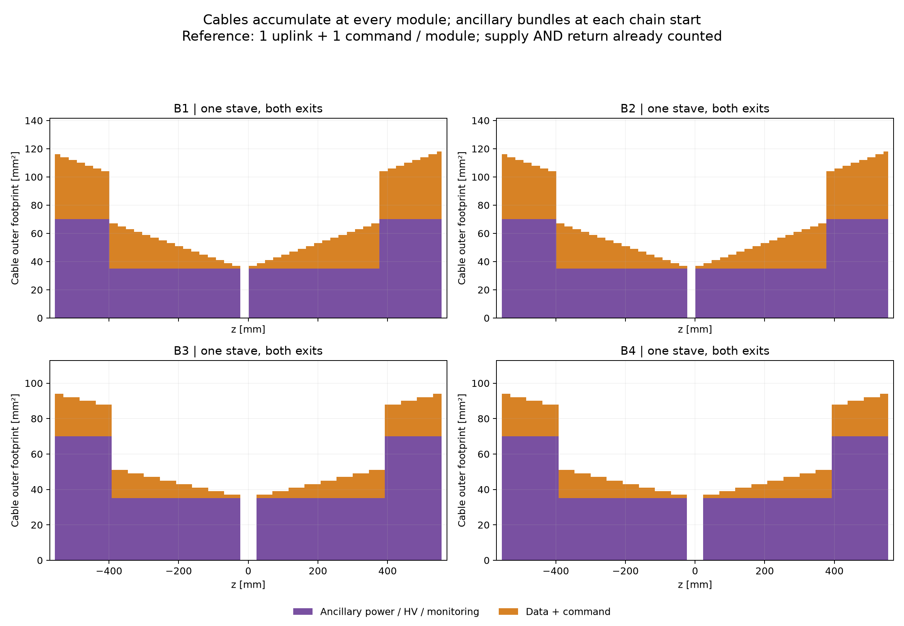
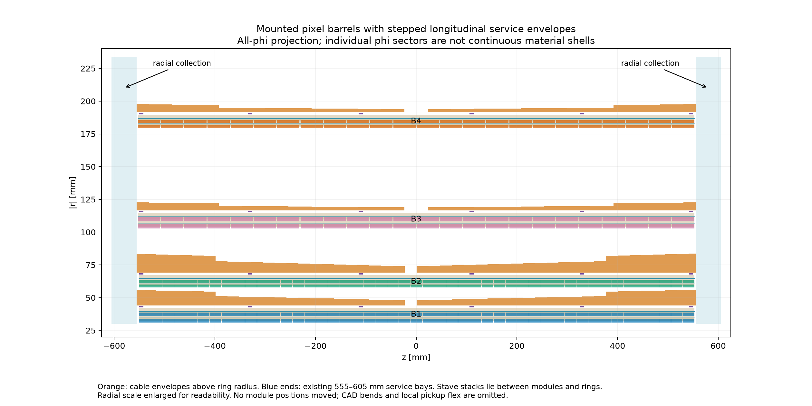
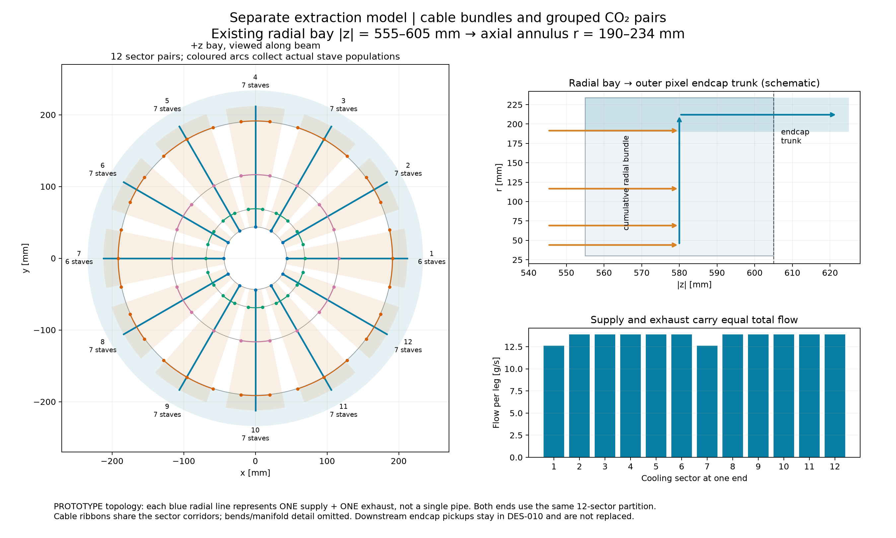

# DES-002 — Cumulative cables and sector cooling

Status: **PROTOTYPE**, 2026-09-30. [Routing request](https://github.com/asalzburger/nodd/pull/29#issuecomment-5911262892).
Governing choices: [DES-002 PS-C15–C19 / PS-I09](../../../design/DES-002-pixel-barrel-support-cooling.md#cable-bundles-and-twelve-sector-cooling-extraction).

## Recommendation and limits

Use outward stepped bundles, with **12 cooling sectors per end (24 feed/exhaust
pairs total)**. Keep the existing 164 independent counterflow evaporators; each
stave contributes one feed and one exhaust at each end. Module positions, rings,
feet and the selected baseline remain unchanged. This is a repeatable simulation
geometry proposal, not a complete solid model or engineering qualification.

**The reference cable scenario fits the sufficient radial envelope screen and
sector capacity screens. Conservative and stress scenarios fail.** In particular,
B1 has only 1.778 mm nominal reference clearance to B2. Do not approve these
spaces without settling cable aggregation/composition and cooling hydraulics.
A failed all-phi bound denotes a potential overlap, not an exact wedge/body
intersection. The adverse scenarios also exceed finite route capacity, a separate
failure. No gap or module placement was changed to hide it.

## Drawings







| View | PNG | PDF | SVG |
| --- | --- | --- | --- |
| barrel-B1 | [PNG](barrel-B1.png) | [PDF](barrel-B1.pdf) | [SVG](barrel-B1.svg) |
| barrel-B2 | [PNG](barrel-B2.png) | [PDF](barrel-B2.pdf) | [SVG](barrel-B2.svg) |
| barrel-B3 | [PNG](barrel-B3.png) | [PDF](barrel-B3.pdf) | [SVG](barrel-B3.svg) |
| barrel-B4 | [PNG](barrel-B4.png) | [PDF](barrel-B4.pdf) | [SVG](barrel-B4.svg) |
| barrel-all | [PNG](barrel-all.png) | [PDF](barrel-all.pdf) | [SVG](barrel-all.svg) |
| cable-accumulation | [PNG](cable-accumulation.png) | [PDF](cable-accumulation.pdf) | [SVG](cable-accumulation.svg) |
| barrels-rz | [PNG](barrels-rz.png) | [PDF](barrels-rz.pdf) | [SVG](barrels-rz.svg) |
| radial-extraction | [PNG](radial-extraction.png) | [PDF](radial-extraction.pdf) | [SVG](radial-extraction.svg) |

The x–y cuts are at z=+110 mm and show actual accumulated load there, not the
larger end bundle. The ring overflight extends along the whole stave in this
effective geometry. The all-phi |r|–z projection is not a solid cable annulus;
radial scale is enlarged. The extraction drawing shows shortest azimuthal
collection arcs and the existing radial bay; lines represent bundles. It is a
topology view, not a packing proof or a manifold CAD model.

## Counts and geometry

All 2,750 physical barrel modules / 6,206 chips are assigned exactly once to
164 half-stave groups and 328 ancillary chains. Modules at z≥0 route to +z.
Ancillary supply AND return are already included in the 35 mm² chain footprint.
The 47-row single-chip staves have unequal 23/24-module halves; there is no
assumed perfect end symmetry for electrical loads. Chains start at the inner
module and are capped at 16 modules and 32 chips. A chain's full transport bundle
starts at its first pickup; serial jumpers and local module flex are not resolved.
Each module adds data and command links. Modules are not pooled across staves.

| Layer | Staves | Modules | Chains, both ends | Reference cable radii, maximum [mm] | Gap to next barrel body [mm] |
| --- | --- | --- | --- | --- | --- |
| B1 | 12 | 564 | 48 | 44.016–56.030 | 1.778 |
| B2 | 22 | 1034 | 88 | 69.104–83.540 | 19.182 |
| B3 | 18 | 432 | 72 | 116.633–122.636 | 56.987 |
| B4 | 30 | 720 | 120 | 191.483–197.634 | 54.610 |

An annular sector covers the inherited available fraction of each stave pitch.
Its transverse area is exactly raw cable footprint × demand multiplier / packing.
Ring radii +0.5 mm define its inner edge. Ring/foot/stave radial containment and
next-layer minimum body radii prove the nominal reference envelope clear; the
obsolete inward DES-010 pixel support reservations are not actual outward-A
structures. The unresolved global end brackets and new clips are not checked. The finite
reference radial and axial extraction envelopes also have zero intersections
with all baseline module r–z bounds. This excludes the unmodeled gathering
solids and manifold hardware; it is not a full solid-model overlap claim.

## Finite extraction capacity

Capacity uses actual sector populations, not a total divided by twelve. Each
successive radial interval adds the layer that joins there. Available radial
area is r_min × sector angle × (50−2×2) mm; axial capacity uses the exact sector
area of the 190–234 mm trunk after 2 mm boundary allowances. Cable and both pipe
legs are included, with the inherited packing, phi and spare-demand scenario.
The following axial figures are **barrel contribution only at the bay exit**,
not certification of downstream endcap plus barrel loading.

| Scenario | Barrel radial bound | Worst radial capacity used | Worst axial capacity used |
| --- | --- | --- | --- |
| reference | pass | 68.8% | 54.4% |
| conservative | FAIL / potential overlap | 164.6% | 147.8% |
| stress | FAIL / potential overlap | 276.7% | 259.3% |

The most populated sector has 7 staves; the least has
6. Each grouped feed/exhaust outer diameter is
4√N mm: 9.798–10.583 mm at the outer handoff.
This preserves the upstream 4 mm branch footprints; it does **not** establish a
two-phase exhaust bore, pressure drop or pressure-vessel wall.

Total circulation remains 328.4 g/s. Each end supplies and returns
164.2 g/s; individual sector legs carry
12.6–13.9 g/s.
Nominal sector exhaust heat is 642.4–705.6 W;
the +50% / 2:1 imbalance screen gives up to 1411.2 W at one exhaust.
Do not sum the worst imbalance at both ends as an extra physical heat source.
The earlier local energy balance is unchanged; collection does not qualify flow
sharing. Twelve sectors are a routing partition, not twelve independent detector
evaporators or an established failure-isolation system.

## Material accounting for later full simulation

Integrate footprint × route length by cable class. The reference model gives
**5.8110 litres ancillary footprint and
2.4694 litres data/command footprint**, through
|z|=605 mm, including idealized collection paths. These are cable outer-envelope
volumes, **not solid copper volumes or masses**. The reserve multiplier adds
space, not unobserved matter. Longitudinal envelopes preserve these volumes with
component fraction packing/demand_multiplier × the supplied cable composition.
For radial wedges, normalize each component by its integrated footprint volume
divided by the actual sector volume; constant upstream depth reserves extra area
as radius grows. Wedge turns must be unioned/partitioned before solid construction.

Cable composition and mass are deliberately null in the export: the inherited
35 mm² prototype bundle gives no conductor or insulation inventory. Assigning the
unrelated 9 µm Cu / 35 µm polyimide local flex to it would invent material. Supply a
cable bill of materials before creating a production effective material. This
missing input prevents a qualified full-simulation material result today.

A separate provisional 0.15 mm Ti wall screen for the transport network gives
**281.74 g Ti** and **676.30 g full-liquid CO₂ upper bound**.
These additions exclude the already-counted 164 local evaporators. The grouped
pair wall area is recalculated from its larger OD, not copied from the sum of
branch walls. The idealized length inventory includes axial stubs, shortest phi
arcs, radial branches/collectors and the axial handoff. Manifold blocks, fittings,
local module flex, clips/trays, connectors and bend excess remain additional;
this is not total service mass. Liquid filling is a mass bound, not operating
mixture density. The wall is not warm-pressure certified.

## Reproduction and validation scope

```sh
MPLCONFIGDIR=/tmp/nodd-des002-mpl python3 -B tools/pixel_support/services.py
python3 -B -m unittest discover -s tools/pixel_support -p 'test_*.py' -v
```

[screening.json](screening.json) holds numerical results, source revision, exact
hashes, versions and command. [routing.json.gz](routing.json.gz) contains stable
IDs, module ownership, all three longitudinal scenarios, finite radial segments,
gathering path lengths, flow and material-accounting contracts. Its geometry is
an additive prototype, not wired into DD4hep. [artifacts.json](artifacts.json)
identifies the producer and every generated artifact. Earlier three evidence
sets remain unchanged. Checks cover module conservation, chain rounding,
monotonic accumulation, independent volume integration, uneven sector loading,
counterflow totals, envelope-area inversion and explicit failing scenarios.
No Geant4, ACTS, tracking gain, complete solid-model overlap check, material scan,
FEA or hydraulic test is claimed.
