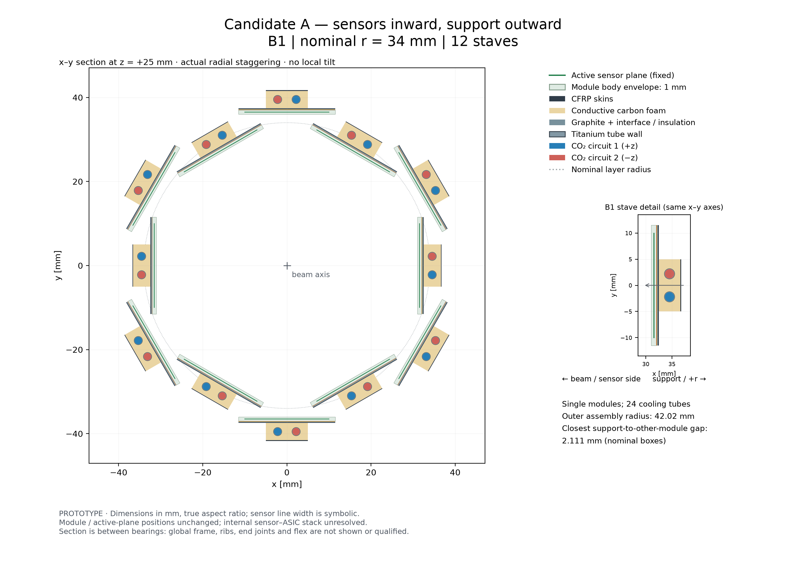
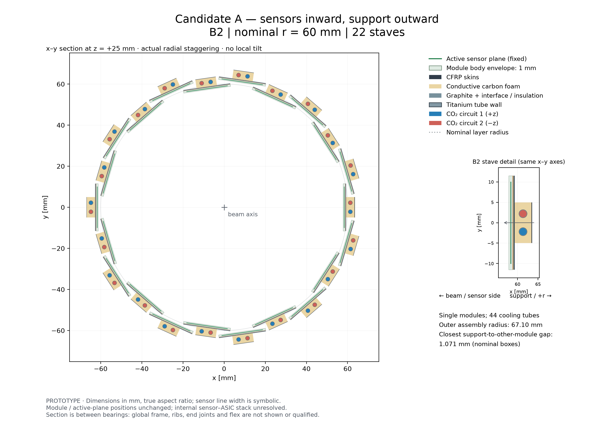
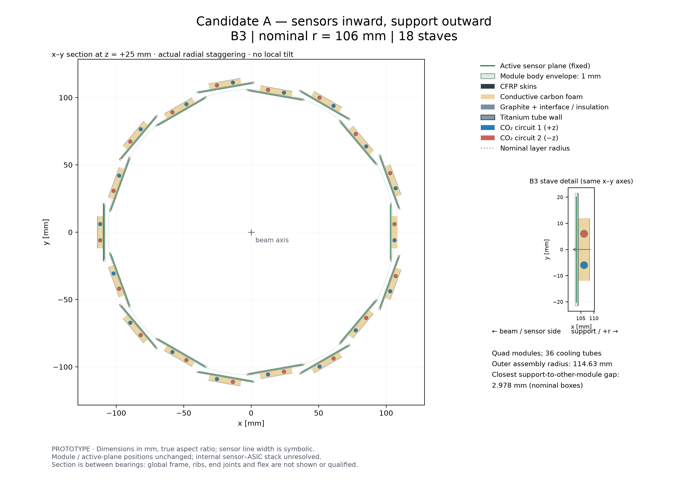
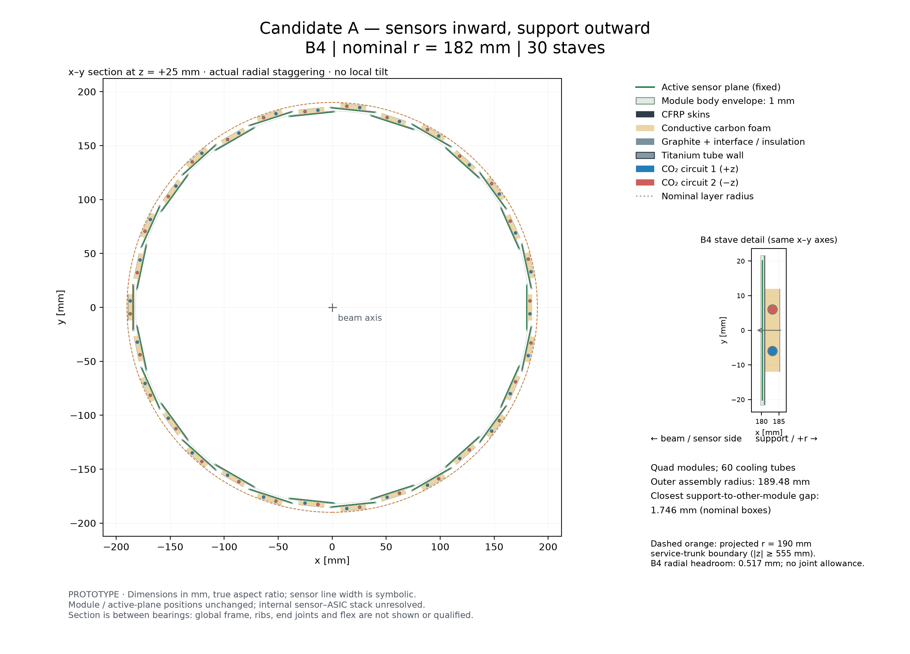

# DES-002 — Candidate A, outward support assembly

Status: **PROTOTYPE**, 2026-09-30. This responds to the human request for four
individual full-barrel x–y drawings and a combined assembly with sensors facing
inward. It implements proposed PS-C11/C12 in [DES-002](../../../design/DES-002-pixel-barrel-support-cooling.md),
without changing sensitive positions or recording engineering sign-off.

## Drawings

All sections are at **z = +25 mm**, which intersects one module on every stave.
B1/B2 each show one active chip patch per stave; B3/B4 show two patches per stave
at this cut through their quad modules. Two cooling tubes run along every stave.
All lengths and aspect ratios are to scale; the sensor line width is symbolic.


| View | Nominal radius | Staves | Cooling tubes | Downloads |
| --- | --- | --- | --- | --- |
| B1 | 34 mm | 12 | 24 | [PNG](barrel-B1.png) · [PDF](barrel-B1.pdf) · [SVG](barrel-B1.svg) |
| B2 | 60 mm | 22 | 44 | [PNG](barrel-B2.png) · [PDF](barrel-B2.pdf) · [SVG](barrel-B2.svg) |
| B3 | 106 mm | 18 | 36 | [PNG](barrel-B3.png) · [PDF](barrel-B3.pdf) · [SVG](barrel-B3.svg) |
| B4 | 182 mm | 30 | 60 | [PNG](barrel-B4.png) · [PDF](barrel-B4.pdf) · [SVG](barrel-B4.svg) |
| Combined | — | 82 | 164 | [PNG](barrel-all.png) · [PDF](barrel-all.pdf) · [SVG](barrel-all.svg) |






The green lines retain the baseline active-plane coordinates. Light green shows
the 1 mm module body envelope. Its internal sensor/ASIC laminate is unresolved;
the drawing does not pretend that the sensitive plane lies at the body's innermost
face. The stave is attached to the outward module face, with the proposed sensor
side directed towards the beam. Opposite throughflows are blue/red; these colours
identify circuits, not measured temperatures or liquid/vapour phases.

## Geometry screen and implications

**PS-I06 — INFERENCE:** attach the unchanged 4.725 mm A stack to each module's
outward (+normal) face. Its first 0.475 mm spans the full module width; the
4.25 mm core/back skin use a 10 mm single or 24 mm quad spine. Retain all
radial stagger levels, azimuths, rows and active patches from the exact selected
PR #28 geometry (baseline identity and caveat concerning PR #26 are in DES-002).
The whole barrel still has 2750 modules; only its transverse section is drawn.

Intersect two bounding rectangles per stave against all other module/support
rectangles, including other layers, using the existing OBB separating-axis test
(numerical tolerance 10⁻⁷ mm). Compute minimum Euclidean edge distances in x–y
and the maximum corner radius. Cross-sections repeat along the uninclined,
z-uniform module columns. This supports a local nominal-fit claim, not full
three-dimensional assembly clearance. Intended contacts with each stave's own
module and between stack layers are excluded from conflict counts.

| Layer | Outermost assembly radius | Minimum support → other module gap | Minimum support → other support gap |
| --- | --- | --- | --- |
| B1 | 42.016 mm | 2.111 mm | 3.111 mm |
| B2 | 67.104 mm | 1.071 mm | 1.487 mm |
| B3 | 114.633 mm | 2.978 mm | 3.978 mm |
| B4 | 189.483 mm | 1.746 mm | 2.746 mm |

**Result:** zero nominal support/module or support/support intersections among
the 82 stave columns. No geometric tolerance inflation is applied. All pipe
circles fit within their foam-core envelopes. A deliberately full-width thick
spine produces conflicts, providing a positive control for the narrow-spine choice.

B4 leaves only **0.517 mm radial headroom** to the **projected** 190 mm inner
radius of the pixel service trunk. That trunk starts at |z| = 555 mm and is not
present at this cut; the dashed orange circle is a reference projection. This
number is not a certified joint or assembly clearance. End fittings, bearings,
flex and the local-to-transport pipe transition must be designed before accepting
the outward envelope. The baseline's inward annular support reservations remain
unchanged and do not contain the proposed outward supports. The shared ring/frame
load path must be reconsidered accordingly; no ring is drawn at z = 25 mm because
the proposed bearings lie at other z positions.

The local stack quantities and flow/power assumptions are unchanged from the
[earlier screening report](../results.md), so their arithmetic is retained.
Its inward clearance result and illustrative inward rib mass are **not** transferred
to this orientation. No new thermal, hydraulic, mechanical FEA, material scan or
ACTS tracking result is claimed. In particular, any tracking benefit remains to
be measured with the complete passive geometry.

## Reproduction and checks

Starting revision: `f0ebdc4707aded2c0b774f73d2bf87409f1fce71`.
Exact baseline/producer hashes, Python/Matplotlib versions, command, numeric
tolerance and unrounded values are in [screening.json](screening.json).
[artifacts.json](artifacts.json) records all 15 drawing files and the screen.
The original inward evidence and its hashes are preserved unchanged.

```sh
MPLCONFIGDIR=/tmp/nodd-des002-mpl python3 -B tools/pixel_support/outward.py
python3 -B -m unittest discover -s tools/pixel_support -p 'test_*.py' -v
```

The controls verify unchanged input geometry, outward placement, full stave/pipe
inventory and pipe containment, reject cuts through module gaps and nonuniform
columns, and test clearance distances against analytic rotated boxes. The
existing four thermal/material/beam-screen controls also remain applicable.
