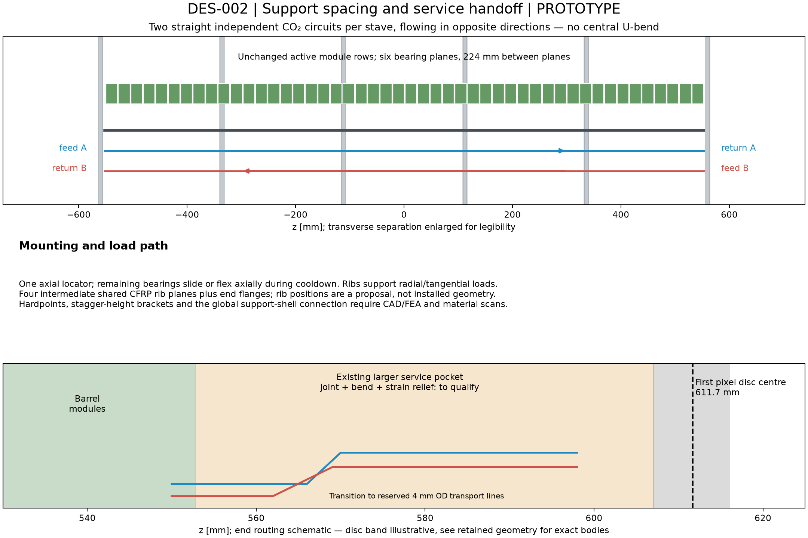

# DES-002 — Pixel barrel support screening

**PROTOTYPE, 2026-09-30.** [Design and source facts](../../design/DES-002-pixel-barrel-support-cooling.md). No production changes. The selected PR #28 geometry is fixed; PR #26 is infrastructure. These are calculations and box checks, not FEA, hydraulic simulation or bench measurements.

## Recommendation

Prototype **A: narrow carbon-foam/CFRP sandwich stave with evaporative CO₂** first. Keep **B: hollow CFRP box with localized foam saddles** as the second, material-reduction candidate. Both preserve module positions and use a full-width thin thermal plate. The small material difference does not yet justify relying on smaller thermal contacts, particularly for the single-chip staves. The proposed 30% net-foam allowance for B is optimistic until saddle geometry, glue and contact conductance are demonstrated.

## Actual barrel inventory and cooling load

Loads use the inherited 2.688 W/chip proxy (0.7 W/cm² over3.84cm²). The stress case is1.5×, with no second service-power addition.

| Layer radius, mm | Staves | Family / modules per stave | Modules | Layer nominal power, kW | Stave nominal/stress, W | Circuits |
| --- | ---: | --- | ---: | ---: | ---: | ---: |
| 34 | 12 | single / 47 | 564 | 1.516 | 126.3 / 189.5 | 24 |
| 60 | 22 | single / 47 | 1034 | 2.779 | 126.3 / 189.5 | 44 |
| 106 | 18 | quad / 24 | 432 | 4.645 | 258.0 / 387.1 | 36 |
| 182 | 30 | quad / 24 | 720 | 7.741 | 258.0 / 387.1 | 60 |

Total: **82 staves,2750 modules,6206 chips;16.682kW nominal and25.023kW stress**. Each stave has two independent full-length circuits flowing in opposite directions,164circuits total. One feed and one exhaust per stave at each end preserve the endpoint port counts of the earlier two-half-stave grouping. This refines the hydraulic topology; it does not claim the earlier grouping was a qualified cooling design. Preserve the4mmOD transport reservations and full detector-wide inventory.

At−35°C, NIST saturation enthalpies give313.18J/g latent heat and12.024bar equilibrium pressure. Flows proposed for testing are1.3g/s per inner tube and2.5g/s per outer tube (total328.4g/s). With inlet quality0.10, +50% heat and a2:1 split between tubes, exit quality is0.410 for inner and0.430 for outer circuits, below the proposed0.45 cap. Maximum branch loads126.3/258.0W stay below the inherited300W grouping ceiling. Mass flux is approximately522/509kg/(m²s).

**These are energy-balance results.** They do not establish available pump head, two-phase pressure drop, boiling onset, flow sharing or dry-out. Restrictors/manifolds and tube/joint pressure design need qualification, including warm conditions. Losing one circuit is not an accepted full-power operating mode; interlock the affected stave.

## Thermal path

The calculated conduction terms are8.20Kcm²/W for singles and10.69Kcm²/W for quads. These use proposed interface/insulation/graphite values and transverse CFRP conduction; they omit tube contact, foam constriction, boiling resistance and hot spots. They are lower-bound budgets, not achieved TFM. The separate end-to-end acceptance target is≤15Kcm²/W: if measured, it would give−19.25°C sensor temperature under uniform1.05W/cm² stress at−35°C coolant. The remaining4.25K margin to the proposed−15°C limit must cover uncertainty and nonuniformity. Irradiated leakage/runaway safety is still unassessed.

IBL provides a constructed carbon-foam/titanium comparator with measuredTFM around14Kcm²/W; ITk documentation shows why chip-periphery heating and thermal cycling must also be tested. We do not transfer that measured performance to either nODD candidate.

## Material and bending comparison

X0 is the normal-incidence, width-averaged **local support** contribution: CFRP, graphite, foam, assumed bondlines, insulation and both titanium tubes. “Filled” adds a full-liquid coolant upper bound. It excludes sensor/ASIC, flex, connectors, hardpoints, end flanges and shared ribs. It is not a full pixel-layer material budget.

| Module / candidate | Solid support, %X0 | With liquid, %X0 | Sag at250mm, µm | Sag sensitivity, µm | First bending mode, Hz |
| --- | ---: | ---: | ---: | ---: | ---: |
| single / A | 0.645 | 0.711 | 23.4 | 12.7–41.5 | 116 |
| single / B | 0.621 | 0.687 | 20.1 | 10.8–35.9 | 125 |
| quad / A | 0.679 | 0.748 | 21.4 | 11.6–38.0 | 121 |
| quad / B | 0.627 | 0.696 | 19.3 | 10.2–34.6 | 128 |

B saves only0.024percentage points ofX0 for singles and0.052 for quads under these assumptions. The0.18mm equivalent bondlines alone contribute about0.201%X0; material effort should include adhesive control and local flex design rather than assuming foam removal dominates. Changes to bonds need matched thermal/mechanical tests.

The beam model uses effective laminateE=100GPa, varied70–140GPa, and1/4g single/quad module mass, varied±50%; tube liquid mass is included. It ignores shear, torsion, global supports, cable force and thermal distortion. At560mm spans, nominal deflection is about0.49–0.59mm; at1120mm it is7.8–9.4mm. A shallow stave supported only at its ends is therefore not a credible precision-support assumption in this screen.

Propose six bearing planes atz=−560,−336,−112,+112,+336,+560mm (224mm spacing), conservatively screen250mm spans. One axial locator and sliding/flexural remaining mounts avoid longitudinal overconstraint. A proposed50µm static-sag target survives this limited parameter screen; the5µm running stability target is **unverified**. Reported frequencies describe ideal beam bending only, not installed detector resonances. **Floating rings alone cannot create short spans:** the calculation requires an independently stiff longitudinal shell/frame carrying the bearing reactions to end flanges. Its compliance and material remain unquantified; the complete installed system has not passed the static or dynamic stability targets.

Four illustrative intermediate CFRP rib planes (8mm axial width,1mm radial thickness, all four layers) add about123g before brackets. A normal crossing through a rib adds about0.474%X0 locally; for equal-z weighting its four bands (32mm total) add about0.0135%X0 averaged over1120mm. Real track material depends on eta and z-vertex and requires directional scans. End planes, hardpoints, stagger-height brackets and global load paths are additional. No ring position is approved by this calculation.

## Geometry screen and drawings

The existing pixel support reservation is5mm inward of the innermost body envelope for each layer, not a6mm detailed stave. The proposed stack is4.725mm behind each module, using a10mm or24mm spine and a thin full-width plate. Representative boxes for all82 z-uniform columns find **zero support/module and support/support interior overlaps**. A deliberately full-width-deep-beam control produces overlaps, confirming the screen can detect the relevant collision. This checks repeated cross-sections at zero tolerance; supports for radially raised staves can extend outside the old annular shell. Hardpoints/ribs/end joints and beam-pipe tolerances remain separate CAD checks.

[Cross-section PDF](cross-sections.pdf) · [editable SVG](cross-sections.svg)

[Routing PDF](longitudinal-routing.pdf) · [editable SVG](longitudinal-routing.svg)

## Reproduction and checks

[Workflow](../../../tools/pixel_support/README.md), [inputs](../../../tools/pixel_support/inputs.json), [complete results](screening.json). Input and producer hashes, Python version and command are retained. Literature copies remain in ignored cache; precise locators and source hashes are in the catalogue.

Executed: complete baseline count/power extraction, analytic material/thermal/beam calculation, repeated-cross-section collision screen, four tests (energy conservation, changed-baseline rejection, collision positive control and span scaling), and PNG/PDF/SVG rendering. Both drawings were visually inspected. Dashboard/session checks are recorded in the session log. No ACTS/DD4hep/Geant4 job, finite-element calculation or hydraulic test was required or run; sensitive geometry is unchanged.

Next decision: approve a first thermal/mechanical prototype scope, preferably A. Before fixing dimensions, verify module power and mass, laminate properties, saddle/bond geometry, shared-rib stiffness, pressure/flow margins and warm-to-cold alignment. Both candidates remain DRAFT/PROTOTYPE.
