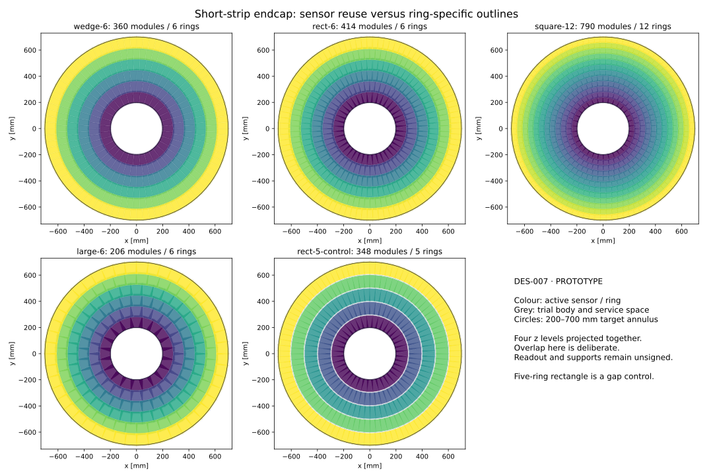

# DES-007 — Endcap module and ring comparison

- Status: PROTOTYPE analytical evidence; no detector validation or sign-off
- Date: 2026-09-25
- Source base: `58136c8adad0d10bb046bef3a574e181b7e1463c` plus working-tree inputs/script hashes in JSON
- Design: [DES-007](../design/DES-007-short-strip-modules.md)
- Inputs and reproduction: [study README](../../tools/short_strip/README.md)
- Numerical records: [4 mm margins](DES-007-ring-study.json), [initial 2 mm margins](DES-007-ring-study-initial.json)

## Result and conditional recommendation

Keep the **48 × 96 mm² active rectangle, six rings, one sensor type** as the
working reuse candidate. It gives a familiar sensor scale, one repeated module
outline, and fewer module/service interfaces than the square alternative.
Retain the **six-type wedge** as a serious lower-silicon alternative. Selection
is conditional on feasible sensor/readout tiling and a full thermal/material
account. Neither has been demonstrated manufacturable or buildable here.

All results below are **INFERENCE** from unsigned DES-007 C01–C07 and the
retained deterministic polygon calculation. Per-disk numbers cover one active
200–700 mm annulus, not a complete tracker.

| Candidate | Rings | Sensor types | Modules/disk | Active silicon / annulus | Channels/disk, 75 µm × 0.5 mm | Worst sampled missing area |
| --- | ---: | ---: | ---: | ---: | ---: | ---: |
| wedge-6 | 6 | 6 | 360 | 1.150 | 43.37 million | 0.000% |
| rect-6 | 6 | 1 | 414 | 1.349 | 50.87 million | 0.000% |
| square-12 | 12 | 1 | 790 | 1.287 | 48.54 million | 0.000% |
| large-6 | 6 | 1 | 206 | 1.343 | 50.63 million | 0.000% |
| rect-5-control | 5 | 1 | 348 | 1.134 | 42.76 million | 5.840% |

The five-ring rectangle is rejected: its radial span cannot cover the annulus
with the chosen sensor length and overlaps. Its uncovered fraction increases
when the edge margin is enlarged because the outermost ring centres move apart.
This expected failure is retained as evidence rather than hidden by the shortlist.

The large square reduces module interfaces but doubles channels per module
relative to the 48 × 96 rectangle, increases the ASIC-tiling/wafer/flatness burden
and has no demonstrated packaging advantage. The 48 mm square reduces per-module
channels but nearly doubles the number of individual service attachments.
Wedges reduce active-silicon area relative to the rectangle by
14.7%
at the cost of six sensor outlines, clipped boundary cells and unresolved custom
readout placement. Even common electronics may require different flex variants.

## Ring counts and occupied space

| Candidate | Modules by ring (inner → outer) | Trial body radial range [mm] | Projected area with multiple hits |
| --- | --- | ---: | ---: |
| wedge-6 | 32, 44, 54, 66, 76, 88 | 191.48–708.00 | 12.49% |
| rect-6 | 40, 52, 64, 74, 86, 98 | 192.50–707.92 | 28.50% |
| square-12 | 34, 40, 46, 52, 58, 62, 68, 74, 80, 86, 92, 98 | 192.50–707.92 | 23.85% |
| large-6 | 20, 26, 32, 38, 42, 48 | 192.50–709.16 | 28.21% |
| rect-5-control | 40, 56, 70, 84, 98 | 192.50–707.92 | 17.12% |

All five fixtures have zero same-level body intersections and an 11 mm total
z envelope: four centres spaced by 3 mm, each with 2 mm full body thickness.
The modules overlap in xy deliberately; distinct z levels separate them.
The body range excludes ring supports, cooling manifolds and shared services.
It therefore cannot certify clearance to neighbouring subsystems. The radial
inner body range is especially relevant near the provisional 190 mm pixel edge;
the outer range must be reconciled with the provisional 710 mm long-strip start.

## ODD reference and feature-size cost

ODD has 126 modules per disk in three rings. From the pinned factory half-
dimensions (DES-007 F02/I01), its full active trapezoid area is
1.454544 m²
per disk. This implies about
38.79 million
ideal XML cells. Boundary cells and runtime segmentation have not been counted.
It spans nominally 240–700 mm, so its count/area is a reference, not an equal-
acceptance competitor to these 200–700 mm candidates. Its 156 mm sensor length
also exceeds the proposed 96 mm module scale. More modules are therefore expected.

| Rectangular candidate cell | Ideal cells/module | Channels/disk (area estimate) | Binary second-coordinate error |
| --- | ---: | ---: | ---: |
| 75 µm × 0.5 mm | 122,880 | 50.87 million | 0.144 mm |
| 75 µm × 1 mm | 61,440 | 25.44 million | 0.289 mm |
| 75 µm × 1.5 mm | 40,960 | 16.96 million | 0.433 mm |
| 100 µm × 1.467 mm | 31,411 | 13.00 million | 0.423 mm |

The baseline rectangle has exactly 640 × 192 cells. The 1 and 1.5 mm options
also divide 96 mm exactly; the sourced CMS cell does not, so its count is only
an area estimate and requires a different edge/row design. A CMS-like cell and
ASIC interface must be considered together. With twelve endcap disks the
baseline rectangle would imply about 610 million endcap channels alone; this
multiplication is a scenario, not an authorized disk layout or electronics plan.
Power and bandwidth are unquantified. Existing strip or MPA chips are not
declared compatible. Barrel reuse is geometrically attractive but 48 × 96 mm
does not preserve ODD’s 48 × 108 mm barrel tiling; a new stave coverage study is needed.

## Failed initial margins and numerical checks

The initial 2 mm edge margins gave zero coarse projected holes for all four
main candidates, but failed displaced-vertex/stagger coverage; the large square
also had small projected gaps at finer sampling. Worst missing fractions were:

| Initial candidate | Maximum uncovered area over all scans |
| --- | ---: |
| wedge-6 | 0.1019% |
| rect-6 | 0.1140% |
| square-12 | 0.1140% |
| large-6 | 0.0617% |
| rect-5-control | 5.0501% |

The explained mechanism is footprint projection: 4.5 mm z staggering at
r = 700 mm gives a 2.69 mm shift for disk z = 1320 mm and vertex z = +150 mm.
Four-mm margins accommodate that shift and finite polygon corner curvature.
This is a physical clearance adjustment in an unsigned prototype, not an
unexplained acceptance improvement or an accepted reference replacement.

For each final candidate, 500 × 1440 and 1000 × 2880 polar grids were run
for projected coverage and three vertex positions (−150, 0, +150 mm). All four
main candidates have zero uncovered bins in all eight scans. A finite grid
can miss narrow holes; no statistical confidence or continuous proof is claimed.
There is no random seed because all sampling is deterministic.

Six unit tests pass: polygon area/containment and radial bounds, SAT controls,
convexity/unique IDs/angular search bounds, optimized-versus-brute-force global
coverage including z projection, channel arithmetic, and the rejected-layout
and body-clearance controls. The brute-force comparison covers every input
candidate on an independent 37 × 121 grid. These are analytical checks only.

Environment: Python 3.14.7, NumPy 2.4.3, Matplotlib 3.11.0.
Input/script SHA-256 and the base revision plus dirty-state inventory are in
each JSON. The surrounding Git commit identifies the retained source files.
No DD4hep, Geant4, ACTS, material scan, radiation qualification, support/thermal
simulation or complete readout design was run. Full hardware review remains open.
