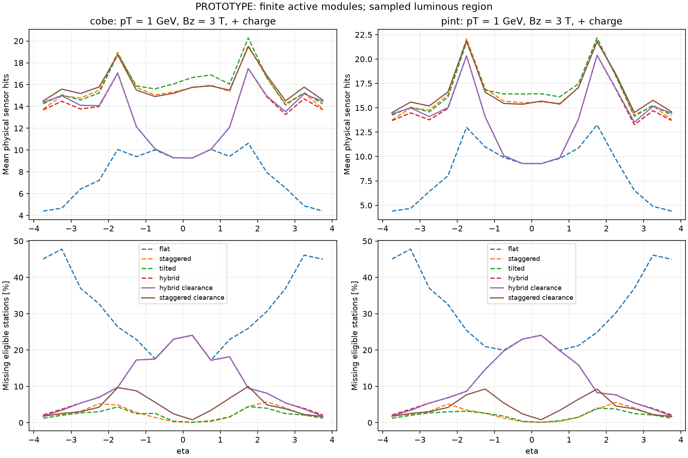
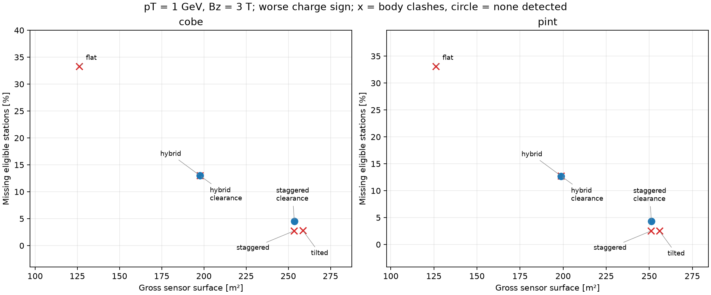
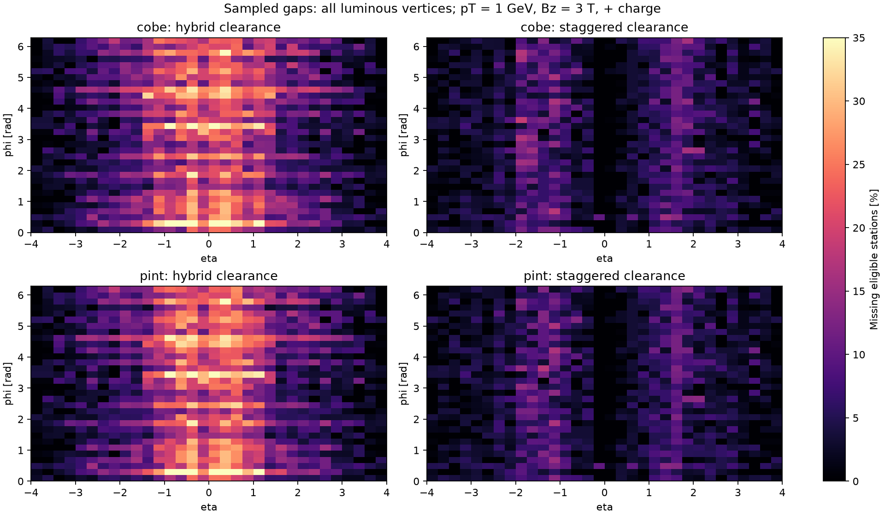

# DES-009 numerical results

**PROTOTYPE.** Draft inputs; finite sampling is not a proof of continuous hermeticity.

`coverage.csv` contains all trajectory/subdetector/region summaries; `layers.csv` retains every ideal-layer denominator and missed count. `silicon.csv` separates gross sensor surface and active readout area. `eta.csv` retains directional profiles. Exact configuration, source hashes, distributions and native ACTS audit are in `summary.json`.

## Populations and trial occupied bodies

| Layout | Modules | Sensors | Gross / active m² | Body clashes | Host overruns |
| --- | ---: | ---: | ---: | ---: | ---: |
| cobe-flat-mixed | 15005 | 19642 | 126.19 / 123.10 | 5304 | 0 |
| cobe-staggered-mixed | 27528 | 37680 | 253.42 / 247.38 | 13807 | 0 |
| cobe-tilted-mixed | 28050 | 38400 | 258.57 / 252.41 | 21366 | 0 |
| cobe-hybrid-mixed | 21899 | 29572 | 197.56 / 192.80 | 216 | 0 |
| cobe-hybrid_clearance-mixed | 21971 | 29644 | 197.67 / 192.91 | 0 | 0 |
| cobe-staggered_clearance-mixed | 27600 | 37752 | 253.54 / 247.49 | 0 | 0 |
| pint-flat-mixed | 15005 | 19642 | 126.19 / 123.10 | 7956 | 0 |
| pint-staggered-mixed | 27044 | 37196 | 251.12 / 245.15 | 13555 | 0 |
| pint-tilted-mixed | 27482 | 37832 | 255.88 / 249.80 | 17894 | 0 |
| pint-hybrid-mixed | 22151 | 29824 | 198.75 / 193.96 | 216 | 0 |
| pint-hybrid_clearance-mixed | 22223 | 29896 | 198.87 / 194.07 | 0 | 0 |
| pint-staggered_clearance-mixed | 27116 | 37268 | 251.24 / 245.26 | 0 | 0 |

Body clashes reject the particular trial support envelope; absence of clashes is not full support/services validation.

## Total reachable hits and sampled coverage

Modes: straight = no field; positive/negative = pT = 1 GeV, Bz = 3 T, charge ±1. Means include every sampled direction. Station counts require a complete same-module pair for long strips.

| Layout | Mode | Sensor hits min / mean | Stations min / mean | Missing eligible stations % | Tracks with all eligible stations % |
| --- | --- | ---: | ---: | ---: | ---: |
| cobe-flat-mixed | straight | 0 / 7.40 | 0 / 6.56 | 33.62 | 2.86 |
| cobe-flat-mixed | positive | 0 / 7.69 | 0 / 6.80 | 31.09 | 2.91 |
| cobe-flat-mixed | negative | 0 / 7.49 | 0 / 6.59 | 33.30 | 1.79 |
| cobe-staggered-mixed | straight | 7 / 15.90 | 5 / 9.73 | 2.74 | 77.04 |
| cobe-staggered-mixed | positive | 7 / 15.65 | 6 / 9.73 | 2.73 | 76.70 |
| cobe-staggered-mixed | negative | 7 / 15.48 | 5 / 9.73 | 2.68 | 77.01 |
| cobe-tilted-mixed | straight | 8 / 15.97 | 5 / 9.77 | 2.37 | 79.35 |
| cobe-tilted-mixed | positive | 7 / 15.97 | 5 / 9.78 | 2.28 | 79.73 |
| cobe-tilted-mixed | negative | 7 / 15.25 | 5 / 9.72 | 2.81 | 75.52 |
| cobe-hybrid-mixed | straight | 2 / 13.15 | 2 / 8.73 | 12.69 | 34.82 |
| cobe-hybrid-mixed | positive | 4 / 13.19 | 4 / 8.91 | 10.96 | 38.35 |
| cobe-hybrid-mixed | negative | 5 / 12.95 | 5 / 8.70 | 13.02 | 33.16 |
| cobe-hybrid_clearance-mixed | straight | 2 / 13.34 | 2 / 8.71 | 12.95 | 35.10 |
| cobe-hybrid_clearance-mixed | positive | 4 / 13.41 | 4 / 8.92 | 10.90 | 38.88 |
| cobe-hybrid_clearance-mixed | negative | 5 / 13.12 | 5 / 8.70 | 12.99 | 33.41 |
| cobe-staggered_clearance-mixed | straight | 4 / 16.13 | 2 / 9.56 | 4.88 | 63.82 |
| cobe-staggered_clearance-mixed | positive | 7 / 15.87 | 5 / 9.60 | 4.55 | 64.13 |
| cobe-staggered_clearance-mixed | negative | 8 / 15.75 | 5 / 9.61 | 4.36 | 65.77 |
| pint-flat-mixed | straight | 0 / 8.09 | 0 / 6.66 | 33.26 | 2.85 |
| pint-flat-mixed | positive | 0 / 8.39 | 0 / 6.88 | 30.97 | 2.97 |
| pint-flat-mixed | negative | 0 / 8.19 | 0 / 6.67 | 33.11 | 1.89 |
| pint-staggered-mixed | straight | 7 / 16.63 | 5 / 9.81 | 2.57 | 78.23 |
| pint-staggered-mixed | positive | 7 / 16.38 | 6 / 9.82 | 2.53 | 77.96 |
| pint-staggered-mixed | negative | 7 / 16.21 | 5 / 9.81 | 2.49 | 78.20 |
| pint-tilted-mixed | straight | 8 / 16.68 | 5 / 9.86 | 2.18 | 80.68 |
| pint-tilted-mixed | positive | 7 / 16.62 | 5 / 9.87 | 2.09 | 81.04 |
| pint-tilted-mixed | negative | 7 / 16.00 | 5 / 9.82 | 2.53 | 77.40 |
| pint-hybrid-mixed | straight | 2 / 13.99 | 2 / 8.85 | 12.10 | 36.54 |
| pint-hybrid-mixed | positive | 4 / 14.01 | 4 / 9.00 | 10.74 | 39.52 |
| pint-hybrid-mixed | negative | 4 / 13.77 | 4 / 8.79 | 12.75 | 33.94 |
| pint-hybrid_clearance-mixed | straight | 2 / 14.18 | 2 / 8.83 | 12.36 | 36.82 |
| pint-hybrid_clearance-mixed | positive | 4 / 14.22 | 4 / 9.01 | 10.68 | 40.06 |
| pint-hybrid_clearance-mixed | negative | 4 / 13.94 | 4 / 8.80 | 12.71 | 34.19 |
| pint-staggered_clearance-mixed | straight | 4 / 16.86 | 2 / 9.65 | 4.60 | 65.22 |
| pint-staggered_clearance-mixed | positive | 7 / 16.58 | 5 / 9.69 | 4.29 | 65.11 |
| pint-staggered_clearance-mixed | negative | 8 / 16.46 | 5 / 9.70 | 4.12 | 66.83 |

## Per subdetector for the clearance variants

Each triplet is straight / positive / negative. Areas count both long-strip faces and count a pixel sensor only once across its active islands.

| Layout | Subdetector | Gross m² | Mean sensor hits | Missing eligible stations % |
| --- | --- | ---: | ---: | ---: |
| cobe-hybrid_clearance-mixed | pixel | 5.51 | 6.28 / 6.53 / 6.26 | 17.38 / 14.67 / 18.40 |
| cobe-hybrid_clearance-mixed | short_strip | 47.77 | 4.10 / 4.03 / 4.02 | 7.11 / 5.23 / 5.59 |
| cobe-hybrid_clearance-mixed | long_strip | 144.39 | 2.96 / 2.84 / 2.85 | 10.75 / 11.07 / 10.98 |
| cobe-staggered_clearance-mixed | pixel | 6.68 | 7.67 / 7.85 / 7.80 | 8.48 / 7.71 / 7.39 |
| cobe-staggered_clearance-mixed | short_strip | 55.82 | 4.77 / 4.58 / 4.56 | 0.91 / 0.85 / 0.81 |
| cobe-staggered_clearance-mixed | long_strip | 191.04 | 3.69 / 3.44 / 3.39 | 0.79 / 1.57 / 1.46 |
| pint-hybrid_clearance-mixed | pixel | 5.51 | 6.28 / 6.53 / 6.26 | 17.38 / 14.67 / 18.40 |
| pint-hybrid_clearance-mixed | short_strip | 48.97 | 4.94 / 4.84 / 4.84 | 5.45 / 4.61 / 4.81 |
| pint-hybrid_clearance-mixed | long_strip | 144.39 | 2.96 / 2.84 / 2.85 | 10.75 / 11.07 / 10.98 |
| pint-staggered_clearance-mixed | pixel | 6.68 | 7.67 / 7.85 / 7.80 | 8.48 / 7.71 / 7.39 |
| pint-staggered_clearance-mixed | short_strip | 53.52 | 5.49 / 5.29 / 5.27 | 0.10 / 0.11 / 0.14 |
| pint-staggered_clearance-mixed | long_strip | 191.04 | 3.69 / 3.44 / 3.39 | 0.79 / 1.57 / 1.46 |

## Pixel-family and outline controls

All control rows use the same smaller sample, including a mixed baseline; do not subtract them from the denser main sample. Strip geometry is unchanged. The body-clash column refers to pixels only; these controls retain the original uncorrected stagger levels.

| Control | Pixel modules | Pixel gross / active m² | Pixel station loss %, straight / + / − | Pixel body clashes |
| --- | ---: | ---: | ---: | ---: |
| cobe-staggered-single | 15900 | 6.74 / 6.11 | 4.20 / 4.17 / 4.21 | 13686 |
| cobe-staggered-double | 7968 | 6.63 / 6.12 | 5.10 / 4.75 / 5.07 | 9228 |
| cobe-staggered-quad | 3996 | 6.52 / 6.14 | 5.01 / 4.30 / 4.46 | 4458 |
| cobe-staggered-mixed-control | 5632 | 6.56 / 6.14 | 4.78 / 4.29 / 4.35 | 6877 |
| cobe-staggered-small_gaps | 5680 | 6.43 / 6.22 | 4.30 / 3.80 / 3.83 | 6967 |
| cobe-staggered-large_gaps | 5596 | 6.96 / 6.09 | 5.55 / 5.31 / 5.43 | 7201 |
| pint-staggered-single | 15900 | 6.74 / 6.11 | 4.20 / 4.17 / 4.21 | 13686 |
| pint-staggered-double | 7968 | 6.63 / 6.12 | 5.10 / 4.75 / 5.07 | 9228 |
| pint-staggered-quad | 3996 | 6.52 / 6.14 | 5.01 / 4.30 / 4.46 | 4458 |
| pint-staggered-mixed-control | 5632 | 6.56 / 6.14 | 4.78 / 4.29 / 4.35 | 6877 |
| pint-staggered-small_gaps | 5680 | 6.43 / 6.22 | 4.30 / 3.80 / 3.83 | 6967 |
| pint-staggered-large_gaps | 5596 | 6.96 / 6.09 | 5.55 / 5.31 / 5.43 | 7201 |

## Native ACTS audit

Passing case audits: 24 / 24. See exact track lists, actual runtime provenance and mismatches in summary.json; NOT RUN is not a pass.

