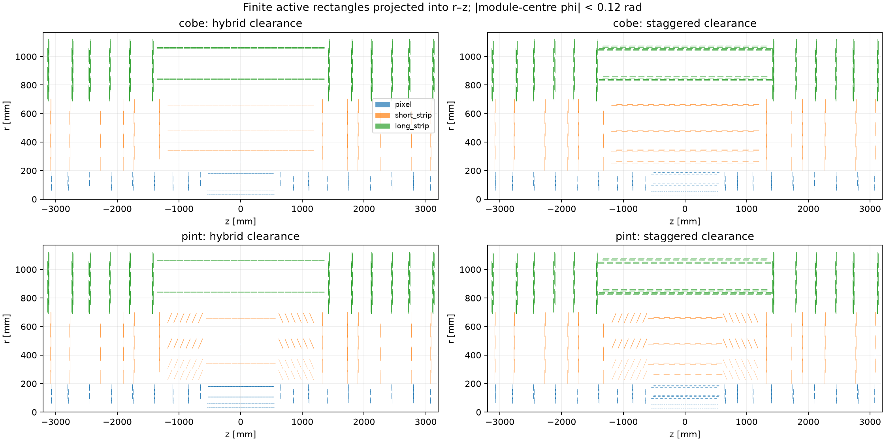
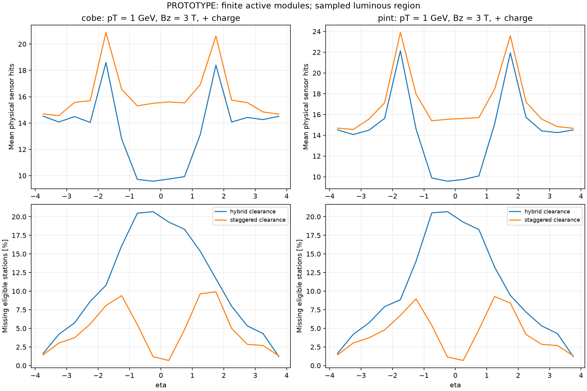
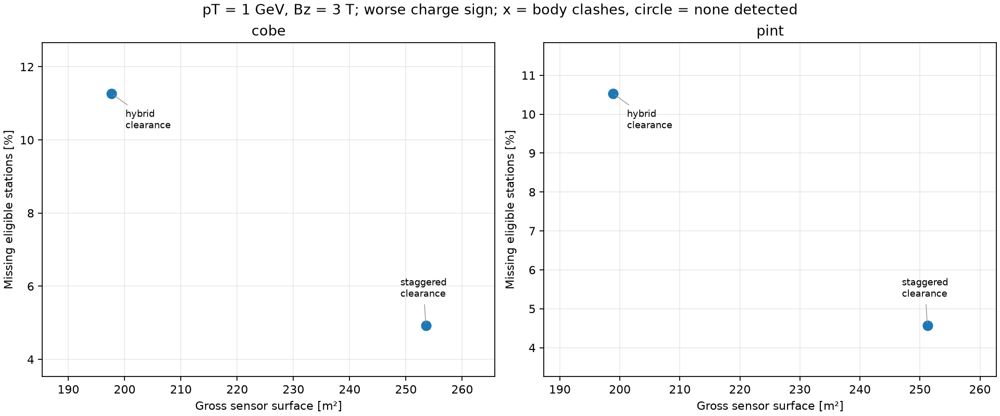
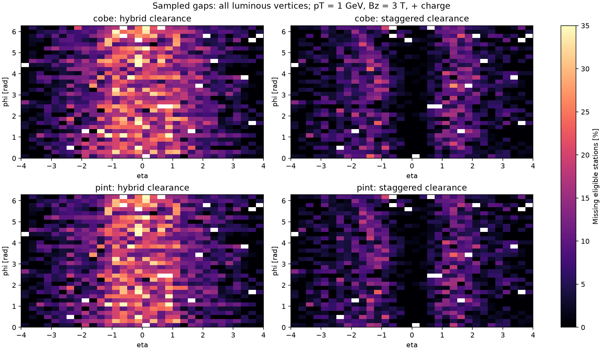

# DES-009 numerical results

**PROTOTYPE.** Draft inputs; finite sampling is not a proof of continuous hermeticity.

`coverage.csv` contains all trajectory/subdetector/region summaries; `layers.csv` retains every ideal-layer denominator and missed count. `silicon.csv` separates gross sensor surface and active readout area. `eta.csv` retains directional profiles. Exact configuration, source hashes, distributions and native ACTS audit are in `summary.json`.

## Populations and trial occupied bodies

| Layout | Modules | Sensors | Gross / active m² | Body clashes | Host overruns |
| --- | ---: | ---: | ---: | ---: | ---: |
| cobe-hybrid_clearance-mixed | 21971 | 29644 | 197.67 / 192.91 | 0 | 0 |
| cobe-staggered_clearance-mixed | 27600 | 37752 | 253.54 / 247.49 | 0 | 0 |
| pint-hybrid_clearance-mixed | 22223 | 29896 | 198.87 / 194.07 | 0 | 0 |
| pint-staggered_clearance-mixed | 27116 | 37268 | 251.24 / 245.26 | 0 | 0 |

Body clashes reject the particular trial support envelope; absence of clashes is not full support/services validation.

## Total reachable hits and sampled coverage

Modes: straight = no field; positive/negative = pT = 1 GeV, Bz = 3 T, charge ±1. Means include every sampled direction. Station counts require a complete same-module pair for long strips.

| Layout | Mode | Sensor hits min / mean | Stations min / mean | Missing eligible stations % | Tracks with all eligible stations % |
| --- | --- | ---: | ---: | ---: | ---: |
| cobe-hybrid_clearance-mixed | straight | 4 / 13.43 | 3 / 9.04 | 10.95 | 37.18 |
| cobe-hybrid_clearance-mixed | positive | 4 / 13.55 | 4 / 9.07 | 10.96 | 37.23 |
| cobe-hybrid_clearance-mixed | negative | 4 / 13.48 | 3 / 9.04 | 11.27 | 36.35 |
| cobe-staggered_clearance-mixed | straight | 7 / 16.07 | 5 / 9.70 | 4.86 | 63.16 |
| cobe-staggered_clearance-mixed | positive | 6 / 16.17 | 5 / 9.74 | 4.87 | 63.55 |
| cobe-staggered_clearance-mixed | negative | 7 / 16.11 | 5 / 9.74 | 4.92 | 62.43 |
| pint-hybrid_clearance-mixed | straight | 4 / 14.34 | 3 / 9.18 | 10.25 | 38.92 |
| pint-hybrid_clearance-mixed | positive | 4 / 14.46 | 4 / 9.22 | 10.29 | 39.14 |
| pint-hybrid_clearance-mixed | negative | 4 / 14.39 | 3 / 9.19 | 10.53 | 38.75 |
| pint-staggered_clearance-mixed | straight | 7 / 16.84 | 5 / 9.81 | 4.48 | 64.92 |
| pint-staggered_clearance-mixed | positive | 6 / 16.94 | 5 / 9.85 | 4.49 | 65.38 |
| pint-staggered_clearance-mixed | negative | 7 / 16.88 | 5 / 9.84 | 4.57 | 64.04 |

## Per subdetector for the clearance variants

Each triplet is straight / positive / negative. Areas count both long-strip faces and count a pixel sensor only once across its active islands.

| Layout | Subdetector | Gross m² | Mean sensor hits | Missing eligible stations % |
| --- | --- | ---: | ---: | ---: |
| cobe-hybrid_clearance-mixed | pixel | 5.51 | 6.19 / 6.19 / 6.15 | 15.03 / 14.87 / 15.30 |
| cobe-hybrid_clearance-mixed | short_strip | 47.77 | 4.25 / 4.27 / 4.26 | 5.01 / 4.98 / 5.25 |
| cobe-hybrid_clearance-mixed | long_strip | 144.39 | 2.99 / 3.08 / 3.06 | 11.65 / 12.52 / 12.44 |
| cobe-staggered_clearance-mixed | pixel | 6.68 | 7.52 / 7.50 / 7.48 | 8.43 / 8.37 / 8.52 |
| cobe-staggered_clearance-mixed | short_strip | 55.82 | 4.76 / 4.80 / 4.80 | 1.23 / 1.14 / 1.14 |
| cobe-staggered_clearance-mixed | long_strip | 191.04 | 3.79 / 3.86 / 3.84 | 0.71 / 1.40 / 1.22 |
| pint-hybrid_clearance-mixed | pixel | 5.51 | 6.19 / 6.19 / 6.15 | 15.03 / 14.87 / 15.30 |
| pint-hybrid_clearance-mixed | short_strip | 48.97 | 5.15 / 5.19 / 5.18 | 3.14 / 3.18 / 3.27 |
| pint-hybrid_clearance-mixed | long_strip | 144.39 | 2.99 / 3.08 / 3.06 | 11.65 / 12.52 / 12.44 |
| pint-staggered_clearance-mixed | pixel | 6.68 | 7.52 / 7.50 / 7.48 | 8.43 / 8.37 / 8.52 |
| pint-staggered_clearance-mixed | short_strip | 53.52 | 5.53 / 5.57 / 5.56 | 0.20 / 0.13 / 0.18 |
| pint-staggered_clearance-mixed | long_strip | 191.04 | 3.79 / 3.86 / 3.84 | 0.71 / 1.40 / 1.22 |

## Pixel-family and outline controls

All control rows use the same smaller sample, including a mixed baseline; do not subtract them from the denser main sample. Strip geometry is unchanged. The body-clash column refers to pixels only; these controls retain the original uncorrected stagger levels.

| Control | Pixel modules | Pixel gross / active m² | Pixel station loss %, straight / + / − | Pixel body clashes |
| --- | ---: | ---: | ---: | ---: |

## Native ACTS audit

Passing case audits: 4 / 4. See exact track lists, actual runtime provenance and mismatches in summary.json; NOT RUN is not a pass.

