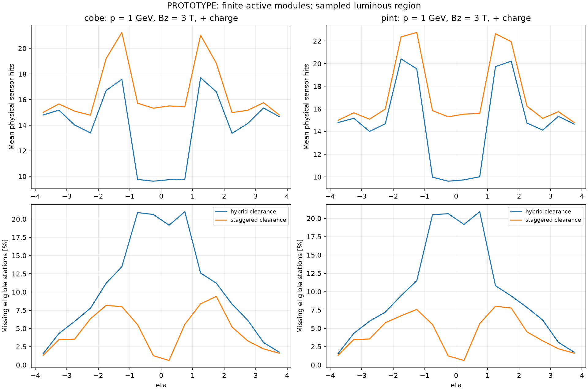
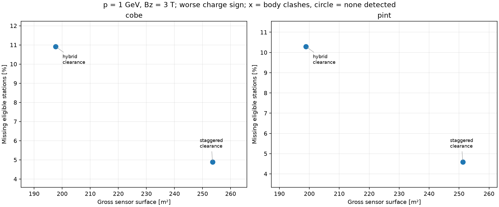
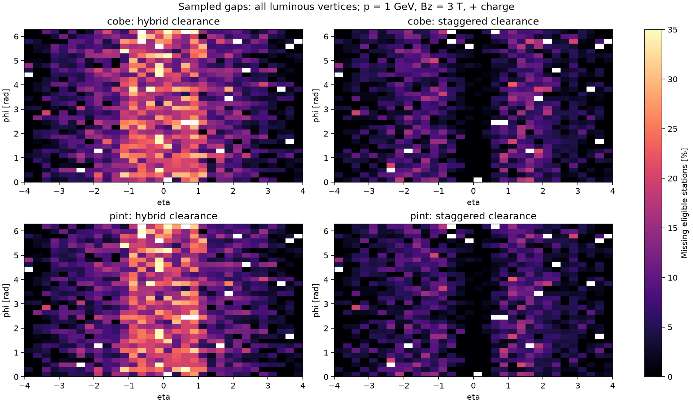

# DES-009 numerical results

**PROTOTYPE.** Draft inputs; finite sampling is not a proof of continuous hermeticity.

`coverage.csv` contains all trajectory/subdetector/region summaries; `layers.csv` retains every ideal-layer denominator and missed count. `silicon.csv` separates gross sensor surface and active readout area. `eta.csv` retains directional profiles. Exact configuration, source hashes, distributions and native ACTS audit are in `summary.json`.

## Populations and trial occupied bodies

| Layout | Modules | Sensors | Gross / active m² | Body clashes | Host overruns |
| --- | ---: | ---: | ---: | ---: | ---: |
| cobe-hybrid_clearance-mixed | 21971 | 29644 | 197.67 / 192.91 | 0 | 0 |
| cobe-staggered_clearance-mixed | 27600 | 37752 | 253.54 / 247.49 | 0 | 0 |
| pint-hybrid_clearance-mixed | 22223 | 29896 | 198.87 / 194.07 | 0 | 0 |
| pint-staggered_clearance-mixed | 27116 | 37268 | 251.24 / 245.26 | 0 | 0 |

Body clashes reject the particular trial support envelope; absence of clashes is not full support/services validation.

## Total reachable hits and sampled coverage

Modes: straight = no field; positive/negative = p = 1 GeV, Bz = 3 T, charge ±1. Means include every sampled direction. Station counts require a complete same-module pair for long strips.

| Layout | Mode | Sensor hits min / mean | Stations min / mean | Missing eligible stations % | Tracks with all eligible stations % |
| --- | --- | ---: | ---: | ---: | ---: |
| cobe-hybrid_clearance-mixed | straight | 4 / 13.43 | 3 / 9.04 | 10.95 | 37.18 |
| cobe-hybrid_clearance-mixed | positive | 5 / 13.88 | 4 / 9.26 | 10.84 | 37.48 |
| cobe-hybrid_clearance-mixed | negative | 5 / 13.85 | 4 / 9.25 | 10.91 | 36.43 |
| cobe-staggered_clearance-mixed | straight | 7 / 16.07 | 5 / 9.70 | 4.86 | 63.16 |
| cobe-staggered_clearance-mixed | positive | 7 / 16.45 | 5 / 9.93 | 4.87 | 62.16 |
| cobe-staggered_clearance-mixed | negative | 8 / 16.45 | 6 / 9.92 | 4.89 | 62.18 |
| pint-hybrid_clearance-mixed | straight | 4 / 14.34 | 3 / 9.18 | 10.25 | 38.92 |
| pint-hybrid_clearance-mixed | positive | 5 / 14.79 | 4 / 9.40 | 10.22 | 38.94 |
| pint-hybrid_clearance-mixed | negative | 4 / 14.76 | 3 / 9.39 | 10.29 | 37.94 |
| pint-staggered_clearance-mixed | straight | 7 / 16.84 | 5 / 9.81 | 4.48 | 64.92 |
| pint-staggered_clearance-mixed | positive | 8 / 17.22 | 5 / 10.04 | 4.50 | 63.50 |
| pint-staggered_clearance-mixed | negative | 8 / 17.21 | 6 / 10.03 | 4.59 | 63.23 |

## Per subdetector for the clearance variants

Each triplet is straight / positive / negative. Areas count both long-strip faces and count a pixel sensor only once across its active islands.

| Layout | Subdetector | Gross m² | Mean sensor hits | Missing eligible stations % |
| --- | --- | ---: | ---: | ---: |
| cobe-hybrid_clearance-mixed | pixel | 5.51 | 6.19 / 6.71 / 6.68 | 15.03 / 14.30 / 14.52 |
| cobe-hybrid_clearance-mixed | short_strip | 47.77 | 4.25 / 4.23 / 4.24 | 5.01 / 5.00 / 5.02 |
| cobe-hybrid_clearance-mixed | long_strip | 144.39 | 2.99 / 2.94 / 2.93 | 11.65 / 13.00 / 12.62 |
| cobe-staggered_clearance-mixed | pixel | 6.68 | 7.52 / 8.01 / 8.00 | 8.43 / 7.97 / 8.21 |
| cobe-staggered_clearance-mixed | short_strip | 55.82 | 4.76 / 4.75 / 4.76 | 1.23 / 1.16 / 1.00 |
| cobe-staggered_clearance-mixed | long_strip | 191.04 | 3.79 / 3.69 / 3.69 | 0.71 / 2.03 / 1.59 |
| pint-hybrid_clearance-mixed | pixel | 5.51 | 6.19 / 6.71 / 6.68 | 15.03 / 14.30 / 14.52 |
| pint-hybrid_clearance-mixed | short_strip | 48.97 | 5.15 / 5.14 / 5.15 | 3.14 / 3.29 / 3.31 |
| pint-hybrid_clearance-mixed | long_strip | 144.39 | 2.99 / 2.94 / 2.93 | 11.65 / 13.00 / 12.62 |
| pint-staggered_clearance-mixed | pixel | 6.68 | 7.52 / 8.01 / 8.00 | 8.43 / 7.97 / 8.21 |
| pint-staggered_clearance-mixed | short_strip | 53.52 | 5.53 / 5.52 / 5.53 | 0.20 / 0.15 / 0.17 |
| pint-staggered_clearance-mixed | long_strip | 191.04 | 3.79 / 3.69 / 3.69 | 0.71 / 2.03 / 1.59 |

## Pixel-family and outline controls

All control rows use the same smaller sample, including a mixed baseline; do not subtract them from the denser main sample. Strip geometry is unchanged. The body-clash column refers to pixels only; these controls retain the original uncorrected stagger levels.

| Control | Pixel modules | Pixel gross / active m² | Pixel station loss %, straight / + / − | Pixel body clashes |
| --- | ---: | ---: | ---: | ---: |

## Native ACTS audit

Passing case audits: 4 / 4. See exact track lists, actual runtime provenance and mismatches in summary.json; NOT RUN is not a pass.

