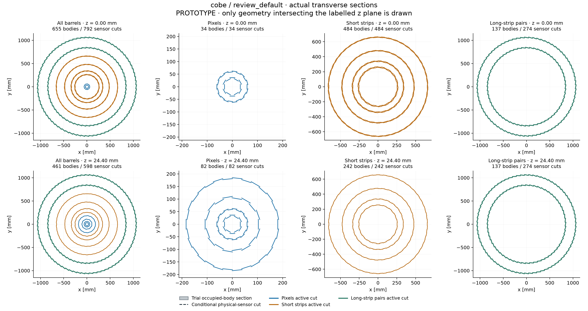
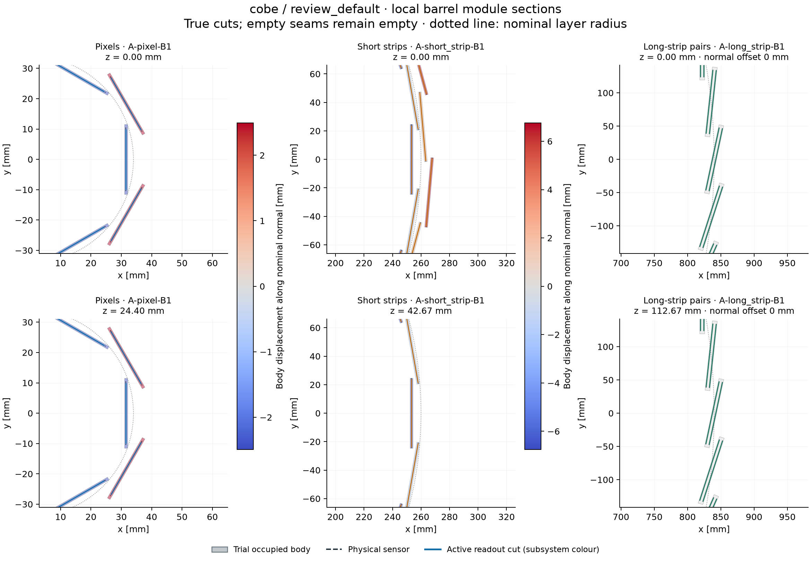
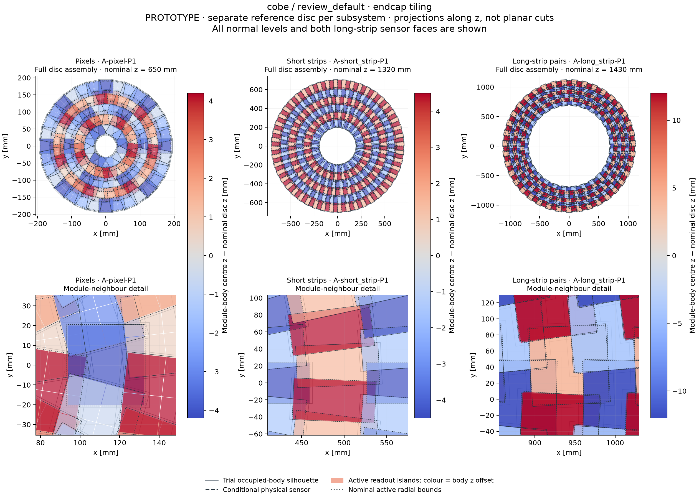

# DES-009 — Reviewer-directed default and transverse views

Date: 2026-09-29. **PROTOTYPE; a working default for the next iteration.**
[Review request](https://github.com/asalzburger/nodd/pull/24#issuecomment-5886458913),
[design hypotheses](../design/DES-009-module-populated-layouts.md), and
[original comparison](DES-009-module-populated-layouts.md).

The default uses cobe's cylindrical layers, omitting pint's inclined barrel-end
sections. Local module tilts in phi are a separate choice. The user explicitly
confirmed on 2026-09-29 that “no tilt section” means no inclined section as default
and that the unnamed third barrel bullet means long strips; the clarification is
retained in the [session record](../../logs/codex/SESSION-2026-09-29-pr24-default-layout.md).

| Region | Default | Separate option |
| --- | --- | --- |
| Pixel barrel | Tangential modules staggered in phi at alternating radii; no z staggering | Add z staggering |
| Short-strip barrel | Tangential modules staggered in phi at alternating radii, with z staggering | Local phi tilt on common-radius staves, retaining z staggering |
| Long-strip barrel | Local phi tilt on common-radius staves; no z staggering | Held fixed in this comparison |
| All endcaps | Existing clearance staggering in r/phi and normal depth | Engineering feasibility remains open |

The initial local tilt is the inherited 12 degree numerical hypothesis. The
single-plus-quad pixel policy and pinned sensor/module models from PRs #8/#21/#22
remain unchanged. Two binary switches give four comparable placements; this is
not a new pixel-family or sensor-outline optimization.

“No z staggering” means fixed phi, radius and local orientation along each stave.
Its uniform longitudinal pitch clears consecutive trial occupied bodies by at
least 0.2 mm. Full rows fit the nominal active-envelope endpoints; the largest
row count respecting the minimum body pitch is used. This avoids the 328
long-barrel/first-disc clashes found when adding an extra row at the minimum
pitch. The rejected alternative remains reproducible through the model input.
Full modules can extend beyond nominal ideal-layer endpoints; none is cropped.
Inactive longitudinal seams therefore remain real coverage losses. A phi tilt
and alternating phi radii are treated as different mechanisms, not silently
combined in the same alternative.

## Measurements and mechanical checks

All four placements have **zero detected trial-body overlaps and host overruns**.
The scan covers x/y = 0..1 mm, z = -150..150 mm, eta = -4..4 and full phi.
The four primary cases each use 8,992 directions/vertices in three modes;
four independent checks each use 4,096 directions, and the default-only total-p
check uses those same 4,096 directions. This is **169,344 trajectory evaluations**,
including repeated straight controls. The original 477,312 evaluations remain
separate historical evidence. Samples are probe distributions, not event weights.

The following table uses the independent random sample. Triplets are straight /
positive charge / negative charge at **pT = 1 GeV, Bz = 3 T**.

| Placement | Modules | Gross / active silicon m² | Mean sensor hits | Missing eligible stations % | All eligible stations reached, % of tracks |
| --- | ---: | ---: | --- | --- | --- |
| **Default** | 24,855 | 217.465 / 212.195 | 14.617 / 14.875 / 14.600 | 5.970 / 5.897 / 6.302 | 56.10 / 56.03 / 54.35 |
| Pixel z staggering | 25,721 | 218.180 / 212.859 | 15.422 / 15.681 / 15.405 | 5.736 / 5.561 / 6.081 | 57.47 / 58.45 / 54.98 |
| Short-strip local tilt | 24,967 | 217.997 / 212.711 | 14.614 / 14.948 / 14.518 | 6.590 / 6.459 / 6.978 | 53.37 / 53.22 / 51.61 |
| Both options | 25,833 | 218.712 / 213.375 | 15.418 / 15.755 / 15.323 | 6.356 / 6.123 / 6.757 | 55.40 / 56.42 / 52.64 |

Default per-subdetector totals, using the same sample and triplet convention:

| Subdetector | Modules | Gross silicon m² | Mean sensor hits | Missing eligible stations % |
| --- | ---: | ---: | --- | --- |
| Pixels | 4,838 | 5.964 | 6.715 / 6.693 / 6.672 | 8.889 / 9.022 / 8.950 |
| Short strips | 11,744 | 55.819 | 4.760 / 4.804 / 4.796 | 1.230 / 1.140 / 1.139 |
| Long strips | 8,273 | 155.681 | 3.142 / 3.377 / 3.132 | 7.993 / 7.109 / 10.757 |

Physical sensors and logical stations remain distinct: pixel chip islands
share one sensor; a long-strip station needs both faces of the same module.
The default has 33,128 physical sensors and 42,848 active patches. Its independent
sample has at least five reached stations per track, but the primary grid exposes
straight-line cases with only **two stations**. Those worst directions are at
eta = ±3.4 and z = ±150 mm, with seven eligible pixel-endcap stations and no
eligible barrel stations: five endcap stations are missed. They are an adverse
sample of the unchanged endcap tiling, not a consequence of barrel z seams.
The barrel losses are reported separately below. The working default remains
neither hermetic nor reconstruction-qualified.

At **total p = 1 GeV**, the default's bent-track station losses are 5.815 / 6.226%
for positive/negative charge. This is a separate momentum convention, not a
replacement for the pT scan. Both signs matter for a uniformly handed phi tilt.

The default saves **36.074 m² (14.23%)** relative to the previous fully staggered
cobe fixture. Most of the saving is the long-strip barrel: 3,425 instead of
5,304 assemblies and 64.452 instead of 99.811 m². Its radial occupied shell is
about 28.9 mm per layer. In exchange, the long-barrel station loss increases
from 1.46 / 2.99 / 2.60% to **16.40 / 15.15 / 22.92%**. This directly exposes
the coverage cost of the combined long-barrel policy. Both the phi mechanism
and longitudinal placement change relative to the old fixture; this comparison
does not isolate the effect of removing z staggering alone.

The pixel z option adds 866 assemblies and 0.715 m². Pixel-barrel losses improve
from 16.45 / 16.75 / 16.45% to 15.56 / 15.47 / 15.60%, while the occupied radial
shell grows from roughly 5.4–8.7 mm to 12.2–19.7 mm. Retain this as an option,
without promoting its modest coverage gain over the simpler default. The minimum
inner trial-body radius is 31.008 mm for the default and 26.023 mm with pixel z
staggering; neither establishes beam-pipe/service clearance.

Tangential short strips remain the preferred tested choice: their barrel losses
are 2.47 / 2.32 / 2.31%, versus 5.95 / 5.49 / 6.12% with the 12 degree local tilt.
The tilt adds 112 assemblies and 0.532 m², and increases occupied radial shells
from 11.8–16.6 mm to 25.4–26.6 mm. The result does not rule out different angles
or overlap policies; those would be new documented studies.

Endcap tiling is unchanged: default independent-sample station losses are
0.90 / 0.86 / 1.04% for pixels, 0.052 / 0.038 / 0.051% for short strips, and zero
observed for long strips. Its support, cooling and services feasibility remains
open. No cost, material, thermal or reconstruction-performance estimate is implied.

The [rejected minimum-pitch control](DES-009-review-default/rejected-minimum-pitch.json)
retains all 328 barrel/disc box intersections. End fitting uses 25 long-strip rows
at 112.667 mm pitch. The trial body ends at |z| = 1406.460 mm, leaving 7.890 mm
before the first disc's nearest trial body. Actual stereo-rotated active corners
still extend 0.950 mm beyond the nominal unrotated endpoints; nothing is clipped.

All **nine native ACTS audits pass**: 432 sampled tracks, 382,142 candidate target
trials, 6,241 reached patches and exact patch-ID-set agreement. Maximum checked
trajectory residual is 9.21e-7 mm. They use unchanged sensitive bounds and the
supporting-plane propagation method from the original study; the shared broad
phase and global-navigation limitations remain. Mechanical clearance is limited
to the occupied boxes and host. Numerical and native evidence records source
revision `30ac28acaee5f8359acb1654de655a9760c7d704`, configuration/code hashes,
and the actual PR6178 overlay binary hash; no ACTS installation was modified.

Validation passed 41 local numerical/geometry/native/view tests, 27 dashboard
tests, 32 logging tests and 14 browser-interaction assertions. The original 12
cobe/pint geometry outputs were checked unchanged; retained old evidence was
not regenerated. Missing Spack fingerprint verification and Geant4 data-path
warnings remain documented runtime limits, not claims of full simulation.

Complete results: [primary sample](DES-009-review-default/main/results.md),
[independent sample](DES-009-review-default/offgrid/results.md), and
[total-p check](DES-009-review-default/total-p/results.md). Each includes all
region/layer denominators, hit distributions, silicon tables and native audits.

## Transverse views

The repeatable view generator provides actual barrel cuts at stated z values,
including an adjacent row slice, and x-y projections of one positive reference
disc assembly per subsystem. Endcap modules on different stagger levels are
projected together deliberately and their normal offsets are shown explicitly.
A projected overlap is not by itself a three-dimensional solid overlap.
At z = 0 the outer two pixel barrels lie in an inter-module longitudinal gap;
their empty sections are retained. The second cut at z = 24.396 mm intersects
all four pixel barrels. This is a placement seam, not an omitted layer.







The [short-strip tilt option](DES-009-review-default/views-short-tilt/barrel-detail.png)
provides a direct geometric comparison. The view manifests retain slice positions,
selected layer IDs, actual input and renderer hashes, and the distinction between
physical sensor outlines, active islands and occupied boxes.

## Reproduce after a sensor or module update

```sh
python tools/module_layout/study.py run --native --jobs 3 \
  --models tools/module_layout/review_models.json \
  --config tools/module_layout/review_config.json --output reference/cache/NEW-review-main
python tools/module_layout/study.py run --native --jobs 3 \
  --models tools/module_layout/review_models.json \
  --config tools/module_layout/review_offgrid_config.json --output reference/cache/NEW-review-offgrid
python tools/module_layout/report.py --run reference/cache/NEW-review-main \
  --output reference/cache/NEW-review-report
python tools/module_layout/views.py --run reference/cache/NEW-review-main \
  --case cobe-review_default-mixed --output reference/cache/NEW-review-views
```

Use the [verified ACTS workflow](../../tools/module_layout/README.md). Each command
writes a fresh directory; model/layer/configuration/code hashes remain attached
to the evidence. Alternate supported shape inputs can be supplied with `--models`
and `--layouts`; changed physics inputs require a fresh scan and native audit.
The original study's evidence remains a historical comparison.
