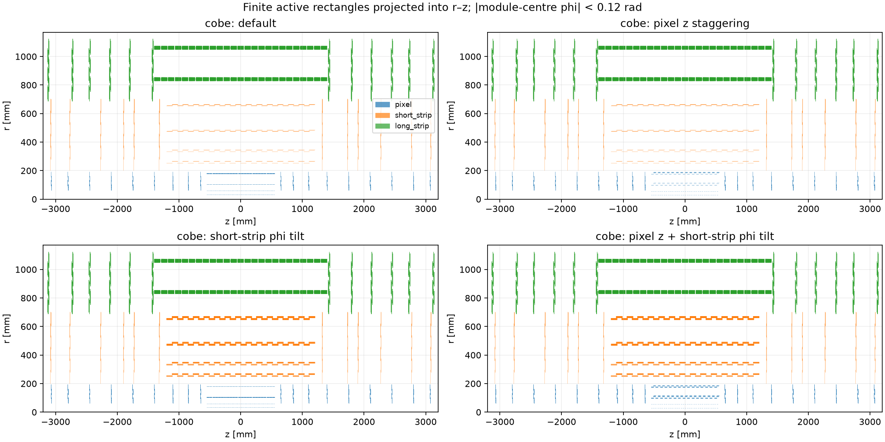
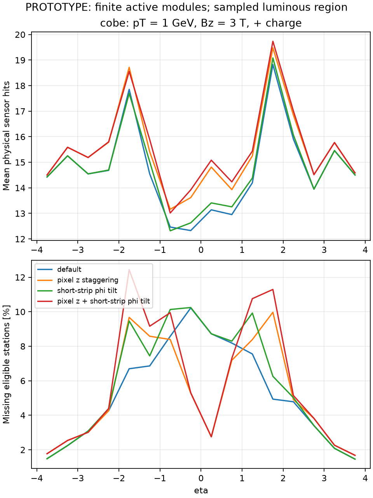
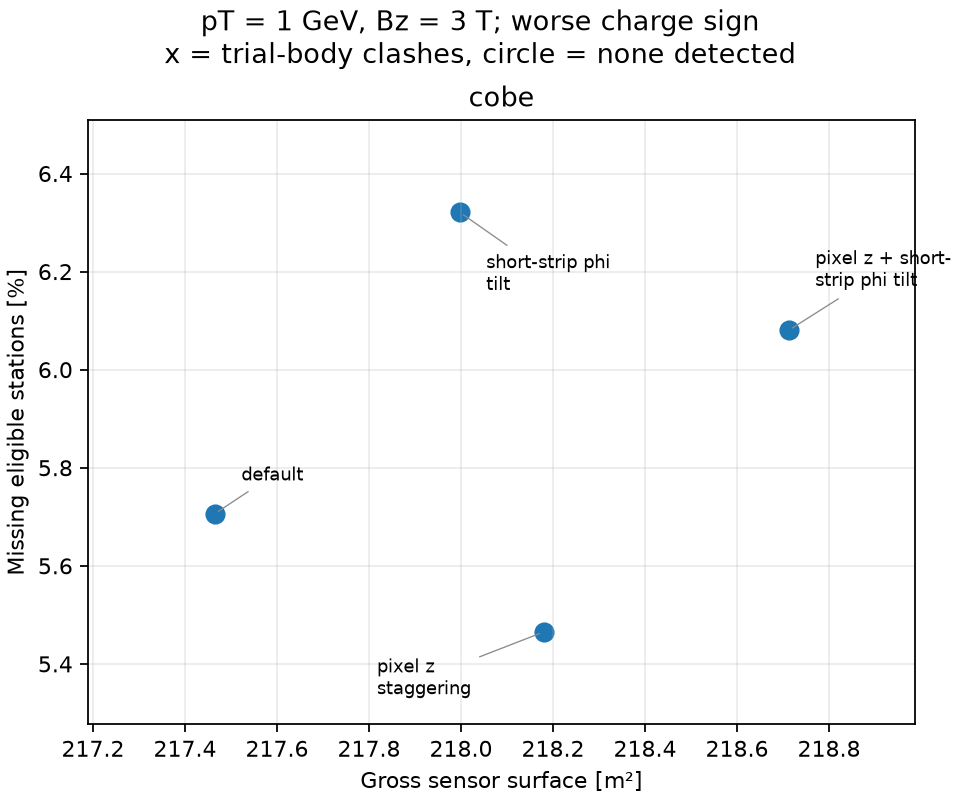
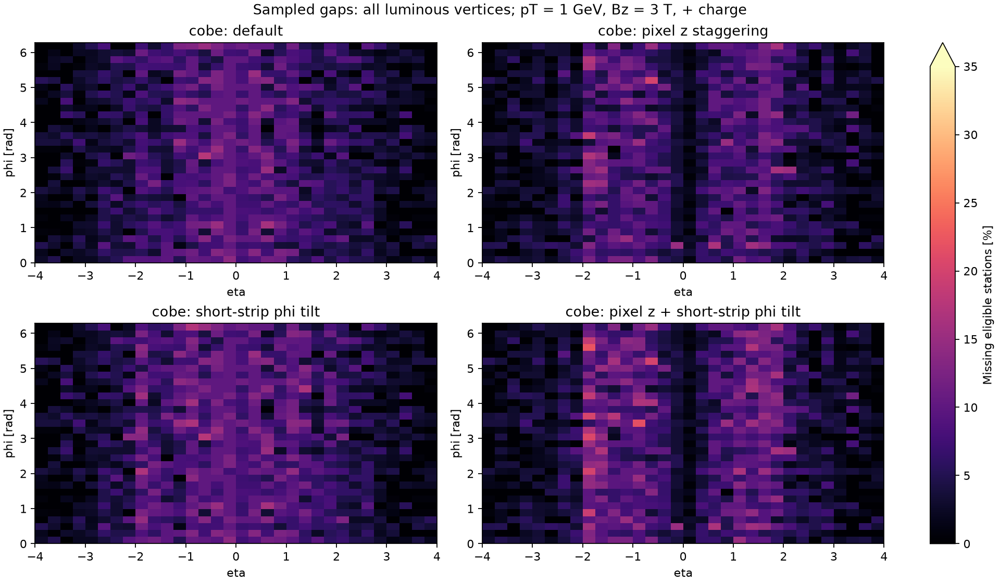

# DES-009 numerical results

**PROTOTYPE.** Draft inputs; finite sampling is not a proof of continuous hermeticity.

`coverage.csv` contains all trajectory/subdetector/region summaries; `layers.csv` retains every ideal-layer denominator and missed count. `silicon.csv` separates gross sensor surface and active readout area. `eta.csv` retains directional profiles. Exact configuration, source hashes, distributions and native ACTS audit are in `summary.json`.

## Populations and trial occupied bodies

| Layout | Modules | Sensors | Gross / active m² | Body clashes | Host overruns |
| --- | ---: | ---: | ---: | ---: | ---: |
| cobe-review_default-mixed | 24855 | 33128 | 217.46 / 212.19 | 0 | 0 |
| cobe-review_pixel_z-mixed | 25721 | 33994 | 218.18 / 212.86 | 0 | 0 |
| cobe-review_short_tilt-mixed | 24967 | 33240 | 218.00 / 212.71 | 0 | 0 |
| cobe-review_pixel_z_short_tilt-mixed | 25833 | 34106 | 218.71 / 213.37 | 0 | 0 |

Body clashes reject the particular trial support envelope; absence of clashes is not full support/services validation.

## Total reachable hits and sampled coverage

Modes: straight = no field; positive/negative = pT = 1 GeV, Bz = 3 T, charge ±1. Means include every sampled direction. Station counts require a complete same-module pair for long strips.

| Layout | Mode | Sensor hits min / mean | Stations min / mean | Missing eligible stations % | Tracks with all eligible stations % |
| --- | --- | ---: | ---: | ---: | ---: |
| cobe-review_default-mixed | straight | 4 / 14.86 | 2 / 9.46 | 5.46 | 60.70 |
| cobe-review_default-mixed | positive | 7 / 14.74 | 5 / 9.48 | 5.34 | 60.11 |
| cobe-review_default-mixed | negative | 7 / 14.41 | 5 / 9.44 | 5.71 | 58.71 |
| cobe-review_pixel_z-mixed | straight | 4 / 15.59 | 2 / 9.50 | 5.45 | 59.56 |
| cobe-review_pixel_z-mixed | positive | 7 / 15.49 | 5 / 9.52 | 5.31 | 58.56 |
| cobe-review_pixel_z-mixed | negative | 7 / 15.21 | 5 / 9.50 | 5.47 | 57.97 |
| cobe-review_short_tilt-mixed | straight | 4 / 14.83 | 2 / 9.42 | 5.87 | 58.46 |
| cobe-review_short_tilt-mixed | positive | 7 / 14.83 | 5 / 9.42 | 5.98 | 57.47 |
| cobe-review_short_tilt-mixed | negative | 7 / 14.31 | 5 / 9.38 | 6.32 | 56.28 |
| cobe-review_pixel_z_short_tilt-mixed | straight | 4 / 15.56 | 2 / 9.46 | 5.86 | 58.16 |
| cobe-review_pixel_z_short_tilt-mixed | positive | 7 / 15.59 | 5 / 9.46 | 5.95 | 56.88 |
| cobe-review_pixel_z_short_tilt-mixed | negative | 7 / 15.12 | 5 / 9.44 | 6.08 | 56.17 |

## Per subdetector

Each triplet is straight / positive / negative. Areas count both long-strip faces and count a pixel sensor only once across its active islands.

| Layout | Subdetector | Gross m² | Mean sensor hits | Missing eligible stations % |
| --- | --- | ---: | ---: | ---: |
| cobe-review_default-mixed | pixel | 5.96 | 6.94 / 7.10 / 6.99 | 8.50 / 7.76 / 7.85 |
| cobe-review_default-mixed | short_strip | 55.82 | 4.77 / 4.58 / 4.56 | 0.91 / 0.85 / 0.81 |
| cobe-review_default-mixed | long_strip | 155.68 | 3.15 / 3.07 / 2.86 | 5.56 / 8.03 / 10.83 |
| cobe-review_pixel_z-mixed | pixel | 6.68 | 7.67 / 7.85 / 7.80 | 8.48 / 7.71 / 7.39 |
| cobe-review_pixel_z-mixed | short_strip | 55.82 | 4.77 / 4.58 / 4.56 | 0.91 / 0.85 / 0.81 |
| cobe-review_pixel_z-mixed | long_strip | 155.68 | 3.15 / 3.07 / 2.86 | 5.56 / 8.03 / 10.83 |
| cobe-review_short_tilt-mixed | pixel | 5.96 | 6.94 / 7.10 / 6.99 | 8.50 / 7.76 / 7.85 |
| cobe-review_short_tilt-mixed | short_strip | 56.35 | 4.74 / 4.67 / 4.46 | 2.07 / 2.64 / 2.55 |
| cobe-review_short_tilt-mixed | long_strip | 155.68 | 3.15 / 3.07 / 2.86 | 5.56 / 8.03 / 10.83 |
| cobe-review_pixel_z_short_tilt-mixed | pixel | 6.68 | 7.67 / 7.85 / 7.80 | 8.48 / 7.71 / 7.39 |
| cobe-review_pixel_z_short_tilt-mixed | short_strip | 56.35 | 4.74 / 4.67 / 4.46 | 2.07 / 2.64 / 2.55 |
| cobe-review_pixel_z_short_tilt-mixed | long_strip | 155.68 | 3.15 / 3.07 / 2.86 | 5.56 / 8.03 / 10.83 |

## Native ACTS audit

Passing case audits: 4 / 4. See exact track lists, actual runtime provenance and mismatches in summary.json; NOT RUN is not a pass.

