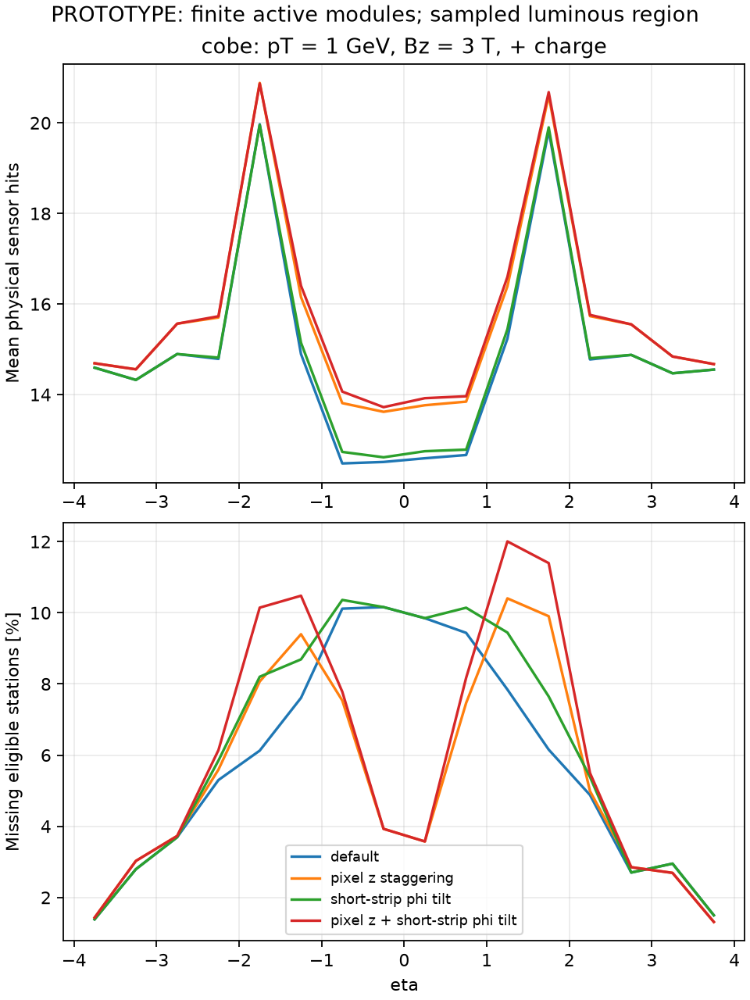
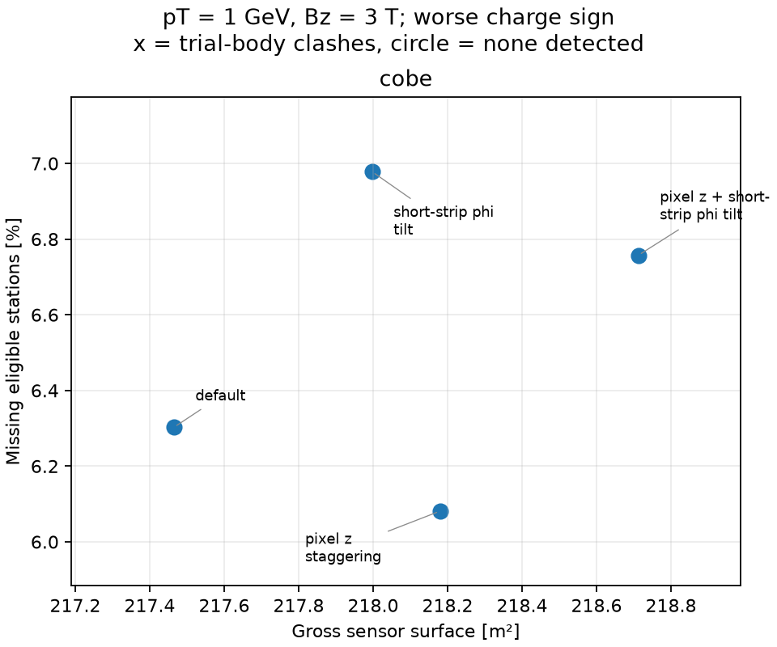
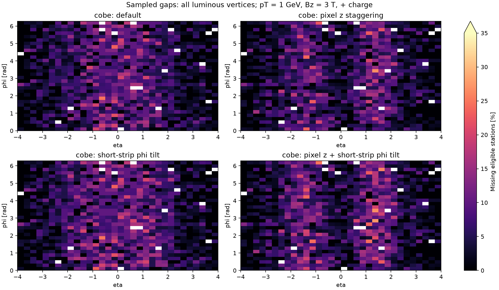

# DES-009 numerical results

**PROTOTYPE.** Draft inputs; finite sampling is not a proof of continuous hermeticity.

`coverage.csv` contains all trajectory/subdetector/region summaries; `layers.csv` retains every ideal-layer denominator and missed count. `silicon.csv` separates gross sensor surface and active readout area. `eta.csv` retains directional profiles. Exact configuration, source hashes, distributions and native ACTS audit are in `summary.json`.

## Populations and trial occupied bodies

| Layout | Modules | Sensors | Gross / active m² | Body clashes | Host overruns |
| --- | ---: | ---: | ---: | ---: | ---: |
| cobe-review_default-mixed | 24855 | 33128 | 217.46 / 212.19 | 0 | 0 |
| cobe-review_pixel_z-mixed | 25721 | 33994 | 218.18 / 212.86 | 0 | 0 |
| cobe-review_short_tilt-mixed | 24967 | 33240 | 218.00 / 212.71 | 0 | 0 |
| cobe-review_pixel_z_short_tilt-mixed | 25833 | 34106 | 218.71 / 213.37 | 0 | 0 |

Body clashes reject the particular trial support envelope; absence of clashes is not full support/services validation.

## Total reachable hits and sampled coverage

Modes: straight = no field; positive/negative = pT = 1 GeV, Bz = 3 T, charge ±1. Means include every sampled direction. Station counts require a complete same-module pair for long strips.

| Layout | Mode | Sensor hits min / mean | Stations min / mean | Missing eligible stations % | Tracks with all eligible stations % |
| --- | --- | ---: | ---: | ---: | ---: |
| cobe-review_default-mixed | straight | 5 / 14.62 | 5 / 9.56 | 5.97 | 56.10 |
| cobe-review_default-mixed | positive | 5 / 14.87 | 5 / 9.61 | 5.90 | 56.03 |
| cobe-review_default-mixed | negative | 5 / 14.60 | 5 / 9.56 | 6.30 | 54.35 |
| cobe-review_pixel_z-mixed | straight | 7 / 15.42 | 5 / 9.61 | 5.74 | 57.47 |
| cobe-review_pixel_z-mixed | positive | 6 / 15.68 | 5 / 9.67 | 5.56 | 58.45 |
| cobe-review_pixel_z-mixed | negative | 7 / 15.40 | 5 / 9.62 | 6.08 | 54.98 |
| cobe-review_short_tilt-mixed | straight | 5 / 14.61 | 4 / 9.50 | 6.59 | 53.37 |
| cobe-review_short_tilt-mixed | positive | 6 / 14.95 | 5 / 9.55 | 6.46 | 53.22 |
| cobe-review_short_tilt-mixed | negative | 5 / 14.52 | 5 / 9.50 | 6.98 | 51.61 |
| cobe-review_pixel_z_short_tilt-mixed | straight | 6 / 15.42 | 4 / 9.56 | 6.36 | 55.40 |
| cobe-review_pixel_z_short_tilt-mixed | positive | 6 / 15.75 | 5 / 9.61 | 6.12 | 56.42 |
| cobe-review_pixel_z_short_tilt-mixed | negative | 7 / 15.32 | 5 / 9.55 | 6.76 | 52.64 |

## Per subdetector

Each triplet is straight / positive / negative. Areas count both long-strip faces and count a pixel sensor only once across its active islands.

| Layout | Subdetector | Gross m² | Mean sensor hits | Missing eligible stations % |
| --- | --- | ---: | ---: | ---: |
| cobe-review_default-mixed | pixel | 5.96 | 6.71 / 6.69 / 6.67 | 8.89 / 9.02 / 8.95 |
| cobe-review_default-mixed | short_strip | 55.82 | 4.76 / 4.80 / 4.80 | 1.23 / 1.14 / 1.14 |
| cobe-review_default-mixed | long_strip | 155.68 | 3.14 / 3.38 / 3.13 | 7.99 / 7.11 / 10.76 |
| cobe-review_pixel_z-mixed | pixel | 6.68 | 7.52 / 7.50 / 7.48 | 8.43 / 8.37 / 8.52 |
| cobe-review_pixel_z-mixed | short_strip | 55.82 | 4.76 / 4.80 / 4.80 | 1.23 / 1.14 / 1.14 |
| cobe-review_pixel_z-mixed | long_strip | 155.68 | 3.14 / 3.38 / 3.13 | 7.99 / 7.11 / 10.76 |
| cobe-review_short_tilt-mixed | pixel | 5.96 | 6.71 / 6.69 / 6.67 | 8.89 / 9.02 / 8.95 |
| cobe-review_short_tilt-mixed | short_strip | 56.35 | 4.76 / 4.88 / 4.71 | 2.92 / 2.67 / 2.98 |
| cobe-review_short_tilt-mixed | long_strip | 155.68 | 3.14 / 3.38 / 3.13 | 7.99 / 7.11 / 10.76 |
| cobe-review_pixel_z_short_tilt-mixed | pixel | 6.68 | 7.52 / 7.50 / 7.48 | 8.43 / 8.37 / 8.52 |
| cobe-review_pixel_z_short_tilt-mixed | short_strip | 56.35 | 4.76 / 4.88 / 4.71 | 2.92 / 2.67 / 2.98 |
| cobe-review_pixel_z_short_tilt-mixed | long_strip | 155.68 | 3.14 / 3.38 / 3.13 | 7.99 / 7.11 / 10.76 |

## Native ACTS audit

Passing case audits: 4 / 4. See exact track lists, actual runtime provenance and mismatches in summary.json; NOT RUN is not a pass.

