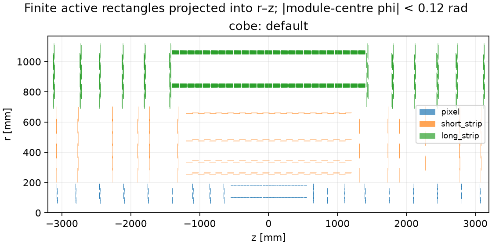
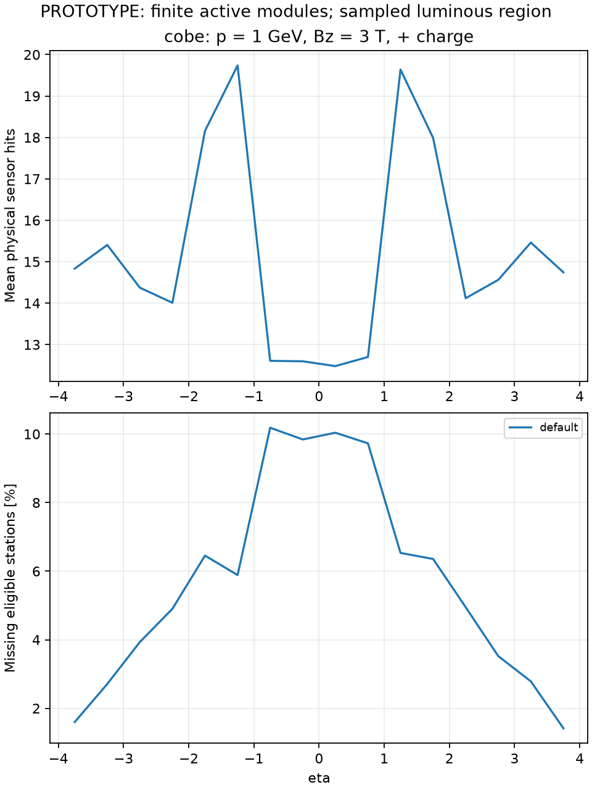
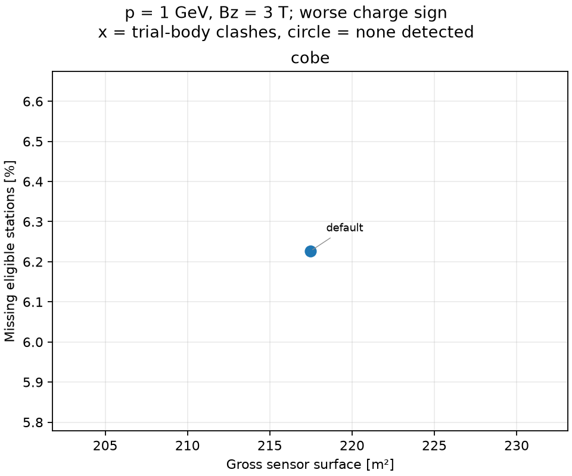
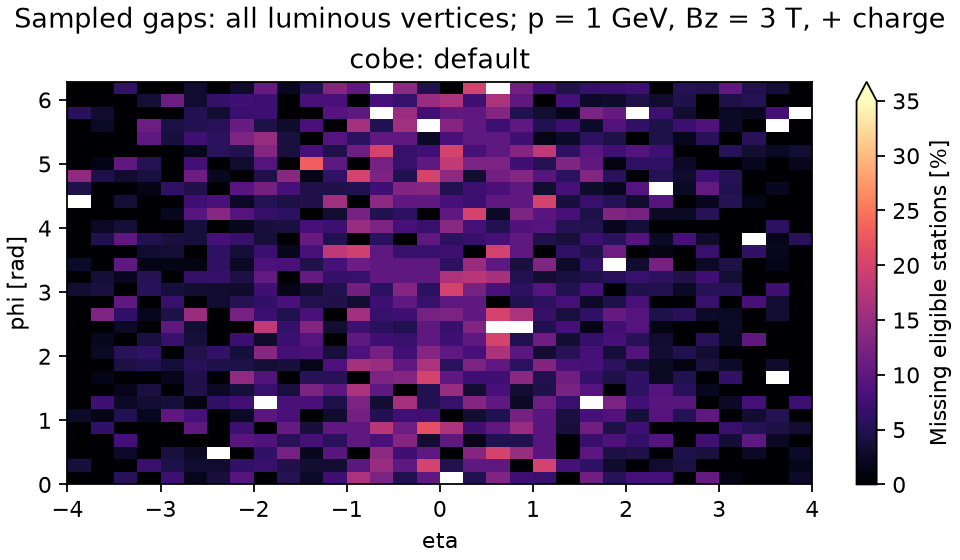

# DES-009 numerical results

**PROTOTYPE.** Draft inputs; finite sampling is not a proof of continuous hermeticity.

`coverage.csv` contains all trajectory/subdetector/region summaries; `layers.csv` retains every ideal-layer denominator and missed count. `silicon.csv` separates gross sensor surface and active readout area. `eta.csv` retains directional profiles. Exact configuration, source hashes, distributions and native ACTS audit are in `summary.json`.

## Populations and trial occupied bodies

| Layout | Modules | Sensors | Gross / active m² | Body clashes | Host overruns |
| --- | ---: | ---: | ---: | ---: | ---: |
| cobe-review_default-mixed | 24855 | 33128 | 217.46 / 212.19 | 0 | 0 |

Body clashes reject the particular trial support envelope; absence of clashes is not full support/services validation.

## Total reachable hits and sampled coverage

Modes: straight = no field; positive/negative = p = 1 GeV, Bz = 3 T, charge ±1. Means include every sampled direction. Station counts require a complete same-module pair for long strips.

| Layout | Mode | Sensor hits min / mean | Stations min / mean | Missing eligible stations % | Tracks with all eligible stations % |
| --- | --- | ---: | ---: | ---: | ---: |
| cobe-review_default-mixed | straight | 5 / 14.62 | 5 / 9.56 | 5.97 | 56.10 |
| cobe-review_default-mixed | positive | 5 / 15.19 | 5 / 9.80 | 5.82 | 55.37 |
| cobe-review_default-mixed | negative | 5 / 14.93 | 5 / 9.75 | 6.23 | 53.61 |

## Per subdetector

Each triplet is straight / positive / negative. Areas count both long-strip faces and count a pixel sensor only once across its active islands.

| Layout | Subdetector | Gross m² | Mean sensor hits | Missing eligible stations % |
| --- | --- | ---: | ---: | ---: |
| cobe-review_default-mixed | pixel | 5.96 | 6.71 / 7.21 / 7.21 | 8.89 / 8.66 / 8.44 |
| cobe-review_default-mixed | short_strip | 55.82 | 4.76 / 4.75 / 4.76 | 1.23 / 1.16 / 1.00 |
| cobe-review_default-mixed | long_strip | 155.68 | 3.14 / 3.22 / 2.96 | 7.99 / 7.16 / 12.34 |

## Native ACTS audit

Passing case audits: 1 / 1. See exact track lists, actual runtime provenance and mismatches in summary.json; NOT RUN is not a pass.

