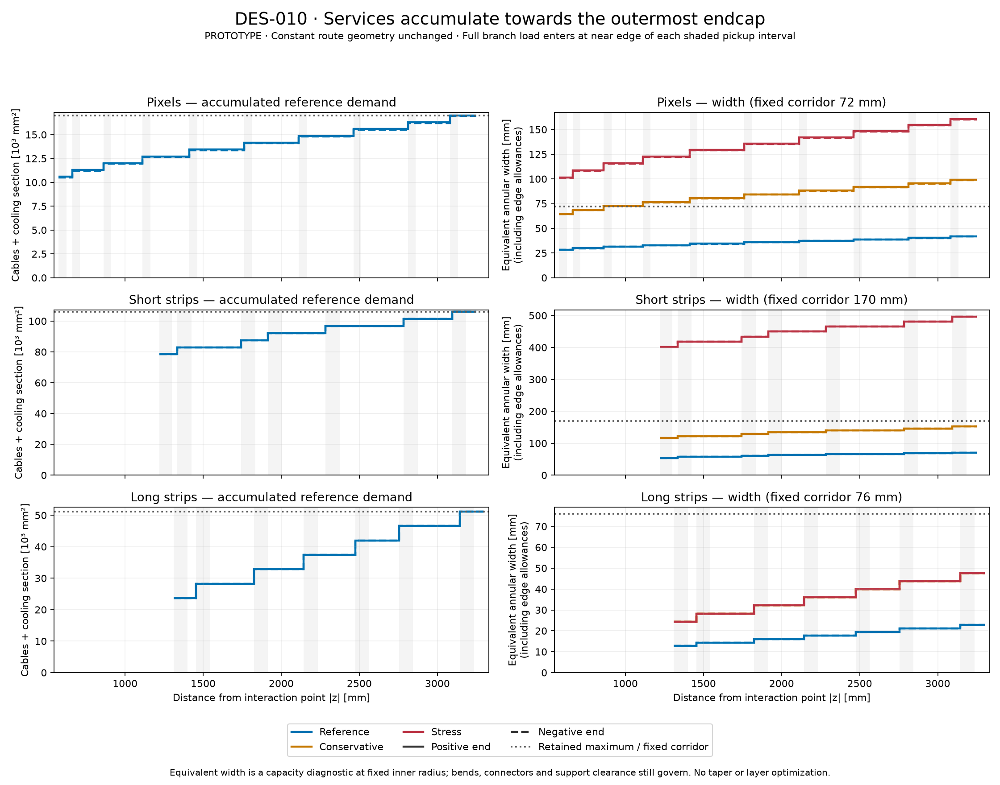

# DES-010 — PR #25 gap comparison and accumulated services

- Date: 2026-09-29; **PROTOTYPE, no tracker or service-design approval**.
- Responds to [the expert comment](https://github.com/asalzburger/nodd/pull/25#issuecomment-5890301780)
  on reviewed head `2a3dbfb741f7ea27e77cca3de81690fa800e4567`.
- Governing [DES-010, SC-I04/SC-C19](../design/DES-010-tracker-service-corridors.md).
- Source [comparison dossier](../design/inputs/DES-010-upgrade-service-comparison.md)
  contains FACT/INFERENCE classifications, exact pages, edition limits and hashes.

The reviewer is correct: service traffic grows as endcaps join the route. The
original prototype used the **final whole-end load at every z in each axial
trunk**, while its disc collectors and barrel/rear radial segments selected
local or accumulated traffic. The original 72/170/76 mm gaps are fixed conservative
reservations, not calculated requirements at every disc. This response adds a
position-dependent diagnostic and historical engineering comparisons; it does
not change gaps, restore rows or start the separate layer-position optimization.

## Comparison with public upgrade designs

The following are **derived envelope dimensions**, except the directly reported
ATLAS 6.6 mm local accommodation. They are not transferable nODD requirements.

| Object | nODD working reservation, mm | Public comparison and exact locator | Scope |
| --- | ---: | --- | --- |
| Pixel axial route |72 radial | ATLAS 2021 overview slide 15 reports 6.6 local accommodation at the limiting Layer 2 last half-ring. CMS TDR Table 10.1 p236 plus Fig. 5.1 p89 give 50/56 pixel-module-to-OT envelope differences. | A distributed ring-layer route and module/envelope differences are not a combined all-pixel trunk; support and clearance occupy some of the latter. |
| Short/long inter-endcap route |170 radial | Neither upgrade has the same separate nested short/long endcap topology. CMS's 577→621=44 in Fig. 5.1 is only a barrel mechanical-envelope separation. | No like-for-like 170 mm endcap corridor is established by either design. |
| Outer barrel-service bypass |76 radial for nODD long-strip trunk | ATLAS Pixel TDR Fig. 15.1 p322/PDF344:1061−1015=46. CMS Fig. 5.1 p89:1175−1155=20, separate from 10 installation clearance to TEDD. | Published service-labelled envelopes carry barrel services past endcaps; nODD's trunk also collects its own endcap services. Different loads, radii and sector occupancy. |
| Barrel radial escape |50/80/90 axial for pixels/short/long | ATLAS Fig. 15.1:1475−1372=103. CMS Fig. 5.1:1265−1224.5=40.5 TBPS; 1245−1202=43 TB2S. | Similar functions at centimetre scale; connector/bend/support qualifications do not transfer. |

The ATLAS envelope drawing is explicitly a historical discussion model. Both
TDRs use support/installation allocations that must not be counted again as
free cable volume. ATLAS uses external strip service collection; CMS PS and 2S
share endcap structures. Their architecture and readout loads differ from nODD.
The nODD 170 mm gap is consequently a target for constrained routing review, not
something validated by analogy. Width alone cannot compare capacity: circumference,
packing, available azimuth and carried cable/cooling inventory also matter.

## What the additive profile counts

The source is the byte-identical [original run](DES-010-services/main/summary.json),
executed at `d3265fa1e52f26b0aac556325eaa6d7a10442720`. The new tool checks all six
input snapshots and the original geometry/service producer hashes, then consumes
the retained local groups and declared feeder graph. It does not regenerate
surfaces, change sensor counts, rerun tracks or modify the original evidence.

**SC-C19, unapproved diagnostic convention:** a complete feeder is present from
the near edge in absolute z of its finite intersection with its subsystem trunk.
This bounds load conservatively within the joining pocket; actual connector
positions remain unspecified. Each retained group enters once. Original chain/
harness ceilings and per-layer/end manifold rounding are applied to the group
union, not to a fraction of the final module count. Both pipe directions occupy
space and are counted, irrespective of coolant flow direction. Every terminal
inventory and scenario capacity must reproduce the original trunk result.

This covers the six single-subsystem axial trunks. Shared rear/bore routes keep
their original whole-end budgets. Accumulated loads are retained through each
trunk's downstream extraction pocket rather than pretending to know where inside
that pocket individual services leave. The maximum occurs after the last endcap
pickup and remains until the downstream handoff in this routing hypothesis.

Positive-end results, using the reference architecture:

| Subsystem | Modules before first disc → final | Cable + cooling section, mm² | Barrel fraction of final load | Equivalent width before first disc → final, mm | Fixed gap, mm | Full load from \|z\|, mm |
| --- | ---: | ---: | ---: | ---: | ---: | ---: |
| pixel | 1,392 → 2,148 | 10,584.9 → 17,007.9 | 62.24% | 28.39 → 41.81 | 72 | 3081.70 |
| short strip | 3,388 → 5,044 | 78,410.8 → 105,919.4 | 74.03% | 54.26 → 71.04 | 170 | 3094.10 |
| long strip | 1,644 → 3,372 | 23,655.6 → 51,164.3 | 46.23% | 12.73 → 22.79 | 76 | 3144.25 |

The full-load pickup intervals are 3081.70–3131.70 mm for pixels,
3094.10–3184.10 for short strips and 3144.25–3234.25 for long strips. The table uses
the near edge, not an exact termination coordinate. At the negative end, pixel
reference demand is 10,516.9→16,939.9 mm² (equivalent width 28.24→41.67 mm).
Short-strip and long-strip area demands coincide between ends under the current
group ceilings, despite unequal long-strip module counts. Full signed inventories
are retained in the [profile JSON](DES-010-services/review-accumulation/profile.json).

“Equivalent width” inverts annular capacity at the retained inner radius:

`w = 2b + sqrt((r_min+b)^2 + A/(π f_phi f_pack)) − (r_min+b)`.

Here A includes the scenario's demand multiplier, b=2 mm per boundary, and the
original azimuth/packing assumptions remain fixed. Reference uses 0.75×0.50;
conservative/stress use 0.50×0.40 and 25% demand allowance. This is an area-only
lower requirement under the assumed architecture, **not a proposed physical
taper**. It omits bend/connector footprints and does not recheck module/support
clearance at new boundaries. Geometrically allocating its radius can be impossible
without moving neighbouring structures; no narrower gap is declared feasible.



[Vector PDF](DES-010-services/review-accumulation/views/cumulative-services.pdf).
Shading shows finite pickup intervals; solid/dashed lines distinguish the two
ends (mostly coincident). Left: reference area grows from a substantial barrel
load to the fixed whole-end maximum. Right: three architecture scenarios against
the unchanged reserved gap; long-strip conservative/stress curves coincide.

## Consequences and unchanged limitations

The final equivalent widths are reference 41.81/71.04/22.79 mm versus the retained
72/170/76 mm gaps. This makes upstream over-reservation explicit and motivates
a later tapering study. It does not justify accepting those reference minima:
conservative terminal widths are 99.15/152.17/47.58 mm; stress gives
160.69/495.74/47.58. Pixel conservative and pixel/short-strip stress fail even
before all endcaps have joined. Electronics, packing and sector choices still
matter more than a single reference-width comparison.

The original required rear-all/common-bore junction still has only 2.14% reference
cross-section headroom. Reference capacity, all adverse failures, the 3,898 removed
assemblies and original coverage losses remain exactly as reported. A varying
upstream profile cannot remove a real downstream bottleneck. Strip stress still
retains optimistic reference cooling; no hydraulic qualification follows.

Human review should separate two follow-ups: qualify the load/aggregation and
mechanical/interface assumptions, then optimize route widths and layer/ring
positions under those constraints. This PR introduces neither optimization nor
approval of PR #24's tracker hypothesis.

## Repeatability and validation

Run from the repository root; choose fresh output directories:

```sh
python3 -B tools/module_layout/services_profile.py \
  --run docs/validation/DES-010-services/main \
  --output docs/validation/DES-010-services/review-accumulation \
  --pickup-policy near-edge-full-load
python -B tools/module_layout/services_profile_views.py \
  --run docs/validation/DES-010-services/review-accumulation \
  --output docs/validation/DES-010-services/review-accumulation/views
```

The profile command is standard-library-only. Plotting used the verified ACTS
installation's Python 3.14.5 with Matplotlib 3.11.2; profile/test execution used
system Python 3.14.6. See [runtime setup](../../tools/module_layout/README.md).
The Spack preflight flagged changed setup/lock fingerprints, so imports were
checked directly. No ACTS build or propagation was needed for this additive
budget diagnostic. Source SHA, code/input hashes, timestamp, command and runtime
are retained in profile/view metadata.

The retained additive run used clean source
`b6a7506d671d4462935d9c07efdf401f3aeaf676`; its [artifact manifest](DES-010-services/review-accumulation/artifacts.json)
covers the profile, input snapshot and PNG/PDF output. All 49 service tests passed,
including ten new controls covering mirrored/unequal ends, exact source-group partition,
local rounding, cooling manifold aggregation, final load agreement, equivalent
width inversion, malformed graph/pickup rejection and retained-input tampering.
Dashboard validation/build and journal validation passed; final publication checks are recorded in
[the session journal](../../logs/codex/SESSION-2026-09-29-service-gap-review.md).
The original numerical/native report remains available unchanged.
