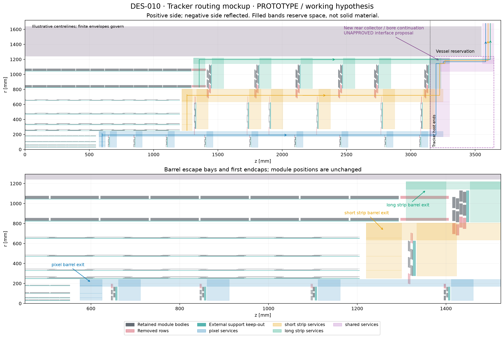
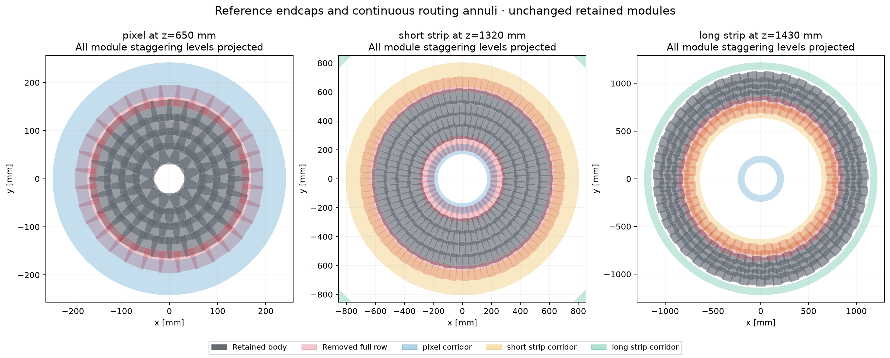
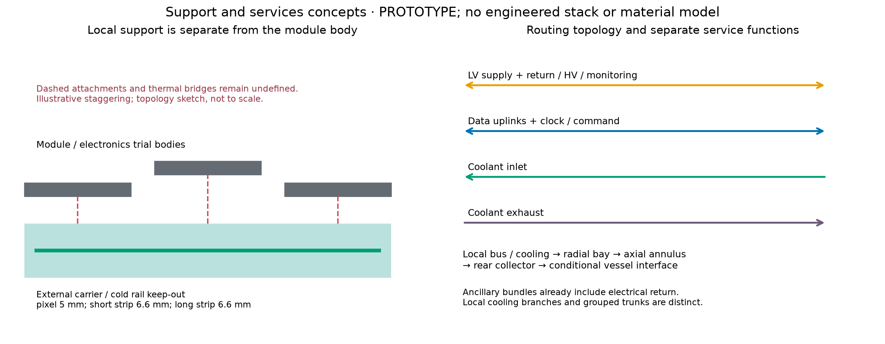

# DES-010 — Tracker service gaps and routing mockups

- Date: 2026-09-29; status: **PROTOTYPE / unapproved working hypothesis**.
- Governing design: [DES-010](../design/DES-010-tracker-service-corridors.md);
  inherited module placements: [DES-009](../design/DES-009-module-populated-layouts.md).
- Numerical source revision: `d3265fa1e52f26b0aac556325eaa6d7a10442720`, clean tracked source at execution.
- Exact [inputs and numerical results](DES-010-services/main/summary.json),
  [view provenance](DES-010-services/views/views.json), and
  [rejected initial throat control](DES-010-services/rejected-throat-probe.json).

PR #24 did **not approve** the tracker default. This study uses
`cobe-review_default-mixed` only to expose the space and coverage consequences of
providing cables, cooling and local supports. All retained module transforms and
layer positions are unchanged. Layer-position optimization belongs to a separate
follow-up PR; no production geometry or material has been added.

The proposed gaps provide connected finite routes that pass the **reference
cross-section budget**. The **conservative and stress budgets fail**. The gap
construction removes 3,898 assemblies and 40.162 m² of physical sensor area;
missing eligible stations increase from about 5.3–5.7% to 16.9–17.3% on the same
sample. This is evidence of the cost of the working hypothesis, not an acceptable
performance result or an engineering-qualified routing design.

## Public-source estimates and their limits

The [pixel dossier](../design/inputs/DES-010-pixel-services.md) and
[strip dossier](../design/inputs/DES-010-strip-services.md) distinguish FACT,
INFERENCE and NODD DESIGN CHOICE, with exact TDR pages and catalogue hashes.
The [budget input snapshot](DES-010-services/main/budget_inputs.json) retains
per-field source/classification records. The following adopted quantities are
**unapproved nODD space-budget choices based on those sources**, not specifications
for existing nODD electronics.

| Item | Adopted counting / occupied outer dimensions | Public basis and uncertainty |
| --- | --- | --- |
| Pixel power, HV and monitoring | 35 mm² ancillary cable envelope per homogeneous chain; at most 32 chips and 16 physical modules | ATLAS pixel TDR serial powering; later public ITk prototype ancillary bundles. Eight quads, sixteen doubles or sixteen singles at most; A1/A2 electrical compatibility remains unqualified. Supply and return included. |
| Pixel data/control | 1 mm² per differential link; one uplink and one command link per module in reference case | Public ITk twinax dimensions; conservative uses one uplink/chip, stress four/chip. Aggregation is an assumption. |
| Pixel cooling | 2.688 W/chip proxy; 300 W circuit ceiling; 4 mm OD feed plus 4 mm OD return per circuit | TDR power-density components and later public 300 W/3 mm ID exhaust example; OD and grouping are reservations, not pressure-drop or thermal calculations. |
| Strip power/data | 13.4 mm OD power cable plus 3.6 mm OD multifibre per at most 12 modules | CMS TDR §5.2 Table 5.1 p91 and §3.2.4 p35; adopted upstream cable envelope is deliberately explicit. |
| Strip cooling | 2.5 mm OD feed and return per leaf; at most 14 short-barrel, 13 long-barrel or 12 endcap modules/leaf; at most eight leaves per 8/12 mm OD trunk pair | ATLAS strip local interfaces and manifold topology; CMS trunk envelopes. Round within each half-stave/endcap row and layer/end before summing. |
| Strip heat comparator | 7.8 W per short-strip module; 5.4 W per complete long-strip pair | CMS PS/2S service-input comparators, not nODD ASIC predictions. Two sensors do not double the pair's power. |
| Strixel stress | Short-strip cable housings scaled by 122,880/30,208 ≈ 4.068, with group rounding | Connected-channel comparison only. **Cooling sizes and heat stay at reference values, an optimistic and unqualified assumption.** |

The pixel proxy gives about 33 kW after cuts, the unscaled short-strip comparator
78.7 kW, and long strips 35.7 kW. These numbers do not qualify cooling, voltage
drop, current density or bandwidth. In particular the finer strixel electronics
could change the short-strip demand substantially.

## Supports and service inventory

Reserve external local-support depth of 5 mm for pixels and 6.6 mm for strips,
with 2 mm separation from service routes. The ATLAS strip thermal stack combined with two 0.30 mm sensors implies
6.34–6.54 mm between sensor midplanes; it cannot be inserted into the inherited
5 mm long-strip sandwich. An external carrier/cold rail is therefore reserved.
Attachments and thermal bridges to staggered modules remain undefined.

| Subsystem | Support reservations | Equivalent support area (volume/depth), m² | Bounding envelope, litres |
| --- | ---: | ---: | ---: |
| Pixels | 22 | 4.028 | 20.138 |
| Short strips | 16 | 37.716 | 248.924 |
| Long strips | 14 | 53.615 | 353.861 |

These full annular shell/slab keep-outs contain voids and are **not solid
material volumes or masses**. For scale, the cited strip stack has two 0.15 mm
CFRP skins and two 0.17 mm bus layers: per m² these occupy 0.30 and 0.34 litres,
respectively, around a 5 litre/m² core envelope. A material budget needs a
selected support topology and composition. The inner pixel support has only
about 1.008 mm remaining clearance to its 25 mm host, requiring mechanical review.

| Subsystem/end | Modules | Chips | Power chains / harnesses | Cooling leaf loops | Feed/return trunk pairs |
| --- | ---: | ---: | ---: | ---: | ---: |
| Pixel positive | 2,148 | 6,144 | 272 chains | 127 | 127 |
| Pixel negative | 2,114 | 6,110 | 272 chains | 127 | 127 |
| Short strip, each end | 5,044 | — | 640 harnesses | 398 | 56 |
| Long strip positive | 3,372 | — | 293 harnesses | 293 | 42 |
| Long strip negative | 3,235 | — | 293 harnesses | 293 | 42 |

Spatial partitioning is performed before ceilings; global division of module
counts understates partly filled groups. The central barrel row is assigned to
the positive end rather than silently split. Local strip pipes are replaced by
manifold trunks downstream, avoiding double counting. Endpoint manifold banks,
connectors, installation access and real bend radii still need engineering.

## Gaps and routing

Initially the projected pixel/short-strip endcap envelopes overlap radially by
3.991 mm and short/long strips by 26.384 mm. Different z planes avoid direct
body collision but leave no continuous annulus. The long-strip barrel/endcap
bay is only 7.890 mm. Whole-row removal creates the following reservations,
identical in geometry on both ends. All dimensions are mm.

| Route | Radial range | Absolute z range / depth |
| --- | --- | --- |
| Pixel axial trunk | 170–242 | 575–3250 |
| Short-strip axial trunk | 635–805 | 1220–3250 |
| Long-strip outer trunk | 1144–1220 | 1310–3300 |
| Pixel barrel radial escape | Accumulates barrel layers to pixel trunk | 575–625 |
| Short-strip barrel radial escape | Accumulates barrel layers to short-strip trunk | 1220–1300 |
| Long-strip barrel radial escape | Accumulates barrel layers to outer trunk | 1310–1400 |
| Endcap radial collectors | Retained inner ring to own outer trunk | Outside outward support + 2 mm; depth 50 pixels / 90 strips |
| New rear collector | 170–1220, split by carried subsystems | 3150–3300 |
| New common bore continuation | 1040–1220 | 3230–3645 |
| Conditional vessel-end handoff | 1144–1680 | 3555–3645 |

The rear collector adds pixel, then short-strip, then long-strip traffic. The
common bore runs inside the bore bounded by the coarse DES-003 vessel reservation (r=1240–1640,
|z|≤3550), then turns beyond its end before the endcap calorimeter at |z|=3650.
It clears the coarse allocations but uses **new, unapproved space beyond the
tracker host at |z|=3150**. The last long-strip disc leaves only 14.35 mm inside
that host. Vessel access, feedthroughs and continuation to the outside of the
whole detector are unresolved; this is a conditional handoff, not full egress.



[Vector PDF](DES-010-services/views/routing-rz.pdf). Coloured bands reserve space;
arrows show representative paths, not cable centreline engineering or solid fill.
Every plotted path is checked against the stated corridor bounds.



[Vector PDF](DES-010-services/views/routing-xy.pdf). These are assembly projections
at the stated disc positions, including all staggering levels, not a single-z
material slice. Red outlines identify removed complete rows.



[Vector PDF](DES-010-services/views/local-support-concept.pdf). This local diagram
shows topology, not dimensional mechanical design. Undefined bridges remain
labelled. The occupied-envelope checks do not certify their buildability.

The first route probe passed section-area checks but failed twelve reference
junctions. The [retained rejected control](DES-010-services/rejected-throat-probe.json)
records this. SC-C18 extends trunks to the start of their barrel bays and the
common bore through the full exit bay, and declares the intended flow tree.
Each declared edge must physically connect and preserve upstream module demand;
incidental geometric contacts are recorded without being made mandatory flows.
Finite intersection pockets are tested, but a bundle-specific bend-radius and
connector-access qualification has **not** been performed.

## Capacity results

Each boundary reserves 2 mm. Reference uses 75% azimuth × 50% packing. Conservative
uses 50% × 40%, 25% additional demand and one pixel uplink/chip. Stress adds four
pixel uplinks/chip and scaled short-strip harnesses. Demand includes feed and
return; capacity is the usable cross-section, not copper area.

Positive end, demand / capacity in mm² (negative-end details are retained in JSON):

| Route | Reference | Conservative | Stress |
| --- | ---: | ---: | ---: |
| pixel-trunk-P | 17,008 / 33,006 **PASS** | 26,255 / 17,603 **FAIL** | 49,295 / 17,603 **FAIL** |
| short_strip-trunk-P | 105,919 / 281,612 **PASS** | 132,399 / 150,193 **PASS** | 545,567 / 150,193 **FAIL** |
| long_strip-trunk-P | 51,164 / 200,522 **PASS** | 63,955 / 106,945 **PASS** | 63,955 / 106,945 **PASS** |
| common-bore-P | 174,092 / 468,600 **PASS** | 222,609 / 249,920 **PASS** | 658,817 / 249,920 **FAIL** |
| vessel-end-handoff-P | 174,092 / 231,812 **PASS** | 222,609 / 123,633 **FAIL** | 658,817 / 123,633 **FAIL** |

All 78 route records and 76 required joining throats pass reference capacity.
The tightest required reference join, positive `rear-all` → `common-bore`,
carries 174,092 mm² against 177,902 mm² capacity: **97.86% utilization, only
2.14% spare cross-section**. The wider common-bore section in the table does not
remove this junction constraint.
Conservative fails **22 routes and 14 required throats**; stress fails **48 and
24**, respectively. Failures include barrel radial escapes, not merely axial
trunks. Reference passing is conditional on aggregation, packing and allocations;
it does not establish a robust envelope for the adverse architectures.

## Silicon and coverage cost

Original zero-based rows removed: pixel endcap row 4 (576 assemblies); short-strip
endcap rows 0 and 5 (1,656); long-strip endcap rows 0 and 1 (1,392); first and last
rows 0 and 24 on both long-strip barrels (274). The latter opens the long-strip
axial bay to 120.556 mm. No retained module is clipped, repacked or moved, and all
sensor/patch identifiers remain stable. The complete removed-ID ledger is in
`summary.json.services`.

| Region | Assemblies before → after | Retained sensors | Sensor area before → after, m² | Retained active area, m² |
| --- | ---: | ---: | ---: | ---: |
| pixel/barrel | 2,750 → 2,750 | 2,750 | 2.557 → 2.557 | 2.383 |
| pixel/endcap | 2,088 → 1,512 | 1,512 | 3.407 → 2.467 | 2.322 |
| short strip/barrel | 6,776 → 6,776 | 6,776 | 32.206 → 32.206 | 31.224 |
| short strip/endcap | 4,968 → 3,312 | 3,312 | 23.613 → 15.742 | 15.262 |
| long strip/barrel | 3,425 → 3,151 | 6,302 | 64.452 → 59.296 | 58.079 |
| long strip/endcap | 4,848 → 3,456 | 6,912 | 91.230 → 65.035 | 63.701 |
| total | 24,855 → 20,957 | 27,564 | 217.465 → 177.303 | 172.971 |

The retained 20,957 assemblies have 27,564 physical sensors and 35,556 active
patches. Physical sensor area falls by 18.47%; chip/readout silicon and support
material are not included. A two-sensor long-strip assembly contributes two
physical sensor areas.

Before/after crossings reuse exactly 8,992 directions per mode, combining grids,
boundary-corner stress and seeded continuous samples over x/y=0..1 mm,
z=−150..150 mm, signed η=−4..4. The bend sample is explicitly **pT=1 GeV in 3 T**,
for both charges; it is not fixed total p=1 GeV. There are 53,952 trajectory
evaluations across both geometries and three modes. Fractions use this sampling
measure, not event weights or a proof of continuous hermeticity. Original nominal
layer eligibility remains unchanged, so deleting a row cannot improve the
coverage denominator.

| Mode | Scope | Mean sensor hits before → after | Missing eligible stations, % before → after | Tracks reaching every eligible station, % before → after |
| --- | --- | ---: | ---: | ---: |
| straight | total | 14.859 → 12.548 | 5.46 → 17.20 | 60.70 → 25.21 |
| straight | pixel | 6.944 → 6.439 | 8.50 → 14.59 | 66.45 → 43.41 |
| straight | short strip | 4.766 → 3.730 | 0.91 → 19.02 | 96.19 → 48.34 |
| straight | long strip | 3.149 → 2.379 | 5.56 → 23.33 | 87.86 → 55.90 |
| positive | total | 14.741 → 12.321 | 5.34 → 16.94 | 60.11 → 23.69 |
| positive | pixel | 7.097 → 6.452 | 7.76 → 14.08 | 66.44 → 42.73 |
| positive | short strip | 4.578 → 3.609 | 0.85 → 18.15 | 96.41 → 51.37 |
| positive | long strip | 3.066 → 2.259 | 8.03 → 26.09 | 83.29 → 44.01 |
| negative | total | 14.408 → 12.083 | 5.71 → 17.28 | 58.71 → 22.38 |
| negative | pixel | 6.992 → 6.411 | 7.85 → 14.19 | 66.04 → 42.30 |
| negative | short strip | 4.558 → 3.612 | 0.81 → 18.12 | 96.57 → 51.58 |
| negative | long strip | 2.858 → 2.060 | 10.83 → 28.62 | 78.53 → 39.78 |

Means use all 8,992 tracks; the all-stations fraction uses eligible tracks for
that scope. Sensor hits deduplicate physical sensors. Long-strip stations require
both faces of the same module; extra station hits do not hide missing ideal IDs.
The total sampled minimum station count changes 2→2 (straight), 5→4 (positive)
and 5→3 (negative). One negative-charge sample loses every pixel hit, although
it still reaches other tracker sensors. All tracks retain at least one tracker
hit, which alone is not useful tracking acceptance. Per-layer, barrel/endcap,
η/φ profiles, pairs, orphan faces and hit distributions remain in the JSON.

## Checks actually run

- Finite geometry: zero module-body overlaps, module host overflows, route/body,
  route/support, support/body or support/support conflicts, support host errors,
  conflicts with allocated coarse global volumes, or disconnected declared routes.
- Native ACTS audit: **48/48 tracks**, 39,912 candidate-plane propagation attempts,
  565 reached active patches, exact patch-ID agreement and zero mismatches.
  Maximum trajectory residual 9.211×10⁻⁷ mm with 10 mm maximum steps. There were
  6,982 expected negative-candidate propagation errors and 32,365 finite-bound
  rejections; these are excluded targets, not successful propagations or missing
  expected hits. This is a per-target plane/bounds audit, not complete detector
  navigation, material transport or reconstruction.
- Module workflow: **80 tests passed**, including 39 service tests and original
  controls/native checks. Dashboard: **27 tests**, logging: **32 tests**, and
  JavaScript: **14 assertions** passed. Dashboard build and journal validation
  passed after correcting a dashboard deliverable link; the failed first build
  is preserved in the session record.
- All three final plots generated successfully; longitudinal and transverse
  views visually inspected against the route and removal ledgers.

The local Spack preflight reported changed setup/lock fingerprints. Required
Python/ACTS imports were verified directly: Python 3.14.5, NumPy 2.5.3 and
Matplotlib 3.11.2. The inspected sister checkout was
`355ea68493b326956756c9386d2fd9eaf9328568`, with its pre-existing sensitivity patch
preserved. Native execution used the separately hashed step-size overlay from
ACTS PR #6178 (binding commit `9e3b59f638a38520abe9420fe8868eff3de6789f`). Source
HEAD, uncommitted patches and binary provenance are distinct in the retained
runtime manifest; no clean full ACTS rebuild is claimed. A Geant4 dataset-path
warning was observed; no DD4hep/Geant4 transport validation is claimed here.

## Repeatability and next decisions

The [workflow](../../tools/module_layout/README.md) documents runtime verification
and all input switches. The numerical run executed:

```sh
source /Users/salzburg/cernbox/configs/acts/acts_setup.sh
acts run acts-nodd
source /Users/salzburg/Documents/work/installed/acts-nodd/pyvenv/bin/activate
PYTHONPATH="/tmp/acts-python-step-size-overlay/python:${PYTHONPATH}" \
python -B tools/module_layout/services.py \
  --output reference/cache/DES-010-services-main-20260929 --coverage --native \
  --acts-source /Users/salzburg/Documents/work/dev/acts-nodd \
  --runtime-manifest /tmp/acts-python-step-size-overlay/manifest.json
MPLCONFIGDIR=reference/cache/DES-010-matplotlib \
python -B tools/module_layout/services_views.py \
  --run reference/cache/DES-010-services-main-20260929 \
  --output docs/validation/DES-010-services/views
```

Use fresh output directories when repeating. The overlay path is machine-local;
recreate it or supply an equivalent verified binding if absent. Six exact input
snapshots and code hashes permit changed sensor/module shapes to regenerate
geometry, exclusions, budgets, coverage and plots without a stale removal list.
Dimension and mask-layout changes within the supported rectangular models rerun
directly. New boundary shapes need matching geometry, intersection and native
ACTS-bounds adapters plus validation; arbitrary shapes are not accepted by JSON
alone.
The committed summary contains the complete numerical ledgers and native audit;
compressed per-track scan files and ACTS runtime intermediates remain in ignored
cache and can be regenerated. Plotting needs only the retained summary and inputs.

Review the service architecture and interface allocations before optimization.
The most valuable next constraints are a qualified strixel load, pixel
aggregation/serial-power compatibility, allowable sector occupancy, local-support
stack and attachment depth, manifold/bend/access envelopes and the vessel-end
handoff. The later positioning study should preserve those reserved routes and
measure whether moving layers or ring boundaries can recover the observed losses.
This PR does not perform that optimization or choose a new tracker default.
