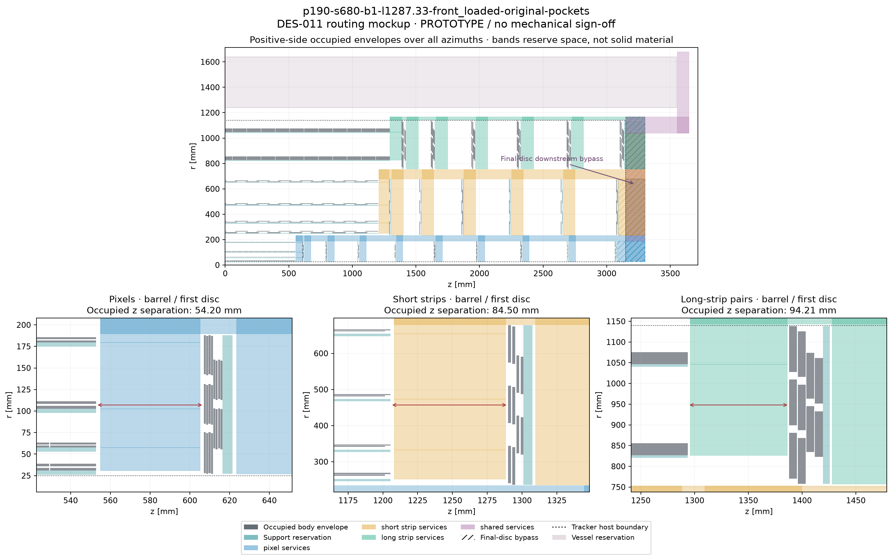

# DES-011 — Service-constrained placement results

**PROTOTYPE.** Response to [PR #25 expert direction](https://github.com/asalzburger/nodd/pull/25#issuecomment-5891018641),
observed at `9b5b7f2aa14ad38434480c29666187aa893b73d3`.
[DES-011](../design/DES-011-service-constrained-tracker-optimization.md) governs
this separate follow-up. PR #24's tracker remains an unapproved hypothesis.
No production geometry, material or sign-off changes.

## Working-baseline decision — 2026-09-30

The user selected **the original-pocket control** as the new tracker working
baseline: `p190-s680-b1-l1287.33-front_loaded-original-pockets`.
[DES-011 SO-C19](../design/DES-011-service-constrained-tracker-optimization.md#working-baseline-selected-on-2026-09-30)
records the exact geometry, retained bypass, scope and rationale. Larger silicon
area is no longer a driving concern. This is a human selection from the retained
comparison, not a change to the frozen optimization ranking or numerical evidence.
Engineering qualification and production sign-off remain outstanding.

## Final corrected results

Numerical source: `ac61f766b34f9bb60748e8fc4258a41037ca1e33`. Eight primary configurations and three
radius/pocket comparisons were executed under the corrected individual-component
constraint. Selection was frozen before final validation. Each of five retained
cases has 12,064 directions × three modes = 36,192 mode-track evaluations; the
4096-direction random cohort uses fresh seed 202609294. All 360 native ACTS
trajectories agree with the finite-surface oracle, including explicit central
probes. Geometry, service inventories, aggregate capacity and known circular
component/throat fit checks pass. Conservative/stress capacity scenarios fail.

| Layout | Physical silicon, m² | Active silicon, m² | Mean usable stations | Worst-mode p95 maximum inter-station gap, mm | Fixed-reference missed stations | Dense coverage gates |
| --- | ---: | ---: | ---: | ---: | ---: | --- |
| PR25 baseline | 177.303 | 172.971 | 8.2284 | 1378.66 | 17.539% | Control |
| Area candidate | 199.964 | 195.090 | 8.8637 | 1099.18 | 12.240% | PASS |
| Coverage candidate | 196.473 | 191.680 | 9.0758 | 1008.17 | 11.047% | PASS |
| Original-pocket control | 197.250 | 192.435 | 9.0182 | 1009.57 | 10.938% | PASS |
| Spacing candidate — FAIL | 187.365 | 182.703 | 8.8281 | 936.09 | 12.680% | **FAIL** |

The trained coverage candidate raises sampled mean stations by 10.30%
and physical silicon by 10.81% relative to PR25. These global gains coexist
with local losses below. The spacing candidate loses 17 straight-track long-strip
station opportunities (10,984 → 10,967 across 12,064 rays), failing the frozen
subsystem-mean guard. **It is not recommended**, despite its smaller gap statistic.
No validation-based reranking replaces the frozen training roles.

### Per-subdetector totals

Mean crossings and stations average the three equally sized trajectory-mode samples.
Full per-mode counts, fixed/candidate-local misses, gap distributions and random
cohort statistics are in the [generated numerical report](DES-011-optimization/results.md).

| Layout | Subdetector | Physical silicon, m² | Active silicon, m² | Mean sensor crossings | Mean usable stations |
| --- | --- | ---: | ---: | ---: | ---: |
| PR25 baseline | Pixels | 5.024 | 4.706 | 6.3347 | 4.4660 |
| PR25 baseline | Short strips | 47.948 | 46.486 | 3.6799 | 2.8854 |
| PR25 baseline | Long strips | 124.331 | 121.780 | 2.2618 | 0.8770 |
| Area candidate | Pixels | 5.024 | 4.706 | 6.4783 | 4.5765 |
| Area candidate | Short strips | 55.705 | 54.006 | 4.6093 | 3.3182 |
| Area candidate | Long strips | 139.234 | 136.378 | 2.6262 | 0.9690 |
| Coverage candidate | Pixels | 5.768 | 5.406 | 7.1089 | 4.8784 |
| Coverage candidate | Short strips | 51.903 | 50.319 | 4.0757 | 3.2104 |
| Coverage candidate | Long strips | 138.802 | 135.954 | 2.6587 | 0.9870 |
| Original-pocket control | Pixels | 5.847 | 5.480 | 7.0599 | 4.8560 |
| Original-pocket control | Short strips | 52.169 | 50.577 | 4.0514 | 3.1958 |
| Original-pocket control | Long strips | 139.234 | 136.378 | 2.6126 | 0.9663 |
| Spacing candidate — FAIL | Pixels | 5.847 | 5.480 | 6.6844 | 4.6657 |
| Spacing candidate — FAIL | Short strips | 57.188 | 55.443 | 4.3965 | 3.2723 |
| Spacing candidate — FAIL | Long strips | 124.331 | 121.780 | 2.2748 | 0.8901 |

### Local losses and recommendation

The coverage candidate preserves the central guard but adds zero-long-strip rays
in the straight eta∈[-1,-0.5), vertex-z=0 bin: **5 → 15 of 160**. In positive
curvature, pixels at eta∈[1.5,2), vertex-z=150 mm have **0 → 4 of 128** zero-hit
rays. The failed spacing candidate loses one long-strip station on average
(2 → 1) for 128 straight rays at eta∈[-1.5,-1), vertex-z=-150 mm. Random-cohort
local regressions also remain. The [independent audit](DES-011-optimization/local-coverage-audit.md)
retains all before/after bins, paired hashes and central outcomes. Passing the
declared guards does not establish pointwise non-regression or hermeticity.

**Recommendation at study publication (2026-09-29):** carry the inherited-pitch, constant-corridor design
into review with both the coverage candidate and the original-pocket control.
The control retains more routing depth, has 9.0182 mean stations versus 9.0758,
a 1009.57 mm gap statistic versus 1008.17 mm, and 0.777 m² more silicon. It has
no increased zero-hit fraction in any measured structured or random eta bin.
Its numerical role remains a comparison control, not a newly optimized winner.
The subsequent human selection above makes it the working baseline. The area candidate offers 199.964 m² with fewer average hits. Avoid
selecting a layout solely because it has the lowest inter-hit-gap statistic.

### Routing dimensions and mockups

| Layout | Pixel / short / long constant trunk widths, mm | Minimum reference capacity / demand |
| --- | --- | ---: |
| Coverage | 44 / 72 / 25 | 1.10049 |
| Area | 44 / 76 / 25 | 1.10109 |
| Spacing — coverage FAIL | 44 / 74 / 23 | 1.10049 |
| Original-pocket control | 44 / 73 / 25 | 1.11100 |

For all three compact candidates, positive first-disc centres are
605.7 / 1275.5 / 1331.65 mm (pixels / short / long strips). Physical occupied
barrel-to-disc clearances are **48.2 / 64.5 / 22.206 mm**. Negative pixels use
|z|=604.7 mm and 47.2 mm clearance; the strip values are symmetric. The original
pocket control has positive centres 611.7 / 1295.5 / 1403.65 mm and clearances
54.2 / 84.5 / 94.206 mm. Actual traffic and the necessary component dimensions
therefore keep the first discs farther away than the requested 10 mm minimum.

All source groups are conserved, all main/bypass partitions are disjoint and
complete, and both terminal routes carry every signed-end source. The tightest
known-item passage has only 0.6 mm excess beyond the adopted 13.4 mm cable and
the two boundary skins. This is a necessary dimension check, not bend, connector
or installation qualification. [Independent service audit](DES-011-optimization/service-source-audit.json),
[individual-fit audit](DES-011-optimization/individual-fit-audit.json).

[Selected baseline transverse module/support/service views](DES-011-optimization/views/p190-s680-b1-l1287.33-front_loaded-original-pockets/transverse-sections.png)
and [full comparison figure](DES-011-optimization/views/comparison.png); PDF versions
and all five case views accompany the [view manifest](DES-011-optimization/views/views.json).
The failed spacing case is marked in the comparison figure. Bands reserve space;
they are not a material simulation or individual cable placement.

## What the study changes

The finite sensor/module shapes remain those of DES-009. Refill the endcap
annuli, retain constant subsystem trunk widths, and place first discs as close
to their barrels as complete local routing and at least 10 mm physical clearance
allow. A final-disc bypass uses separate downstream space and joins the fully
counted common exit. It does not erase its cables, power or cooling.

The bounded search varies two trunk inner radii, final-disc extraction, long-strip
barrel half-length and three disc schedules, followed by small intermediate
barrel-radius shifts. Inner two pixel radii and outer tracking radius remain
fixed. Separate coverage, spacing and area selections are frozen on training
samples before dense validation. This is not a global optimizer or a resolution
prediction. Existing finite-surface ACTS checks are appropriate here; IdRes was
not used, and ideal-layer covariance cannot establish finite-module coverage.

## Failure found and retained

The [first run](DES-011-optimization-rejected-even-rows/README.md) completed at
source `6c882257c368927732315dbc756f1b89263d95af`, with all 240 sampled native
trajectories agreeing. Its mean-only ranking nevertheless selected 24-row
long-strip barrels with a 15.3167 mm stereo-projected active gap around z=0.
All 96 eta=0/zvertex=0 rays per mode lost both long-strip stations. The native
sample contained no eta=0 tracks. This is an explained coverage rejection,
not a native propagation failure. Inputs, outputs, figures and the
[central diagnostic](DES-011-optimization-rejected-even-rows/central-seam-diagnostic.json)
remain retained, rather than replaced by corrected evidence.

The revised protocol adds 23-row long-strip options with nominal half-lengths
1287.3333333 mm (inherited PR #25 row pitch) and 1300 mm (stretched rows):
a central module row and 12/11 modules on positive/negative half-staves, within
the inherited 12-module harness cap. The 1350 mm / 24-row alternative remains a
rejected control; the 1400 mm / 25-row alternative tests the extra positive-side
harness burden. No sensor, staggering policy or harness limit changes. The inherited-pitch
option preserves existing longitudinal barrel seams; the stretched option
needs a radius shift to avoid a newly blind sampled eta/vertex stratum.
Exploratory seeds pass physical, mean and central constraints; final ranking
requires the full local guard after the bounded radius exploration.

A strict central mean/zero-hit guard and a no-new-completely-blind eta/vertex
stratum guard now accompany mean-hit selection. Other local regressions are
reported explicitly. Native samples add eight central azimuths in every mode.
The dense grids serve regression checks after this diagnosis; a fresh 4096-ray
random cohort with seed 202609293 in that run (202609294 in the final envelope follow-up) is independent of the original run and ranking.

## Individual cable passage rejection

The [second full scan](DES-011-optimization-rejected-pocket-depths/README.md)
at `10203d9a3f41d82cb467a7deb75e8293b0f1cc95` fixed the
coverage guard, but an independent service audit exposed another missing gate.
Some 10 mm disc pockets and 15 mm long-strip barrel turns passed aggregate area
capacity while failing to contain the budget's individual round components.
The 13.4 mm strip power cable plus 2 mm skins on both boundaries requires at
least 17.4 mm total depth, rounded to 18 mm; the 12 mm cooling return pipe alone
also fails those passages. These compact candidates are rejected on this
necessary dimensional check, regardless of their coverage or ACTS results.
The original larger-pocket control is assessed separately.

The service builder now enforces both aggregate area and individual-item passage
checks, including finite joining throats. A bounded eight-primary-case follow-up
within the earlier candidate region uses that correction and
fresh random validation seed 202609294. It is explicitly a scoped follow-up,
not a claim that the complete earlier scan satisfies the added constraint.

## Pocket comparison and support cost

The original-pocket control matches the **unshifted primary search seed**, not
the final coverage winner, which also shifts intermediate barrel radii by −10 mm.
Its module count, area and short-strip trunk width therefore differ from that
winner. Do not attribute their entire difference to pocket depth.

For the corrected matched unshifted seed, the training mean station count is
8.86618 with dimension-constrained compact pockets and 8.84276 with the original
pocket floors: a difference of 0.02342 stations (0.26%). Their silicon inventories are identical. The worst-mode
95th percentile of maximum inter-station gap changes from 1005.41 to 1006.23 mm.
These are **corrected-model training diagnostics**, not an independent matched-pair validation or evidence of mechanical qualification.
They suggest retaining the larger-pocket option while engineering connector and
cooling bends; the compact floor alone gives little sampled benefit for this
seed. Finalists and their tradeoffs are validated separately above.

Keep constant trunk widths for simpler supports. The final-disc bypass can
reduce upstream width, but adds a distinct downstream extraction and still needs
the full common-exit capacity. In a corrected-model paired unshifted p190/s680 inherited-pitch training audit, omitting
final-disc traffic from the main trunks reduces pixel/short/long widths from
46/76/27 to 44/73/25 mm. It recovers **no additional silicon area** in that pair
and changes mean stations from 8.85036 to 8.86618 (+0.01582). Both cases pass
geometry, capacity, known individual-component fit and training coverage gates;
inter-station and boundary-gap statistics are unchanged. The bypass is therefore an
optional engineering tradeoff, not an automatic recommendation for more complex
supports. The no-bypass counterpart is retained as a separate [paired training audit](DES-011-optimization/paired-bypass-training.json),
not a dense/native finalist; a final engineering choice needs matched validation. Preserving inherited
longitudinal row pitch avoids new coincident seams without adding z staggering.
None of these geometric results prices fabrication or qualifies a support design.

## Interpretation limits

Counts are usable stations, requiring both stereo faces of the same long-strip
module; sensor hits are reported separately. Area sums silicon surfaces,
including projected overlaps; it is not the union of covered area. Spacing is
3D path length, with origin/host-boundary gaps also reported to expose missing
first/last hits. Fewer than two stations gives undefined inter-hit spacing.

The luminous domain is x/y∈[0,1] mm, z∈[-150,150] mm, eta∈[-4,4]. Bent cases mean
**pT=1 GeV**, both charges, constant 3 T, with no material interactions or fitted
track resolution. Neither grids nor random rays prove continuum hermeticity.
Odd row count repairs the observed central hole but other unstaggered seams
remain. Existing phi losses and smaller local regressions must remain visible.

Reference routing uses capacity ≥ 1.1 × demand, integer millimetre rounding and
finite junction/throat checks. Conservative packing and stress scenarios remain
explicit failures. Nominal 10 mm pocket floors are overridden by known
individual-component bounds, currently at least 18 mm for strip passages.
These dimensions still do not qualify connector/bend space; the original larger
pocket floors are a separate control.
The proposed vessel opening, material budgets, structural attachments, thermal
performance, hydraulics and detailed electrical architecture remain unsigned.
ACTS checks sensitive intersections, while geometric service checks cover
reserved volumes; neither qualifies the engineering.

## Provenance and repeatability

Public source classifications and dimension locators remain in DES-009/010 and
`reference/manifest.yaml`; no new external detector facts are introduced.
Search ranges, local coverage guards and pocket assumptions are explicit
**NODD DESIGN CHOICE** proposals, with no human approver recorded. The necessary
diameter inequality is explicitly classified **INFERENCE** from retained inputs.
The [workflow](../../tools/module_layout/README.md#service-constrained-placement-follow-up)
snapshots all inputs, complete selected geometry, source hashes, sample seeds,
budget results and native audit metadata in a fresh directory. Regenerate after
module-shape updates; do not reuse old inventories or inferred cut lists.

The local ACTS runtime uses the authorized sister checkout and existing
step-size/sensitivity binding overlay. Its source HEAD and installed extension
hash are recorded separately. Spack registry fingerprints had changed; runtime
imports were reverified and the warning retained. No shared dependencies were
installed or rebuilt in this task.

## Checks actually run

- Final module suite: 136 tests, 133 passed and three ACTS-dependent skips in
  system Python; native validation separately passed 360/360 trajectories in the
  verified runtime, zero mismatches, maximum trajectory residual 2.05×10⁻⁷ mm.
- Independent source/input/artifact hashes, service inventory conservation,
  individual component passage and local-coverage guards were recomputed.
- Twenty-two PNG/PDF mockups/comparisons rendered from retained layouts; routing,
  transverse and comparison figures were inspected. The renderer marks the
  failed dense-coverage candidate and records its own post-run source hash.
- All 21 original DES-010 artifacts remain byte-identical. The two rejected
  studies remain distinct, with their original results and rejection diagnoses.
- Dashboard validation/build and session-log validation run before publication;
  exact commands and outcomes are retained in the
  [session record](../../logs/codex/SESSION-2026-09-29-service-optimization.md).

Exact client-reported token counters are unavailable for this task; the session's
usage array remains empty. No historical counts are allocated to this work.
