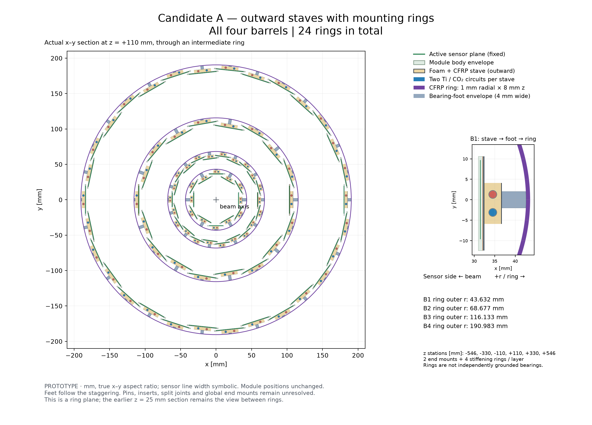
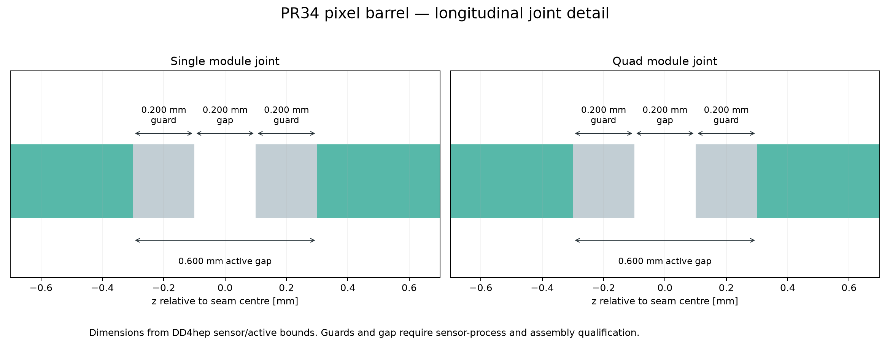

# Selected pixel barrel baseline: drawings and DD4hep

The explicit human instruction after PR #34 merged selects `packed-200um` as the
working barrel baseline. This implementation follows DES013 Z-C09 and DES012
PB-C14–18, within the existing standalone **PROTOTYPE**. Formal sensor, mechanical,
thermal and production sign-off remains pending. The governing source layout is
PR34 head `ac56d6db1dd2dc40882f5ed39a76125096171a06`, merged as
`4fd92926c61bc8281055ec21befcc43ebbe1c30c`; its compressed SHA-256 is
`e3abb11dd779daef410290186318f9e696c7d7a9a330841badb9a1773c17a842`.

## Technical drawing set

All sheets are available as SVG, PDF and PNG. Module/joint sheets use the actual
generated DD4hep compact. Assembly and routing sheets use the same pinned layout,
support settings and regenerated service inventory as the compact exporter.
They are technical layout drawings, not toleranced manufacturing drawings.

| Sheet | PDF | Editable vector |
| --- | --- | --- |
| Single module face and radial stack | [PDF](drawings/module-single.pdf) | [SVG](drawings/module-single.svg) |
| Quad module face and radial stack | [PDF](drawings/module-quad.pdf) | [SVG](drawings/module-quad.svg) |
| Longitudinal joint, guards and assembly gap | [PDF](drawings/z-gap-detail.pdf) | [SVG](drawings/z-gap-detail.svg) |
| Four stave packing patterns and mounting stations | [PDF](drawings/stave-packing.pdf) | [SVG](drawings/stave-packing.svg) |
| Fully mounted barrel, x–y | [PDF](engineering/mounted/barrel-all.pdf) | [SVG](engineering/mounted/barrel-all.svg) |
| B1 mounted section | [PDF](engineering/mounted/barrel-B1.pdf) | [SVG](engineering/mounted/barrel-B1.svg) |
| B2 mounted section | [PDF](engineering/mounted/barrel-B2.pdf) | [SVG](engineering/mounted/barrel-B2.svg) |
| B3 mounted section | [PDF](engineering/mounted/barrel-B3.pdf) | [SVG](engineering/mounted/barrel-B3.svg) |
| B4 mounted section | [PDF](engineering/mounted/barrel-B4.pdf) | [SVG](engineering/mounted/barrel-B4.svg) |
| Mounting and support, r–z | [PDF](engineering/mounted/barrels-rz.pdf) | [SVG](engineering/mounted/barrels-rz.svg) |
| Sections between rings: full / B1 / B2 / B3 / B4 | [full](engineering/outward/barrel-all.pdf), [B1](engineering/outward/barrel-B1.pdf), [B2](engineering/outward/barrel-B2.pdf), [B3](engineering/outward/barrel-B3.pdf), [B4](engineering/outward/barrel-B4.pdf) | [full SVG](engineering/outward/barrel-all.svg) |
| Cables and cooling, x–y: full / B1 / B2 / B3 / B4 | [full](engineering/services/barrel-all.pdf), [B1](engineering/services/barrel-B1.pdf), [B2](engineering/services/barrel-B2.pdf), [B3](engineering/services/barrel-B3.pdf), [B4](engineering/services/barrel-B4.pdf) | [full SVG](engineering/services/barrel-all.svg) |
| Services, r–z | [PDF](engineering/services/barrels-rz.pdf) | [SVG](engineering/services/barrels-rz.svg) |
| Radial extraction and axial handoff | [PDF](engineering/services/radial-extraction.pdf) | [SVG](engineering/services/radial-extraction.svg) |
| Cumulative cable inventory along staves | [PDF](engineering/services/cable-accumulation.pdf) | [SVG](engineering/services/cable-accumulation.svg) |




“Fixed/unchanged” positions in reused assembly-sheet legends mean fixed to the
**selected PR34 source**, not identical to the old PR29 row geometry. Assembly
sheets show occupied module envelopes and symbolic active lines; the module
sheets resolve the implemented laminate. The internal stack now has an explicit
DD4hep effective representation; its engineering qualification remains open.

## Geometry and inventory

| Barrel | Radius mm | Staves | Rows/stave | Modules | Active chips | z pitch mm | Passive stave endpoints mm |
| --- | ---: | ---: | ---: | ---: | ---: | ---: | --- |
| B1 | 34 | 12 | 53 single | 636 | 636 | 20.6 | −551.0, +552.8 |
| B2 | 60 | 22 | 53 single | 1,166 | 1,166 | 20.6 | −551.0, +552.8 |
| B3 | 106 | 18 | 26 quad | 468 | 1,872 | 40.8 | −552.8, +552.8 |
| B4 | 182 | 30 | 26 quad | 780 | 3,120 | 40.8 | −552.8, +552.8 |
| Total | | 82 | | **3,050** | **6,794** | | |

Each active patch is 19.2 mm in phi × 20 mm in z, with a 384 × 400 grid at
50 µm pitch. The approximate 21 × 20 mm die places its 1.8 mm peripheral allowance
in phi. Sensor edge guards are 0.2 mm in z and 0.5 mm in phi; 0.2 mm physical
inter-module clearance gives a 0.6 mm active gap. Quad internal seams remain
0.2 mm. Single substrates are 20.2 × 20.4 mm; quads 39.6 × 40.6 mm. Bond loops,
bias structures, encapsulation, dicing/placement tolerances and connectors remain
unqualified; the drawing does not turn die periphery into active silicon.

Single module occupied bodies are offset −0.9 mm along local u. The factory now
keeps that translation separate from the normal-defined stave rotation; otherwise
using the polar angle of the shifted centre would incorrectly rotate every patch.
All source module/patch identifiers are preserved. This source revision changes
the ID set relative to PR29, while retaining the field scheme and checking unique
packed volume/pixel IDs; files from the two geometries must not be mixed.

The passive support and evaporators retain the PR29 endpoints so the rings at
±546 mm remain attached. Active rows occupy shorter spans: single bodies
[−545.8,+545.8] mm and quads [−540.6,+520.0] mm. The rings and radial feet are
rechecked against the shifted/wider bodies; cooling collection begins at the
physical pipe endpoint to avoid counting local evaporator length twice.
Counts also include 24 rings, 492 feet, 164 evaporators, 3,050 cumulative cable
segments and 96 disjoint effective end-service cells. Endcaps/strips are untouched.

## Executed validation

Environment: DD4hep **1.38** (`/7deaacd`), ROOT **6.40.04**, Spack Python **3.14.5**;
Geant4 11.4.2 is installed but transport was not run. Node preflight reports changed
setup/lockfile fingerprints (exit 2); actual imports, compilation and runtime
checks succeeded without modifying shared dependencies. Drawings used Matplotlib
3.11.2. Generation occurred on base `4fd9292` with task changes present; retained
reports record that base plus individual producer/input hashes, not a falsely
clean production commit. The session record and artifact manifest link the work.

- [CTest](ctest.txt): **3/3 pass** (12 exporter/validator tests, native geometry check,
  ROOT export/reload). [Support tests](support-tests.txt): **19 pass**, including a
  negative test rejecting passive spans shorter than occupied module rows.
- [Native nominal report](nominal.json): **6,794/6,794** sensitive centres, normals,
  dimensions and identifiers match frozen source patches; 33,970 pixel-cell checks;
  43,250 expected entity count/position/volume/mass checks; **zero ROOT overlaps**
  at 10⁻⁵ mm. Existing numerical tolerances are unchanged.
- All 75 deterministic ROOT navigation/material rays complete. Origins are
  (0,0,0), (1,1,−150), (1,1,+150) mm; eta = −2,−1,0,1,2; phi =
  0,0.37,1.11,2.29,4.73 rad. Radiation and interaction lengths are retained per ray.
- [PR29 control](pr29-control.json) was rebuilt/exported in the same runtime using
  `detector/config/pixel-barrel-pr29.json`: 2,750 modules / 6,206 patches, zero overlaps.
  [Comparison](baseline-comparison.json) retains all count/mass/ray deltas. Independent
  source-box intersections reproduce both complete ROOT ray cohorts. Ideal
  mid-plane intersections are also retained: a grazing finite-thickness edge clip
  explains two old-control and four new-layout differences from infinitely thin sensor-plane counts.
- Six rays lose crossings, 31 gain and 38 are unchanged. Five losses are at
  origin z=+150 mm, eta=+2, where the selected quad row phase leaves a shorter
  positive-z end; the sixth loses a duplicate B3 crossing at z=−150, eta=−2,
  phi=2.29. These reproduce the frozen source boxes, not a DD4hep placement error.
  The sparse cohort is **not** a new acceptance estimate. PR34's matched ACTS
  coverage study remains the coverage evidence; no Geant4 transport, ACTS conversion
  of this DD4hep assembly or reconstruction performance is claimed here.
- [ROOT roundtrip](root-display.json), `geoDisplay -load_only`, and
  [nodehammer import/export audit](nodehammer.json) pass. The latter checks
  43,250 entities and 6,794 sensitive tags through NHB reload and full/sensitive/stave
  tessellation and GLB export. No new GUI screenshot or browser qualification is claimed.

## Mass, services and remaining cooling limit

The complete modeled assembly weighs **25.337 kg**, versus **24.054 kg** for the
same-runtime PR29 control: **+1.282 kg** from the extra modules/chips, changed support
widths/mount envelopes and recalculated services. This is model mass, including
provisional mixtures and full-liquid coolant; it is not a weighed assembly.
The unweighted 75-ray mean X/X0 changes from 0.28587 to 0.32000; many rays run along
supports/services, so these values are navigation diagnostics, not a tracker
angular material average. Individual X/X0 and interaction-length deltas remain
visible in the comparison.

[Copper sensitivity](cable-comparison.json), using 5%, 10%, 20% copper by cable
footprint volume, gives 21.360 / 25.337 / 33.290 kg. All three native validations
pass with identical geometry/IDs/paths, unchanged non-cable materials and monotonic
radiation-length response. The provisional cable composition remains configurable.

The [refreshed service screen](engineering/screening.json) conserves 6.092 L of
ancillary cable footprint and 2.786 L of link footprint, plus 0.06259 L transport
Ti and 0.61753 L full-liquid transport CO₂. Local evaporators are accounted for
separately. Reference routing fits: peak radial/axial utilization **0.716 / 0.560**.
Conservative and stress scenarios still fail (radial/axial **1.708 / 1.531** and
**2.943 / 2.752**); reference fit is not certification of all routing scenarios.
Effective end cells preserve inventory but do not resolve individual bends or
manifolds. Extra clips, connectors and bond/flex details remain omitted as documented.

[Heat balance](engineering/thermal.json) retains the inherited flows: 1.3 g/s per
single circuit and 2.5 g/s per quad circuit, two circuits per stave, 328.4 g/s total.
Nominal chip power is **18.262 kW** (+1.581 kW). At the inherited 1.5 stress factor
and 2/3 worst-circuit heat split, singles reach quality **0.449919** and quads
**0.457050**, against a **0.45** ceiling. Singles have essentially no margin; quads
**fail**. A heat-balance-only minimum for quads is 2.55035 g/s per circuit. This
implementation neither silently increases flow nor claims pressure-drop/dryout
qualification. Expert thermal/hydraulic work remains required before acceptance.

## Repeat and inspect

Follow [detector/README.md](../../../../detector/README.md) for dependency activation,
build, coordinated service refresh and drawing regeneration. Refresh is sequential:
finish `refresh.py --draw --update-config`, then build/test, then draw from compact,
then export viewers. It is deliberately hash-pinned and rejects partial updates.

For the retained comparison, rerun:

```sh
python3 -B tools/pixel_barrel_dd4hep/compare_baselines.py \
  --old docs/validation/DES-012/PR34/pr29-control.json \
  --new docs/validation/DES-012/PR34/nominal.json \
  --old-layout docs/validation/DES-011-optimization/cases/p190-s680-b1-l1287.33-front_loaded-original-pockets/layout.json.gz \
  --new-layout docs/validation/DES-013-pixel-z/data/packed-200um/layout.json.gz \
  --sensor-thickness-mm 0.15 \
  --output build/pixel-baseline-comparison.json
```

The optional source audit needs NumPy; ordinary report comparison does not.
To create fresh control inputs use `export.py --config detector/config/pixel-barrel-pr29.json`,
then the same `validate.py` invocation as the nominal compact (see detector README).
Use [cable-cu05.json](cable-cu05.json) and [cable-cu20.json](cable-cu20.json) for the
retained sensitivity cases. `compare_materials.py` compares the resulting three reports.

The updated compact is `build/dd4hep/detector/compact/pixel-barrel.xml` and ROOT file
`build/dd4hep/detector/pixel-barrel.root`. The nodehammer workflow creates
`build/nodehammer/pixel/{full,sensitive,stave}.nhproj`. These large, reproducible
artifacts are local build outputs. Reopen the newly generated files rather than
an old compact probe or an earlier packed viewer project.

No new literature-based numerical assumptions are introduced. Public-source
provenance remains in DES001/002/012/013 and the existing reference manifest; new
values here are either the explicit human selection, its derived inventories or
measured software validation results. A new evidence directory preserves previous
PR29 and PR34 study outputs. ADR003 artifact policy continues to apply.
