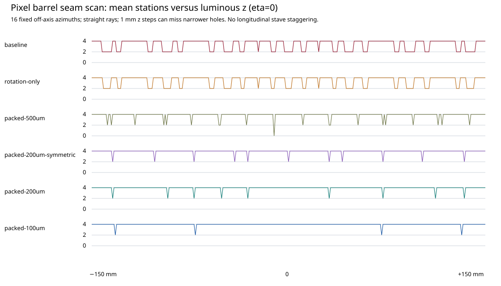

# Recommendation for review

**Take the chip-centred `packed-200um` geometry forward as a prototype target.**
Keep the existing working baseline until the sensor edges, assembly clearances,
lateral services and increased cooling load have been reviewed. No numerical
hypothesis in this PR has human engineering sign-off.

Rotate the ASIC/module matrix by 90° so that the readout peripheral ledge and
bond/flex allowance run in phi. Use a 0.2 mm inactive sensor edge on each z end
and 0.2 mm clear mechanical separation between occupied module bodies. Mount
from behind or laterally on the continuous outward support, without a z-end
clamp. The resulting active-to-active inter-module z gap is 0.6 mm, compared
with about 4.30 mm for the baseline single and 7.55 mm for the baseline quad.
The quad's separate 0.2 mm internal readout seam remains inactive.

Retain 12/22/18/30 staves and the four radii. Use 53 single-module rows on B1/B2
at 20.6 mm pitch and 26 quad rows on B3/B4 at 40.8 mm pitch. The common row
phase puts an active chip at z=0. This has no relative z staggering between
staves. It moves seam locations; it does not eliminate them. The occupied quad
range is asymmetric, −540.6 to +520.0 mm, leaving end space that is explicitly
included in the coverage loss. Do not stretch the pitch to consume that space.

## Measured benefit and costs

On 4,096 matched independent directions/vertices, missed ideal barrel-layer
opportunities fall from 16.54% to 3.87% for straight tracks, 16.43% to 3.86% for
positive 1 GeV pT tracks, and 16.65% to 4.01% for negative tracks in 3 T. The
fraction of eligible straight tracks hitting every reachable barrel layer rises
from 59.02% to 88.62%. These are finite, uniform eta/phi/luminous-box samples,
not physics-event efficiencies or proof of hermeticity.

The straight paired comparison improves 1,257 tracks, worsens 175 and leaves
2,664 unchanged. Every tested off-grid eta band of width 1 and z band of width
100 mm improves in aggregate in all three primary modes. Individual holes and
end losses remain; averaged gain is not a pointwise dominance claim. Other
subdetectors and the pixel endcaps have identical per-track counts and unchanged
geometry. Total-p=1 GeV is retained as a separate sensitivity check.

There are 3,050 modules instead of 2,750 (+10.91%), and 6,794 ASICs instead of
6,206 (+9.47%). Pixel-barrel physical sensor area grows from 2.5574 to 2.7491 m²
(+7.49%); full-tracker sensor area grows from 197.2498 to 197.4415 m². The source
chip matrix areas do not change. Nominal ASIC power rises from 16.6817 to
18.2623 kW (+1.5805 kW), before new flex/connection losses or sensor leakage.
Power and data routing must be regenerated for the increased inventory; existing
service clearances alone do not establish cable capacity.

## Cooling amendment required before implementation

**INFERENCE from DES002's inherited heat-balance assumptions:** B1/B2 reach
exit quality 0.44992 against the selected ceiling 0.45, leaving effectively no
engineering margin. B3/B4 reach 0.45705, which **fails** that ceiling. This PR
retains that failure and does not silently change the cooling baseline.

For the quad staves, solving the same heat balance requires at least
2.5504 g/s per circuit (two circuits/stave) at 1.5× ASIC power, 2/3 maximum heat
share and inlet quality 0.1. A proposed 2.6 g/s trial would give about 0.4433,
but it is **not a qualified replacement flow**: pressure drop, two-phase
stability, manifolds, plant capacity, sensor/leakage heat, electronics losses
and contact thermal resistance require renewed analysis. The single staves
also need deliberate margin beyond the barely sufficient inherited 1.3 g/s.

## Alternatives and residual holes

- Rotation alone retains the original row placement and only reaches 13.8%
  missing opportunities. Removing longitudinal service space supplies most of
  the gain.
- The 0.5 mm edge case reaches about 5.7%, but its particular regular pitches
  align all four barrel gaps at z=−11 mm for the straight eta=0 scan. A thicker
  guard does not automatically yield a more robust layout. See the dedicated
  native seam control; this is a geometric rejection of this phase, not of
  all possible 0.5 mm sensor designs.
- The symmetric 0.2 mm packing has similar off-grid averages, but the quad
  inter-chip seams remove two barrel stations at eta=z=0. The selected phase
  restores four hits on those probes.
- A 0.1 mm edge and 0.1 mm assembly gap lower off-grid missing opportunities to
  3.05–3.17%, with the same chip count for the chosen chip-centred packing.
  The additional gain is below one percentage point and entails a more demanding
  sensor/tolerance target. Retain this as sensitivity, not the preferred target.

The plotted 1 mm z scan can miss sub-millimetre holes. Finite-edge native controls
probe 1 µm inside and outside the actual z bounds. Neither test establishes
continuous hermeticity or physical sensor response. The next review should
resolve a qualified sensor edge, exact ASIC seal-ring/bond footprint, lateral
flex and mounting interfaces, tolerance stack and cooling/service amendment.
Only then should a separate change update the DD4hep working baseline.
