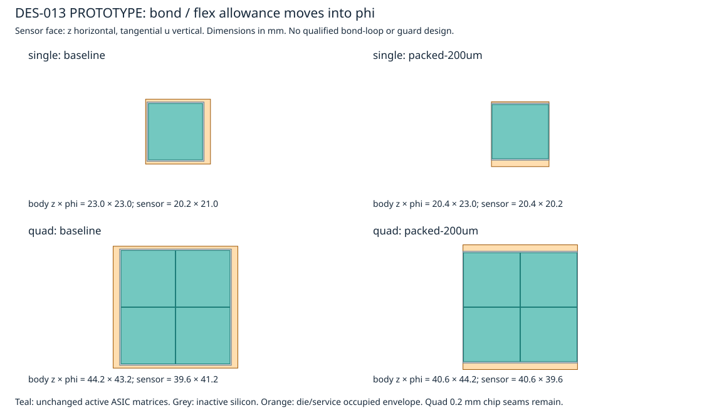

# DES-013 — Pixel barrel z-coverage prototype results

**Pending human approval.** Existing detector defaults are unchanged. See [design contract](../../design/DES-013-pixel-barrel-z-coverage.md) and [reproduction commands](../../../tools/pixel_z_coverage/README.md).

## Matched off-grid comparison

4,096 directions uniform in eta ∈ [-4,4], phi ∈ [0,2π], x/y ∈ [0,1] mm and z ∈ [-150,150] mm. Same rays for every layout. Fractions describe this sampling measure. A missing opportunity means an active hit is absent on a reachable ideal barrel layer; extra hits elsewhere cannot cancel it.

| Case | Modules | Chips | Sensor m² | Miss straight | Miss q+ | Miss q− | All reachable hit, straight | Mean barrel stations, straight |
| --- | --- | --- | --- | --- | --- | --- | --- | --- |
| baseline | 2750 | 6206 | 2.5574 | 16.54% | 16.43% | 16.65% | 59.02% | 2.2056 |
| rotation-only | 2750 | 6206 | 2.5574 | 13.84% | 13.68% | 13.98% | 64.71% | 2.2761 |
| packed-500um | 2982 | 6726 | 2.7717 | 5.72% | 5.54% | 5.67% | 83.55% | 2.4822 |
| packed-200um-symmetric | 3050 | 6794 | 2.7491 | 3.94% | 4.04% | 4.01% | 88.47% | 2.5315 |
| packed-200um | 3050 | 6794 | 2.7491 | 3.87% | 3.86% | 4.01% | 88.62% | 2.5339 |
| packed-100um | 3050 | 6794 | 2.7319 | 3.17% | 3.05% | 3.14% | 90.54% | 2.5469 |

Bent primary sample: pT=1 GeV, constant 3 T, both charge signs. Silicon area counts physical sensor substrates once (including guards and chip seams), not ASIC silicon. All cases retain 82 staves and the four radii.

## Full tracker and separate momentum sensitivity

| Case | Mean total stations, straight | Total sensor m² | Mean barrel stations at eta=z=0 | Miss total-p=1 GeV q+ | Miss total-p=1 GeV q− |
| --- | --- | --- | --- | --- | --- |
| baseline | 8.9949 | 197.2498 | 2.00 | 16.25% | 17.37% |
| rotation-only | 9.0654 | 197.2498 | 2.00 | 13.78% | 14.48% |
| packed-500um | 9.2715 | 197.4642 | 4.00 | 5.34% | 5.84% |
| packed-200um-symmetric | 9.3208 | 197.4415 | 2.00 | 3.65% | 3.92% |
| packed-200um | 9.3232 | 197.4415 | 4.00 | 3.73% | 3.91% |
| packed-100um | 9.3362 | 197.4243 | 4.00 | 3.05% | 3.15% |

The eta=z=0 diagnostic includes central and luminous-boundary grid azimuths. It is a seam probe, not an event-weighted average. Total-p curves follow the existing first-host-exit or transverse-half-turn convention; low-pT curling is consequently truncated.

## Per-layer and subsystem results

Tables below use the full matched 7,312-track cohort per primary mode (angular grid + luminous boundaries + random sample). Machine-readable summaries also retain eta and phi profiles, subsystem/region counts, sensor hits, missing stations, distributions, and per-track arrays. Endcaps and strips are byte-for-byte unchanged.

### straight

| Case | B1 miss | B2 miss | B3 miss | B4 miss | Pixel stations | Short-strip stations | Long-strip stations |
| --- | --- | --- | --- | --- | --- | --- | --- |
| baseline | 15.54% | 16.37% | 14.83% | 16.23% | 4.8089 | 3.1597 | 0.9822 |
| rotation-only | 13.64% | 13.23% | 12.60% | 14.13% | 4.8693 | 3.1597 | 0.9822 |
| packed-500um | 5.90% | 5.82% | 4.43% | 5.10% | 5.0658 | 3.1597 | 0.9822 |
| packed-200um-symmetric | 3.57% | 3.06% | 5.82% | 5.22% | 5.0990 | 3.1597 | 0.9822 |
| packed-200um | 3.57% | 3.06% | 4.58% | 3.76% | 5.1132 | 3.1597 | 0.9822 |
| packed-100um | 2.20% | 1.95% | 4.22% | 4.25% | 5.1269 | 3.1597 | 0.9822 |

### positive

| Case | B1 miss | B2 miss | B3 miss | B4 miss | Pixel stations | Short-strip stations | Long-strip stations |
| --- | --- | --- | --- | --- | --- | --- | --- |
| baseline | 15.26% | 16.22% | 15.24% | 17.20% | 4.8379 | 3.1679 | 0.9787 |
| rotation-only | 13.26% | 13.43% | 12.34% | 13.77% | 4.9066 | 3.1679 | 0.9787 |
| packed-500um | 5.72% | 5.82% | 4.82% | 5.07% | 5.0974 | 3.1679 | 0.9787 |
| packed-200um-symmetric | 3.52% | 3.46% | 6.06% | 6.16% | 5.1225 | 3.1679 | 0.9787 |
| packed-200um | 3.52% | 3.46% | 4.67% | 3.82% | 5.1415 | 3.1679 | 0.9787 |
| packed-100um | 2.37% | 1.91% | 4.46% | 4.19% | 5.1574 | 3.1679 | 0.9787 |

### negative

| Case | B1 miss | B2 miss | B3 miss | B4 miss | Pixel stations | Short-strip stations | Long-strip stations |
| --- | --- | --- | --- | --- | --- | --- | --- |
| baseline | 16.48% | 16.72% | 14.95% | 17.32% | 4.8333 | 3.1682 | 0.9334 |
| rotation-only | 14.24% | 13.83% | 12.70% | 14.87% | 4.8963 | 3.1682 | 0.9334 |
| packed-500um | 6.03% | 5.64% | 4.86% | 7.01% | 5.0946 | 3.1682 | 0.9334 |
| packed-200um-symmetric | 3.03% | 3.38% | 5.80% | 7.49% | 5.1305 | 3.1682 | 0.9334 |
| packed-200um | 3.03% | 3.38% | 5.01% | 6.16% | 5.1413 | 3.1682 | 0.9334 |
| packed-100um | 2.54% | 1.82% | 4.79% | 6.10% | 5.1533 | 3.1682 | 0.9334 |

## Mechanical packing, services and cooling

| Case | Layer | Rows | Pitch mm | Body gap mm | Occupied z mm | Stress W/stave | Stress exit quality |
| --- | --- | --- | --- | --- | --- | --- | --- |
| baseline | B1 | 47 | 23.496 | 0.496 | [-551.0, 552.8] | 189.50 | 0.4103 |
| baseline | B2 | 47 | 23.496 | 0.496 | [-551.0, 552.8] | 189.50 | 0.4103 |
| baseline | B3 | 24 | 46.148 | 1.948 | [-552.8, 552.8] | 387.07 | 0.4296 |
| baseline | B4 | 24 | 46.148 | 1.948 | [-552.8, 552.8] | 387.07 | 0.4296 |
| rotation-only | B1 | 47 | 23.496 | 0.496 | [-551.9, 551.9] | 189.50 | 0.4103 |
| rotation-only | B2 | 47 | 23.496 | 0.496 | [-551.9, 551.9] | 189.50 | 0.4103 |
| rotation-only | B3 | 24 | 46.148 | 2.948 | [-552.3, 552.3] | 387.07 | 0.4296 |
| rotation-only | B4 | 24 | 46.148 | 2.948 | [-552.3, 552.3] | 387.07 | 0.4296 |
| packed-500um | B1 | 51 | 21.200 | 0.200 | [-540.5, 540.5] | 205.63 | 0.4367 |
| packed-500um | B2 | 51 | 21.200 | 0.200 | [-540.5, 540.5] | 205.63 | 0.4367 |
| packed-500um | B3 | 26 | 41.400 | 0.200 | [-548.7, 527.5] | 419.33 | 0.4570 |
| packed-500um | B4 | 26 | 41.400 | 0.200 | [-548.7, 527.5] | 419.33 | 0.4570 |
| packed-200um-symmetric | B1 | 53 | 20.600 | 0.200 | [-545.8, 545.8] | 213.70 | 0.4499 |
| packed-200um-symmetric | B2 | 53 | 20.600 | 0.200 | [-545.8, 545.8] | 213.70 | 0.4499 |
| packed-200um-symmetric | B3 | 26 | 40.800 | 0.200 | [-530.3, 530.3] | 419.33 | 0.4570 |
| packed-200um-symmetric | B4 | 26 | 40.800 | 0.200 | [-530.3, 530.3] | 419.33 | 0.4570 |
| packed-200um | B1 | 53 | 20.600 | 0.200 | [-545.8, 545.8] | 213.70 | 0.4499 |
| packed-200um | B2 | 53 | 20.600 | 0.200 | [-545.8, 545.8] | 213.70 | 0.4499 |
| packed-200um | B3 | 26 | 40.800 | 0.200 | [-540.6, 520.0] | 419.33 | 0.4570 |
| packed-200um | B4 | 26 | 40.800 | 0.200 | [-540.6, 520.0] | 419.33 | 0.4570 |
| packed-100um | B1 | 53 | 20.300 | 0.100 | [-537.9, 537.9] | 213.70 | 0.4499 |
| packed-100um | B2 | 53 | 20.300 | 0.100 | [-537.9, 537.9] | 213.70 | 0.4499 |
| packed-100um | B3 | 26 | 40.500 | 0.100 | [-536.6, 516.3] | 419.33 | 0.4570 |
| packed-100um | B4 | 26 | 40.500 | 0.100 | [-536.6, 516.3] | 419.33 | 0.4570 |

Cooling uses DES002 power, 1.5 stress factor, 2/3 maximum heat share in either of two circuits, inlet quality 0.1 and inherited 1.3/2.5 g/s per circuit. The selected exit-quality ceiling is 0.45. This is a heat-balance screen; no new pressure-drop/flow stability/FEA or bond qualification. More chips also require revised power and data cable counts; inherited service metadata in layout files is reference-only.

No material is removed from an approved detector by this study. The proposed z gap reserves no end clamp or connector: mounting must be behind or lateral to the sensor. Guard, dicing, glue squeeze-out, placement and thermal-motion tolerances need expert review. The quad internal chip seam is still inactive.

## Geometry and native ACTS checks

| Case | Body overlaps | Support conflicts | Trunk radial headroom mm | ACTS tracks | Audit passed | Edge/seam tracks | Edge/seam passed | Max residual mm |
| --- | --- | --- | --- | --- | --- | --- | --- | --- |
| baseline | 0 | 0 | 0.517 | 92 | True | 28 | True | 3.52e-07 |
| rotation-only | 0 | 0 | 0.517 | 92 | True | 28 | True | 1.89e-07 |
| packed-500um | 0 | 0 | 0.517 | 92 | True | 28 | True | 2.68e-07 |
| packed-200um-symmetric | 0 | 0 | 0.517 | 92 | True | 28 | True | 1.78e-07 |
| packed-200um | 0 | 0 | 0.517 | 92 | True | 28 | True | 1.78e-07 |
| packed-100um | 0 | 0 | 0.517 | 92 | True | 28 | True | 1.78e-07 |

ACTS constructs all finite sensitive planes and propagates selected positive/negative/straight tracks to supporting planes with EigenStepper; native bounds and hit IDs are checked against the analytic oracle. Central seam and worst-missing-hit tracks supplement the random sample, including total-p=1 GeV. This audit does not validate global navigation, material interactions, detector response or reconstruction. The conservative broad phase is shared with the oracle; exhaustive synthetic tests check that boundary. Runtime/source/extension hashes and tolerances are in each audit.

Dedicated edge controls test 1 µm inside/outside each barrel layer’s actual z bounds, plus common z=−11/0/+11 mm seam rays. Audit pass means agreement with expected geometry, including predicted holes; it does not mean every track hits all layers.

See [recommendation and remaining approvals](recommendation.md).
