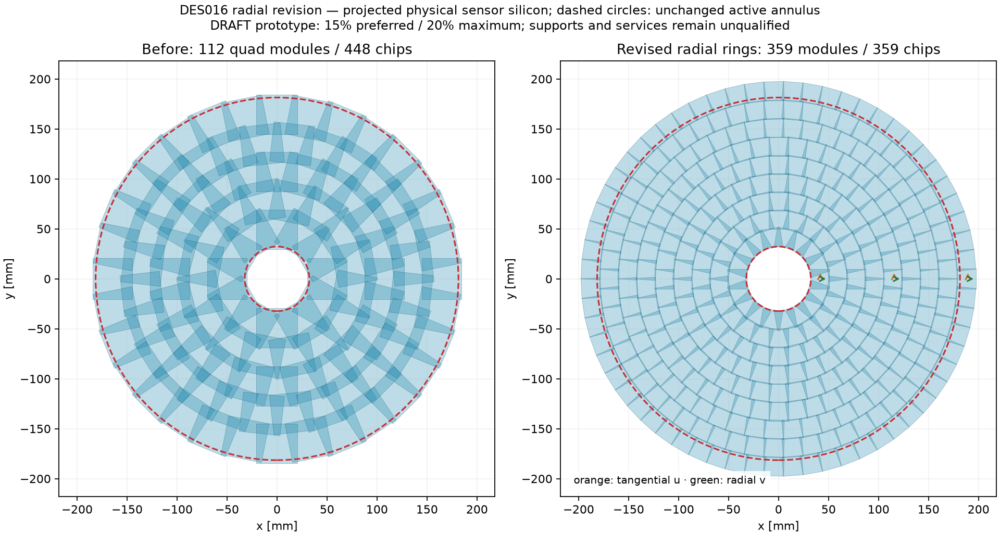
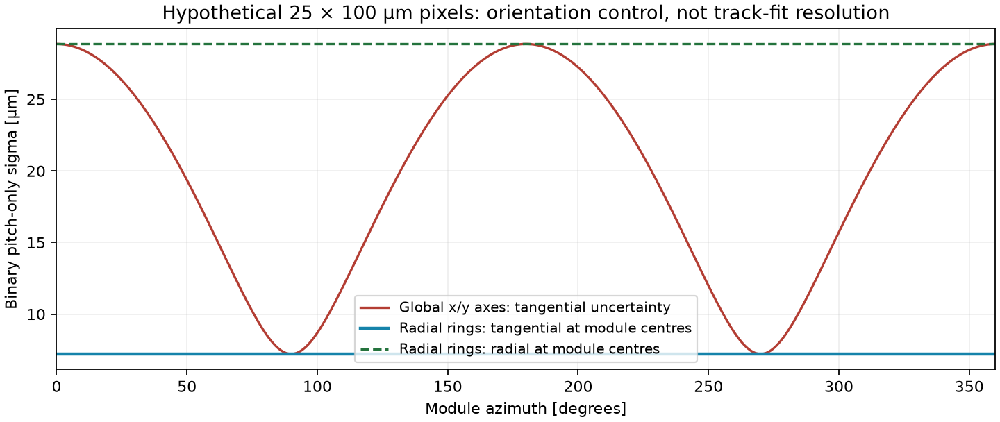

# DES016 — radial module revision

Status: **DRAFT / isolated PROTOTYPE. Coverage/body/orientation screens pass; inherited service packing remains unqualified.**

The user rejected global x/y-aligned modules and authorized 15–20% overlap for hermeticity. [DES016](../../../design/DES-016-pixel-disc-module-optimization.md) now prefers 15% and caps both whole projected silicon and annulus-only overlap at 20%. The earlier [Cartesian result](../results.md) is retained as superseded evidence. This revises PR41 independently of PR40 positioning and does not replace the production compact.

## Selected layout and bounded search

The selected arrangement has **359 single-RD53i modules/chips per disc in 9 concentric rings**, preserving the 18-module inner ring at template radius 41.15 mm. Every module has tangential `u` and outward radial `v` at its centre. Adjacent rings alternate half-cell phase. Active matrices remain 20 × 19.2 mm, with the existing 50 × 50 µm chip-cell fixture and nominal annulus r32.3..181.4550267061104 mm. Centres are compensated for axial staggering; the radii below are template radii before that compensation.

| Ring | Family | Modules | Template radius [mm] |
| --- | --- | ---: | ---: |
| 1 | single | 18 | 41.150000 |
| 2 | single | 22 | 59.283438 |
| 3 | single | 28 | 77.500314 |
| 4 | single | 34 | 95.778759 |
| 5 | single | 40 | 114.103911 |
| 6 | single | 46 | 132.465529 |
| 7 | single | 51 | 150.846077 |
| 8 | single | 57 | 169.252443 |
| 9 | single | 63 | 187.680115 |

First-disc margins are 0.55 mm radial and 0.1 mm tangential in the ring-envelope proposal. These are search controls; actual active polygons decide coverage. The finite scan considers 36 specified candidates, with single, tangential-double, radial-double, quad and mixed-family policies. It ranks fully passing candidates first by the preferred overlap tier, then chip count, module count and worst overlap. No scanned arrangement satisfied the preferred 15% limit for both overlap metrics with certified coverage; the selected candidate uses the authorized 20% tier. This is a bounded search, not a proof of a global optimum.

| Per disc | Original quad coplanar control | Revised first-disc nominal IP projection |
| --- | ---: | ---: |
| Modules / chips | 112 / 448 | 359 / 359 |
| Silicon repeated area / projected union | 75.856% | **15.593%** |
| Annulus-only repeated area / union | 78.121% | **17.478%** |
| Repeated area / summed installed area | 43.135% | 13.490% |
| Installed silicon outside annulus [mm²] | 4320.5 | 20300.5 |

Repeated area means `(sum of physical sensor-outline areas − union area) / union area`; triple coverage counts twice. Outlines include guard silicon. A double/quad has one shared outline, while coverage uses its individual active matrices with the inherited **0.2 mm inactive interchip gap**. The annulus is unchanged and outlines are never cropped to improve the overlap metric.

## Larger-module controls and seams

These representative rows minimize the worst endpoint coverage hole within each scanned family policy. Full controls and rejected certificates are retained in [screening.json](screening.json); lower silicon overlap alone is not sufficient to select a proposal.

| Policy | Modules / chips | Whole overlap | Annular overlap | Worst active hole at tested vertex [mm²] | Result |
| --- | ---: | ---: | ---: | ---: | --- |
| double | 185 / 352 | 22.640% | 24.253% | 483.128 | REJECTED |
| double-radial | 210 / 402 | 23.176% | 26.197% | 344.078 | REJECTED |
| quad | 110 / 386 | 21.827% | 24.964% | 1074.463 | REJECTED |
| single-double | 232 / 360 | 18.085% | 20.320% | 344.947 | REJECTED |
| single-quad | 192 / 453 | 19.548% | 22.978% | 687.576 | REJECTED |
| single-double-quad | 212 / 447 | 20.338% | 23.667% | 541.264 | REJECTED |

The tested larger/mixed rings leave active seam gaps and/or exceed the overlap ceiling. They are retained as rejected variants; this does not establish that every possible mixed-family design is infeasible. Shared-sensor seam response cannot be assumed or stretched. The body screen colours entire assemblies, keeping all chips on their parent's plane.

## Pixel axes and resolution scope

For a hypothetical **25 × 100 µm** binary-pitch control, local pixel covariance is `diag(p_u²,p_v²)/12`, rotated into tangential/radial coordinates. Global x/y alignment makes tangential sigma vary from **7.217 to 28.868 µm** with azimuth. The revised axes give constant **7.217 µm tangential** and **28.868 µm radial** values at module centres. The square-pixel control is rotation-invariant, as expected. This rectangular pitch is a test hypothesis; it does not change the RD53i hardware fixture.

Flat rectangles cannot align with the radial/tangential basis at every pixel. Maximum corner departure is **17.435°**, dominated by the retained inner ring, and its nonzero rotated covariance is recorded. These are local geometric measurement controls, not fitted transverse/longitudinal track resolutions, digitization, charge sharing or irradiation qualification. Longitudinal track resolution also depends on polar angle, lever arms and reconstruction.

## Coverage, bodies and native ACTS

All nine positive disc datums pass conservative polygon-containment certificates for **every on-axis straight-ray vertex z in [−150,+150] mm**; geometric reflection supplies the negative end. The first disc uses 6 certified intervals. Individual active-matrix endpoint intersections contain a conservative annulus superset on each interval. No raster or guard silicon substitutes for active coverage. Numerical area threshold remains 1e−6 mm²; the circular superset error bound is 0.015213 mm².

All 18 overlap/body screens pass; worst overlap across distances is **19.483%**. 5 axial levels at 1.2 mm spacing retain ≥0.2 mm occupied-body separation. First-disc body envelope is r≤202.035 mm, with minimum beam radius 31.642 mm. Maximum body radius across all distances is 202.035 mm. The positive-side periphery remains outward under negative reflection. Existing original DES015 disc datums, including ±615.2 mm, are unchanged in this independent study.

Native **acts-nodd** constructs **6462 candidate sensitive planes** and compares 324 matched tracks against the actual staggered quad baseline, using all 18 discs, 0/2 T, pT1 GeV, both charges and on-axis vertices −150/0/+150 mm. Six exhaustive first-disc controls bypass the shared broad-phase filter. All finite-plane intersections/IDs agree with the independent analytic oracle; no track misses its intended target disc. [acts.json](acts.json) retains exact binaries, source state and summary hashes. This is an actual finite supporting-plane transport audit, not global navigation, continuous-helix hermeticity, fitted resolution or material validation.

## Engineering boundary and service estimates

Sensor guard remains the unqualified **0.1 mm** choice, with the single-body 20.4 × 21.4 mm envelope. Doubles and quads retain explicitly defined shared-outline/body choices; the quad occupied envelope is inherited 43.2 × 44.2 mm. A **0.5 mm guard control gives 24.530% whole and 27.407% annular overlap**, showing the effect of realistic edge allowances without hiding the control.

Conditional heat is **964.992 W/disc**, 19.866% below 448 chips. Homogeneous half-ring groups produce **30 power chains** under both ≤16-module and ≤32-chip limits, and **18 independently fed cooling circuits** under the inherited 300 W grouping ceiling. Both feed/return legs are counted. Circumferential tube length is 6543.7 mm/disc, giving 40.293 cm³ of OD2.8 mm tube envelope before transport legs, bends and manifolds. These are spatial estimates, not routed or hydraulic-qualified assemblies.

The trial shared trunk occupies r205..231.7 mm after reserving 2 mm beyond the largest occupied body. The inherited barrel traffic, eight joined discs and ninth-disc conditional bypass are retained.

| Scenario | Cable [mm²/disc] | Feed+return [mm²/disc] | Positive demand after 8 discs [mm²] | Available packed area [mm²] | Utilization / result |
| --- | ---: | ---: | ---: | ---: | --- |
| reference | 1768.0 | 452.4 | 28648.0 | 13736.5 | 2.09 × / FAIL |
| conservative | 1768.0 | 452.4 | 38150.0 | 7326.1 | 5.21 × / FAIL |
| stress | 2845.0 | 452.4 | 61722.5 | 7326.1 | 8.42 × / FAIL |

The support envelope and all failing shared-trunk scenarios require engineering revision before adoption. No thermal failure is declared resolved by the geometric screen. No design sign-off or production integration is implied.

## Reproduction and provenance

[Inputs](inputs.json), [screening](screening.json), [ACTS](acts.json) and [artifact hashes](artifacts.json) pin the full scan, policies, preserved baseline, source/code state and runtime. Follow the [tool README](../../../../tools/pixel_disc_optimization/README.md). Matrix/pitch/material and service inputs are inherited evidence; new placement/body/guard/family controls are unqualified NODD DESIGN CHOICES; areas, certificates, covariance and services are INFERENCES. All plots are generated from the retained numerical proposal. Original Cartesian reports and scientific inputs remain intact.
