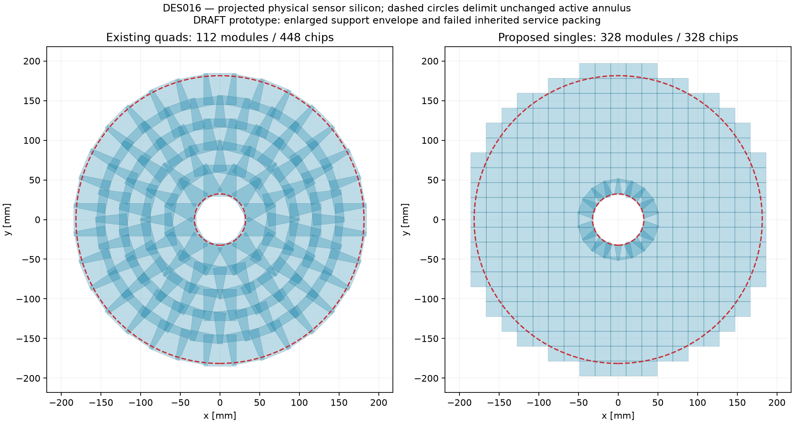
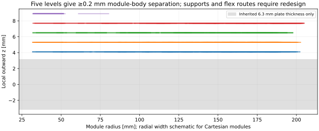

# DES016 — preliminary disc silicon optimization

Status: **DRAFT / isolated PROTOTYPE. Geometric target passes; inherited service packing FAILS.**

[Issue #38](https://github.com/asalzburger/nodd/issues/38#issuecomment-5981583892) requests less silicon overlap with unchanged coverage. The user fixed the limit at 10%. [DES016](../../design/DES-016-pixel-disc-module-optimization.md) defines metric, dimensions and approval boundary. The separate positioning PR retains ownership of changed disc datums.

The selected mixed Cartesian/inner-ring tiling has **328 single-RD53i modules/disc**, retaining the 20 × 19.2 mm active matrix, 50 µm pitch, 0.15 mm sensor, nine discs per end and nominal active annulus **r32.3..181.4550267061104 mm**. Eighteen singles form the inner polar ring; 310 form the Cartesian interior/boundary. The first-disc lattice pitch is 19.55 × 18.75 mm; its0.45 mm pitch reduction scales as615.2/abs(z) on farther discs while retaining the same328 module indices. Five outward z levels with 1.2 mm spacing retain the 1 mm occupied body and ≥0.2 mm z gap wherever physical bodies overlap in x/y. All proposed numbers remain unqualified choices.

| Quantity, per disc | Existing coplanar x/y quad control | Proposed at first-disc nominal IP projection |
| --- | ---: | ---: |
| Modules / chips | 112 / 448 | 328 / 328 |
| Gross silicon Σarea [mm²] | 182730.2 | 126071.0 |
| Repeated area / projected union | 75.856% | **8.911%** |
| Repeated area / summed installed area | 43.135% | 8.182% |
| Annulus-only repeated area / union | 78.121% | **9.907%** |
| Installed silicon outside nominal annulus [mm²] | 4320.5 | 15985.9 |

Overlap is `(Σ individual polygon area − area of union) / area of union`, so triple-covered silicon is counted twice as redundancy. Physical guard silicon counts in the overlap metric; only active matrices count toward active coverage. Nothing is clipped to improve a selection metric. The retained baseline table is a coplanar x/y control; ACTS compares the actual DES014/015 z stagger separately. Baseline active coverage has 928.6 mm² of holes in that control, despite gross sensor-outline coverage.

## Continuous straight coverage and native audit

All nine positive disc datums passed polygon containment certificates for **every on-axis luminous z vertex in [−150,+150] mm**; reflection supplies the negative end. Per-interval intersections of endpoint footprints are contained in every intermediate footprint because each rectangle projects by a monotone homothety. Their union contains a conservative polygon superset of the true circular annulus. First-disc proof uses 27 intervals; each retained gap upper bound is zero with a 1e−6 mm² numerical area threshold. Circle discretization gives a 0.0153 mm² conservative area bound, not a weakened coverage target. Transverse displaced vertices and continuous helical coverage are outside this proof.

The placement centre correction uses `D=(z²−150²)/z`, `xy_physical=xy_template×(1+local_z/D)` to balance the two vertex extremes without changing any active matrix dimension. The same chip count/tiling policy is repeated; x/y datums and lattice pitches differ slightly with disc distance. All 18 per-disc sensor and body screens pass; largest envelope radius across the nine distances is 211.833 mm. Disc positions retain the original DES015 list including ±615.2 mm first datums; they are not the independent whole-mm amendment.

Native **acts-nodd** constructed all 5904 proposed finite sensitive planes and 8064 baseline planes, and audited **324 matched tracks each**, using 0/2 T, pT=1 GeV, both charges, all 18 discs and vertices −150/0/+150 mm. Actual ACTS supporting-plane transport, finite RectangleBounds and returned IDs agree with the independently tested analytic oracle: zero mismatches. Candidate missing intended target-disc crossings: **0**; baseline: **0**. Six first-disc control tracks test all 328 planes without the shared voxel broad phase. [Native evidence](acts.json) includes actual binary/source hashes, existing ACTS working-tree changes, residuals and limitations. This is a finite intersection audit; it does not establish global navigation, reconstruction, material response or continuous helix hermeticity.

## Physical envelope and guard sensitivity

First-disc body envelope: **r≤210.305 mm**, minimum beam radius 29.618 mm, local occupied z 3.6..9.4 mm, five levels. The original r188.5 mm support and local service bands cannot be reused. The enlarged radial envelope is a cost of the Cartesian edge overhang; it is explicitly reported rather than hidden in the overlap ratio.

Sensor guard is **0.1 mm per edge**, occupied body **20.4 × 21.4 mm**, with inherited 1.8 mm ASIC periphery directed outward. These slim-edge/assembly choices require detector/module review and prototype evidence. Keeping the inherited **0.5 mm guard gives 17.193% overlap**, failing 10%. The optimized concentric single-chip control has 296 chips and 13.673% overlap, also failing. No fabricated sensor/ASIC qualification or sign-off is asserted.

## Cable and cooling envelope estimates

Use the unchanged DES010 scenario inputs and complete module count. New nominal heat is **881.664 W/disc**, compared with 1204.224 W for 448 chips (−26.786%). Installed sensor-envelope volume is328×20.2×19.4×0.15=19.280 cm³/disc, compared with 27.410 cm³ for the 112 quad outlines. Projected areas in the table differ from physical installed areas because of finite z. Across 18 discs: 15.870 kW. Local row/ring grouping produces **33 power chains** (≤16 singles and≤32 chips each), compared with16 old quad chains. The conservative local routing concept has **20 independently fed circuits** (one per row/ring, subdivided above 300 W), versus10 old half-ring loops. The heat-only lower bound is 3 circuits; merging spatial loops is not hydraulic validation.

Local evaporator OD2.8 mm and combined row/ring centreline length **6383.0 mm** imply **39.304 cm³/disc** of bounding tube envelope before feeds, returns and bends. The 20 loops have both4 mm OD transport legs, occupying **502.7 mm²** bare feed/return cross-section. Counts and lengths are explicit estimates, not routed or thermal-qualified supports.

Place the trial trunk at **r214..231.7 mm** after reserving2 mm beyond the enlarged module envelope, within the inherited carrier shell. The area scenarios include the current barrel inventory and eight joined discs; the ninth retains its conditional bypass. Demand multipliers and packing/available-phi factors are applied separately.

| Scenario | Cable [mm²/disc] | Feed+return [mm²/disc] | Positive trunk after8 discs [mm²] | Available packed area [mm²] | Utilization / result |
| --- | ---: | ---: | ---: | ---: | ---: |
| reference | 1811.0 | 502.7 | 29394.1 | 9293.9 | 3.16 × / FAIL |
| conservative | 1811.0 | 502.7 | 39082.7 | 4956.7 | 7.88 × / FAIL |
| stress | 2795.0 | 502.7 | 61725.2 | 4956.7 | 12.45 × / FAIL |

All inherited trunk scenarios fail. Splitting quads reduces chips and heat but increases physical modules, command/uplink bundles, chain count and boundary overhang. A revised readout aggregation, cooling grouping, collector/last-disc route and carrier/support architecture is required before baseline adoption. The study therefore **does not replace the preliminary DD4hep compact**. Existing thermal failures are not resolved by this geometric result.

## Reproduction and evidence

[Screening](screening.json) retains rejected candidates, guard control, full certificates, counts and source/code hashes. [ACTS](acts.json) retains exact runtime provenance and matched audit summaries. Install `requirements.txt` in an isolated local target or venv; keep that target prepended to the activated ACTS PYTHONPATH, preserving existing runtime paths. See the [tool README](../../../tools/pixel_disc_optimization/README.md). Figures are original nODD drawings generated from the same polygons. No baseline files or historical reports are overwritten; human design approval is still pending.
