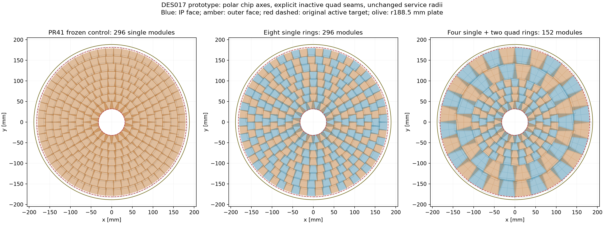
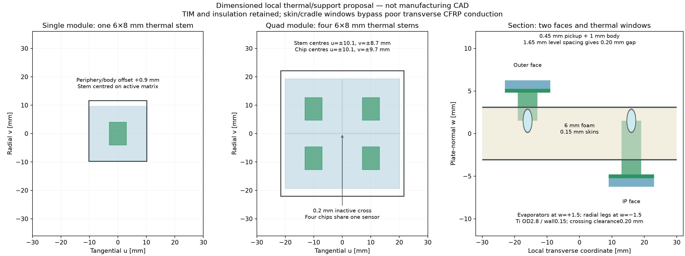
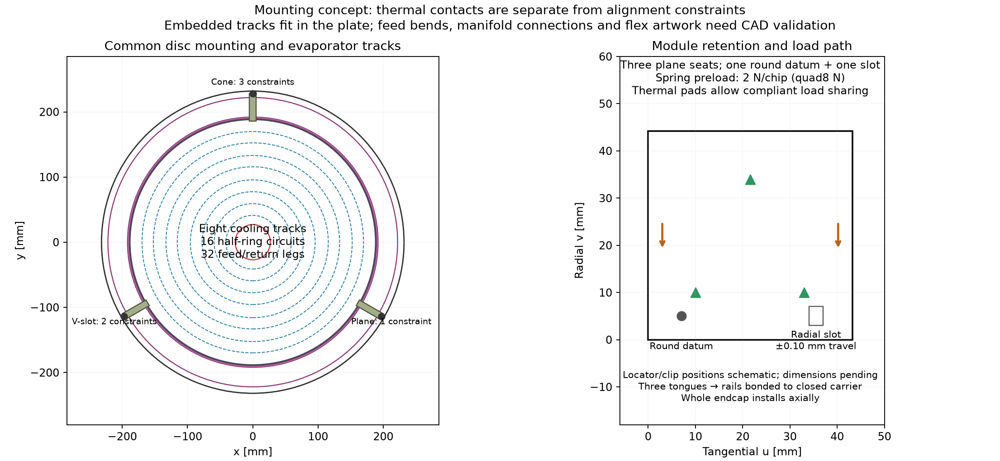
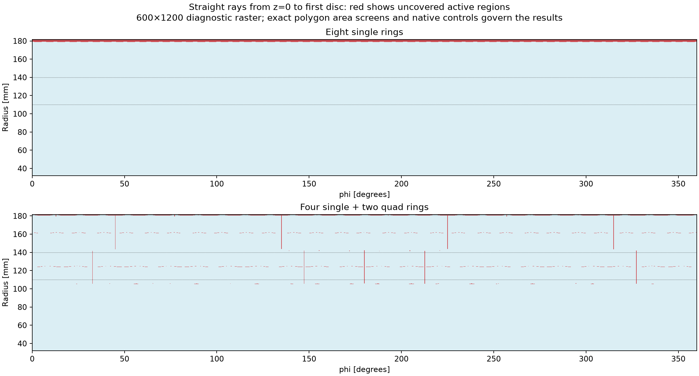

# DES017 — Layout, local support, cooling and mounting comparison

- Status: DRAFT / isolated PROTOTYPE. Both original-annulus hermeticity and adverse engineering cases remain unresolved.
- Governing design: [DES017](../../design/DES-017-pixel-disc-support-variants.md); inputs and exact geometry are retained alongside this report.
- Source revision: `8e593e32a97acc36b9a7850e1dfabc11d2175180` plus the recorded dirty producer/input hashes. These locate the actual prototype; a later enclosing commit is not substituted as its execution revision.

## Geometric comparison

| Option | Physical modules/disc | Chips/disc | Worst silicon overlap/union | Worst sampled original-annulus gap | Max body/stem radius [mm] | Margin to188.5 plate [mm] | Nominal heat [W] |
| --- | ---: | ---: | ---: | ---: | ---: | ---: | ---: |
| Eight single rings | 296 | 296 | 18.942% | 2.847% | 182.337 | 6.163 | 795.648 |
| Four single + two quad rings | 152 | 302 | 18.955% | 1.611% | 185.503 | 2.997 | 811.776 |

The mixed option retains102 inner singles and adds50 quads (22 at124 mm,28 at161 mm),
for152 modules and302 chips. It reduces separate module installations by48.65%,
while chip count/power rises2.03%. “4 + 4” refers to chip rows; there are six physical rings.
First four nominal rings and their radial/tangential frames are identical across options.
The new two-face placement changes local sensor z and its explicit xy compensation;
it does not claim to preserve PR41 survivor transforms. All18 source plate datums remain unchanged.

| Option | Physical ring | Family | Population | Nominal radius [mm] | Phase [cells] |
| --- | ---: | --- | ---: | ---: | ---: |
| Eight single rings | 1 | single | 18 | 41.150000 | 0 |
| Eight single rings | 2 | single | 22 | 59.283438 | 0.5 |
| Eight single rings | 3 | single | 28 | 77.500314 | 0 |
| Eight single rings | 4 | single | 34 | 95.778759 | 0.5 |
| Eight single rings | 5 | single | 40 | 114.103911 | 0 |
| Eight single rings | 6 | single | 46 | 132.465529 | 0.5 |
| Eight single rings | 7 | single | 51 | 150.846077 | 0 |
| Eight single rings | 8 | single | 57 | 169.252443 | 0.5 |
| Four single + two quad rings | 1 | single | 18 | 41.150000 | 0 |
| Four single + two quad rings | 2 | single | 22 | 59.283438 | 0.5 |
| Four single + two quad rings | 3 | single | 28 | 77.500314 | 0 |
| Four single + two quad rings | 4 | single | 34 | 95.778759 | 0.5 |
| Four single + two quad rings | 5 | quad | 22 | 124.000000 | 0 |
| Four single + two quad rings | 6 | quad | 28 | 161.000000 | 0.5 |

324 candidates were ranked on a128-segment annulus approximation, with full2048-segment
circle bounds for retained station metrics. These finite grids are numerical settings,
not manufacturing tolerances. Ranking favours the smallest worst vertex gap among
bounded,≤20% overlap candidates; then chips and overlap. This is a bounded exploration,
not a global optimum or a certificate of continuous luminous-vertex coverage.
Active areas are four separate20×19.2 mm islands per quad; the0.2 mm inactive cross
is never filled. One shared silicon outline per assembly counts once. The0.1 mm
guard remains conditional; the retained0.5 mm guard control is separately reported.
At0.5 mm guard, full-disc silicon overlap becomes28.037% (single) and24.787%
(mixed), so both fail the20% limit. The small-guard sensor requires technology review.
**Full original-annulus hermeticity fails for both**, despite improvement in the mixed case.
Do not reduce the original target to redefine these failures as coverage success.

## Local support and mounting

Use a common r27..188.5 mm carbon sandwich,0.15 mm skins/6 mm foam. Alternate phi
columns between its faces, then colour the padded physical-body conflicts separately
on each face. First sensor offset is±4.1 mm; each further level adds1.65 mm.
This includes a1 mm occupied module,0.45 mm pickup and0.20 mm nominal gap.
The single option needs up to three levels per face; the mixed option two.
All18 tested stations have zero body/stem or core-insert conflicts at the stated
nominal gap. The nearest plate clears the605 mm barrel-turn end by
2.300 mm (single)
and3.950 mm (mixed).
Both give at least5.450 mm body clearance to the outward collector starting at w11.7 mm.
The0.20 mm pickup gap and0.10 mm tube-to-skin margin have no tolerance qualification.

Single pickups use one6×8 mm stem. Quads use four, one per chip, with contacts1 mm
radially toward the module centre; their two cooling tracks therefore follow
nominal v±8.7 mm. The0.30 mm graphite pickup is anisotropic; the stem's grain is
specified axially. Skin/cradle windows give a direct thermal path to machined
180° Ti saddles. Treat these as procurement and coupon requirements.
The reproduced outward-face central-stem controls fail and are retained in
[failed-outward-controls.json](failed-outward-controls.json), rather than concealed by body-only checks.

Use one round datum plus a radial slot, three plane seats and spring retention.
Proposed preload is2 N/chip (single2 N,quad8 N), with compliant quad thermal pads
rather than four rigid alignment constraints. A±0.10 mm slot has nominal margin
over51.84 µm differential expansion in the explicit20 µm/(m K),60 K control.
Spring/contact pressure (equal-load proxy41.7 kPa), friction, pad flatness and clip
envelopes require coupon/FEA review. Locator positions in the drawing are schematic.

At disc scale, three10 mm tongues from r186..228 couple at90°,210°,330° to8×8 mm
CFRP box rails (0.4 mm walls,r223.7..231.7) bonded to the0.3 mm closed carrier
(r231.7..232,|z|609..3136). Cone/slot/plane coupling gives3+2+1 constraints.
The closed shell completes the load path; thin rails alone are not the recommendation.
Whole-endcap insertion is axial. A removable half-disc, installation around an
installed beam pipe, shell split and last-disc connector access are not qualified.

## Cooling, thermal and services

Both options need eight radial evaporator tracks and16 independently served
half-ring circuits, with32 feed/return legs. Quads reduce physical module count,
not cooling rows. OD2.8/wall0.15 mm Ti tubes occupy w±1.5 mm routing planes;
nominal crossing gap is0.20 mm and skin clearance0.10 mm. Track radii follow
the actual thermal contacts; all retained radial saddles fit their8 mm stem width.
Circuit arc length plus both radial legs and30 mm/leg bend allowance is an
inventory estimate. A10 mm bend-radius target, branch junctions, manifold and
pressure/leak tests need swept CAD and hydraulic verification. No tube-flow claim
is inferred from a geometric reservation.

Azimuthal evaporators use the+1.5 mm plane and radial fan-outs the−1.5 mm plane;
end-of-arc risers connect them. Separating them avoids nominal radial/azimuthal
crossings in one plane. The front pads have the longest path to the evaporator.
Thermal and insert-mass screens conservatively use that far-plane reach for both
faces. Actual risers, port separation, sector redistribution and weld access remain
unqualified; the drawing is a route concept, not a swept pipe collision certificate.

| Option | Ring | Chip row | Half | Chips | Nominal W | Stress W | Flow g/s | Stress outlet quality |
| --- | ---: | ---: | ---: | ---: | ---: | ---: | ---: | ---: |
| Eight single rings | 1 | 1 | 1 | 9 | 24.192 | 36.288 | 1.0 | 0.2159 |
| Eight single rings | 1 | 1 | 2 | 9 | 24.192 | 36.288 | 1.0 | 0.2159 |
| Eight single rings | 2 | 1 | 1 | 11 | 29.568 | 44.352 | 1.0 | 0.2416 |
| Eight single rings | 2 | 1 | 2 | 11 | 29.568 | 44.352 | 1.0 | 0.2416 |
| Eight single rings | 3 | 1 | 1 | 14 | 37.632 | 56.448 | 1.0 | 0.2802 |
| Eight single rings | 3 | 1 | 2 | 14 | 37.632 | 56.448 | 1.0 | 0.2802 |
| Eight single rings | 4 | 1 | 1 | 17 | 45.696 | 68.544 | 1.0 | 0.3189 |
| Eight single rings | 4 | 1 | 2 | 17 | 45.696 | 68.544 | 1.0 | 0.3189 |
| Eight single rings | 5 | 1 | 1 | 20 | 53.760 | 80.640 | 1.0 | 0.3575 |
| Eight single rings | 5 | 1 | 2 | 20 | 53.760 | 80.640 | 1.0 | 0.3575 |
| Eight single rings | 6 | 1 | 1 | 23 | 61.824 | 92.736 | 1.0 | 0.3961 |
| Eight single rings | 6 | 1 | 2 | 23 | 61.824 | 92.736 | 1.0 | 0.3961 |
| Eight single rings | 7 | 1 | 1 | 26 | 69.888 | 104.832 | 1.0 | 0.4347 |
| Eight single rings | 7 | 1 | 2 | 25 | 67.200 | 100.800 | 1.0 | 0.4219 |
| Eight single rings | 8 | 1 | 1 | 29 | 77.952 | 116.928 | 1.1 | 0.4394 |
| Eight single rings | 8 | 1 | 2 | 28 | 75.264 | 112.896 | 1.1 | 0.4277 |
| Four single + two quad rings | 1 | 1 | 1 | 9 | 24.192 | 36.288 | 1.0 | 0.2159 |
| Four single + two quad rings | 1 | 1 | 2 | 9 | 24.192 | 36.288 | 1.0 | 0.2159 |
| Four single + two quad rings | 2 | 1 | 1 | 11 | 29.568 | 44.352 | 1.0 | 0.2416 |
| Four single + two quad rings | 2 | 1 | 2 | 11 | 29.568 | 44.352 | 1.0 | 0.2416 |
| Four single + two quad rings | 3 | 1 | 1 | 14 | 37.632 | 56.448 | 1.0 | 0.2802 |
| Four single + two quad rings | 3 | 1 | 2 | 14 | 37.632 | 56.448 | 1.0 | 0.2802 |
| Four single + two quad rings | 4 | 1 | 1 | 17 | 45.696 | 68.544 | 1.0 | 0.3189 |
| Four single + two quad rings | 4 | 1 | 2 | 17 | 45.696 | 68.544 | 1.0 | 0.3189 |
| Four single + two quad rings | 5 | 1 | 1 | 22 | 59.136 | 88.704 | 1.0 | 0.3832 |
| Four single + two quad rings | 5 | 1 | 2 | 22 | 59.136 | 88.704 | 1.0 | 0.3832 |
| Four single + two quad rings | 5 | 2 | 1 | 22 | 59.136 | 88.704 | 1.0 | 0.3832 |
| Four single + two quad rings | 5 | 2 | 2 | 22 | 59.136 | 88.704 | 1.0 | 0.3832 |
| Four single + two quad rings | 6 | 1 | 1 | 28 | 75.264 | 112.896 | 1.1 | 0.4277 |
| Four single + two quad rings | 6 | 1 | 2 | 28 | 75.264 | 112.896 | 1.1 | 0.4277 |
| Four single + two quad rings | 6 | 2 | 1 | 28 | 75.264 | 112.896 | 1.1 | 0.4277 |
| Four single + two quad rings | 6 | 2 | 2 | 28 | 75.264 | 112.896 | 1.1 | 0.4277 |

The flows sum to16.2 g/s (single) and16.4 g/s (mixed); rounded upward from1.5×
power/quality arithmetic, with1 g/s floor. They use the inherited313.18 J/g latent
heat proxy and0.10→0.45 quality window; neither pressure drop nor stable boiling
has been established, especially at the floor flow.

Thermal screening adds finite-volume sheet spreading to normal graphite,
stem/core, two bonds, insulating TIM, Ti saddle and h=10/20/30 kW/(m² K).
Uniform and edge-concentrated power, k=1500/1000/500 W/(m K),−40/−35°C coolant
and1.5× power are retained. Refined0.25 mm solutions and0.125 mm controls are
in [thermal-refined.json](thermal-refined.json);0.5/1 mm exploratory convergence
remains visible in screening.json. Full-circumference boiling area is optimistic;
h10k is the half-area sensitivity to h20k. Quad cross-talk, irradiated leakage
feedback, coolant temperature variation and interface ageing remain unmodelled.

| Option | Worst stress at−40°C [°C] | Worst stress at−35°C [°C] | −15°C screen |
| --- | ---: | ---: | --- |
| Eight single rings | -17.004 | -12.004 | −40 passes; −35 FAILS |
| Four single + two quad rings | -16.857 | -11.857 | −40 passes; −35 FAILS |

| Option | Bandwidth scenario | Power chains | Links/commands | Trunk utilization | Flange neck utilization | Result |
| --- | --- | ---: | ---: | ---: | ---: | --- |
| Eight single rings | reference | 26 | 592 | 1.318× | 1.785× | FAIL |
| Eight single rings | conservative | 26 | 592 | 3.310× | 4.483× | FAIL |
| Eight single rings | stress | 26 | 1480 | 5.362× | 7.262× | FAIL |
| Four single + two quad rings | reference | 18 | 304 | 1.089× | 1.474× | FAIL |
| Four single + two quad rings | conservative | 18 | 454 | 2.915× | 3.948× | FAIL |
| Four single + two quad rings | stress | 18 | 1360 | 4.983× | 6.749× | FAIL |

Homogeneous chains obey both16-module and32-chip limits (quad maximum8).
Both4 mm-OD feed/return transports count, giving402.124 mm²/disc before packing.
Eight preceding discs and barrel demand accumulate in the fixed r192..231.7 trunk
and r222 flange neck. **The mixed layout improves reference cable demand but does
not close the inherited packing failures**. Reference aggregation per physical
module is optimistic; conservative/stress per-chip links remain visible.
Thin8×0.20 mm buses route on each face around pickup windows, with8×0.12 mm tails
and three radial fan corridors between reserved mounting sectors. Actual bus
artwork, connectors, branch-end bends and flex sweeps require a routing study;
they are not part of the body/stem collision pass or a complete mass estimate.

## Material and structural scope

Estimated local dry subsets are530.36 g
(single) and520.33 g (mixed),
plus1 g/chip payload proxies of296/302 g. Component tables in screening.json
subtract reserved pipe/insert/glue volumes from foam and contact windows from skins,
including a180° saddle correction. These are conditional inventory estimates,
**not total disc masses**: flexes, liquid CO2, edge closeouts, tongue details,
manifolds and the shared carrier are excluded. Tube/insert routing intersections
and clipping these solids to the foam require CAD union-volume verification.
Do not infer a measured material reduction from the10 g difference.
The inherited diametral-beam proxy spans326.49 mm. Distributed/point load brackets
over E70..140 GPa are only gravity screens; they ignore laminate layup, windows,
shear, tabs, vibration, joints, preload and alignment. No qualified disc stiffness,
directional X0 map or passive DD4hep/Geant4 model is claimed.

## Native evidence and recommendation

- eight-single: 540 tracks, 5328 patches, native/oracle agreement=True, 54 target-disc misses retained.
- eight-single-exhaustive: 6 tracks, 296 patches, native/oracle agreement=True, 0 target-disc misses retained.
- four-single-two-quad: 540 tracks, 5436 patches, native/oracle agreement=True, 92 target-disc misses retained.
- four-single-two-quad-exhaustive: 6 tracks, 302 patches, native/oracle agreement=True, 0 target-disc misses retained.

Matched native ACTS EigenStepper supporting-plane targets and native finite
RectangleBounds test all18 reflected discs, both charge signs,0/2 T, luminous
vertices and seam/edge probes, with exhaustive first-disc controls. Expected
misses are acceptance evidence, not transport mismatches.
The mixed layout has92 target misses against54 for eight singles in the540-track
sample:36 misses at r110,18 at r140,36 at r181 and2 curved probes at r175 mm.
Eight singles miss only the54 r181 edge probes. These deliberately sparse probes
are not efficiencies, but demonstrate why a smaller uncovered area is insufficient
to claim better tracking acceptance. The original-annulus holes remain a review gate.

This is vacuum transport,
not global navigation, passive-material transport or fitted resolution. The
rectangular25×100 µm binary covariance control is geometric only; polar axes
avoid global-xy pitch modulation at module centres, with finite-corner variation retained.

**Recommendation: use the four-single + two-quad variant as the next working
prototype**, with the common two-face sandwich and per-chip pickups. It nearly
halves mounting/handling operations, requires fewer axial levels, improves sampled
coverage and lowers reference cable demand, while keeping the radius within the
same fixed services. Keep the eight-single option as a modularity/yield control:
single-chip replacement is simpler and a failed module loses less area. Quad
yield, handling and replacement cost need vendor/assembly input.

Before adoption, prioritize: restore the remaining original-annulus holes without
increasing the service radius; measure thermal contacts and pressure drop at cold
and warm conditions; solve trunk/neck service demand; then qualify clip/flexure,
laminate/tolerance and swept routing with CAD/FEA and passive transport. Neither
formal sign-off nor production integration follows from this PR.
