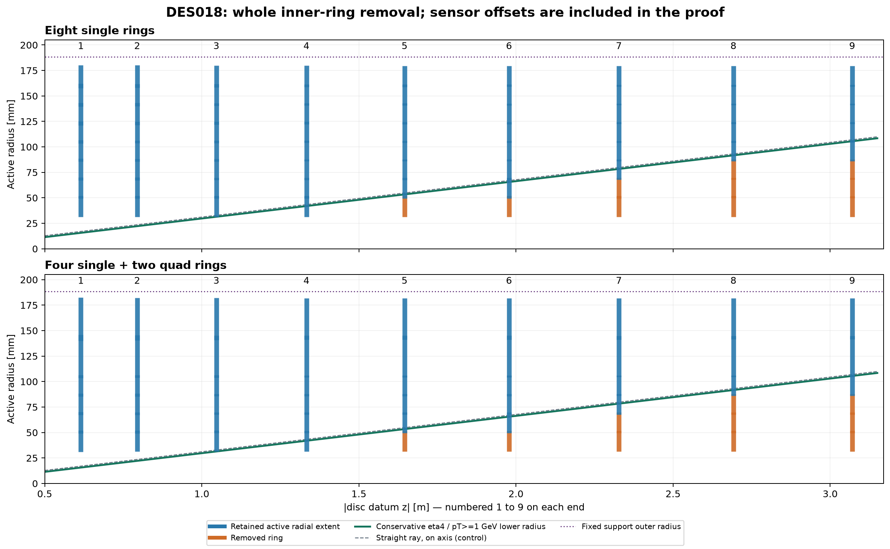
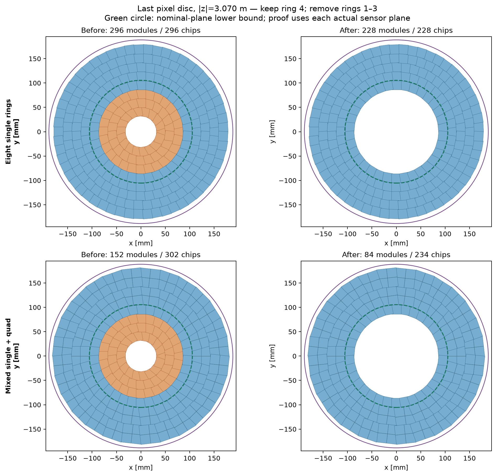

# DES018 — Eta-limited pixel-disc apertures

- Status: DRAFT / isolated PROTOTYPE; no production change or human design sign-off.
- Governing [DES018](../../design/DES-018-pixel-disc-eta-apertures.md), frozen [DES017 control](../DES-017/results.md).
- Source baseline: PR42 merge `f2af2714dadd30a722f5ece11d0fd04e92cbfd39` on the prototype branch; exact executed producer/input hashes remain in screening/native evidence.

**Recommendation:** remove ring 1 on discs 5–6, rings 1–2 on disc 7 and rings 1–3 on discs 8–9, identically on both ends and in both module variants. Retain all rings on discs 1–4. Preserve every surviving placement and stable identifier.

## Exact per-disc schedule

| Disc on either end | Datum \|z\| [mm] | Removed original rings | Eight-single chips | Mixed modules / chips | Cooling circuits | Smallest removed-ring margin [mm] |
| --- | --- | --- | --- | --- | --- | --- |
| 1 | 615.200 | None | 296 | 152 / 302 | 16 | — |
| 2 | 794.414 | None | 296 | 152 / 302 | 16 | — |
| 3 | 1046.270 | None | 296 | 152 / 302 | 16 | — |
| 4 | 1333.096 | None | 296 | 152 / 302 | 16 | — |
| 5 | 1645.288 | 1 | 278 | 134 / 284 | 14 | 1.574 |
| 6 | 1977.808 | 1 | 278 | 134 / 284 | 14 | 13.727 |
| 7 | 2327.479 | 1, 2 | 256 | 112 / 262 | 12 | 8.694 |
| 8 | 2692.091 | 1, 2, 3 | 228 | 84 / 234 | 10 | 3.971 |
| 9 | 3070.000 | 1, 2, 3 | 228 | 84 / 234 | 10 | 17.773 |

Margins are before the additional 0.10 mm retention buffer; every selected removal exceeds it. The smallest margin over both variants is 1.574 mm. Datums are the unchanged DES017 values, not rounded/repositioned by this study. Ring numbers and survivor IDs keep their original meaning. The RZ figure shows aggregated radial extents, not gap-free coverage at every phi.

## Why this preserves the requested coverage

The user selected **pT>=1 GeV** and tracker **|eta|<4**. Selection includes the closed eta4 boundary. Luminous z is±150 mm; transverse x/y are conservatively bounded by±1 mm (a superset of the earlier0..1 mm fixture). The field is a uniform axial0..4 T hypothesis, with charges0 and±1 and first host exit/half-turn as in the inherited oracle.

From PDG section49.5.2, page8, Eq49.48, `sinh(eta)=cot(theta)`. The smallest transverse arc to each actual sensor plane is `s=(|z_sensor|-150)/sinh(4)`. With `k=0.000299792458*4/1 mm^-1`, the corresponding minimum chord is `2*sin(k*s/2)/k`. Subtracting sqrt(2) mm bounds the transverse vertex displacement. This is an inference from the [PDG definition](https://pdg.lbl.gov/2025/reviews/rpp2025-rev-kinematics.pdf) and the explicit uniform-field helix, not a fitted efficiency.

On the first outward half-turn, chord increases with arc and decreases with curvature. Consequently the eta4/1 GeV/4 T choice bounds the full continuous specified domain. Every active rectangle corner is tested at its own plane; a convex rectangle has its largest radial norm at a corner. Quad islands and inactive seams stay separate. A whole ring is removed only when all its patches are strictly below the envelope with the extra buffer. Positive/negative reflection preserves this proof.

The retained fourth ring of disc9 is required: its limiting margin is−0.363 mm (single) or−0.372 mm (mixed). Straight, on-axis geometry would remove it, but omits the transverse vertex envelope. Each first retained ring also has an explicit finite-patch witness; both1 GeV charge signs in4 T reach those witnesses natively. Removing the next ring would therefore lose an in-scope baseline hit. This is a maximal contiguous-prefix removal within the frozen ring catalogue, not a global tiling optimum.

The all-pT first-half-turn control uses the weaker chord factor2/pi and removes only ring1 on discs8–9. It is deliberately not the selected1 GeV schedule. Lower-pT or recurling/secondary/scattered tracks, nonuniform fields and energy loss require a new study.

## Savings and unchanged support

Both variants remove **424 single-chip modules/chips over all18 discs**, saving **1139.712 W nominal** and 1709.568 W in the inherited1.5× heat control. Active chip area removed is0.162816 m²; this is installed area, not projected union or a qualified material budget.

Eight-single totals change5328→4904 modules/chips. Mixed totals change2736→2312 modules and5436→5012 chips (15.50% fewer physical assemblies,7.80% fewer chips). Both cooling inventories change288→248 circuits and576→496 feed/return legs. Retained half-ring populations, per-chip heat/contact paths and circuit loads are unchanged; whole empty tracks are deleted. Actual cooling flow and tube-length estimates are retained per disc in screening.json.

Keep the common6.3 mm sandwich, r27..188.5 mm plate, three tongues/kinematic mounts and carrier. Remove only the omitted modules/pickups and their cooling tracks; retain survivor mounting heights and xy compensation. No support bore enlargement, recolouring, remounting or disc movement is proposed. Empty pickup windows need engineering closeouts before manufacturing; full plate/skin/rail mass is not claimed as saved. All nominal survivor body/stem/core bounds pass. CAD, hydraulics, tolerance/laminate/coupon/FEA qualification remain open.

## Matched analytic and native checks

- eight-single: 1906 matched analytic tracks, unchanged exact hit-ID sets (11547 hits before and after); 182 matched native tracks preserve every in-scope hit. Two out-of-scope eta controls expose intended hit losses. Last-disc exhaustive all-plane controls before/after pass.
- four-single-two-quad: 1906 matched analytic tracks, unchanged exact hit-ID sets (11722 hits before and after); 182 matched native tracks preserve every in-scope hit. Two out-of-scope eta controls expose intended hit losses. Last-disc exhaustive all-plane controls before/after pass.

Seeded off-grid tracks include neutral cases, pT1..100 GeV, continuous eta/phi/vertices and0/2/3/4 T. Boundary probes and straight/bent first-retained-ring witnesses supplement them. Native ACTS uses EigenStepper supporting-plane targets, actual RectangleBounds and returned sensitive IDs; neutral motion is checked analytically and by equivalent charged zero-field controls. The native binding accepts±1 only. This is vacuum finite-plane validation, not global navigation, passive transport or fitted resolution.

Preserving every in-scope baseline hit does **not** make the baseline hermetic: original quad seams, transition holes and outer-edge misses remain. Original full-annulus demand is kept in old evidence; the new eta-limited task justifies these specific inner removals. No acceptance loss is hidden by a smaller denominator or additional hits elsewhere.

## Heterogeneous service demand

Counts are recomputed for each disc. The trunk sums the actual first8 disc cable/pipe demands plus the unchanged barrel rather than multiplying one disc by8. The inherited last-disc bypass is reported separately; an all-nine-disc flange-neck control includes it conservatively. Fixed trunk r192..231.7 and neck outer222 mm are retained.

| Variant | Scenario | Positive trunk | Inherited neck | All-nine neck control | Screen |
| --- | --- | --- | --- | --- | --- |
| eight-single | reference | 1.261× | 1.708× | 1.804× | FAIL |
| eight-single | conservative | 3.177× | 4.302× | 4.528× | FAIL |
| eight-single | stress | 5.177× | 7.012× | 7.347× | FAIL |
| four-single-two-quad | reference | 1.032× | 1.397× | 1.455× | FAIL |
| four-single-two-quad | conservative | 2.781× | 3.767× | 3.925× | FAIL |
| four-single-two-quad | stress | 4.799× | 6.499× | 6.770× | FAIL |

Mixed reference trunk utilization improves1.089→1.032× and inherited neck1.474→1.397×. Negative-side results and all actual local inventories are retained in screening.json. This optimization improves services but does not close their packing failures. Reference link aggregation remains optimistic; adverse bandwidth scenarios and bypass/manifold routing are unresolved.

The new overlap.json recomputes silicon overlap on the unchanged original annulus and full projected union. Removing only existing rings creates no new physical neighbour intersections. Maximum selected overlap remains below20%; unchanged first discs retain the original0.5 mm-guard failure. Thermal per-chip interfaces and qualified operating margins are not redefined; the inherited−35°C warm-coolant failures remain.

Source classifications and the new public PDG catalogue entry are in DES018. Artifact/producer SHA-256 values are in artifacts.json. Draft status is unchanged; technical review should assess the removal schedule and remaining field/material/routing assumptions before adoption.
