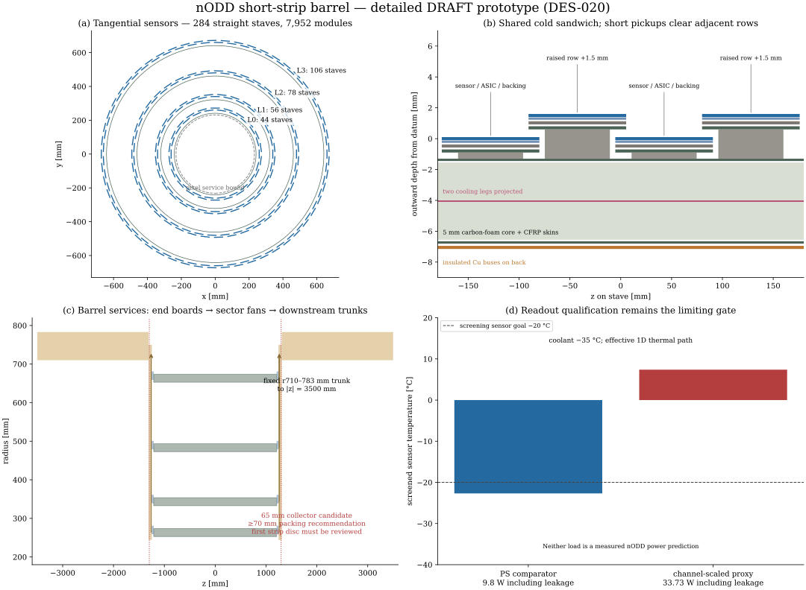
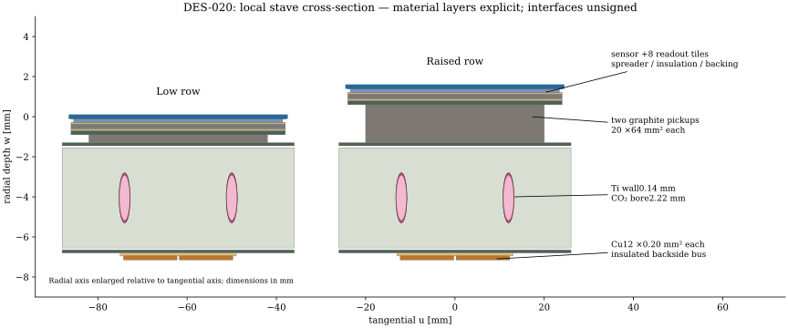

# DES-020 — Detailed short-strip barrel prototype results

- Date: 2026-10-06.
- Design: [DES-020](../../design/DES-020-short-strip-barrel.md), DRAFT; issue [#20](https://github.com/asalzburger/nodd/issues/20).
- Disposition: bounded barrel prototype and engineering screens completed; **not qualified for production integration**.
- Actual execution revision: dirty `a2493c458538d938971b2c3fbb00c1be719d6f60` plus the exact input/producer/factory/library hashes in [native.json](native.json). A later enclosing deliverable commit is not the execution revision.
- Inputs: [central contract](../../../tools/short_strip_barrel/inputs.json), inherited DES-007/010/011 and pinned pixel material recipes. No pixel, production compact, existing endcap or reconstruction configuration changed.

## Placement and construction

The fine 75 µm axis remains tangential, the 0.5 mm axis axial, and their cross
product radial. One 48×96 mm² active strixel rectangle has 640×192 cells; no
unexplained stereo pair is introduced. A 49×103 mm² occupied module includes
passive guard, eight hypothetical readout tiles, bump envelope, graphite,
insulation, adhesives, backing and two flex ledges. ASIC compatibility and the
channel transfer across tile boundaries remain unresolved.

| Layer | Nominal radius (mm) | Physical sensor-centre range (mm) | Staves | Modules |
|---|---:|---:|---:|---:|
| 0 | 260 | 260–273.5 | 44 | 1,232 |
| 1 | 340 | 340–353.5 | 56 | 1,568 |
| 2 | 480 | 480–493.5 | 78 | 2,184 |
| 3 | 660 | 660–673.5 | 106 | 2,968 |
| Total | | | 284 | 7,952 |

There are 28 symmetric rows/stave, centres ±1152 mm, pitch85.333333 mm,
active endpoints ±1200 mm. Alternate staves are radially separated by12 mm;
alternate rows are lifted by1.5 mm. An8 mm phi margin was selected after the
smaller-margin sample exposed curved-track seams. Total active silicon is
36.642816 m² with977,141,760 channels. These are consequences of the selected
research strixel, not an electronics feasibility claim.

A52 mm wide carbon sandwich supports two independent central-return titanium
U-loops/stave, one per end. Its5 mm pure-carbon foam core is analytically cut for
the2.5 mm OD pipes; coolant, walls and core occupy disjoint volumes. Two shortened
20×64 mm² graphite pickups/module give1.833333 mm clearance to the neighbouring
103 mm module body. Edge flex wraps lie outside the core. Backside copper and
signal buses connect to separate end boards. Nine bearing rings/layer limit the
unsupported length to300 mm; one axial datum and compliant/sliding remaining
joints are proposed. Feet are explicit occupied volumes; fasteners, inserts,
kinematic joints and cold metrology are unqualified. The current rectangular
foot meets the circular ring tangentially (line contact); a curved shoe or
machined seat with finite bearing area and clamps is required before mechanical
integration. A zero-overlap check does not establish that load-bearing interface.

## Cabling, cooling and routing

The [retained layout and route ledger](layout.json.gz) assigns every module
exactly once to a14-module half-stave, then to an end sector and downstream
handoff. Positive and negative cooling loops remain independent. Per end:

| Item | Count / envelope |
|---|---|
| Leaf cooling loops | 284 |
| Cable harnesses | 568; two per half-stave |
| Manifold feed/return pairs | 40; rounded within12 sectors, ≤8 leaf loops/pair |
| Harness benchmark | 13.4 mm power +3.6 mm fibre outer diameters, ≤12 modules/harness |
| Cooling trunks | 8/12 mm OD feed/return, 6/10 mm bore |
| Collector | r244..750 mm, \|z\|1245..1310 mm |
| Longitudinal trunk | r710..783 mm, \|z\|1310..3500 mm |

Counts are barrel-only. Cable diameters and effective constituent recipes are
publicly informed benchmarks, not specified nODD manufactured harnesses. The
new shared LV rails differ from the independently powered CMS comparator.
Endcap demand, connectors, fittings, access, real fibre count, grounding,
conversion electronics and optical endpoints are not certified by this ledger.

The65 mm collector has worst **50.8962% mean gross envelope fill**, exceeding
the50% packing screen. It is constructible as a volume-conserving effective
DD4hep cell, but that does not turn this engineering failure into a pass.
Recommend **at least70 mm** for the next interface study as a mean-volume lower
bound; local cross sections, manifold bodies and swept bends must still close.
The25/50 mm bend-centre fixtures plus finished component radius fit the65 mm
scalar depth (largest56.7 mm), but they do not establish connected CAD routing.

The collector reaches1310 mm and conflicts with the frozen first short-strip
disc datum1295.5 mm. Endcap datums/support and the barrel-end acceptance must be
studied together before integration. The innermost strip bearing radius240 mm
has8.3 mm scalar radial separation from the fixed pixel service bound231.7 mm;
this is **not a combined pixel/strip native clearance audit**.

## Independent engineering screens

[screening.json](screening.json) retains failures as well as successes.

| Screen | Reference / sensitivity result | Interpretation |
|---|---|---|
| Fixed trunk capacity | Maximum demand/capacity0.76764 | Reference barrel demand fits nominal0.75 phi /0.50 packing; excludes endcaps |
| Adverse trunk capacity | 1.79915 | Fails at0.50 phi /0.40 packing and1.25× demand |
| Channel-scaled cable demand | 2.94386 | Fails; channel scaling is a sensitivity, not a real cable prediction |
| Sensor temperature, reference load9.8 W | −22.74/−22.68 °C at−35 °C coolant | Low/raised rows pass the−20 °C screen; only~2.7 °C margin |
| Warm coolant, same load | −12.74/−12.68 °C at−25 °C | Fails |
| Channel-scaled load33.73 W | +7.19/+7.39 °C at−35 °C | Fails; no compatible ASIC power bound is known |
|12 V tapped LV drop | Reference0.0813 V; sensitivity0.3307 V round trip | Passes1 V screen; return0.0407/0.1654 V passes0.2 V; ampacity/noise unqualified |
| Half-stave energy balance | Reference142.70 W; sensitivity485.49 W |3/7 g/s fixtures allow210/490 W; sensitivity fails3 g/s, barely passes7 g/s energy only |
| Simplified beam sag |47.57/33.30/23.79 µm atE70/100/140 GPa | Passes50 µm fixture at300 mm span; no joints/FEA/torsion/dynamics qualification |

The thermal model includes insulation, adhesive, anisotropic sheet spreading,
full carbon-foam depth, a contact resistance and raised pickup length. It is a
conservative1D hotspot fixture, not calibrated FEA. LV current uses readout power;
separate leakage heat belongs to the HV load. Neither comparator nor channel
scaling supplies an actual upper bound. Hydraulics, pressure containment,
boiling stability and dry-out are untested. The beam fixture uses worst local
stave mass870.0007 g and CFRP-skin second moment111.657 mm⁴; it excludes ring
flexibility and service loads at connectors.

Data demand is also explicitly unresolved. At32 bits/hit,20% packet overhead
and occupancies10⁻⁵/10⁻⁴/10⁻³, a14-module half-stave needs0.6606/6.606/66.060 Gbit/s
at1 MHz accepted events, or26.424/264.241/2642.412 Gbit/s at40 MHz. The sourced
8.96 Gbit/s usable link requires1/1/8 or3/30/295 uplinks respectively. Several
scenarios fail the two-uplink comparator. Occupancy/rates are scenario choices;
qualified fibres per3.6 mm cable remain null. A diameter budget alone does not
establish usable bandwidth.

Analytical and native exclusive material inventories agree. Local barrel
(including rings) is **250.1428 kg** in this fixture; graphite pickups contribute
51.7376 kg and the power-bus category33.3647 kg, both targets for later engineering
optimization. Benchmark off-stave service cells add1048.2547 kg and trays42.4235 kg;
total native transport inventory1340.8210 kg. These large gross-envelope-derived
cable masses are **not a manufactured cable BOM estimate**. Sparse directional
material scans contain correspondingly large forward service contributions
(up to several X₀); do not use them as accepted tracker material performance.

## Validation actually run

Local Spack preflight returned2 because its stored setup/lock hashes changed.
The user was warned; actual runtime was then checked in a fresh activated shell:
DD4hep1.38 `/7deaacd`, ROOT6.40.04, Geant4 11.4.2 `/cpge6jj` with installed datasets.
Shared dependencies were not installed or modified. NumPy2.5.3 and
Matplotlib3.11.2 came from the existing ACTS Python environment.

| Check | Actual evidence |
|---|---|
| Standard-library controls |5/5 passed: unique complete routes, oriented axes, readout count, stale/invalid input rejection, disjoint constituent construction and adverse/30 mm controls |
| Standalone CMake build / CTest | Build succeeded;2/2 CTest passed, including controls and complete native audit |
| DD4hep construction |7,952 sensors;248,118 physical placements;248,116 expected component entities; all role counts/material volumes/masses match |
| Native transforms / readout | Maximum centre residual2.3609×10⁻¹³ mm; exact axes;7,952 unique volume IDs;39,760 sampled anisotropic cells, grid640×192 |
| ROOT overlaps | **0 at1e−5 mm** in the isolated assembly |
| ROOT directional navigation/material |75 straight probes:3 origins×5 eta×5 phi; all layers exercised; per-rayX/X₀ andλ stored in[native.json](native.json) |
| Fresh ROOT persistence | PASS without XML/factory load:7,952 sensors, names/transforms/solids/materials and counts; packed-ID persistence is not checked |
| Finite-plane/OBB oracle | No occupied-module-box SAT collisions; dense straight/charged vacuum samples below |
| Geant4 | DDSimFTFP_BERT seed42, one10 GeV transverse mu−; exit0,7,952 sensitive paths; savedEDM4hep event has8 positive-energy0.2 mm sensor hits, two in each layer |

The Geant4 compact has **no magnetic field**. Curved-track coverage is a separate
analytical vacuum calculation; this is not Geant4 validation of4 T transport.
The earlier axial geantino run initialized but missed the barrel; it is not the
basis of the saved-hit claim. The [Geant4 report](geant4-transverse.json) pins raw
ROOT/log/native hashes and stores the saved hit arrays and system/layer IDs.
ROOT roundtrip is independently retained in[root-roundtrip.json](root-roundtrip.json).
No ACTS geometry conversion, navigation, digitization, resolution or reconstruction
performance was run for this new subsystem.

Coverage uses the original four nominal cylinders at±1200 mm as denominator,
finite active planes, first outward traversal through at most a half turn,
|η|≤4, five origins spanningz±150 mm and transverse±1 mm. It samples pT1 GeV,
B4 T for either charge and straight tracks. It does not prove allpT≥1 GeV or all
intermediate fields/momenta or continuum hermeticity.

| Mode | Tracks | Eligible nominal crossings | Misses | Misses >100 mm from nominal end |
|---|---:|---:|---:|---:|
| Straight |103,040|183,870|1,311|0|
| Positive |103,040|182,446|1,132|0|
| Negative |103,040|182,448|1,135|0|

The161 eta×128 phi sample totals309,120 trajectories. **All three full-boundary
coverage screens fail** because the displaced outer lane loses crossings near
an original nominal barrel end. No denominator was narrowed to claim a pass.
The coarser81×64 control in[coverage-base.json](coverage-base.json) has273/390/382
misses and the same zero interior-miss observation. Dense results and exact
sample/source hashes are in[coverage-refined.json](coverage-refined.json).

## Preserved failed attempts and remedies

1. Initial20/10 mm lane/lift and30 mm collector could not conserve service
   constituent volume; export/build rejected it. [initial-screening.json](initial-screening.json)
   retains the result. The explicit30 mm control still must fail export.
2.2 mm phi margin exposed143/162/165 misses in the earlier6,560-track-per-mode
   |η|≤3 sample. [coverage-2mm-margin.json](coverage-2mm-margin.json) stays historical;
   it is not the later |η|≤4 dense test.8 mm margin and smaller mechanically
   sufficient lanes/lifts were proposed, not retroactively substituted.
3. DD4hep factory initially crashed before entry because a function named
   `create` shadowed registration-macro dispatch; rename to`createShortStripBarrel`
   resolved it. Material/readout-only probes passed. A stalled task-owned debugger
   was terminated; no shared processes or dependencies changed.
4. Initial edge flex at u25 mm intersected the52 mm core: **79,520 overlaps**.
   [native-tail-failure.json](native-tail-failure.json) retains counts, representative
   intersections and original source/material hashes. Route at u26.30 mm with
   explicit front/back bridges removed them; tolerance unchanged.
5. Strict positive-input validation briefly rejected negative sensor temperature;
   the temperature exception was corrected. NumPy scalar serialization of refined
   coverage was corrected to native integers/booleans, then rerun successfully.
6. First DDSim launch lacked truth-region constants and exited1; explicitr800/z1400
   fixtures fixed initialization. Axial geantino then passed but did not test barrel
   hits; the final transverse muon did. Font-cache warnings were solved by a
   task-specific writableMatplotlib directory, without installing dependencies.

## Reproduce and next review

Use the [commands](../../../tools/short_strip_barrel/README.md). Raw compact,
expanded entity inventory, native library, ROOT/EDM4hep and runtime logs remain
under ignored`build/short-strip-barrel/`. Curated reports, route layout, SVGs,
inputs and source are retained; [artifacts.json](artifacts.json) records hashes
and separates executable provenance from publication commits.

Recommend retaining the tangential/axial axes and modular straight-stave assembly,
then closing the electronics footprint/power/bandwidth, the collector/endcap
transition, actual bend/manifold/connectors and combined subsystem clearance.
Thermal-cycle/CTE tests, pressure/flow studies and structural FEA follow. Review
pickup/bus mass and add strain relief/datum/fastener details before freezing
hardware. DES-020 remains DRAFT; no human sign-off, endcap design or production
integration is asserted by these software passes.
