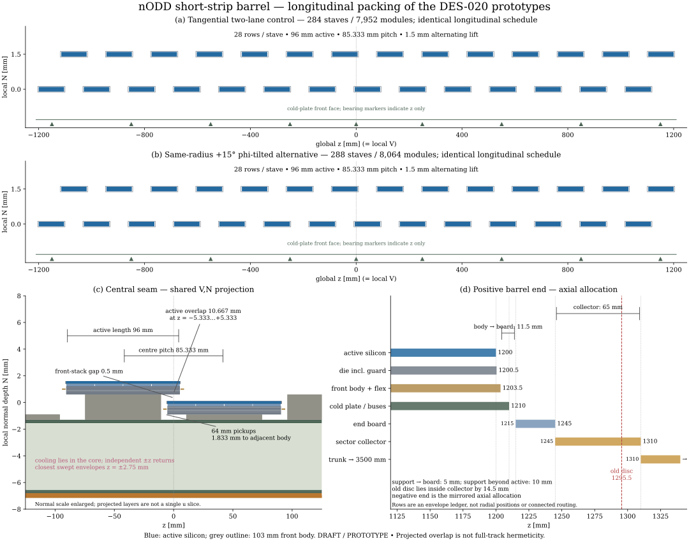

# DES-020 — Longitudinal packing review

- Date: 2026-10-07; DRAFT / isolated PROTOTYPE.
- Review request: [PR49 comment](https://github.com/asalzburger/nodd/pull/49#issuecomment-6030478624).
- Scope: information and a drawing for the existing tangential and +15° phi-tilted
  barrel prototypes. No geometry, source input, IDs, acceptance denominator,
  native evidence or engineering limit changes.
- Classification: **INFERENCE** from DES-020's existing NODD DESIGN CHOICE inputs
  and exported solids; see SB-I04 in [DES-020](../../design/DES-020-short-strip-barrel.md).

## Measured result

The [JSON inventory](z-packing.json) comes from both unmodified compact exporters
and frozen layouts. Every stave has 28 rows on the same axial schedule, centre
endpoints ±1152 mm, active endpoints ±1200 mm and pitch 85⅓ mm. Changing phi
placement does not change V = global z. The control has 284 staves / 7,952 modules;
the alternative 288 / 8,064.

Adjacent active rectangles overlap by 10⅔ mm in z projection. The 97 mm guarded
die and 103 mm front-body/flex outline overlap by 11⅔ and 17⅔ mm respectively.
An alternating 1.5 mm normal lift leaves a 0.5 mm gap between front-stack
envelopes and 1.3 mm between silicon faces; same-height front bodies are
67⅔ mm apart. The 64 mm pickups have 1⅚ mm axial clearance to the neighbouring
103 mm front body. None of these is a tolerance-qualified assembly clearance.

The union of 28 active axial intervals is 2400 mm, versus 2688 mm summed length:
288 mm duplicated at 27 seams, or 10.7143% of summed length. This excludes phi
overlap and is not a total silicon-overlap area fraction or a track-coverage test.
The two central sensors overlap on z=−5⅓..+5⅓ mm while their service groups
remain 14 modules/end. Independent inward cooling returns stop at z=±2.75 mm
including pipe radius, giving 5.5 mm between swept envelopes.

The positive occupied outer bounds are active1200, guarded die1200.5,
front-body/flex1203.5, support/buses/straight cooling1210, board1215..1245,
collector1245..1310 and trunk1310..3500 mm. Support-to-board clearance is5 mm;
front-body-to-board is11.5 mm. The collector still contains the original1295.5 mm
disc datum, 14.5 mm inside its outer bound. Negative z bounds mirror these;
the alternating row-height parity at the two ends is reversed. Bearings are
global layer cylinders (compact `w` = global z), unlike the stave-local `v`
coordinate; their nine 8 mm intervals are measured in that global frame.

## Derivation and actual checks

`draw_z.py` checks the frozen row identities, z centres, axial axes, lifts and
active half lengths for every module in both layouts; it rejects a changed
axial schedule. It then parses the exported compact's module constituents,
pickups, cooling arcs, boards and rings. All staves in each export must repeat
the same row centres/lifts. The final comparison requires every reported axial
quantity to match between the prototypes, excluding transverse counts/angle
and source hashes. Both comparisons passed. The existing ten portable barrel
controls passed, including the tangential frozen-layout regression and its
1e−8 mm placement-shift rejection.

Figure panels(a,b) show both complete axial schedules in local N; bearing markers
identify z only. Panel(c) projects component layers onto V,N, with enlarged
normal scale; it is not a single-u slice. Panel(d) is an axial envelope ledger,
not radial positions or a fully connected service route. Blue denotes active
silicon and the top panels' grey outlines the 103 mm front body.

The JSON records the actual dirty execution revision plus exact input, frozen
layout, model/exporter/factory/drawing producer and new figure hashes. Later
enclosing commits are publication provenance, not the execution revision.
Raw compact/entity inventories stay under ignored `build/short-strip-z-packing/`.
Existing native/ROOT/Geant4/coverage reports and producer files are preserved.
No native or transport rerun is claimed for this documentation-only addition.

The first drawing attempt exhausted a generator while computing min/max;
materializing its intervals fixed the report. Visual review then caught ring
stations being read in the stave frame; the global layer-cylinder coordinate was
used instead. These corrections changed only the new report/drawing helper.

## Limits and next review

The [control report](results.md) and [tilted report](phi-tilted/results.md) retain
nonzero end-boundary coverage losses, collector mean-fill failure and adverse
service/thermal/data cases. All manufacturing/thermal-cycle tolerances, seating,
clamps, connectors, manifold/bend access and hydraulic/electrical continuity
remain unqualified. No geometry extension, endcap integration or sign-off is
supplied by these nominal longitudinal measurements.

Reproduce with the [commands](../../../tools/short_strip_barrel/README.md).
