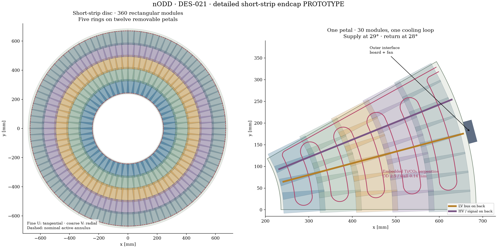
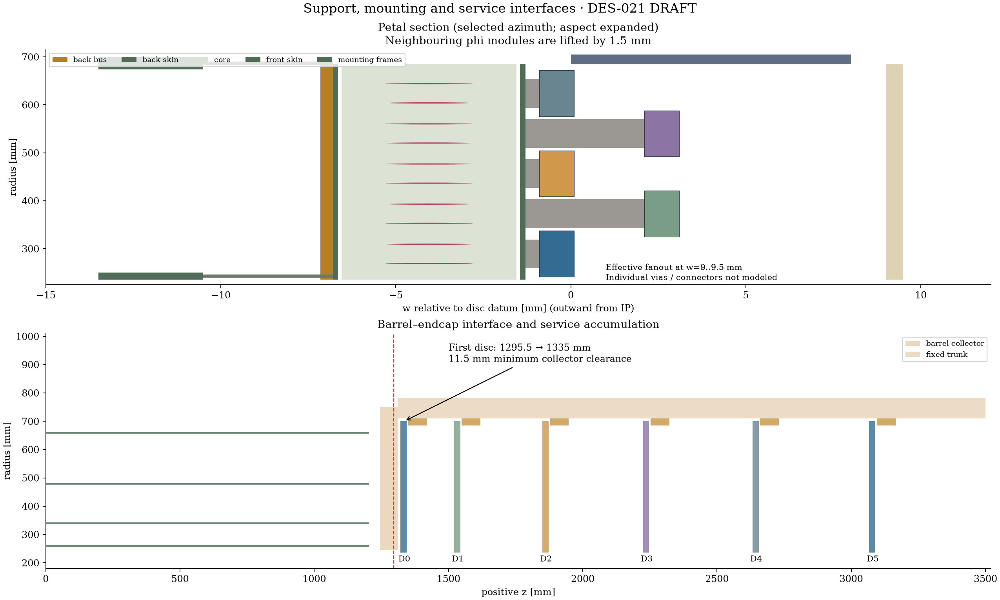

# DES-021 — Short-strip endcap results

Date: 2026-10-06 · **Isolated PROTOTYPE** · [Design](../../design/DES-021-short-strip-endcap.md) remains **DRAFT**.

The detailed endcap has twelve discs, twelve removable petals per disc and five
rings of 48/60/72/84/96 rectangular strixel modules: **360 per disc, 4,320 total**.
Each petal carries thirty modules, three gross power/fibre harnesses, one embedded
CO2 serpentine, LV and HV/control buses, an outer interface board and mounting
seats. The fine coordinate is tangential and the coarse coordinate radial;
negative-end placements use a proper rotation. This standalone model complements
PR50's tilted barrel; production and old scientific artifacts are unchanged.

## Executed software and geometry checks

| Check | Actual result |
| --- | --- |
| Nine portable controls | PASS: counts/IDs, signed axes, complete module/pickup separating axes, cooling containment/separation, limits, true plane hits, a sole-endcap-hit loss regression and independent sensor-area accounting |
| Standalone CMake / CTest | PASS: both model and native tests; DD4hep1.38, ROOT6.40.04, Python3.14.5 |
| Native construction | PASS: 113,654 physical placements including world; 4,320 sensitive sensors |
| IDs / anisotropic cells | PASS: 4,320 unique volume IDs; 21,600 cell centre/decode probes, 640×192 cells/module |
| Signed sensors / radial cooling axes / full entities | PASS against producer inventory and dimensions; no tolerance relaxation |
| Overlaps | **Zero** at 1e-5 mm tolerance |
| Mass / material | PASS at 1e-6 relative capacity/mass tolerance; total isolated endcap model 386.319 kg, including transport cells and trays |
| Native material/navigation | PASS: 120 actual ROOT boundary-following rays in X0 and interaction lengths; all twelve discs exercised |
| ROOT persistence | PASS in a fresh process without factory load; all sensors, passive volumes, masses and signed sensor/tube axes reproduced |
| Geant4 / EDM4hep | PASS: one seeded 10 GeV mu− event per end, FTFP_BERT, seed42, no compact field; six discs per end exercised; saved primary paths within0.01mm |
| Constituent conservation | PASS: explicit conserved material quantities plus residual air; independent density/mass normalization |
| Coverage oracle | PASS agreement for64 independent finite-plane tracks;116,640 sampled vacuum helices |

Positive event:8 saved hits, seven generated-muon hits and one secondary-electron
hit. Negative event:7 saved generated-muon hits. Particle relations distinguish
primary paths from secondary physics; secondary hits remain in the report.
No ACTS conversion, calibrated strixel response, digitization or physics-performance
validation is claimed. Sparse material rays are navigation checks, not continuous
material/acceptance maps. The isolated native mass is not a full integrated tracker
mass; it includes the deliberately large gross cable comparator and transport trays.
The sum of sensor areas is19.90656m2; divided by the twelve nominal annuli it
gives1.35504. This is an area-sum ratio, not a measured overlap fraction or union
coverage. [Area-accounting correction](area-correction.json) replaces a stale
456-module numerator with the actual placements. Full layout/entity/material
comparisons and byte-identical compact XML demonstrate unchanged geometry;
all engineering gate values remain unchanged. The prior screen is retained in
commit1063dce. The screening text also now reflects the actual10mm entry bends.

## Coverage and barrel interface

The old first datum1295.5mm conflicts with the barrel's collector ending1310mm.
The new1335mm datum leaves11.5mm to the upstream frame face. Only this datum
changes (+39.5mm in |z|); the other five are retained. Plate/body corners and
boards fit below the fixed710mm trunk inner radius; outer board corner radius
705.479mm, maximum module/flex corner676.001mm.

The coverage denominator remains the **original annuli and original datums**.
The old/new active-hit comparison uses the same detailed module layout at the
old/new first-disc datums; it is distinct from the ideal-annulus denominator.
At4T and pT1GeV, each charge-sign sample loses576 of35,136 old ideal disc
intersections (1.64%):288 per first disc on each end. The old-datum active layout
misses none in the same sample, so this is a datum-shift effect. At0T and at4T /
pT10GeV there are zero sampled losses. Direct old/new track counts at4T / pT1GeV
are **10,752 /10,176 per charge-sign sample**:576 tracks lose their only
short-strip endcap hit,5.36% of the old endcap-hit tracks (2.47% of all23,328
tracks in that scenario). No tracks gain an endcap hit. The other three scenarios
retain10,176 any-endcap-hit tracks each with no such losses or gains. These
counts concern the short-strip endcap alone; they do not measure the loss of
all tracker hits or reconstruction efficiency. The revised nominal-annulus
sample has zero missing intersections.
Finite grids cannot prove continuous hermeticity. Luminous z hypotheses are
−150/0/+150mm; vacuum first traversal, host r800/|z|3300mm, eta−4..4 in0.1 steps,
96 phi bins. Off-axis samples are used for the independent oracle comparison.
The strip endcap alone does not cover all |eta|<4; pixel/barrel combination and
transition efficiency require an integration study.

The initial report incorrectly claimed equal old/new any-disc-hit counts while
only storing the new count. The dated [coverage correction](coverage-correction.json)
preserves the prior report hash and adds measured old/new counts and a regression
track. The original report remains in commit1063dce. Geometry, datum choices,
old-denominator misses and native/Geant4 execution evidence are unchanged.

## Engineering gates retained as failures

| Screen | Result and implication |
| --- | --- |
| Combined barrel/endcap trunk packing | **FAIL** nominal maximum ratio1.022001 (2.2% over allocation), adverse2.395315, channel-scaled3.975450; fixed710..783mm corridor is never expanded |
| Local outer fan mean fill | 21.23% gross fill; PASS 50% mean screen, not individual bend/connector qualification |
| External power turns | **FAIL**:31.7 /56.7mm radial requirement for25/50mm bends exceeds25mm fan allocation;70mm axial reserve alone fits |
| Sensor thermal path | **FAIL** every tested case; comparator sensor estimate7.8..18.4°C versus−20°C goal. Hypothesis screen, not predicted operating temperature |
| LV distribution | PASS both comparator loads against<1V round trip/<0.2V return; return drops0.0275/0.1118V |
| CO2 enthalpy | Comparator petal299.7W:3g/s FAIL,7g/s PASS; channel-scaled petal1028.7W: both FAIL. No pressure-drop/dry-out qualification |
| Normal-load support beam fixture | **FAIL**: 0.188..0.377mm at E140..70GPa versus0.05mm goal; local petal mass0.658kg. Normal1g fixture, not installed gravity or FEA |
| Bandwidth / ASIC / CTE | Unqualified; rate/occupancy sensitivity in screening.json includes adverse link cases. No actual electronics, adhesives or cold stress sign-off |

Per end, endcap services add216 harnesses and72 loops to the barrel's576 harnesses
and288 loops: **792 harnesses and360 loops**, with sector-wise manifold rounding.
Negative petal p maps to global trunk sector11−p. Native endcap transport cells
contain endcap demand only; the capacity screen includes the barrel. Overlaying
the standalone models would double-allocate service cells and is not integration.

## Recommendations

Retain removable petals and tangential/radial measurement axes. Use the three-seat
mounting concept with a fixed reference and compliant/sliding outer constraints;
add a reviewed mid-radius brace or demonstrate shell stiffness and joint behaviour
with FEA before adopting this plate. Qualify actual adhesive/interposer loading
through cold cycling: public [ATLAS petal evidence](https://arxiv.org/html/2607.25080v1)
supports the topology and documents CTE risks, not these nODD dimensions.

Reduce the dominant thermal spreading/contact path with reviewed cooling contacts
closer to the ASIC/sensor loads, then qualify a real power and pressure-drop model.
The10mm entry bends are geometrically clear, but require tube-forming review.
Resolve radial fan turns and combined service capacity with actual power/fibre
cable specifications and a shared barrel/endcap entry design. Reassess the first
annulus transition jointly with the barrel. These changes need new evidence;
this PR does not silently adjust the fixed envelope or declare an endcap baseline.

## Provenance and failed attempts

Actual screening/native execution is dirty parent54523d9a22c539091f195c362d2542050315e385
plus exact input/producer/factory/library hashes. Publication commits never replace
execution revisions. [Reproducibility inventory](reproducibility.json) contains
current source/artifact hashes and confirms identical physical entities/materials,
compact and library between final native audit and the actual Geant4 execution.
The latter used [its preserved native source report](native-geant4-source.json);
later source changes add only validation constraints and route-crosswalk metadata.
Original hashes remain intact rather than being rewritten to enclosing commits.
Corrected coverage accounting was executed separately on dirty
ae031397b91b9b0a7ca21fdc60dfba02d8ab08f2 with the same geometry/input hashes.
Corrected area accounting was executed on dirty
108313e91486f2843fe8f5a87b8a25594d9223c1; native and Geant4 execution hashes
remain those of the actual prior runs.

[Rejected456-module candidate](rejected-456.json) records45,504 overlaps.
[Intermediate failures](failed-attempts.json) retain count-only3,888 and
rotation-corrected3,168 overlaps, API/setup/factory diagnostics and the initial
secondary-path checker failure. The final design reduces counts for full occupied
support clearance, shortens pickups64→60mm and composes radial rotations explicitly.
A tube-axis audit now prevents the earlier Euler issue. All actual failure results
remain; no overlap, mass, path or acceptance tolerance was lowered.

Raw compact/expected inventory, libraries, ROOT exports/events and runtime logs
remain ignored under build/short-strip-endcap. Curated native, persistence,
Geant4, coverage, services and screening JSON are retained here. Drawings are
repo-native vector geometry, with inspected PNG previews and their own hashes.
The paired [session journal](../../../logs/design/SESSION-2026-10-06-short-strip-endcap.md)
records requests, commands and missing current-turn resource counters.
