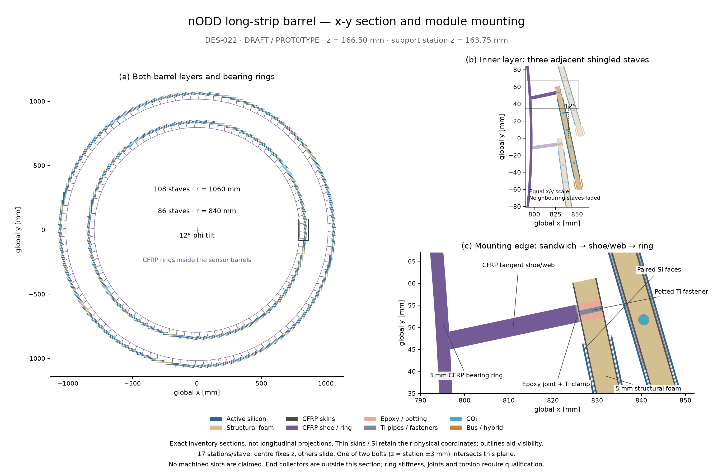

# DES-022 — transverse barrel and mounting view (PR #52 review addition)

[Vector drawing](../../design/figures/DES-022-barrel-xy.svg) ·
[drawing provenance and hashes](xy-drawing.json).
DRAFT / isolated PROTOTYPE; illustration of the unchanged [DES-022 design](../../design/DES-022-long-strip-barrel.md).

This addresses the [request for an x-y view including mounting](https://github.com/asalzburger/nodd/pull/52#issuecomment-6033236185).

The three panels show both barrel layers, three neighbouring inner-layer staves,
and the load path from the sensor sandwich through a potted titanium fastener,
epoxy joint and titanium clamp to the CFRP tangent shoe/web and inner bearing
ring. Buses/hybrids occupy the opposite stave edge; the four buried cooling legs
are visible in the stave section. All panels use equal global x/y scales.

The drawing is a section at **z = 166.50 mm**, inside the bearing station centred
at z = 163.75 mm. This is a drawing-plane choice, not a detector change: it
intersects one of the two bolts centred at station z ±3 mm, and lies 0.25 mm from
that bolt's centre. Box/sensor and trapezoidal shoe boundaries are cut in their
retained world transforms; the transverse bolt uses its actual cylindrical chord.
Thin silicon/skin coordinates are retained, with outlines to aid visibility.
The opposite bolt and end collectors are outside this section. The central
station fixes z and other stations slide; machined slots are not represented.

The source is the immutable DES-022 inventory used for the original native
validation. This drawing introduces no new materials, transforms or engineering
claim. Original native execution hashes, figures, coverage misses and unresolved
joint/ring/torsional qualifications remain in the [actual results](results.md).
