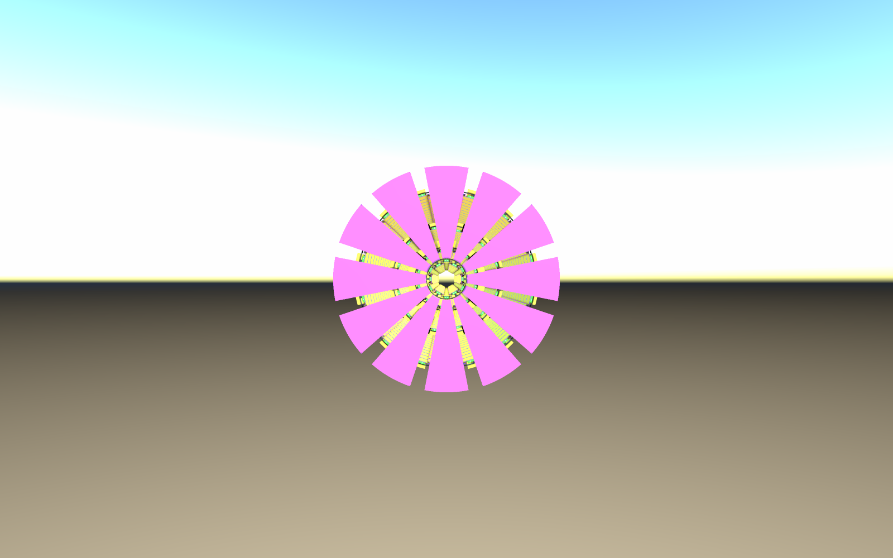
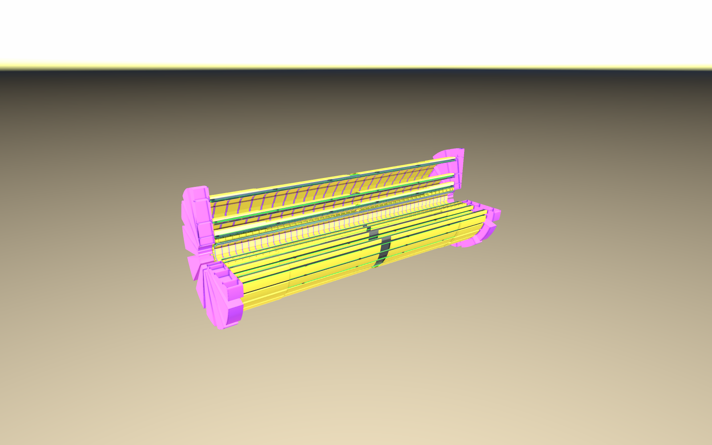

# Nodehammer pixel-barrel evaluation

- Date: 2026-09-30
- Scope: optional display tooling for the DES-012 **PROTOTYPE**, not physics acceptance
- Governing records: [DES-012](../../design/DES-012-dd4hep-pixel-barrels.md),
  [ADR-003](../../decisions/ADR-003-validation-and-artifact-policy.md), TASK-SOFT-NODEHAMMER
- Source: SRC-NODEHAMMER, requested fork at
  [`30b19dcbd9329b742d98b1383a1484600fc3e0c3`](https://github.com/asalzburger/nodehammer/tree/30b19dcbd9329b742d98b1383a1484600fc3e0c3)
- Reproduction: [workflow and commands](../../../tools/nodehammer/README.md)
- Machine-readable evidence: [report](report.json), [ROOT fallback](root-fallback.json)

## Recommendation

Adopt nodehammer as an **optional review/display tool**. Direct DD4hep import
preserves the hierarchy, material colours and sensitive tags, and portable NHB
projects let reviewers inspect the detector without loading its factory. The
native viewer successfully rendered the complete barrel and an oblique cutaway.
Continue using DD4hep/ROOT for geometry navigation, overlap and material checks;
nodehammer renders boundary meshes and is not a transport/material oracle.

No detector construction, material mixture, placement, segmentation or readout
behavior changed. PR29 remains a working baseline under the existing human
authorization; neither this evaluation nor the PR30 merge supplies design sign-off.

## Measured checks

Tested on macOS arm64 with Apple Clang 21, ROOT 6.40.04, DD4hep 1.38,
Spack Python 3.14.5, Conan 2.33.0 and CMake 4.4.3. The Spack registry preflight
returns 2 because its old setup/lock fingerprints changed. Actual compile/link,
compact import and native rendering succeeded; shared dependencies were not changed.

The compact was the maintained PR30 coloured export, backed by its existing
manifest and expected-entity oracle. The retained report records input hashes,
upstream/build identity, workflow hashes, commands and output hashes. Its nODD
revision is the parent checkout revision; workflow hashes identify the uncommitted
implementation used for the run. The compact's own manifest records an earlier
source revision plus per-file hashes; those are distinct provenance fields.

| Check | Result |
| --- | --- |
| Upstream native tests, including enabled importers | 602/602 pass |
| nODD safeguards: rotations, units, unknown materials, opacity | 6/6 pass |
| DD4hep import diagnostics | 0 warnings, 0 errors |
| Placement inventory | 39,388 nodes, including world and PixelBarrel assembly |
| Entity oracle and NHB round trip | All 39,386 named detector entities match |
| Maximum centre difference | 1.14 × 10⁻¹³ mm; tolerance 10⁻⁸ mm |
| Maximum sensor-normal component difference | 2.22 × 10⁻¹⁶; tolerance 10⁻¹² |
| Sensitive tags | Exactly 6,206 active patches, no passive false positives |
| Materials | Every entity material name and imported RGB family checked |
| Rendered physical shapes | 32,860 boxes, 3,198 tubes/sectors, 492 CSG intersections |
| GLB units | All exported node transforms checked; all box dimensions checked; tolerance 10⁻⁷ m |
| GLB material display | RGBA and explicit BLEND checked against the palette |
| Native rendering | Complete project and oblique shader cutaway rendered to PNG |
| ROOT fallback | 39,388 nodes; 0 warnings/errors; no sensitive tags |

The source uses ROOT centimetres. GLB export multiplies lengths by 0.01 to
produce metres. The native viewer and semantic NHB keep centimetres. CSG feet
are tessellated with `fallback="fail"`; all 492 receive meshes. This checks
mesh presence, not their approximation error or analytic mass. Display circles
use 96 segments, a **NODD DESIGN CHOICE** for visual quality, not a detector
dimension or a new geometry tolerance. Camera settings are also display choices.

| Project | Physical mesh placements | Unique meshes | GLB size | Packed project size |
| --- | ---: | ---: | ---: | ---: |
| Full barrel | 36,550 | 237 | 10.81 MiB | 0.35 MiB |
| Active sensors | 6,206 | 1 | 1.26 MiB | 0.35 MiB |
| Layer 1, stave 0 | 386 | 15 | 0.13 MiB | 0.35 MiB |

Each project carries the full compressed semantic input plus its selection config,
so packed sizes are similar. The full view omits 2,838 world/assembly boxes, while
retaining physical parents with daughters. Filtering to leaves would incorrectly
remove substrate silicon, foam and titanium. Each selection's mesh bindings are
checked against its expected physical node set. No stochastic sampling is used.

## Rendered examples

These are actual nodehammer PNG exports, inspected after rendering. The end-bay
effective material appears violet/pink and blocks underlying structures in the
native renderer. The shader cut exposes the barrel without changing the compact,
NHB or GLB. These screenshots are display evidence, not mechanical drawings.

## Limits and upstream rough edges

- **Native translucency is pending.** Source
  `src/viewer/scene_renderer.cpp::finalizeUpload` handles MASK but not BLEND;
  `docs/viewer-rendering-fidelity-strategy.md` lists blending as future work.
  Our generated styles preserve alpha and request BLEND for GLB. Native viewing
  requires hiding/selecting parts or using cuts to expose buried structures.
- **Parent/daughter material replacement is not boolean subtraction.** The
  imported foam contains its tube envelopes and the silicon substrate contains
  active daughters. Coplanar faces may flicker. Do not derive material budgets
  or overlap failures from display meshes. The sensitive-only selection removes
  the substrate face ambiguity when inspecting active silicon.
- **`--strict` rejects informational diagnostics.** In
  `src/cli/cmd_convert.cpp::Strictness`, any nonempty diagnostic list is rejected.
  A clean DD4hep import reports informational NH0104 and therefore fails strict
  mode. We require zero structured import warnings/errors, fail boolean fallback,
  reject degraded nodes and verify complete mesh inventories instead. There is
  no general structured tessellation-diagnostic report exposed by this CLI;
  this check is narrower than a corrected strict mode.
- **ROOT extension autodetection fails.** `TGeoImporter::supportedExtensions`
  returns `.root`, while the registry compares `root`. Explicit
  `--input-format tgeo` works. ROOT-only imports carry no sensitive tags; the
  supported nODD preparation workflow deliberately uses DD4hep.
- **CLI screenshot examples need extra arguments.** `viewer shot archive`
  requires `-i pixel.nhb -c full.toml`; supplying only yaw/pitch is rejected
  unless target x/y/z and distance are also supplied. The README gives the
  actual successful command. Failed trial commands are recorded in the session.
- **Semantic IDs are not detector IDs.** NHB assigns new internal indices.
  The audit rematches named entities after the round trip. Packed DD4hep cell
  IDs and readout segmentation are not claimed to survive as reconstruction data.
- **Web runtime and other platforms remain unverified.** No site was published,
  browser compatibility claimed or performance benchmark inferred from one PNG.
  A matched WASM runtime would be a useful follow-up for dashboard embedding.

These limits are acceptable for optional detector review. Suggested upstream
follow-ups are strict-mode severity filtering, ROOT extension registration,
the screenshot CLI/skill mismatch, and native blending. No upstream source was
patched or dependency installation modified to hide a failure.
